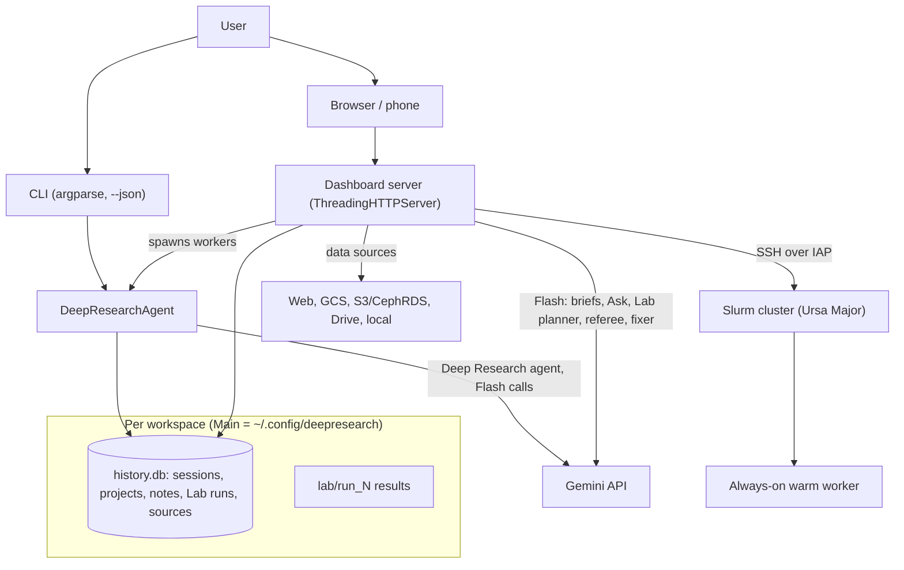

# Architecture: deep-research

A short map of the system. [docs/SPEC.md](docs/SPEC.md) is the complete, normative
specification (module map in section 5.1, every API route, setting and command); this page
is the overview. Earlier versions of this page described the CLI only.

## 1. Pieces

## 2. Layers

- **Research engine** (`core/agent.py`): one Deep Research run per task, streamed or
  polled; recursion fans out child tasks in threads (`ThreadPoolExecutor`), finds gaps and
  synthesizes; follow-ups continue an interaction. `core/session.py` owns the `sessions`
  table (SQLite, WAL mode).
- **CLI** (`__main__.py`, `cli/`): research, start, history, search, repair, `sources`,
  `projects`, `workspace`; every command takes `--json`. `start` detaches a worker
  (`start_new_session`) so the run outlives the terminal.
- **Dashboard** (`dashboard/server.py` + a vanilla-JS client, no build step; Markdown via
  `marked` + `DOMPurify`): library, reports, notes, notebooks, projects, sources, Lab runs,
  audio, research map, compare. Launching a run spawns
  `deep-research research ... --adopt-session N`, exactly like `start`. Listens on this
  machine only unless started with `--allow-remote`; checks Host and Origin. Each request
  carries its workspace (`X-DR-Workspace`).
- **Projects** (`dashboard/projects.py`, `project_api.py`, `claims.py`): containers for a
  grant, paper or thesis; summaries, Ask, briefs, exports, claims board.
- **Data sources** (`sources/`): one registry, adapters per kind, staging to the cluster,
  saved search indexes, open-data discovery, provenance. Only credential references are
  stored (`rclone:<remote>`, `gcloud`).
- **Lab** (`dashboard/lab.py` and the `lab*` modules): turns a question in a report into a
  real job on the cluster. Plan (Flash + Google Search + facts checked on the warm node),
  pre-flight, referee and up to two referee -> fixer rounds, human review, a pilot on the
  warm node, the full run, a verdict from `verdict.json`, a results note attached to the
  report. Blocked downloads can be fetched on the laptop and staged. The cluster's job
  folder is the source of truth; the `lab_runs` table is a cache.
- **Workspaces** (`core/workspace.py`, `wscopy.py`, `wszip.py`): separate libraries;
  Main never moves; copy between workspaces and zip export/import.

## 3. Principles

- **Nothing runs without review.** Lab plans are drafts until a person submits them; AI
  fixes and referee rounds only ever produce another draft.
- **Additive storage.** Migrations only add tables and columns. Main's data is never moved
  or rewritten by new features.
- **Cheap models by default.** Everything except the Deep Research agent uses
  `gemini-3.8-flash`; a 2026-09-30 comparison found Pro no better for Lab plans.
- **Evidence over claims.** Lab outcomes come from checks the job writes, not from the
  write-up; refuted and broken results are shown as such.
- **Threads, not asyncio.** The synchronous `google-genai` client and thread pools cover
  the I/O-bound work and are easier to debug.
- **Tests and spec move together.** `tests/test_spec_sync.py` fails CI when a route,
  setting, module or command is missing from the spec.
