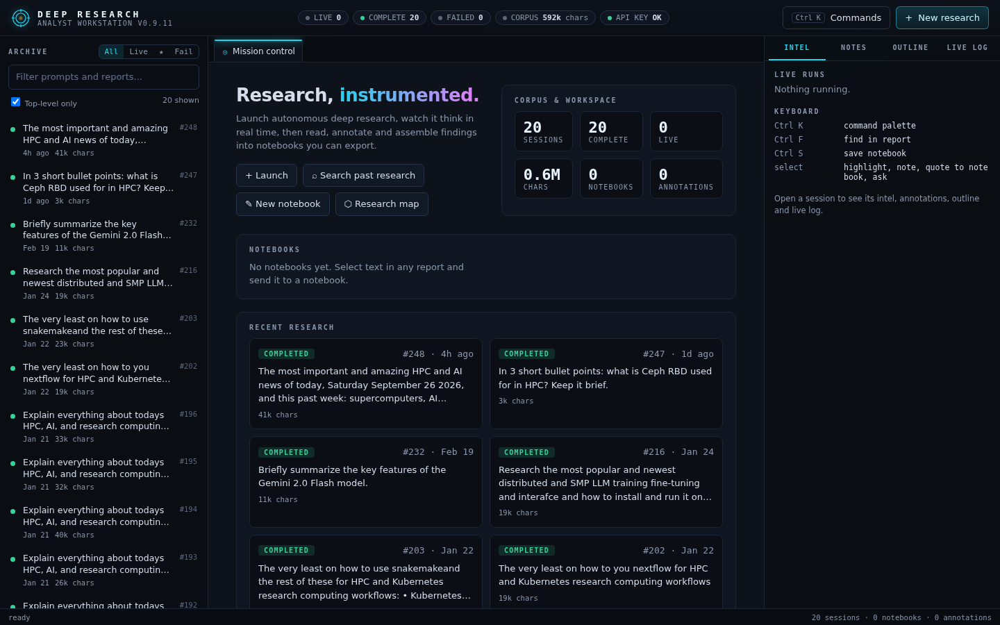
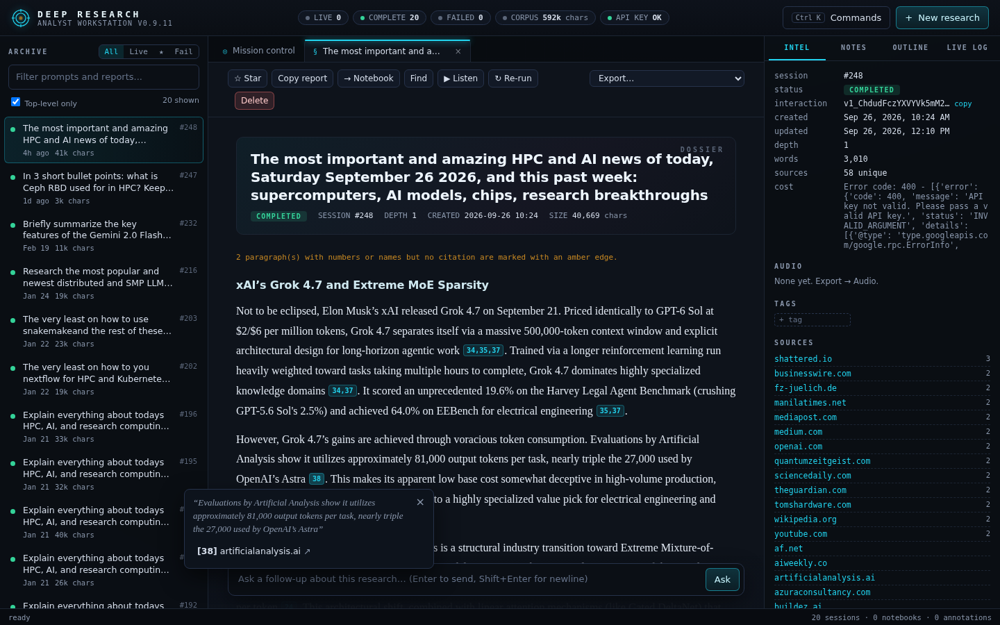
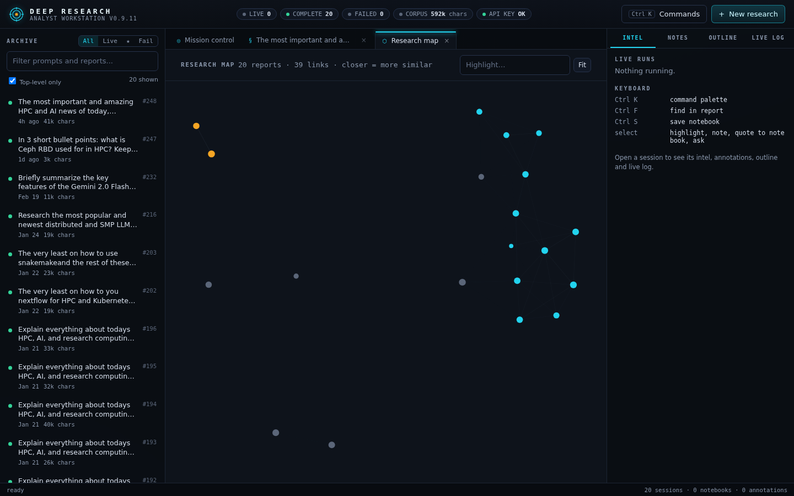
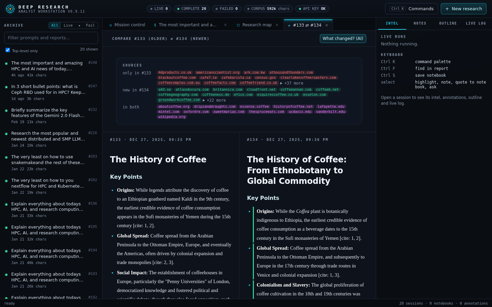
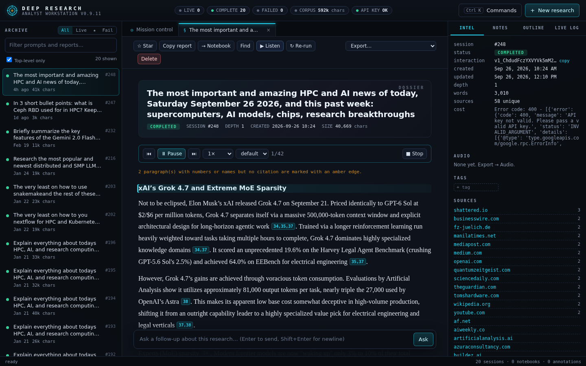
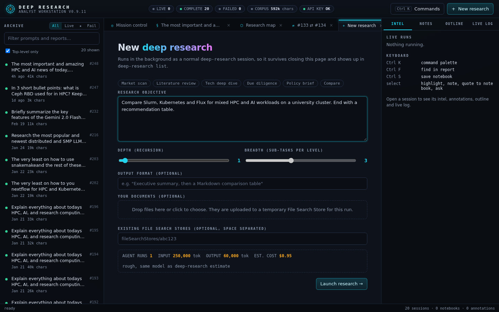
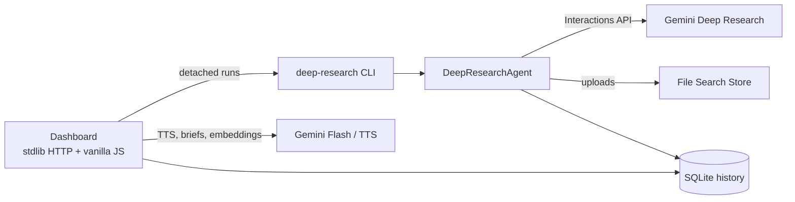

# Deep Research

**A command-line tool and self-hosted web workstation for Google's Gemini Deep Research agent.**
Launch autonomous research, watch it think, then read, annotate, search, compare and listen to
the cited reports it produces. Everything lives in a local SQLite history on your own machine.

[](https://github.com/charles-forsyth/deep-research/actions/workflows/ci.yml)
[](https://github.com/charles-forsyth/deep-research/releases)
[](https://www.python.org/downloads/)
[](LICENSE)
[](https://github.com/astral-sh/uv)
[](https://github.com/astral-sh/ruff)



## Contents

- [Features](#features)
- [Quick start](#quick-start)
- [Command-line usage](#command-line-usage)
- [Web dashboard](#web-dashboard)
- [Configuration](#configuration)
- [Costs](#costs)
- [How it works](#how-it-works)
- [Development](#development)
- [Use case gallery](#use-case-gallery)
- [Contributing, security and license](#contributing)

## Features

**Research engine (CLI)**

- **Autonomous deep research** with the Gemini Deep Research agent (`deep-research-preview-04-2026`,
  or the Max agent via `GEMINI_AGENT_NAME`). It plans, searches, reads and writes a cited report.
- **Your own documents**: upload files or whole folders; they go to a temporary File Search Store
  that the agent searches first, and are cleaned up afterwards.
- **Recursive mode** (`--depth`, `--breadth`): gap analysis spawns parallel sub-research, then
  synthesizes one final report.
- **Headless runs** (`start`) that survive closing the terminal, with PID tracking and honest
  crash detection.
- **Follow-up questions** on any past session, **semantic search** across your whole history, and
  export to Markdown, JSON, CSV or HTML.
- **Resilient**: automatic stream reconnection, exponential backoff, SQLite WAL with retries.

**Research workstation (web dashboard)**

- **Launch** with templates, depth/breadth sliders, a live cost estimate and drag-and-drop uploads.
- **Watch** a live timeline of agent thoughts, sub-task lanes, elapsed time and actual cost, with a
  browser notification when a run finishes.
- **Read** in a typeset reader with outline, find, grouped sources and **citation cards**: hover or
  tap `[cite: 12]` to see the claim and its source. Uncited paragraphs with figures are flagged.
- **Listen**: read any report aloud word for word in the browser's voice, or export an MP3 in a
  Gemini voice, either the full text or an AI-written 2-3 minute spoken summary.
- **Annotate and collect**: highlights, notes and Markdown notebooks with cited quotes.
- **Brief builder**: turn a report or notebook into an executive brief, slide outline or email.
- **Research map**: every report placed by topic similarity, clustered and clickable.
- **Re-run and compare**: repeat a question later and see what changed, source by source.
- Works on phones and tablets; `Ctrl+K` command palette on desktop.

| Reader with citation cards | Research map |
|---|---|
|  |  |
| **Compare two runs** | **Read aloud** |
|  |  |

## Quick start

Requirements: Python 3.12+, [uv](https://github.com/astral-sh/uv), and a
[Gemini API key](https://aistudio.google.com/app/apikey) on a paid tier (the Deep Research agent is
not available on the free tier). `ffmpeg` is optional, for MP3 audio export.

```bash
# Install the CLI globally
uv tool install git+https://github.com/charles-forsyth/deep-research.git

# Save your API key (stored in ~/.config/deepresearch/.env)
deep-research auth login

# Run your first research task
deep-research "The history of the internet" --stream

# Open the workstation
deep-research dashboard --start        # then browse to http://localhost:7420
```

## Command-line usage

```bash
deep-research research "Compare GPU prices" --format "Markdown table" --output prices.md
deep-research research "Summarize the key findings" --upload ./papers/ --stream
deep-research estimate "State of solid-state batteries" --depth 2 --breadth 3   # no API calls
deep-research research "State of solid-state batteries" --depth 2 --breadth 3
deep-research start "Detailed analysis of quantum computing"   # background
deep-research list                    # recent sessions
deep-research show 12 --save report.html
deep-research followup 12 "Explain the error correction part simply"
deep-research search "What did I find about error correction?"
deep-research tree                    # recursive runs as a tree
deep-research delete 12
deep-research cleanup                 # delete all File Search Stores on this key (asks first)
```

A bare prompt runs `research`. `deep-research <command> --help` documents every option.

## Web dashboard

```bash
deep-research dashboard --start                       # background on 0.0.0.0:7420
deep-research dashboard --status                      # PID and URLs
deep-research dashboard --restart
deep-research dashboard --stop
deep-research dashboard --start --host 127.0.0.1      # this machine only
deep-research dashboard --foreground --port 8080      # run in the terminal
```

Runs launched from the dashboard are ordinary background sessions: they appear in
`deep-research list` and keep going if the dashboard restarts.

> **Security:** the dashboard has no login. Anyone who can reach the port can read your research
> and start runs on your API key. It binds `0.0.0.0` by default so it is reachable on a trusted
> home or lab network or over Tailscale; use `--host 127.0.0.1` anywhere else.

| Mobile | Launch with cost estimate |
|---|---|
|  |  |

## Configuration

Settings come from environment variables or `~/.config/deepresearch/.env` (a local `.env` also works).

| Variable | Default | Purpose |
|---|---|---|
| `GEMINI_API_KEY` | (required) | Gemini API key |
| `GEMINI_AGENT_NAME` | `deep-research-preview-04-2026` | Research agent; `deep-research-max-preview-04-2026` for maximum depth |
| `GEMINI_FOLLOWUP_MODEL` | `gemini-3.1-pro-preview` | Model for follow-ups, gap analysis, synthesis and search answers |
| `DR_DASHBOARD_ACCESS_LOG` | unset | Set to log every dashboard HTTP request |

Data locations (all local):

| Path | Contents |
|---|---|
| `~/.config/deepresearch/history.db` | Sessions, reports, embeddings, notebooks, annotations |
| `~/.config/deepresearch/logs/` | Per-session run logs and the dashboard log |
| `~/.config/deepresearch/audio/` | Exported audio files |

## Costs

The Deep Research agent is billed at Gemini 3.1 Pro token rates plus Google Search grounding.
Google's own guidance is roughly 250k input tokens (about 60% cached) and 60k output tokens per run,
which is about **$1 per agent run**; measured runs have ranged from $0.37 to $2.04. Recursive runs
multiply that by the number of agents (`1 + breadth + breadth^2 ...`), so run `deep-research estimate`
first. The dashboard shows the estimate before launch and the actual cost afterwards (from Google's
usage record, available for about a day after a run).

Audio export uses Gemini 3.8 Flash TTS: about $0.25 to read a long report word for word, a few cents
for a spoken summary. Briefs and comparisons use Gemini 3.8 Flash and usually cost under a cent.
Prices change; check [Gemini API pricing](https://ai.google.dev/gemini-api/docs/pricing).

## How it works



The dashboard adds no Python dependencies: it is a standard-library `ThreadingHTTPServer` serving
vanilla JavaScript (with vendored `marked` and `DOMPurify`). See [ARCHITECTURE.md](ARCHITECTURE.md),
[docs/DASHBOARD_DESIGN.md](docs/DASHBOARD_DESIGN.md) and the full system specification in
[docs/SPEC.md](docs/SPEC.md).

## Development

```bash
git clone https://github.com/charles-forsyth/deep-research.git
cd deep-research
uv sync                         # creates .venv with dev tools
uv run pre-commit install       # ruff, formatting and hygiene checks on commit
uv run pytest                   # 110+ tests (about 75% coverage), no network needed
uv run ruff check . && uv run ruff format --check . && uv run mypy src/
```

CI runs the same lint, format, type and test checks on Python 3.12 and 3.13 for every push and pull
request. See [CONTRIBUTING.md](CONTRIBUTING.md) and [CHANGELOG.md](CHANGELOG.md).

## Use case gallery

<details>
<summary>Fifteen example prompts, from codebase archaeology to gift ideas</summary>

Unlock the full potential of your autonomous research agent with these powerful workflows.

#### Developer & Technical

**1.** The "Codebase Archaeologist"
Inherit a messy legacy project? Use this to understand it fast.
*   **The Power:** Uses `--upload` to ingest the file structure and key files, and `--depth 2` to recursively analyze subsystems and identify architectural patterns.
*   **Command:**
    ```bash
    deep-research "Analyze this codebase. Identify the tech stack, key patterns, and security risks." --upload ./src/ --depth 2
    ```

**2.** Technical Troubleshooting
Stuck on an obscure error? Let the agent find the fix.
*   **The Power:** Synthesizes solutions from StackOverflow, GitHub Issues, and official documentation into a single, verified fix, saving you hours of tab-switching.
*   **Command:**
    ```bash
    deep-research "Fix 'Error X' in System Y. Synthesize solutions from GitHub issues and docs."
    ```

**3.** Content Repurposing
Need to turn a whitepaper into a tweet thread?
*   **The Power:** Uploads long PDF reports and intelligently reformats the key insights into specific social media formats.
*   **Command:**
    ```bash
    deep-research "Turn this report into a Tweet thread and a LinkedIn post." --upload report.pdf
    ```

#### Business & Strategy

**4.** The "Competitor Matrix"
Need to compare products for a strategy meeting?
*   **The Power:** Uses `--breadth 5` to spawn parallel agents that research multiple competitors simultaneously, and `--format CSV` to generate a spreadsheet ready for Excel.
*   **Command:**
    ```bash
    deep-research "Compare top 5 CRM tools. Columns: Pricing, Features, Sentiment." --breadth 5 --format CSV --output crm.csv
    ```

**5.** Supply Chain Risk Assessment
Worried about logistics?
*   **The Power:** Traces product dependencies recursively to identify geopolitical bottlenecks (e.g., rare earth metals) and single points of failure.
*   **Command:**
    ```bash
    deep-research "Trace the supply chain of Lithium batteries. Identify geopolitical risks." --depth 2
    ```

**6.** Investment Due Diligence
Considering an investment or partnership?
*   **The Power:** Recursively investigates financial health (10-K), recent lawsuits, and leadership history to create a comprehensive risk profile.
*   **Command:**
    ```bash
    deep-research "Deep dive on [Company]. Focus on financial health, lawsuits, and leadership." --depth 2
    ```

**7.** Grant Proposal Generator
Need funding?
*   **The Power:** Researches specific funding agencies (NSF, NIH) and tailors your project description to align perfectly with their current strategic goals.
*   **Command:**
    ```bash
    deep-research "Draft a grant proposal for [Project Idea] aligned with NSF strategic goals."
    ```

#### Academic & Legal

**8.** The "Academic Literature Review"
Writing a thesis or paper?
*   **The Power:** The "Gap Analysis" feature. The agent creates an initial review, realizes "I found papers on X, but I'm missing Y," and automatically spawns child tasks to find the missing citations.
*   **Command:**
    ```bash
    deep-research start "Write a literature review on microplastics in soil. Identify research gaps." --depth 3 --breadth 4
    ```

**9.** Legal Precedent Search
Need case law?
*   **The Power:** Recursively analyzes legal databases to find relevant case law in specific jurisdictions and highlights contradictory rulings.
*   **Command:**
    ```bash
    deep-research "Find case law regarding [Legal Concept] in [Jurisdiction]. Analyze contradictions."
    ```

**10.** Historical "What If" Analysis
Studying history?
*   **The Power:** Synthesizes views from multiple historians to construct a detailed counter-factual analysis of major historical events.
*   **Command:**
    ```bash
    deep-research "Analyze the Battle of Midway outcomes if [Event X] had changed."
    ```

#### Life & Automation

**11.** The "Daily Briefing" Pipeline
Want a custom news feed?
*   **The Power:** The `-q` (Quiet Mode) allows you to run this in a cron job or script, piping the output directly to email or Slack without any logs.
*   **Command:**
    ```bash
    deep-research -q "Summarize global AI news from the last 24 hours." > morning_brief.txt
    ```

**12.** Travel Itinerary Planner
Planning a complex trip?
*   **The Power:** Depth ensures specific constraints (e.g., "Gluten-Free", "Kid-Friendly") are checked against actual restaurant menus and venue policies, not just generic lists.
*   **Command:**
    ```bash
    deep-research "2-week Japan trip. Gluten-free food, kid-friendly hiking, anime spots." --depth 2
    ```

**13.** The "Deep Dive Interview Prep"
Preparing for a big interview?
*   **The Power:** Recursively looks at the company's recent challenges, the CEO's speeches, and employee reviews to give you talking points that impress.
*   **Command:**
    ```bash
    deep-research "Deep dive on [Company]. Focus on recent product launches and culture." --depth 2
    ```

**14.** The "Gift Wizard"
Need a gift for a hobby you don't understand?
*   **The Power:** Checks Reddit threads and niche forums to find durable, highly-rated items that enthusiasts actually respect, within your budget.
*   **Command:**
    ```bash
    deep-research "Best gift for a 30yo rock climber who loves coffee. Budget $200."
    ```

**15.** Fact-Checking / Debunking
Is that viral video true?
*   **The Power:** Traces claims back to primary sources (studies, raw footage) to identify logical fallacies and misinformation.
*   **Command:**
    ```bash
    deep-research "Verify the claims in [Viral Article]. Trace citations to primary sources."
    ```

</details>

## Contributing

Contributions are welcome: read [CONTRIBUTING.md](CONTRIBUTING.md) and the
[Code of Conduct](CODE_OF_CONDUCT.md). Report vulnerabilities privately as described in
[SECURITY.md](SECURITY.md); ask questions or share ideas via [SUPPORT.md](SUPPORT.md).

This is an independent project and is not affiliated with or endorsed by Google.

Released under the [MIT License](LICENSE).
