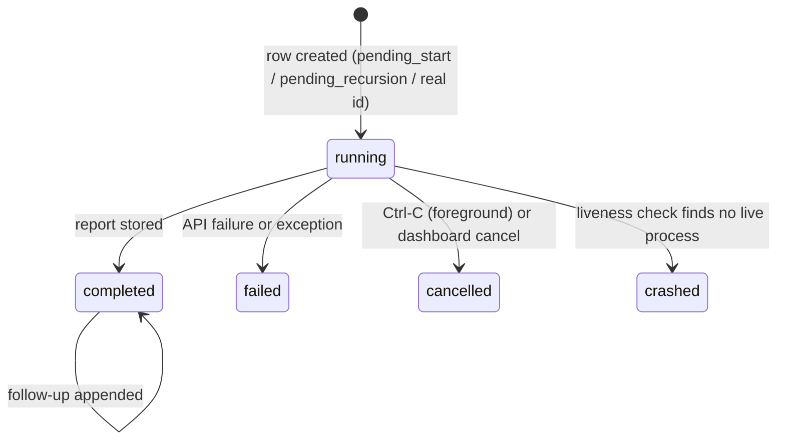

# deep-research: System Specification

| | |
|---|---|
| Document | Complete functional and technical specification |
| Applies to | deep-research v0.18.0 (package `deepresearch`) |
| Status | Living document. Describes the system as built, verified against the source on 2026-09-26 |
| Companion docs | [ARCHITECTURE.md](../ARCHITECTURE.md) (overview), [DASHBOARD_DESIGN.md](DASHBOARD_DESIGN.md) (design intent), [CHANGELOG.md](../CHANGELOG.md) |

This document is normative for behaviour: if the code and this document
disagree, one of them is a bug. Requirement IDs (for example `REQ-RUN-3`) are
stable and are referenced by tests and issues. Items marked **Known gap** are
real current behaviour that falls short of the ideal; each has a tracking note
in [section 17](#17-known-gaps-and-limitations).

## Contents

1. [Purpose and scope](#1-purpose-and-scope)
2. [Glossary](#2-glossary)
3. [System context](#3-system-context)
4. [Requirements](#4-requirements)
5. [Architecture](#5-architecture)
6. [Research engine](#6-research-engine)
7. [Session lifecycle and liveness](#7-session-lifecycle-and-liveness)
8. [Data model](#8-data-model)
9. [Command-line interface](#9-command-line-interface)
10. [Dashboard server and HTTP API](#10-dashboard-server-and-http-api)
11. [Dashboard client](#11-dashboard-client)
12. [Configuration, files and environment](#12-configuration-files-and-environment)
13. [External services, models and cost model](#13-external-services-models-and-cost-model)
14. [Security model](#14-security-model)
15. [Error handling and resilience](#15-error-handling-and-resilience)
16. [Testing and quality gates](#16-testing-and-quality-gates)
17. [Known gaps and limitations](#17-known-gaps-and-limitations)
18. [Build, release and operations](#18-build-release-and-operations)
19. [Extension guide](#19-extension-guide)

---

## 1. Purpose and scope

### 1.1 Problem

Google's Gemini Deep Research agent can plan a research task, run dozens of
web searches, read the sources and write a long, cited report. On its own it
is an API: every run is a one-off call, results live in Google's short-lived
interaction store, and there is no history, no way to go deeper on the gaps a
report leaves, and no comfortable place to read, compare or reuse the output.

### 1.2 What deep-research provides

1. **A command-line tool** (`deep-research`) that runs the agent in the
   foreground or as a detached background job, streams its thinking, uploads
   local files for it to search, and exports the report as Markdown, JSON or CSV.
2. **Recursive research**: after a report comes back, a model finds its gaps,
   spawns child research tasks to fill them in parallel, and synthesizes one
   final report. Depth and breadth are user-controlled and costed up front.
3. **A permanent local history** in SQLite: every run, its prompt, status,
   report, parent/child links and a semantic embedding, so past research can be
   listed, re-read, followed up and searched by meaning.
4. **A self-hosted web dashboard**: a private research desk that launches and
   watches runs, renders reports with citation cards, supports highlights,
   notes and notebooks, shows actual cost, maps related research, compares
   reruns, builds briefs, and reads reports aloud.

### 1.3 Goals

- **G1 Honest cost.** Never spend without showing an estimate first; show the
  real cost after the fact from Google's own usage data.
- **G2 Nothing lost.** Every run is recorded locally before any money is spent,
  and its report is kept after Google forgets the interaction.
- **G3 Truthful state.** A run that is not running must never be shown as
  running.
- **G4 Low friction.** One `uv tool install`, one API key, no build step, no
  external database, no background LLM calls the user did not ask for.
- **G5 Private by default.** Everything stays on the user's machine except the
  calls to Google that the user starts.

### 1.4 Non-goals

- Multi-user accounts, authentication or role separation (see [section 14](#14-security-model)).
- Hosting on the public internet.
- Supporting LLM providers other than Google Gemini.
- Windows service management (the daemon uses POSIX process groups).
- Editing the agent's research plan interactively (the Deep Research
  collaborative-planning mode is not used).

---

## 2. Glossary

| Term | Meaning |
|---|---|
| **Agent** | Google's hosted Deep Research agent (`deep-research-preview-04-2026` by default), reached through the Interactions API. |
| **Interaction** | One agent or model call on Google's side, identified by an interaction id (`v1_...`). Google retains it for a limited time (observed: about a day for usage data). |
| **Session** | One row in the local `sessions` table: a single research task (a root run, or one child of a recursive run) or its record. Identified locally by an integer id. |
| **Root / child** | In a recursive run, the root session has `parent_id NULL`; children point at their parent. |
| **Depth** | Number of recursion levels. Depth 1 = one agent task, no recursion. |
| **Breadth** | Maximum number of child tasks spawned per node. |
| **Node** | One agent task inside a recursive run. A run of depth D and breadth B has at most `1 + B + B^2 + ... + B^(D-1)` nodes. |
| **Adopt** | A background process taking over a session row that was pre-created by its launcher (the `start` command or the dashboard), instead of creating a new row. |
| **File Search Store** | A Gemini-hosted document index the agent can search (`fileSearchStores/...`). Temporary stores are created for `--upload` and deleted afterwards. |
| **Follow-up** | A question asked in the context of a finished interaction; the answer is appended to that session's report. |
| **Notebook** | A dashboard-only Markdown document for collecting findings across reports. |
| **Annotation** | A highlight (and optional note) on an exact quote in a report. |
| **Brief** | A generated executive brief, slide outline or email built from a report or notebook, saved as a notebook. |
| **Audio export** | A Gemini TTS rendering (full text or spoken summary) of a report or notebook, stored as MP3 (WAV if ffmpeg is missing). |
| **State dir** | `$XDG_CONFIG_HOME/deepresearch` (default `~/.config/deepresearch`): settings, database, logs, uploads, audio, dashboard pid file. |

---

## 3. System context


External actors:

| Actor | Interface | Direction |
|---|---|---|
| User (terminal) | `deep-research` CLI, stdout/stderr, exit codes | in/out |
| User (browser) | HTTP on `0.0.0.0:7420` by default; single-page app | in/out |
| Google Gemini API | HTTPS via `google-genai` SDK and one raw `urllib` health probe | out |
| ffmpeg (optional) | subprocess, WAV to MP3 conversion | out |
| Local filesystem | state dir (section 12) | in/out |

---

## 4. Requirements

Each requirement is testable. "Test" names the pytest that covers it, where one
exists; "manual" means covered by the release checklist in section 16.4.

### 4.1 Research runs (REQ-RUN)

| ID | Requirement | Verified by |
|---|---|---|
| REQ-RUN-1 | A research run shall create a local session row before or at the moment Google returns an interaction id, so a run is recorded even if the process dies later. | `test_create_session`, `test_process_stream_output` |
| REQ-RUN-2 | A background run (`start` or dashboard) shall pre-create its row with interaction id `pending_start`, record the worker pid, and have the worker adopt that row. No second row shall be created for the root, at any depth. | `test_recursive_root_adopts_precreated_row`, `test_start_research_records_run_meta_and_rerun_link`, `test_main_start` |
| REQ-RUN-3 | When the agent finishes, the complete report text shall be stored in `sessions.result` and the status set to `completed`. Logs may truncate the report; the database shall not. | `test_final_text_from_steps`, `test_update_session` |
| REQ-RUN-4 | If a run fails after an interaction exists, the row shall become `failed` with the error in `result`. If it fails before an interaction exists (bad key, quota, network), an adopted row shall also become `failed`. | `test_research_failure_before_interaction_marks_adopted_row_failed` |
| REQ-RUN-5 | Ctrl-C in a foreground run shall mark the row `cancelled`. | manual |
| REQ-RUN-6 | A streamed run whose connection drops shall check the interaction's status and, if it is still running, resume from the last event id without starting a new interaction, backing off on repeated failures. | `test_stream_end_without_final_event_checks_status` |
| REQ-RUN-7 | Uploaded files shall go into a temporary File Search Store that is deleted, with its documents, when the run ends, whether it succeeds or fails. | `test_agent_auto_upload_and_cleanup`, `test_file_manager_cleanup` |
| REQ-RUN-8 | When `--output` ends in `.json` or `.csv`, the prompt shall ask for a fenced code block of that type, and the exporter shall extract it. Invalid JSON shall be saved raw to `<file>.raw`, not lost. | `test_request_auto_format_json`, `test_request_auto_format_csv`, `test_save_json_invalid_fallback` |

### 4.2 Recursion (REQ-REC)

| ID | Requirement | Verified by |
|---|---|---|
| REQ-REC-1 | For depth > 1, after each non-leaf report the follow-up model shall return 0 to `breadth` gap questions as a JSON list. An empty list, or unparseable output, ends recursion for that node and keeps its report. | `test_recursive_research` |
| REQ-REC-2 | Child tasks at one level shall run in parallel (thread pool sized to breadth), each as its own session row with `parent_id` and `depth` set. | `test_recursive_research` |
| REQ-REC-3 | When at least one child returns a report, the node's report shall be replaced by a synthesis of the parent and child reports. If synthesis fails, the parent report shall be kept with the raw child reports appended under a clear error marker. | code review (no dedicated test; see K8) |
| REQ-REC-4 | A level shall wait for all of its children and synthesize every report that comes back, however long it took. Each task (root or child) is bounded by `task_timeout_min` (default 180, `DR_TASK_TIMEOUT_MIN`, 0 = no limit); a task still running at the limit is cancelled at Google and marked `failed`. At most `breadth` children run per node. | `test_slow_child_report_is_kept_in_synthesis`, `test_gap_questions_are_capped_at_breadth`, `test_poll_times_out_and_cancels_at_google` |

### 4.3 History and liveness (REQ-HIS)

| ID | Requirement | Verified by |
|---|---|---|
| REQ-HIS-1 | A row in state `running` whose worker process no longer exists shall be shown and stored as `crashed` the next time sessions are listed. | `test_pid_tracking_dead`, `test_pid_tracking_alive` |
| REQ-HIS-2 | A child row with no pid shall be judged by its parent: if the parent is finished (`completed`, `crashed`, `failed`, `cancelled`) or the parent's process is gone, the child is `crashed`. | `test_session_manager_coverage` |
| REQ-HIS-3 | A `running` row with no pid and no parent shall become `crashed` after 3 hours without an update (matching the default task limit). | `test_running_row_without_pid_goes_stale`, `test_recent_running_row_without_pid_stays_running` |
| REQ-HIS-4 | Writing an embedding shall not change `updated_at`, so elapsed-time figures stay correct. | code review (see K8) |
| REQ-HIS-5 | Sessions shall be addressable by local integer id or by interaction id in every CLI command that takes an id. | `test_main_followup_numeric_id`, `test_id_help_is_consistent` |

### 4.4 Cost (REQ-COST)

| ID | Requirement | Verified by |
|---|---|---|
| REQ-COST-1 | The CLI `estimate` command and the dashboard launch form shall show a cost estimate from the same formula (section 13.3) before any research money is spent. The estimate makes no API calls. | `test_main_estimate`, `test_estimate_matches_cli_model` |
| REQ-COST-2 | The dashboard shall show a run's actual cost from the Interactions API usage block when Google still has it, and say plainly when it does not. | `test_usage_cost_uses_cached_rate_and_counts_searches`, `test_usage_endpoint_caches_expired_but_retries_transient` |
| REQ-COST-3 | Only definitive usage answers (real usage, or "interaction expired") shall be cached; transient errors shall be retried on the next request. | `test_usage_endpoint_caches_expired_but_retries_transient` |
| REQ-COST-4 | Any paid dashboard action other than launching research (audio export, AI brief, AI compare summary) shall show its cost before it runs. | manual |

### 4.5 Dashboard (REQ-DASH)

| ID | Requirement | Verified by |
|---|---|---|
| REQ-DASH-1 | `deep-research dashboard --start` shall start the server detached, write a pid file, and print every URL it is reachable on. `--stop`, `--restart`, `--status` shall act on that pid. `--status` exits 0 healthy, 1 not answering, 3 not running. | `test_start_status_restart_stop`, `test_stale_pid_file_is_ignored`, `test_flags_are_mutually_exclusive` |
| REQ-DASH-2 | The server shall bind `0.0.0.0:7420` by default and serve the whole UI from packaged static files with no build step and no CDN. | `test_index_and_static_served` |
| REQ-DASH-3 | The dashboard and every process it spawns shall use the user settings file for the API key even when started from a folder containing another `.env`. Variables exported in the real shell still win. | `test_service_env_*`, `test_children_and_server_do_not_run_in_callers_cwd` |
| REQ-DASH-4 | `/api/health?check=1` shall report whether Google accepts the key (cached 10 minutes; `null` when it cannot check). The UI shall block launching research when the key is missing or rejected. | `test_health_reports_invalid_key` |
| REQ-DASH-5 | Cancelling a run shall cancel the Google interaction (when one exists), terminate the worker's process group, and mark the row `cancelled`. | `test_cancel_only_running` (state check only) |
| REQ-DASH-6 | Deleting a session shall also delete its annotations and tags; with `recursive=1` it shall delete all descendants too. | `test_delete_recursive_purges_children_and_annotations` |
| REQ-DASH-12 | Every non-GET API request shall be `application/json` (with or without a body), shall be refused when its `Origin` differs from its `Host`, and every request shall be refused when its `Host` is not an IP address, a single-label name, a local or tailnet suffix, or listed in `DR_ALLOWED_HOSTS`. | `test_bodyless_cross_site_post_cannot_cancel`, `test_foreign_origin_write_refused`, `test_dns_rebinding_host_refused`, `test_local_host_names_allowed` |
| REQ-DASH-7 | Uploads shall only be accepted as JSON (base64), limited to 25 MB per request, stored under a random folder in `uploads/`, and research may only reference upload paths inside that folder. | `test_upload_then_research_with_upload`, `test_json_content_type_required_for_writes`, `test_start_research_validation` |
| REQ-DASH-8 | The layout shall be usable at phone (390 px), tablet and desktop widths: side panes become drawers below the tablet breakpoint and nothing overflows horizontally. | manual (Playwright) |
| REQ-DASH-9 | Reading aloud word for word shall use the browser's speech engine (free) and highlight the current paragraph; source lists, URLs and citation markers shall not be read. | `test_speakable_strips_markup_citations_urls_and_sources` |
| REQ-DASH-10 | Audio exports shall support HTTP Range requests so browsers can seek. | `test_range_request_returns_partial_content` |
| REQ-DASH-11 | Notebooks shall autosave within about 1 second of the last edit, and in Read and Split modes shall render Markdown without the editor's text leaking into the preview. | manual |

### 4.6 Non-functional (REQ-NF)

| ID | Requirement |
|---|---|
| REQ-NF-1 | Python 3.12 and 3.13 on Linux and macOS. Runtime dependencies are limited to those in `pyproject.toml`; the dashboard uses only the standard library on the server and vanilla JavaScript on the client. |
| REQ-NF-2 | The test suite shall make no network calls and finish in under a minute. |
| REQ-NF-3 | All SQLite access shall tolerate concurrent writers (worker processes, the dashboard, the CLI) through WAL mode and a 10 s busy timeout. Session writes on the research path shall also retry on `OperationalError`. **Partly met:** several writes have no retry (K1). |
| REQ-NF-4 | The dashboard shall make no Gemini calls on its own schedule; every paid call is the direct result of a user action. (The only unprompted outbound call is the free key check at page load.) |
| REQ-NF-5 | The dashboard shall stay responsive with thousands of sessions: session lists are capped (500 default, 5,000 max) and the report reader renders one session at a time. |
| REQ-NF-6 | No secret (API key) shall be written to logs, the database, exports or the browser. |

---

## 5. Architecture

### 5.1 Module map

| Module | Lines | Responsibility |
|---|---|---|
| `deepresearch/__init__.py` | 29 | Entry point `main`, version lookup, source-checkout venv re-exec (see K18), silences SDK warnings. |
| `deepresearch/__main__.py` | 397 | argparse parser, bare-prompt shortcut, command dispatch, top-level error catch. |
| `cli/base.py` | 39 | `ResearchRequest` and `FollowUpRequest` (Pydantic): final prompt assembly and File Search tool config. |
| `cli/commands.py` | 540 | One handler per CLI command; `detach_process` for `start`; the CLI cost estimator. |
| `core/config.py` | 62 | Paths, `.env` loading, `DeepResearchConfig`, `service_env()` for background processes. |
| `core/agent.py` | 574 | `DeepResearchAgent`: stream and poll runs, follow-up, gap analysis, synthesis, recursion. |
| `core/session.py` | 221 | `SessionManager`: all reads and writes of the `sessions` table, liveness rules. |
| `storage/database.py` | 40 | Creates `sessions`, enables WAL, additive column migrations. |
| `storage/files.py` | 121 | `FileManager`: temporary File Search Stores, upload, cleanup. |
| `utils/exporters.py` | 49 | Code-block extraction and `.json` / `.csv` / text export. |
| `utils/retry.py` | 36 | `with_retry` (network) and `db_retry` (SQLite locks) tenacity decorators. |
| `utils/logger.py` | 59 | Rich console logging with `[INFO]`/`[THOUGHT]`/`[WARN]`/`[ERROR]`/`[DB]` tags and optional timestamps. |
| `dashboard/daemon.py` | 189 | `--start/--stop/--restart/--status`, pid file, health probe, URL listing. |
| `dashboard/server.py` | 963 | `Api` route table and handlers, `ThreadingHTTPServer` plumbing, static files, Range support. |
| `dashboard/store.py` | 287 | `DashboardStore`: notebooks, annotations, session meta (stars, tags), dashboard session queries. |
| `dashboard/features.py` | 546 | Actual cost, research map, compare, briefs, text-to-speech audio. |
| `dashboard/static/` | 2,223 | `index.html`, `app.css`, `app.js`, `features.js`, vendored `marked` and `DOMPurify`. |

Total Python: about 4,150 lines. Total client: about 2,200 lines plus vendored libraries.

### 5.2 Process model

| Process | Started by | Lifetime | Holds |
|---|---|---|---|
| Foreground CLI | the user | one command | a `DeepResearchAgent` when researching |
| Research worker | `start` or `POST /api/research`, as `deep-research research ... --adopt-session N` | one research run | the agent; for recursion, one thread per child task |
| Dashboard server | `dashboard --start` (detached) or `--foreground` | until stopped | one `Api` instance, one thread per HTTP request, one thread per audio job |

Workers are started with `start_new_session=True`, so each is the leader of its own
process group and survives the terminal or the dashboard exiting. Cancel kills the
whole group (`os.killpg`). The dashboard starts workers with `python -I -u -c <boot>`
from the state dir, so neither a stray `./deepresearch` package nor a stray `./.env`
in the launch folder can leak in (REQ-DASH-3).

The CLI `start` command uses a different launcher (`detach_process` in
`cli/commands.py`: `sys.executable -u sys.argv[0]`, inheriting the caller's cwd and
environment). Both launchers produce the same worker command line.

### 5.3 A background run end to end

```mermaid
sequenceDiagram
    participant U as User / browser
    participant D as Dashboard (Api)
    participant DB as history.db
    participant W as Worker process
    participant G as Gemini API
    U->>D: POST /api/research {prompt, depth, breadth}
    D->>DB: INSERT sessions (interaction_id='pending_start', status='running')
    D->>W: spawn research --adopt-session N (new process group)
    D->>DB: UPDATE pid; INSERT run_meta (estimate, rerun_of)
    D-->>U: {id, pid}
    W->>G: interactions.create(agent, background, stream)
    G-->>W: interaction.created (id v1_...)
    W->>DB: UPDATE sessions SET interaction_id (adopt row N)
    loop streaming
        G-->>W: thought summaries, text deltas
        W->>W: append to logs/session_N.log
    end
    U->>D: GET /api/sessions/N/log?offset= (every 2 s)
    G-->>W: interaction.completed
    W->>G: interactions.get(id) for final text
    W->>DB: UPDATE status='completed', result=report
    U->>D: GET /api/sessions (every 4 s while running)
```

### 5.4 Concurrency

- **SQLite in WAL mode** is the only shared state between processes. Every connection
  uses a 10 s busy timeout. `SessionManager` write paths that matter most are wrapped in
  `db_retry` (5 attempts, 0.1-1 s backoff). See K1 for the paths that are not.
- **Recursion** uses a `ThreadPoolExecutor(max_workers=breadth)` per level. Each child
  builds its own `DeepResearchAgent` (own Gemini client, own `FileManager`) so threads
  share no mutable objects except the database.
- **Dashboard** request threads share one `Api`. Shared mutable state is limited to the
  audio job table (`_jobs`, guarded by `_jobs_lock`), the embedding backfill (guarded by
  `_embed_lock`), the key-check cache and the lazily created Gemini client in `Features`.

---

## 6. Research engine

### 6.1 Request model

`ResearchRequest` fields: `prompt`, `stores`, `stream`, `output_format`,
`upload_paths`, `output_file`, `adopt_session_id`, `depth` (default 1), `breadth`
(default 3).

The prompt sent to Google (`final_prompt`) is the user prompt plus, in order:

1. `\n\nFormat the output as follows: <format>` when `--format` is given.
2. A fenced-block instruction when `--output` ends in `.json` or `.csv` (REQ-RUN-8).
3. When files are uploaded, the stream path also appends an instruction to search the
   uploaded files first and cite them. The poll path does not (a minor inconsistency).

`tools_config` is `[{"type": "file_search", "file_search_store_names": stores}]` when
any store is in play, otherwise `None` (the agent then uses its default web tools).

### 6.2 Stream mode (`start_research_stream`)

Used for depth-1 runs with `--stream`, for every dashboard depth-1 run, and for the
root node of every recursive run.

1. If uploads are present, create a temporary store and add it to `stores`. On upload
   failure: log, clean up, return `None` (no row is written; an adopted row stays
   `running` until liveness marks it crashed).
2. `interactions.create(input, agent, background=True, stream=True, tools,
   agent_config={"type": "deep-research", "thinking_summaries": "auto"})`.
3. Process events. On `interaction.created`/`interaction.start`: record the id, and
   either adopt the pre-created row (`update_session_interaction_id`) or create a new
   row. Text deltas print as they arrive; thought summaries print as `[THOUGHT]` lines.
   Terminal events: `interaction.completed/complete`, `error`, `interaction.error`,
   `interaction.failed`, `interaction.cancelled`, or a `status_update` to a terminal
   status.
4. If the stream ends without a terminal event (Google closes long connections),
   check the interaction's status; if it is terminal, finish; otherwise reconnect with
   `interactions.get(id, stream=True, last_event_id=...)`. The wait between attempts
   grows from 2 s to 30 s on repeated failures. The loop ends at the task limit
   (6.4a).
5. On completion, fetch the interaction once more and extract the final text
   (`output_text`, else the last `model_output` step). If non-empty, store it with
   status `completed` (or leave `running` when the caller will synthesize later) and
   export it if `--output` was given. If empty, nothing is written (see K6).
6. `KeyboardInterrupt` marks the row `cancelled`. Any other exception marks it `failed`
   (by interaction id if known, else by adopted row id). Uploads are always cleaned up.

### 6.3 Poll mode (`start_research_poll`)

Used for depth-1 runs without `--stream` and for every child node of a recursive run.
Same upload handling. Creates the interaction with `background=True` (no stream, no
`agent_config`), records or adopts the row, then calls `interactions.get` every 10 s
until the status is `completed` (store the report) or any other terminal status
(`failed`, `cancelled`, `incomplete`, `budget_exceeded`: store the error; `cancelled`
maps to `cancelled`, the rest to `failed`). A failed status check is logged and retried;
30 in a row fail the run. The loop ends at the task limit (6.4a). The report is truncated to 2,000 characters
in the log, never in the database (REQ-RUN-3).

### 6.4 Recursion (`start_recursive_research`)

```
execute(prompt, depth d, max D, breadth B, parent):
    if d == 1: run stream mode, adopting the pre-created row if any
    else:      create child row (interaction_id 'pending_recursion', parent, depth d),
               run poll mode adopting it
    if no report: return None
    if d >= D: return report                       # leaf
    questions = analyze_gaps(prompt, report, B)
    if no questions: mark completed, return report
    run execute(q, d+1, D, B, this row) for each of the first B questions,
        in a thread pool of size B
    wait for every child (each bounds itself with the task limit)
    collect every report that came back
    if none: return report
    final = synthesize_findings(prompt, report, child reports)
    store final as this row's result, status completed
    return final
```

Non-leaf nodes are run with `auto_update_status=False`, so their row stays `running`
with the interim report stored until synthesis finishes. The CLI prints a note and
switches to polling when `--stream` is combined with `--depth > 1`, but the root still
streams to the log.

**Gap analysis** (`analyze_gaps`) sends the objective and report to the follow-up model
and asks for 1 to B questions as a JSON list in a ` ```json ` block. Missing block,
unparseable JSON or any error returns `[]`, which ends recursion for that node. The list
is truncated to B.

**Synthesis** (`synthesize_findings`) sends the objective, the node's report and all
child reports to the follow-up model with instructions to integrate rather than append
and to resolve conflicts. On error it returns the parent report followed by
`[ERROR: Synthesis failed. Appending raw sub-reports below]` and the raw child reports
(REQ-REC-3).

### 6.4a Task limit

Every research task, root or child, carries its own deadline of `task_timeout_min`
minutes (default 180; `DR_TASK_TIMEOUT_MIN`; 0 disables it). Runs are never cut short
before then. A task still running at the deadline is cancelled at Google
(`interactions.cancel`) so it stops billing, and its row becomes `failed` with a
"Timed out" message. Because each child bounds itself, a recursion level simply waits
for all its children, and every report that finishes is used.

Google does not document a maximum run time for the Deep Research agent. Observed runs
take 5 to 60 minutes; the 3-hour default leaves room for slow runs and the Max agent.

### 6.5 Follow-up

`follow_up` calls `interactions.create(input=question, model=followup_model,
previous_interaction_id=<session's interaction>)`, so Google supplies the context. The
answer is appended to the session's `result` as:

```
---
### Follow-up (YYYY-MM-DD HH:MM)

**Q: <question>**

<answer>
```

This only works while Google still holds the original interaction. The dashboard
returns 502 when nothing was appended and 409 when the session has no real interaction
id yet.

### 6.6 File Search

`FileManager.create_store_from_paths` creates one store per run, uploads each file
(each regular file in a folder, top level only; K9), forcing `text/plain` for common
source and text extensions, then sleeps a fixed 5 s for ingestion (K9). `cleanup`
deletes each document with `force`, then the store, then any legacy file resources.
Failures are logged as warnings; a store that cannot be emptied persists and can be
removed later with `deep-research cleanup`, which deletes **every** store on the key.

### 6.7 Export

`DataExporter.export(text, path)`: `.json` extracts the first ` ```json ` block (or the
first bare block, or the whole text), parses and pretty-prints it, writing the raw text
to `<path>.raw` if parsing fails. `.csv` writes the extracted block as is. Any other
extension writes the text unchanged. `show --save` is separate: `.html` saves the Rich
rendering with the Monokai theme, anything else saves plain text.

### 6.8 Semantic search

Shared by `deep-research search` and `POST /api/search`:

1. Backfill: embed every completed session without an embedding using
   `gemini-embedding-001` over `Objective: <prompt>\n\nResult:\n<result>` truncated to
   15,000 characters. Stored as a JSON array in `sessions.embedding` without touching
   `updated_at` (REQ-HIS-4).
2. Embed the query, score every embedded session by cosine similarity in pure Python.
3. Take the top `limit` (CLI default 3; dashboard default 5, capped 1 to 20).
4. Optionally (always in the CLI, `synthesize` flag in the dashboard) send the matching
   prompts and **full** reports to the follow-up model with instructions to answer only
   from them and cite `[Session #N]` for every fact.

---

## 7. Session lifecycle and liveness

### 7.1 States



`crashed` is assigned only by the liveness check, never by the worker. There is no
transition out of `failed`, `cancelled` or `crashed`; a re-run creates a new row.

### 7.2 Interaction id placeholders

| Value | Meaning | Written by |
|---|---|---|
| `pending_start` | Background root row created before the worker has an interaction. | `start`, `POST /api/research` |
| `pending_recursion` | Child row created before its poll run has an interaction. | recursion |
| `v1_...` | Real Google interaction id. | worker on `interaction.created` |

Code that talks to Google (cancel, follow-up, usage) skips any id beginning with
`pending`.

### 7.3 Liveness rules

Applied to each `running` row whenever `SessionManager.list_sessions` runs (CLI `list`;
the dashboard runs it over up to 10,000 rows on every `/api/sessions` and `/api/stats`
call):

1. Row has a pid: dead if `os.kill(pid, 0)` fails (REQ-HIS-1).
2. Row has no pid but a parent: dead if the parent is `completed`, `crashed`, `failed`
   or `cancelled`, or if the parent has a pid that is not alive (REQ-HIS-2).
3. Otherwise: dead if `updated_at` (or `created_at`) is more than 3 hours old
   (REQ-HIS-3).

A dead row is rewritten as `crashed` in the database, not only in the listing.

### 7.4 Pid ownership

Root rows carry the worker's pid (set by the launcher, or by `create_session` /
`update_session_interaction_id` using `os.getpid()` for foreground runs). Child rows
never carry a pid: they run as threads inside the root's worker and are judged through
their parent.

---

## 8. Data model

All tables live in one SQLite file, `history.db`, in WAL mode. Tables are created with
`CREATE TABLE IF NOT EXISTS` by whichever component first needs them; columns are only
ever added (`ALTER TABLE ... ADD COLUMN`), never renamed or dropped. There are no foreign
keys; related rows are cleaned up in code (see K10). Timestamps are naive local-time ISO
strings (K16).

### 8.1 `sessions` (owner: core; read by all)

| Column | Type | Notes |
|---|---|---|
| `id` | INTEGER PK AUTOINCREMENT | Local session id used everywhere in the UI and CLI. |
| `interaction_id` | TEXT | Google id or a placeholder (7.2). Not unique-constrained. |
| `prompt` | TEXT | The user prompt, without format or upload instructions. |
| `status` | TEXT | `running`, `completed`, `failed`, `cancelled`, `crashed`. |
| `created_at`, `updated_at` | TIMESTAMP (ISO text) | `updated_at` changes on status, result and adoption writes, not on embedding. |
| `result` | TEXT | Full report, plus appended follow-ups; error text for `failed`. |
| `files` | JSON (text) | Upload paths as given. |
| `pid` | INTEGER | Worker pid for root rows; NULL for children. Added by migration. |
| `parent_id` | INTEGER | Parent session id for recursion children. Added by migration. |
| `depth` | INTEGER DEFAULT 1 | Recursion level of this node. Added by migration. |
| `embedding` | TEXT | JSON float array from `gemini-embedding-001`. Added by migration. |

### 8.2 Dashboard tables

| Table | Owner | Columns | Purpose |
|---|---|---|---|
| `notebooks` | store | `id`, `title` (max 200), `content`, `created_at`, `updated_at` | Markdown notebooks. |
| `annotations` | store | `id`, `session_id`, `quote` (max 5,000), `occurrence`, `note`, `color` (`amber`/`cyan`/`magenta`/`green`), timestamps. Index on `session_id`. | Highlights anchored by quote text and which occurrence of it. |
| `session_meta` | store | `session_id` PK, `starred`, `tags` (JSON list, max 20) | Stars and tags. |
| `run_meta` | server | `session_id` PK, `depth`, `breadth`, `estimate_usd`, `rerun_of`, `launched_at` | Launch parameters and estimate for dashboard runs; re-run links. |
| `session_usage` | features | `session_id` PK, `usage` (JSON), `fetched_at`, `error` | Cached usage block or definitive "not available" (REQ-COST-3). |
| `audio_exports` | features | `id`, `kind` (`session`/`notebook`), `ref_id`, `mode` (`full`/`summary`), `voice`, `path`, `seconds`, `cost_usd`, `script`, `created_at` | One row per generated audio file. |

The CLI never reads the dashboard tables. Runs started from the CLI therefore have no
`run_meta` row: no estimate is shown next to their actual cost and they cannot appear as
re-runs.

### 8.3 Files outside the database

See section 12.3 for the full state dir. Audio files are named
`<kind>_<ref>_<mode>_<voice>.mp3` (or `.wav`); uploads live in
`uploads/<12 hex chars>/<sanitised name>`; logs in `logs/session_<id>.log`.

---

## 9. Command-line interface

Entry point: `deep-research` (`deepresearch:main`). If the first argument is not a
known command or flag, `research` is inserted, so `deep-research "question"` runs
research in the foreground. `-v/--version` prints the version.

### 9.1 Research commands

| Command | Purpose |
|---|---|
| `research PROMPT [opts]` | Run in the foreground and print the report. |
| `start PROMPT [opts]` | Pre-create a row, spawn a detached worker, print the session id, pid and log path. |
| `estimate PROMPT [--depth] [--breadth] [--upload ...]` | Cost estimate, no API calls (13.3). |

Shared options for `research` and `start`:

| Option | Default | Meaning |
|---|---|---|
| `--stores NAME ...` | none | Existing File Search Stores to search. |
| `--upload PATH ...` | none | Files or folders for a temporary store (deleted afterwards). |
| `--format TEXT` | none | Extra output instructions appended to the prompt. |
| `--output FILE` | none | Export the report (6.7). |
| `--depth N` | 1 | Recursion levels. No upper bound in the CLI (K7). |
| `--breadth N` | 3 | Max child tasks per node. No upper bound in the CLI (K7). |

`research` only: `-q/--quiet` (errors only, then the bare report on stdout),
`--stream` (stream thoughts; ignored when depth > 1), and the hidden
`--adopt-session N` used by background launchers.

### 9.2 History commands

| Command | Behaviour |
|---|---|
| `list [--limit 10]` | Recent sessions by `updated_at`, after applying liveness rules. |
| `show ID [--recursive] [--save FILE]` | Metadata panel, prompt and rendered report. `--recursive` concatenates the whole tree as Markdown. |
| `tree [ID]` | One tree, or the 10 most recently updated roots with their children. |
| `followup ID PROMPT` | Follow-up (6.5); the answer is printed and appended. |
| `search QUERY [--limit 3]` | Semantic search (6.8). |
| `delete ID` | Deletes one row. No prompt; children and dashboard data are left behind (K10). |

`ID` is a local integer id or an interaction id in every command that takes one
(REQ-HIS-5), except `tree`, which takes an integer.

### 9.3 Account and maintenance

| Command | Behaviour |
|---|---|
| `auth login` | Prompts (hidden) for a key, warns if it does not start with `AIza`, overwrites the user `.env` with `GEMINI_API_KEY=...` (K15). |
| `auth logout` | Deletes the user `.env`. |
| `cleanup [--force]` | Lists and deletes **all** File Search Stores on the key, with documents. Confirms unless `--force`. |

### 9.4 Dashboard

`dashboard [--start | --stop | --restart | --status | --foreground] [--host H]
[--port P]`. No flag means `--status`. `--restart` keeps the previous host and port
unless given. Exit codes: see REQ-DASH-1.

### 9.5 Exit codes and errors

Only `dashboard` returns non-zero exit codes. Every other command exits 0 whether or
not it succeeded. Validation errors print `[ERROR] Input Validation Failed`, config
errors (for example a missing key) print `[CONFIG ERROR]`, anything else prints
`[CRITICAL ERROR]` (K11).

---

## 10. Dashboard server and HTTP API

### 10.1 Conventions

- `ThreadingHTTPServer` from the standard library; one thread per request; daemon threads.
- Anything outside `/api/` is a static file from the packaged `static/` folder. Unknown
  paths fall back to `index.html`; `.` and `..` segments are dropped. Only GET is
  allowed there.
- API responses are JSON (`application/json; charset=utf-8`) except audio files. Errors
  are `{"error": "<message>"}` with the status from the table below.
- Every response carries `Cache-Control: no-store`, `X-Content-Type-Options: nosniff`
  and `Referrer-Policy: no-referrer` (audio: `no-store` and `Accept-Ranges` only).
- Every request whose `Host` is not an IP address, a single-label name, a name ending
  in `.local`, `.lan`, `.home`, `.home.arpa`, `.localdomain`, `.internal` or `.ts.net`,
  or a name listed in `DR_ALLOWED_HOSTS` gets 403 (DNS-rebinding protection).
- Request bodies over 25 MB get 413. Every non-GET API request must be
  `application/json`, with or without a body (415 otherwise); this forces a CORS
  preflight for cross-site requests, which the server never approves. A non-GET
  request whose `Origin` does not match its `Host` gets 403. Bad JSON gets 400.
- Unknown path: 404. Known path, wrong method: 405. Unhandled exception: 500 with the
  exception type and message; the traceback goes to the dashboard log.
- Access logging is off unless `DR_DASHBOARD_ACCESS_LOG` is set.

### 10.2 Endpoints

"Paid" marks calls that can spend money on the Gemini API.

**Health and overview**

| Method and path | Paid | Behaviour |
|---|---|---|
| `GET /api/health[?check=1]` | no | `{ok, version, api_key}`; with `check=1` adds `api_key_valid` (true, false or null) from a cached key probe (REQ-DASH-4). |
| `GET /api/stats` | no | Counts by status, total, roots, total report characters, notebook and annotation counts. Runs liveness. |

**Sessions**

| Method and path | Paid | Behaviour |
|---|---|---|
| `GET /api/sessions[?q=&limit=500]` | no | Session rows (no report text) with child, annotation, star and tag data; newest id first; `q` is a LIKE match on prompt and report; limit capped at 5,000. Runs liveness. |
| `GET /api/sessions/{id}` | no | Full row minus embedding, plus `meta`, `children`, `annotations`, `log_available`, `run` (run_meta) and `reruns`. |
| `DELETE /api/sessions/{id}[?recursive=1]` | no | Deletes the row (and descendants with `recursive=1`) plus their annotations and meta (REQ-DASH-6, K10). |
| `PATCH /api/sessions/{id}/meta` | no | Body `{starred?, tags?}`. |
| `POST /api/sessions/{id}/cancel` | no | 409 unless `running`. Cancels the Google interaction, kills the process group, sets `cancelled`, returns notes (REQ-DASH-5, K4). |
| `POST /api/sessions/{id}/followup` | yes | Body `{prompt}`. 400 empty, 409 no interaction, 502 no text. Returns the full result and the appended part. Synchronous. |
| `GET /api/sessions/{id}/log[?offset=]` | no | Log text from `offset` (or the last 200 KB) with ANSI codes stripped, plus the new size. |
| `GET /api/sessions/{id}/tree` | no | Nested `{id, status, depth, prompt, children}`. |
| `GET /api/sessions/{id}/export?format=md\|json[&recursive=1][&annotations=0]` | no | `{filename, content}`. Markdown appends annotations unless `annotations=0`. |
| `GET /api/sessions/{id}/usage[?refresh=1]` | no | Actual usage and cost (13.4) plus `estimate_usd` from run_meta. |
| `GET /api/sessions/{id}/timeline` | no | Lanes for the whole tree and up to 400 parsed log events (`t`, `kind`, `text`). |

**Launching**

| Method and path | Paid | Behaviour |
|---|---|---|
| `POST /api/estimate` | no | Body `{depth, breadth, uploads?}`; same formula as the CLI (REQ-COST-1). |
| `POST /api/uploads` | no | Body `{name, data (base64)}`; writes to a new random folder under `uploads/`; returns `{path, name, size}` (REQ-DASH-7). |
| `POST /api/research` | yes | Body `{prompt, depth 1-5, breadth 1-10, uploads?, stores?, format?, rerun_of?}`. Validates upload paths are inside `uploads/` and exist, and that a key is set. Pre-creates the row, spawns the worker (`--stream` at depth 1), records run_meta. Returns `{id, pid}`. |
| `GET /api/stores` | no | Lists File Search Stores on the key. |

**Search, annotations and notebooks**

| Method and path | Paid | Behaviour |
|---|---|---|
| `POST /api/search` | yes | Body `{query, limit 1-20 (5), synthesize (true)}`. Returns `{matches, answer, embedded_now}` (6.8). |
| `GET/POST /api/annotations`, `PATCH/DELETE /api/annotations/{id}` | no | List (optionally by `session_id`), create `{session_id, quote, occurrence, note, color}`, update `{note, color}`, delete. |
| `GET/POST /api/notebooks`, `GET/PUT/DELETE /api/notebooks/{id}` | no | List (no content), create `{title, content}`, read, update `{title?, content?}`, delete. |

**Analysis and audio**

| Method and path | Paid | Behaviour |
|---|---|---|
| `GET /api/map` | no | Research map nodes, 2-D coordinates and similarity edges (11.4). |
| `POST /api/compare` | if `summarize` | Body `{a, b, summarize}`. Sources only in A, only in B, shared; optional AI "what changed" summary. |
| `POST /api/brief` | yes | Body `{kind: session\|notebook, id, style: brief\|slides\|email}`. Returns `{markdown, cost_usd}`; the client saves it as a notebook. |
| `POST /api/audio/estimate` | no | Body `{kind, id, mode}`. Words, seconds, cost and the voice list. |
| `POST /api/audio` | yes | Body `{kind, id, mode: full\|summary, voice}`. Starts a background job; returns `{job}`. Reuses a cached file for the same kind, id, mode and voice. |
| `GET /api/audio/jobs/{id}` | no | `{status: running\|done\|error, result, error}`. Jobs live in memory only (K17). |
| `GET /api/audio?kind=&id=` | no | Existing audio exports for a report or notebook. |
| `GET /api/audio/{id}/file[?download=1]` | no | The MP3 or WAV, with Range support (REQ-DASH-10); `download=1` sets `attachment`. |

---

## 11. Dashboard client

### 11.1 Stack and layout

- `index.html` shell, `app.css`, `app.js` (core), `features.js` (v0.17 features).
  Vanilla JavaScript in strict mode, no framework, no build step, no network calls
  except to the dashboard's own API.
- Markdown is rendered with vendored `marked` (GFM) and always passed through vendored
  `DOMPurify` before insertion. External links open in a new tab with
  `noopener noreferrer`.
- Three panes: **archive** (left: session list, filter, stars, tags), **stage** (centre:
  tabs), **inspector** (right: Intel, Live log, Notes, Outline). Below 1200 px the inspector becomes a slide-out drawer; below 820 px the archive does
  too, and split views (notebook, compare) stack vertically.
- Top bar: brand, version, live telemetry counters (running, completed, failed, corpus
  size, key health) and the command palette button.

### 11.2 Tabs

Tab kinds: `home` (Mission control, always present), `session`, `notebook`, `launch`,
`search`, `tree`, `map`, `compare`. Open tabs and the active tab persist in
`localStorage` (`dr.tabs.v1`); launch tabs are not persisted.

### 11.3 Refresh and polling

| What | Interval | Stops when |
|---|---|---|
| Session list | 4 s while any run is running, otherwise 20 s; stats on about 30% of polls | never (page open) |
| Live log of the open session | 2 s while running, otherwise 15 s; incremental by byte offset | tab or session changes |
| Notebook autosave | 900 ms after the last keystroke; also on tab switch and page unload | saved |
| Notebook preview | 250 ms debounce | |
| Actual cost | once when a finished session opens | |

When the open session leaves `running`, the reader reloads it, shows a toast and, if the
page is hidden and permission was granted, a browser notification.

### 11.4 Features

| Feature | Behaviour |
|---|---|
| Launch | Prompt, six templates (market scan, literature review, tech deep dive, due diligence, policy brief, compare), depth and breadth, uploads (base64 through `/api/uploads`), existing stores, format. Live estimate; the launch button is disabled when the key is missing or rejected. |
| Reader | Rendered report, outline, find in page (Ctrl F), sources grouped by domain, star, tags, re-run (estimate first), export, cancel, delete (recursive when the session has children), follow-up box (disabled while running). |
| Citation cards | `[cite: N, M]` markers become chips; hover or tap shows the claim and the numbered source. Paragraphs of 25+ words that contain a digit or a capitalised word pair but no citation get an amber "uncited" edge. |
| Annotations | Select text, pick one of four colours; stored by quote and occurrence; notes edited in the inspector. |
| Notebooks | Markdown with Edit, Split and Read modes (`dr.nbmode`); "send to notebook" inserts a cited quote. |
| Search | Semantic search with optional synthesized answer. |
| Tree and timeline | Tree of child tasks; timeline with lanes per node, parsed thought and info events, elapsed time, estimate and actual cost. |
| Research map | Completed, embedded root sessions placed by a two-component projection of their embeddings (power iteration, server side) and relaxed client side; edges join each node to up to 4 neighbours with cosine similarity of at least 0.72. |
| Compare | Two sessions side by side; sources only in A, only in B and shared (by link label); paragraphs of 8+ words in B with no normalised match in A are marked new; optional AI summary. |
| Brief builder | Executive brief, slide outline or email, saved as a new notebook with a "Built from Session #N" footer. |
| Read aloud | Browser `speechSynthesis`, free, paragraph highlighting, voice and rate saved as `dr.voice` and `dr.rate`. Reads `speakable()` text (REQ-DASH-9). |
| Audio export | Full text or 2-3 minute summary in one of 8 Gemini voices (`dr.aivoice`); estimate first; plays in an inline player; listed on the report. |
| Command palette | Ctrl/Cmd K: commands, notebooks and sessions, arrow keys and Enter. |

### 11.5 Keyboard

| Keys | Action |
|---|---|
| Ctrl/Cmd K | Command palette |
| Ctrl/Cmd F | Find in the open report |
| Ctrl/Cmd S | Save the open notebook |
| Enter / Shift+Enter | Send follow-up / new line |
| Escape | Close the selection bar, palette or dialog |
| Middle click on a tab | Close it |

---

## 12. Configuration, files and environment

### 12.1 Settings

| Variable | Default | Used for |
|---|---|---|
| `GEMINI_API_KEY` | none (required) | Every Gemini call. Missing key raises a config error. |
| `GEMINI_AGENT_NAME` | `deep-research-preview-04-2026` | The Deep Research agent. |
| `GEMINI_FOLLOWUP_MODEL` | `gemini-3.1-pro-preview` | Follow-ups, gap analysis, synthesis, search answers. |
| `XDG_CONFIG_HOME` | `~/.config` | Location of the state dir. |
| `DR_LOG_TIMESTAMPS` | unset | Prefix tagged log lines with `[HH:MM:SS]`; set by the dashboard for its workers so the timeline has times. |
| `DR_DASHBOARD_ACCESS_LOG` | unset | Enable per-request access logging. |
| `DR_TASK_TIMEOUT_MIN` | `180` | Safety limit per research task in minutes; 0 = no limit (6.4a). |
| `DR_ALLOWED_HOSTS` | unset | Comma-separated extra host names the dashboard accepts (for example a custom DNS name for the machine). |

`debug` is a field on `DeepResearchConfig` with no environment variable or flag.

### 12.2 Precedence

`python-dotenv` never overrides a variable that is already set, so the first source to
set a variable wins.

| Process | Order (first wins) |
|---|---|
| CLI (`research`, `list`, ...) | real shell environment, then `./.env` in the current folder, then the user `.env` |
| Dashboard server and the workers it starts | real shell environment, then the user `.env`, then `./.env` (`service_env()`; the server also runs from the state dir) |

The CLI `start` command launches its worker from the current folder with the current
environment, so it follows the CLI order.

### 12.3 State dir (`$XDG_CONFIG_HOME/deepresearch/`)

| Path | Contents | Written by |
|---|---|---|
| `.env` | `GEMINI_API_KEY=...` | `auth login` (overwrites), or the user |
| `history.db` (+ `-wal`, `-shm`) | all tables (section 8) | everything |
| `logs/session_<id>.log` | worker stdout and stderr | background workers |
| `logs/dashboard.log` | server output and tracebacks | dashboard |
| `dashboard.pid` | `{"pid", "host", "port"}` JSON | `dashboard --start` |
| `uploads/<hex>/<name>` | files uploaded through the dashboard | `POST /api/uploads` (never cleaned up, K10) |
| `audio/<kind>_<id>_<mode>_<voice>.mp3` | audio exports (WAV if ffmpeg is missing) | `POST /api/audio` |

---

## 13. External services, models and cost model

### 13.1 Google calls

| Call | SDK method | Model or agent | Triggered by |
|---|---|---|---|
| Research | `interactions.create/get` (stream or poll) | agent `deep-research-preview-04-2026` | research, start, dashboard launch, recursion nodes |
| Follow-up | `interactions.create(previous_interaction_id=...)` | `gemini-3.1-pro-preview` | followup (CLI, dashboard) |
| Gap analysis, synthesis | `models.generate_content` | `gemini-3.1-pro-preview` | recursion |
| Search answer | `models.generate_content` | `gemini-3.1-pro-preview` | search (CLI, dashboard) |
| Embeddings | `models.embed_content` | `gemini-embedding-001` | search backfill and query |
| Compare summary, briefs, audio summary script | `models.generate_content` | `gemini-3.8-flash` | dashboard |
| Text to speech | `models.generate_content` (AUDIO) | `gemini-3.8-flash-tts` | dashboard audio export |
| Usage | `interactions.get` | none | dashboard, opening a finished session |
| Cancel | `interactions.cancel` | none | dashboard cancel |
| Stores | `file_search_stores.*` | none | uploads, cleanup, store list |
| Key check | raw GET `v1beta/models?pageSize=1` | none | dashboard page load (cached 10 min) |

### 13.2 Prices used

USD per 1M tokens, as hard-coded (checked against Google's price list on 2026-09-26):

| Item | Input | Cached input | Output |
|---|---|---|---|
| Deep Research model inference (Gemini 3.1 Pro rate) | 2.00 | 0.20 | 12.00 |
| `gemini-3.8-flash` | 0.75 | | 3.75 |
| `gemini-3.8-flash-tts` | 0.50 (text) | | 9.00 (audio, 25 tokens per second) |
| Google Search grounding | 5,000 queries a month free, then $14 per 1,000 | | |

### 13.3 Estimate formula (REQ-COST-1)

```
nodes      = 1 + B + B^2 + ... + B^(D-1)
file_tok   = total upload bytes * 0.25
input      = nodes * 250,000 + nodes * file_tok
cached     = nodes * 250,000 * 0.6
output     = nodes * 60,000
cost       = (input - cached) * 2.00/1M + cached * 0.20/1M + output * 12.00/1M
```

The per-node averages follow Google's published figure for a Deep Research run
(about 250k input tokens, 50-70% cached, about 60k output) and match measured runs of
$0.37 to $2.04. The estimate covers agent runs only: it leaves out gap analysis,
synthesis, follow-ups and search grounding (K12).

| Depth x breadth | Nodes | Estimate |
|---|---|---|
| 1 x any | 1 | $0.95 |
| 2 x 2 | 3 | $2.85 |
| 2 x 3 | 4 | $3.80 |
| 3 x 3 | 13 | $12.35 |
| 5 x 10 (dashboard maximum) | 11,111 | $10,555.45 |

The formula is implemented twice, in `cli/commands.py` and `dashboard/server.py`, and
a test keeps them equal (K12).

### 13.4 Actual cost (REQ-COST-2)

From the interaction's `usage` block:

```
fresh_in  = max(total_input - total_cached, 0) + total_tool_use
model_usd = fresh_in * 2.00/1M + total_cached * 0.20/1M
          + (total_output + total_thought) * 12.00/1M
searches  = sum of grounding_tool_count[type == google_search].count
search_usd_if_over_free = searches / 1000 * 14.00   (shown separately, not added)
```

Usage covers the session's own interaction only. For a recursive root it leaves out
the children, gap analysis and synthesis, and it never includes follow-ups (K12).
Google keeps usage for a limited time (observed: about a day); after that the dashboard
shows "not available from Google (interaction expired)" and caches that answer.

### 13.5 Audio estimate

```
words   = word count of speakable text   (summary mode: min(words, 450))
seconds = words / 2.5                    (150 words a minute)
cost    = chars/4 * 0.50/1M + seconds * 25 * 9.00/1M
        (+ chars/4 * 0.75/1M + 700 * 3.75/1M for the summary script)
```

Example: a 5,000-word report is about 33 minutes and $0.45 as full text, or $0.05 as a
summary. Cost after generation is recomputed from the real audio length.

---

## 14. Security model

### 14.1 Trust boundary

The dashboard is a single-user tool for a trusted network. It has **no
authentication**, binds `0.0.0.0` by default and says so in its help text. Anyone who
can reach the port can read all research, start paid runs, cancel and delete.
`--host 127.0.0.1` keeps it local. An optional login is on the roadmap; until then the
network is the boundary.

### 14.2 Controls in place

| Threat | Control |
|---|---|
| Cross-site writes | Every non-GET API request must be `application/json`, which a browser can only send cross-site after a CORS preflight; the server never answers preflights with CORS headers. Writes whose `Origin` differs from `Host` are refused. |
| Cross-site reads | No CORS headers, so browsers block other origins from reading responses. |
| DNS rebinding | Requests are refused unless `Host` is an IP address, a single-label or local/tailnet name, or listed in `DR_ALLOWED_HOSTS`. |
| Script injection from report content | Reports contain text from the open web. All Markdown goes through DOMPurify; log text is escaped. |
| Path traversal (static) | `.` and `..` segments are dropped; unknown paths serve `index.html`. |
| Path traversal (uploads) | Upload names are reduced to `[A-Za-z0-9._-]`, max 120 characters, inside a fresh random folder; research may only reference paths that resolve inside `uploads/`. |
| Oversized requests | 25 MB body limit. |
| MIME sniffing, referrer leaks | `X-Content-Type-Options: nosniff`, `Referrer-Policy: no-referrer`. |
| API key exposure | The key is never sent to the browser (health returns booleans), never logged, never stored in the database or exports (REQ-NF-6). `auth login` reads it with hidden input. |
| Stale key from a folder `.env` | Service precedence (12.2). |
| Accidental cloud deletion | `cleanup` confirms unless `--force` and warns that it removes every store on the key. |

### 14.3 Data at rest

Everything is plain files under the state dir with the user's normal file permissions.
The database, logs, uploads and audio are not encrypted. The user `.env` gets whatever
mode the umask gives it (K15).

---

## 15. Error handling and resilience

| Failure | Behaviour |
|---|---|
| Missing API key | CLI: `[CONFIG ERROR]`, exit 0. Dashboard: launch disabled, `POST /api/research` returns 400, other paid calls 400. |
| Key rejected by Google | Dashboard health shows `api_key_valid: false`; launch disabled. Worker: row `failed` with the error. |
| Network drop during a streamed run | Check status, then reconnect from the last event id, backing off from 2 s to 30 s, until a terminal status or the task limit. |
| Status check fails while polling | Logged and retried every 10 s; 30 consecutive failures fail the run. |
| Task runs past the limit | Cancelled at Google, row `failed` with a "Timed out" message (6.4a). |
| Network error in follow-up, gaps, synthesis | `with_retry`: up to 4 attempts with exponential backoff (2 s base, 10 s max). Gap analysis and synthesis catch errors internally, so the retry only covers errors raised outside their `try` block. |
| Synthesis failure | Parent report kept, raw child reports appended with an error marker. |
| Child task exception | Logged as a warning; excluded from synthesis. |
| Child returns no report | Logged ("N of M child tasks returned no report"); synthesis uses the rest. |
| Upload failure | Run aborted before any interaction; temporary store cleaned up (K6 for the adopted row). |
| Worker killed or machine rebooted | Row becomes `crashed` at the next listing (7.3). The Google interaction may keep running and billing until it finishes. |
| SQLite lock | 10 s busy timeout everywhere; `db_retry` on the main `SessionManager` writes (K1). |
| TTS chunk failure | Each chunk tried 3 times; job ends in `error` with the message. |
| ffmpeg missing | Audio kept as WAV. |
| Usage lookup failure | Transient errors are not cached and are retried next time; 404 is cached as "expired". |
| Dashboard port taken | `--start` exits 1 with a message. |
| Stale pid file | Ignored if that pid is not alive. |

---

## 16. Testing and quality gates

### 16.1 Suite

140 tests in 12 files, about 30 s, no network and no API key. Gemini is faked, and the
dashboard tests run a real HTTP server on an ephemeral port against a temporary
database.

| File | Tests | Covers |
|---|---|---|
| `tests/cli/test_commands.py` | 12 | Command handlers, start, estimate, follow-up by id |
| `tests/cli/test_help.py` | 9 | Help text and option consistency |
| `tests/core/test_agent.py` | 15 | Stream processing, reconnect, uploads, recursion, adoption, failures, task limit |
| `tests/core/test_config.py` | 10 | Key loading, `service_env` precedence |
| `tests/core/test_session.py` | 10 | Session CRUD and liveness rules |
| `tests/dashboard/test_cli.py` | 5 | Dashboard flags and working directory |
| `tests/dashboard/test_daemon.py` | 5 | Start, status, restart, stop, stale pid |
| `tests/dashboard/test_features.py` | 16 | Usage cost, speakable text, chunks, compare, audio, Range |
| `tests/dashboard/test_server.py` | 26 (+10 parametrised) | Routes, validation, uploads, delete, health, estimate parity, cross-site and host checks |
| `tests/storage/test_files.py` | 5 | Store creation, upload, cleanup |
| `tests/utils/test_exporters.py` | 6 | Code-block extraction, JSON and CSV export |
| `tests/utils/test_retry.py` | 8 | Retry decorators |

### 16.2 Gates

Run locally before a pull request and enforced by CI (`.github/workflows/ci.yml`):

1. `uv run ruff check .`
2. `uv run ruff format --check .`
3. `uv run mypy src/`
4. `node --check` on every dashboard JavaScript file
5. `uv run pytest` with coverage

CI also runs the suite on Python 3.13 and builds the wheel, failing if the dashboard
static files are missing from it. Pre-commit runs ruff, whitespace, YAML/TOML checks, a
1 MB file-size limit and private-key detection.

### 16.3 Test debt

See K8 for requirements that have no automated test.

### 16.4 Release checklist (manual)

Before tagging a release that touches the affected area:

1. **REQ-RUN-5:** start a foreground `research`, press Ctrl-C, confirm `list` shows `cancelled`.
2. **REQ-COST-4:** confirm the audio dialog shows a cost before creating audio (see K14 for briefs and compare).
3. **REQ-DASH-8:** load the dashboard at 390 px, tablet and desktop widths; no horizontal scroll, drawers open and close, browser console clean.
4. **REQ-DASH-11:** type in a notebook, wait about a second, reload, confirm the text is saved; check Read and Split modes.
5. Launch one real depth-1 run from the dashboard and confirm the live log, completion toast and actual cost.
6. After install, `deep-research --version` matches the tag and `dashboard --restart` reports healthy.

---

## 17. Known gaps and limitations

Real current behaviour as of v0.17.5, found by reading the source and, where noted,
confirmed by test. Each is a candidate issue.

| ID | Area | Gap | Effect |
|---|---|---|---|
| K1 | Storage | `db_retry` wraps only some `SessionManager` methods (create, update, fail, list, get). `update_session_pid`, `update_session_interaction_id`, `append_to_result`, `update_embedding`, `delete_session` and every write in `store.py`, `server.py` and `features.py` rely on the 10 s busy timeout alone. | A long lock can surface as a 500 in the dashboard or a lost pid or interaction id in a worker. REQ-NF-3 is only partly met. |
| K2 | Security | **Fixed in v0.18.0.** A cross-site bodyless `POST /api/sessions/{id}/cancel` was accepted (confirmed by test), and there was no `Host` check against DNS rebinding. Now covered by REQ-DASH-12. | |
| K3 | Recursion | **Fixed in v0.18.0.** The 600 s level timeout bounded nothing (the executor waited for all threads anyway) and dropped every child report that arrived after it: 48 of 51 completed children in the author's history ran longer than 10 minutes. Now every report is synthesized and each task has its own limit that cancels at Google (6.4a). | |
| K4 | Cancel | Cancel stops the root interaction and kills the worker's process group, but child interactions already running on Google are not cancelled. The row is set to `cancelled` even if both steps failed. | Children keep billing until they finish; their rows become `crashed`. |
| K5 | Engine | **Fixed in v0.18.0.** The stream reconnect loop had no deadline and the poll loop only exited on `completed` or `failed`. Both now stop on any terminal status or the task limit. | |
| K6 | Engine | If an upload fails, nothing is written: an adopted row stays `running` until liveness marks it `crashed`, with no error message. (A streamed interaction that ends without text and without `completed` is now recorded as failed with its status, since v0.18.0.) | "Crashed" hides the real cause. |
| K7 | Recursion | The CLI does not bound `--depth` or `--breadth` (the dashboard allows up to 5 and 10). (The gap list is now truncated to B, since v0.18.0.) | A typo can start a very expensive run. |
| K8 | Tests | No dedicated test for: synthesis fallback (REQ-REC-3), embeddings leaving `updated_at` alone (REQ-HIS-4), cancel's cloud call and process-group kill (REQ-DASH-5, state change only). | Regressions in these paths would not be caught. |
| K9 | Uploads | Folder uploads take only top-level files. After uploading to a store the code waits a fixed 5 s for ingestion rather than checking. | Nested files are silently skipped; large uploads may not be searchable when the run starts. |
| K10 | Cleanup | CLI `delete` removes one row and leaves children (orphaned), annotations, meta, run_meta, usage and audio. Dashboard delete removes annotations and meta but leaves `run_meta`, `session_usage`, `audio_exports` rows and audio files. Uploaded files are never removed. | Orphan rows and disk growth. |
| K11 | CLI | Every command except `dashboard` exits 0, including on errors. | Scripts cannot detect failure. |
| K12 | Cost | The estimate leaves out gap analysis, synthesis, follow-ups and search grounding. Actual cost covers the session's own interaction only (a recursive root's figure leaves out its children). The estimate formula is duplicated in two modules. | Shown costs understate recursive runs. |
| K13 | Dashboard | No authentication (by design; 14.1). | Anyone on the network can use and spend. |
| K14 | Cost | REQ-COST-4 is only met for audio. The brief dialog says "usually under a cent" without an estimate; the compare "What changed? (AI)" button, semantic search synthesis (which sends the full text of the top matches) and follow-ups show no cost before running. | Paid actions without a figure up front. |
| K15 | Config | `auth login` overwrites the whole user `.env`, dropping any other variables in it, and does not set file permissions explicitly. | Lost settings; key file mode depends on umask. |
| K16 | Data | Timestamps are naive local time. Usage times from Google are passed through as given. | Wrong elapsed times across time-zone or DST changes, and when mixing local and Google times. |
| K17 | Dashboard | Audio jobs live in memory: lost on restart, never pruned. | A restart mid-job loses the job's status (a finished file is still listed). |
| K18 | Packaging | `deepresearch/__init__.py` re-executes into `<project>/.venv/bin/python` when that path exists relative to the installed package. Intended for source checkouts, surprising elsewhere. | Hard-to-debug interpreter switch. |
| K19 | Scale | The research map is O(n^2 x d) in pure Python on every request: 144 reports took 3.3 s on the author's laptop. Liveness runs over up to 10,000 rows on every session list poll. | The dashboard slows as history grows (REQ-NF-5). |

---

## 18. Build, release and operations

### 18.1 Development

```bash
uv sync
uv run pre-commit install
uv run deep-research dashboard --foreground --host 127.0.0.1 --port 7421
```

### 18.2 Change and release flow

1. Branch from `main` (`feat/`, `fix/`, `docs/`).
2. For user-visible changes, bump `version` in `pyproject.toml`, run `uv lock`, and add a
   `CHANGELOG.md` entry under the new version.
3. Pull request; CI must pass; squash merge.
4. Tag: `git tag -a vX.Y.Z -m vX.Y.Z && git push origin vX.Y.Z`. The release workflow
   checks that the tag matches `pyproject.toml`, builds the sdist and wheel, and creates a
   GitHub release whose notes are that version's CHANGELOG section.
5. Install: `uv tool install --force git+https://github.com/charles-forsyth/deep-research.git`,
   then `deep-research dashboard --restart` so the server runs the new code.

### 18.3 Operations

| Task | How |
|---|---|
| Is the dashboard up? | `deep-research dashboard --status` (exit 0, 1 or 3). |
| Why did a run fail? | `deep-research show ID` (error text in the result), then `logs/session_<id>.log`. |
| Why did the dashboard fail? | `logs/dashboard.log` (tracebacks for every 500). |
| Stuck "running" row | Listing sessions applies liveness (7.3); if the process really is alive, cancel it from the dashboard. |
| Leftover cloud stores | `deep-research cleanup` (removes **all** stores on the key). |
| Back up history | `sqlite3 history.db ".backup backup.db"` (copying the file alone can miss the WAL). |
| Change the key | `deep-research auth login`, then `dashboard --restart`. |

---

## 19. Extension guide

| To add | Do this |
|---|---|
| A CLI command | Add the parser in `build_parser()`, add the name to `known_commands` (otherwise the bare-prompt shortcut swallows it), add a `handle_*` in `cli/commands.py`, dispatch it in `main()`, and add a help test in `tests/cli/test_help.py`. |
| An API endpoint | Add a `self._route(...)` line and a handler in `Api`. Raise `ApiError(status, message)` for expected failures. Add a test in `tests/dashboard/test_server.py` using the real HTTP server fixture. Update the table in section 10.2. |
| A table or column | `CREATE TABLE IF NOT EXISTS` or a guarded `ALTER TABLE ADD COLUMN` in the owning component. Additive only: never rename or drop, because older CLIs share the file. When a table is keyed by `session_id`, clean it up in `purge_session_workspace` (see K10). Update section 8. |
| A paid feature | Show an estimate before calling Google (G1, REQ-COST-4); compute the real cost from `usage_metadata` afterwards; never call it on a timer (REQ-NF-4). Update section 13. |
| A model or price change | Constants live in `core/config.py` (agent, follow-up model), `cli/commands.py` and `dashboard/server.py` (estimate), and `dashboard/features.py` (actual cost, Flash, TTS). Change all that apply and re-check the price date in the comment. |
| Client features | Plain JavaScript in `app.js` or `features.js`; no build step, no CDN. Sanitise any HTML built from report or user text. Check at 390 px and desktop, run `node --check`, keep the console clean. |
| A requirement | Give it the next free ID in its group, name the test that covers it, and update this document in the same pull request as the code. |

---

## Document history

| Date | Version | Change |
|---|---|---|
| 2026-09-26 | v0.17.5 | First complete specification, written from the source. |
| 2026-09-26 | v0.18.0 | K2, K3, K5 fixed; task limit (6.4a); REQ-DASH-12; host and origin checks. |
