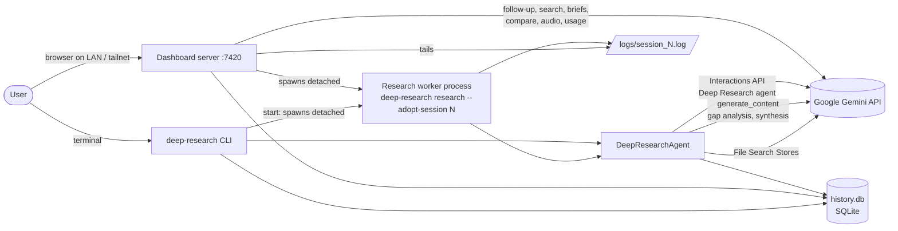

# deep-research: System Specification

| | |
|---|---|
| Document | Complete functional and technical specification |
| Applies to | deep-research v0.17.5 (package `deepresearch`) |
| Status | Living document. Describes the system as built, verified against the source on 2026-09-26 |
| Companion docs | [ARCHITECTURE.md](../ARCHITECTURE.md) (overview), [DASHBOARD_DESIGN.md](DASHBOARD_DESIGN.md) (design intent), [CHANGELOG.md](../CHANGELOG.md) |

This document is normative for behaviour: if the code and this document
disagree, one of them is a bug. Requirement IDs (for example `REQ-RUN-3`) are
stable and are referenced by tests and issues. Items marked **Known gap** are
real current behaviour that falls short of the ideal; each has a tracking note
in [section 17](#17-known-gaps-and-limitations).

## Contents

1. [Purpose and scope](#1-purpose-and-scope)
2. [Glossary](#2-glossary)
3. [System context](#3-system-context)
4. [Requirements](#4-requirements)
5. [Architecture](#5-architecture)
6. [Research engine](#6-research-engine)
7. [Session lifecycle and liveness](#7-session-lifecycle-and-liveness)
8. [Data model](#8-data-model)
9. [Command-line interface](#9-command-line-interface)
10. [Dashboard server and HTTP API](#10-dashboard-server-and-http-api)
11. [Dashboard client](#11-dashboard-client)
12. [Configuration, files and environment](#12-configuration-files-and-environment)
13. [External services, models and cost model](#13-external-services-models-and-cost-model)
14. [Security model](#14-security-model)
15. [Error handling and resilience](#15-error-handling-and-resilience)
16. [Testing and quality gates](#16-testing-and-quality-gates)
17. [Known gaps and limitations](#17-known-gaps-and-limitations)
18. [Build, release and operations](#18-build-release-and-operations)
19. [Extension guide](#19-extension-guide)

---

## 1. Purpose and scope

### 1.1 Problem

Google's Gemini Deep Research agent can plan a research task, run dozens of
web searches, read the sources and write a long, cited report. On its own it
is an API: every run is a one-off call, results live in Google's short-lived
interaction store, and there is no history, no way to go deeper on the gaps a
report leaves, and no comfortable place to read, compare or reuse the output.

### 1.2 What deep-research provides

1. **A command-line tool** (`deep-research`) that runs the agent in the
   foreground or as a detached background job, streams its thinking, uploads
   local files for it to search, and exports the report as Markdown, JSON or CSV.
2. **Recursive research**: after a report comes back, a model finds its gaps,
   spawns child research tasks to fill them in parallel, and synthesizes one
   final report. Depth and breadth are user-controlled and costed up front.
3. **A permanent local history** in SQLite: every run, its prompt, status,
   report, parent/child links and a semantic embedding, so past research can be
   listed, re-read, followed up and searched by meaning.
4. **A self-hosted web dashboard**: a private research desk that launches and
   watches runs, renders reports with citation cards, supports highlights,
   notes and notebooks, shows actual cost, maps related research, compares
   reruns, builds briefs, and reads reports aloud.

### 1.3 Goals

- **G1 Honest cost.** Never spend without showing an estimate first; show the
  real cost after the fact from Google's own usage data.
- **G2 Nothing lost.** Every run is recorded locally before any money is spent,
  and its report is kept after Google forgets the interaction.
- **G3 Truthful state.** A run that is not running must never be shown as
  running.
- **G4 Low friction.** One `uv tool install`, one API key, no build step, no
  external database, no background LLM calls the user did not ask for.
- **G5 Private by default.** Everything stays on the user's machine except the
  calls to Google that the user starts.

### 1.4 Non-goals

- Multi-user accounts, authentication or role separation (see [section 14](#14-security-model)).
- Hosting on the public internet.
- Supporting LLM providers other than Google Gemini.
- Windows service management (the daemon uses POSIX process groups).
- Editing the agent's research plan interactively (the Deep Research
  collaborative-planning mode is not used).

---

## 2. Glossary

| Term | Meaning |
|---|---|
| **Agent** | Google's hosted Deep Research agent (`deep-research-preview-04-2026` by default), reached through the Interactions API. |
| **Interaction** | One agent or model call on Google's side, identified by an interaction id (`v1_...`). Google retains it for a limited time (observed: about a day for usage data). |
| **Session** | One row in the local `sessions` table: a single research task (a root run, or one child of a recursive run) or its record. Identified locally by an integer id. |
| **Root / child** | In a recursive run, the root session has `parent_id NULL`; children point at their parent. |
| **Depth** | Number of recursion levels. Depth 1 = one agent task, no recursion. |
| **Breadth** | Maximum number of child tasks spawned per node. |
| **Node** | One agent task inside a recursive run. A run of depth D and breadth B has at most `1 + B + B^2 + ... + B^(D-1)` nodes. |
| **Adopt** | A background process taking over a session row that was pre-created by its launcher (the `start` command or the dashboard), instead of creating a new row. |
| **File Search Store** | A Gemini-hosted document index the agent can search (`fileSearchStores/...`). Temporary stores are created for `--upload` and deleted afterwards. |
| **Follow-up** | A question asked in the context of a finished interaction; the answer is appended to that session's report. |
| **Notebook** | A dashboard-only Markdown document for collecting findings across reports. |
| **Annotation** | A highlight (and optional note) on an exact quote in a report. |
| **Brief** | A generated executive brief, slide outline or email built from a report or notebook, saved as a notebook. |
| **Audio export** | A Gemini TTS rendering (full text or spoken summary) of a report or notebook, stored as MP3 (WAV if ffmpeg is missing). |
| **State dir** | `$XDG_CONFIG_HOME/deepresearch` (default `~/.config/deepresearch`): settings, database, logs, uploads, audio, dashboard pid file. |

---

## 3. System context

External actors:

| Actor | Interface | Direction |
|---|---|---|
| User (terminal) | `deep-research` CLI, stdout/stderr, exit codes | in/out |
| User (browser) | HTTP on `0.0.0.0:7420` by default; single-page app | in/out |
| Google Gemini API | HTTPS via `google-genai` SDK and one raw `urllib` health probe | out |
| ffmpeg (optional) | subprocess, WAV to MP3 conversion | out |
| Local filesystem | state dir (section 12) | in/out |

---

## 4. Requirements

Each requirement is testable. "Test" names the pytest that covers it, where one
exists; "manual" means covered by the release checklist in section 16.4.

### 4.1 Research runs (REQ-RUN)

| ID | Requirement | Verified by |
|---|---|---|
| REQ-RUN-1 | A research run shall create a local session row before or at the moment Google returns an interaction id, so a run is recorded even if the process dies later. | `test_create_session`, `test_process_stream_output` |
| REQ-RUN-2 | A background run (`start` or dashboard) shall pre-create its row with interaction id `pending_start`, record the worker pid, and have the worker adopt that row. No second row shall be created for the root, at any depth. | `test_recursive_root_adopts_precreated_row`, `test_start_research_records_run_meta_and_rerun_link`, `test_main_start` |
| REQ-RUN-3 | When the agent finishes, the complete report text shall be stored in `sessions.result` and the status set to `completed`. Logs may truncate the report; the database shall not. | `test_final_text_from_steps`, `test_update_session` |
| REQ-RUN-4 | If a run fails after an interaction exists, the row shall become `failed` with the error in `result`. If it fails before an interaction exists (bad key, quota, network), an adopted row shall also become `failed`. | `test_research_failure_before_interaction_marks_adopted_row_failed` |
| REQ-RUN-5 | Ctrl-C in a foreground run shall mark the row `cancelled`. | manual |
| REQ-RUN-6 | A streamed run whose connection drops shall resume from the last event id without starting a new interaction. | `test_deep_research_agent_error_coverage` (partial; see K8) |
| REQ-RUN-7 | Uploaded files shall go into a temporary File Search Store that is deleted, with its documents, when the run ends, whether it succeeds or fails. | `test_agent_auto_upload_and_cleanup`, `test_file_manager_cleanup` |
| REQ-RUN-8 | When `--output` ends in `.json` or `.csv`, the prompt shall ask for a fenced code block of that type, and the exporter shall extract it. Invalid JSON shall be saved raw to `<file>.raw`, not lost. | `test_request_auto_format_json`, `test_request_auto_format_csv`, `test_save_json_invalid_fallback` |

### 4.2 Recursion (REQ-REC)

| ID | Requirement | Verified by |
|---|---|---|
| REQ-REC-1 | For depth > 1, after each non-leaf report the follow-up model shall return 0 to `breadth` gap questions as a JSON list. An empty list, or unparseable output, ends recursion for that node and keeps its report. | `test_recursive_research` |
| REQ-REC-2 | Child tasks at one level shall run in parallel (thread pool sized to breadth), each as its own session row with `parent_id` and `depth` set. | `test_recursive_research` |
| REQ-REC-3 | When at least one child returns a report, the node's report shall be replaced by a synthesis of the parent and child reports. If synthesis fails, the parent report shall be kept with the raw child reports appended under a clear error marker. | code review (no dedicated test; see K8) |
| REQ-REC-4 | A level shall wait at most `recursion_timeout` (600 s) for its children; children still running then are excluded from synthesis and logged as timed out. | code review (see **Known gap** K3) |

### 4.3 History and liveness (REQ-HIS)

| ID | Requirement | Verified by |
|---|---|---|
| REQ-HIS-1 | A row in state `running` whose worker process no longer exists shall be shown and stored as `crashed` the next time sessions are listed. | `test_pid_tracking_dead`, `test_pid_tracking_alive` |
| REQ-HIS-2 | A child row with no pid shall be judged by its parent: if the parent is finished (`completed`, `crashed`, `failed`, `cancelled`) or the parent's process is gone, the child is `crashed`. | `test_session_manager_coverage` |
| REQ-HIS-3 | A `running` row with no pid and no parent shall become `crashed` after 3 hours without an update (Deep Research runs are limited to 60 minutes). | `test_running_row_without_pid_goes_stale`, `test_recent_running_row_without_pid_stays_running` |
| REQ-HIS-4 | Writing an embedding shall not change `updated_at`, so elapsed-time figures stay correct. | code review (see K8) |
| REQ-HIS-5 | Sessions shall be addressable by local integer id or by interaction id in every CLI command that takes an id. | `test_main_followup_numeric_id`, `test_id_help_is_consistent` |

### 4.4 Cost (REQ-COST)

| ID | Requirement | Verified by |
|---|---|---|
| REQ-COST-1 | The CLI `estimate` command and the dashboard launch form shall show a cost estimate from the same formula (section 13.3) before any research money is spent. The estimate makes no API calls. | `test_main_estimate`, `test_estimate_matches_cli_model` |
| REQ-COST-2 | The dashboard shall show a run's actual cost from the Interactions API usage block when Google still has it, and say plainly when it does not. | `test_usage_cost_uses_cached_rate_and_counts_searches`, `test_usage_endpoint_caches_expired_but_retries_transient` |
| REQ-COST-3 | Only definitive usage answers (real usage, or "interaction expired") shall be cached; transient errors shall be retried on the next request. | `test_usage_endpoint_caches_expired_but_retries_transient` |
| REQ-COST-4 | Any paid dashboard action other than launching research (audio export, AI brief, AI compare summary) shall show its cost before it runs. | manual |

### 4.5 Dashboard (REQ-DASH)

| ID | Requirement | Verified by |
|---|---|---|
| REQ-DASH-1 | `deep-research dashboard --start` shall start the server detached, write a pid file, and print every URL it is reachable on. `--stop`, `--restart`, `--status` shall act on that pid. `--status` exits 0 healthy, 1 not answering, 3 not running. | `test_start_status_restart_stop`, `test_stale_pid_file_is_ignored`, `test_flags_are_mutually_exclusive` |
| REQ-DASH-2 | The server shall bind `0.0.0.0:7420` by default and serve the whole UI from packaged static files with no build step and no CDN. | `test_index_and_static_served` |
| REQ-DASH-3 | The dashboard and every process it spawns shall use the user settings file for the API key even when started from a folder containing another `.env`. Variables exported in the real shell still win. | `test_service_env_*`, `test_children_and_server_do_not_run_in_callers_cwd` |
| REQ-DASH-4 | `/api/health?check=1` shall report whether Google accepts the key (cached 10 minutes; `null` when it cannot check). The UI shall block launching research when the key is missing or rejected. | `test_health_reports_invalid_key` |
| REQ-DASH-5 | Cancelling a run shall cancel the Google interaction (when one exists), terminate the worker's process group, and mark the row `cancelled`. | `test_cancel_only_running` (state check only) |
| REQ-DASH-6 | Deleting a session shall also delete its annotations and tags; with `recursive=1` it shall delete all descendants too. | `test_delete_recursive_purges_children_and_annotations` |
| REQ-DASH-7 | Uploads shall only be accepted as JSON (base64), limited to 25 MB per request, stored under a random folder in `uploads/`, and research may only reference upload paths inside that folder. | `test_upload_then_research_with_upload`, `test_json_content_type_required_for_writes`, `test_start_research_validation` |
| REQ-DASH-8 | The layout shall be usable at phone (390 px), tablet and desktop widths: side panes become drawers below the tablet breakpoint and nothing overflows horizontally. | manual (Playwright) |
| REQ-DASH-9 | Reading aloud word for word shall use the browser's speech engine (free) and highlight the current paragraph; source lists, URLs and citation markers shall not be read. | `test_speakable_strips_markup_citations_urls_and_sources` |
| REQ-DASH-10 | Audio exports shall support HTTP Range requests so browsers can seek. | `test_range_request_returns_partial_content` |
| REQ-DASH-11 | Notebooks shall autosave within about 1 second of the last edit, and in Read and Split modes shall render Markdown without the editor's text leaking into the preview. | manual |

### 4.6 Non-functional (REQ-NF)

| ID | Requirement |
|---|---|
| REQ-NF-1 | Python 3.12 and 3.13 on Linux and macOS. Runtime dependencies are limited to those in `pyproject.toml`; the dashboard uses only the standard library on the server and vanilla JavaScript on the client. |
| REQ-NF-2 | The test suite shall make no network calls and finish in under a minute. |
| REQ-NF-3 | All SQLite writes shall tolerate concurrent writers (worker processes, the dashboard, the CLI) through a 10 s busy timeout and retry on `OperationalError`. |
| REQ-NF-4 | The dashboard shall make no Gemini calls on its own schedule; every paid call is the direct result of a user action. (The only unprompted outbound call is the free key check at page load.) |
| REQ-NF-5 | The dashboard shall stay responsive with thousands of sessions: session lists are capped (500 default, 5,000 max) and the report reader renders one session at a time. |
| REQ-NF-6 | No secret (API key) shall be written to logs, the database, exports or the browser. |

