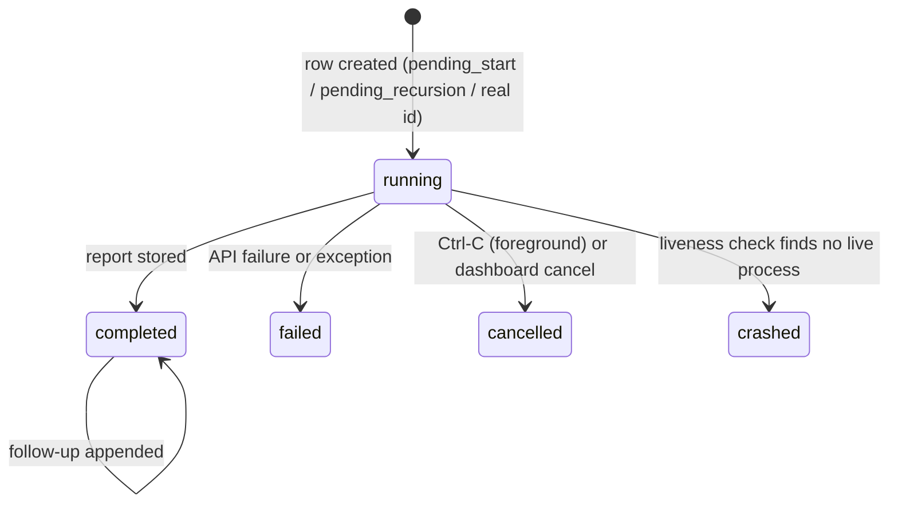
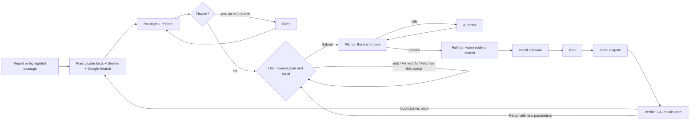

# deep-research: System Specification

| | |
|---|---|
| Document | Complete functional and technical specification |
| Applies to | deep-research v0.61.0 (package `deepresearch`) |
| Status | Living document. Describes the system as built. Every section read against the source on 2026-10-01 (v0.50.2): reference tables regenerated, prose and numbers checked. `tests/test_spec_sync.py` keeps routes, settings, modules, commands, section order and history order in sync. |
| Companion docs | [ARCHITECTURE.md](../ARCHITECTURE.md) (overview), [DASHBOARD_DESIGN.md](DASHBOARD_DESIGN.md) (design intent), [CHANGELOG.md](../CHANGELOG.md) |

This document is normative for behaviour: if the code and this document
disagree, one of them is a bug. Requirement IDs (for example `REQ-RUN-3`) are
stable and are referenced by tests and issues. Items marked **Known gap** are
real current behaviour that falls short of the ideal; each has a tracking note
in [section 17](#17-known-gaps-and-limitations).

## Contents

1. [Purpose and scope](#1-purpose-and-scope)
2. [Glossary](#2-glossary)
3. [System context](#3-system-context)
4. [Requirements](#4-requirements)
5. [Architecture](#5-architecture)
6. [Research engine](#6-research-engine)
7. [Session lifecycle and liveness](#7-session-lifecycle-and-liveness)
8. [Data model](#8-data-model)
9. [Command-line interface](#9-command-line-interface)
10. [Dashboard server and HTTP API](#10-dashboard-server-and-http-api)
11. [Dashboard client](#11-dashboard-client)
12. [Configuration, files and environment](#12-configuration-files-and-environment)
13. [External services, models and cost model](#13-external-services-models-and-cost-model)
14. [Security model](#14-security-model)
15. [Error handling and resilience](#15-error-handling-and-resilience)
16. [Testing and quality gates](#16-testing-and-quality-gates)
17. [Known gaps and limitations](#17-known-gaps-and-limitations)
18. [Build, release and operations](#18-build-release-and-operations)
19. [Extension guide](#19-extension-guide)
20. [Lab runs](#20-lab-runs)
21. [Data sources](#21-data-sources)
22. [Projects](#22-projects)
23. [Workspaces](#23-workspaces)
24. [Open items and future prospects](#24-open-items-and-future-prospects)

---

## 1. Purpose and scope

### 1.1 Problem

Google's Gemini Deep Research agent can plan a research task, run dozens of
web searches, read the sources and write a long, cited report. On its own it
is an API: every run is a one-off call, results live in Google's short-lived
interaction store, and there is no history, no way to go deeper on the gaps a
report leaves, and no comfortable place to read, compare or reuse the output.

### 1.2 What deep-research provides

1. **A command-line tool** (`deep-research`) that runs the agent in the
   foreground or as a detached background job, streams its thinking, uploads
   local files for it to search, and exports the report as Markdown, JSON or CSV.
2. **Recursive research**: after a report comes back, a model finds its gaps,
   spawns child research tasks to fill them in parallel, and synthesizes one
   final report. Depth and breadth are user-controlled and costed up front.
3. **A permanent local history** in SQLite: every run, its prompt, status,
   report, parent/child links and a semantic embedding, so past research can be
   listed, re-read, followed up and searched by meaning.
4. **A self-hosted web dashboard**: a private research desk that launches and
   watches runs, renders reports with citation cards, supports highlights,
   notes and notebooks, shows actual cost, maps related research, compares
   reruns, builds briefs, and reads reports aloud.
5. **Data sources** (section 21): named web datasets, buckets, Drive files and local
   folders, searchable by research runs and staged for Lab jobs.
6. **Lab runs** (section 20): turn a claim in a report into a real computation on a
   Slurm cluster, reviewed before submit, judged by checks the job writes, and attached
   to the report as a note.
7. **Projects** (section 22) and **workspaces** (section 23): containers for a grant,
   paper or thesis, and separate libraries (for example a clean demo library).

### 1.3 Goals

- **G1 Honest cost.** Never spend without showing an estimate first; show the
  real cost after the fact from Google's own usage data.
- **G2 Nothing lost.** Every run is recorded locally before any money is spent,
  and its report is kept after Google forgets the interaction.
- **G3 Truthful state.** A run that is not running must never be shown as
  running.
- **G4 Low friction.** One `uv tool install`, one API key, no build step, no
  external database, no background LLM calls the user did not ask for. (Lab planning
  steps the user started, such as the automatic referee and its fixer rounds, count as
  asked for; 20.15, 20.17.)
- **G5 Private by default.** Everything stays on the user's machine except the
  calls to Google that the user starts and, for Lab runs, the job and staged data sent
  to the user's own cluster account.

### 1.4 Non-goals

- Multi-user accounts, authentication or role separation (see [section 14](#14-security-model)).
- Hosting on the public internet.
- Supporting LLM providers other than Google Gemini.
- Windows service management (the daemon uses POSIX process groups).
- Editing the agent's research plan interactively (the Deep Research
  collaborative-planning mode is not used).

---

## 2. Glossary

| Term | Meaning |
|---|---|
| **Agent** | Google's hosted Deep Research agent (`deep-research-preview-04-2026` by default), reached through the Interactions API. |
| **Interaction** | One agent or model call on Google's side, identified by an interaction id (`v1_...`). Google retains it for a limited time (observed: about a day for usage data). |
| **Session** | One row in the local `sessions` table: a single research task (a root run, or one child of a recursive run) or its record. Identified locally by an integer id. |
| **Root / child** | In a recursive run, the root session has `parent_id NULL`; children point at their parent. |
| **Depth** | Number of recursion levels. Depth 1 = one agent task, no recursion. |
| **Breadth** | Maximum number of child tasks spawned per node. |
| **Node** | One agent task inside a recursive run. A run of depth D and breadth B has at most `1 + B + B^2 + ... + B^(D-1)` nodes. |
| **Adopt** | A background process taking over a session row that was pre-created by its launcher (the `start` command or the dashboard), instead of creating a new row. |
| **File Search Store** | A Gemini-hosted document index the agent can search (`fileSearchStores/...`). Temporary stores are created for `--upload` and deleted afterwards. |
| **Follow-up** | A question asked in the context of a finished interaction; the answer is appended to that session's report. |
| **Notebook** | A dashboard-only Markdown document for collecting findings across reports. |
| **Annotation** | A highlight (and optional note) on an exact quote in a report. |
| **Brief** | A generated executive brief, slide outline, email, grant section, lay summary or literature review built from a report, notebook or project, saved as a notebook. |
| **Project** | A container for the reports, data sources, notebooks and Lab runs of one grant, paper, proposal or thesis, with defaults for new work (section 22). |
| **Inbox** | Top-level reports that are in no project. |
| **Audio export** | A Gemini TTS rendering (full text or spoken summary) of a report or notebook, stored as MP3 (WAV if ffmpeg is missing). |
| **State dir** | `$XDG_CONFIG_HOME/deepresearch` (default `~/.config/deepresearch`): settings, database, logs, uploads, audio, dashboard pid file. Main's data lives here; other workspaces under `workspaces/<id>/`. |
| **Workspace** | A separate library (database, logs, uploads, audio, Lab results). `main` is the default and never moves (section 23). |
| **Data source** | A named place data lives (web, GCS, S3/CephRDS, Drive, local folder), registered once and reused (section 21). |
| **Lab run** | A computation planned from a report and run on a Slurm cluster; outcome CONFIRMED, REFUTED, INCONCLUSIVE or BROKEN (section 20). |
| **Warm node** | A long-running Slurm job on the cluster that runs pilots, fact checks and short Lab jobs without waiting for a new node (20.11, 20.16). |
| **Referee** | A second model pass that asks whether a Lab plan's test could ever fail or ever pass; advice only (20.15). |

---

## 3. System context


```mermaid
flowchart LR
    user([User]) -->|terminal| cli[deep-research CLI]
    user -->|browser on LAN / tailnet| dash[Dashboard server :7420]
    dash -->|spawns detached| worker[Research worker process<br/>deep-research research --adopt-session N]
    cli -->|start: spawns detached| worker
    cli --> agent[DeepResearchAgent]
    worker --> agent
    dash -->|follow-up, search, briefs,<br/>compare, audio, usage| gemini
    agent -->|Interactions API<br/>Deep Research agent| gemini[(Google Gemini API)]
    agent -->|generate_content<br/>gap analysis, synthesis| gemini
    agent -->|File Search Stores| gemini
    agent --> db[(history.db<br/>SQLite)]
    dash --> db
    cli --> db
    worker --> logs[/logs/session_N.log/]
    dash -->|tails| logs
```

External actors:

| Actor | Interface | Direction |
|---|---|---|
| User (terminal) | `deep-research` CLI, stdout/stderr, exit codes | in/out |
| User (browser) | HTTP on `127.0.0.1:7420` by default (this machine only); single-page app | in/out |
| Google Gemini API | HTTPS via `google-genai` SDK and one raw `urllib` health probe | out |
| ffmpeg (optional) | subprocess, WAV to MP3 conversion | out |
| Slurm cluster (optional) | `ssh` (through `gcloud compute ssh --tunnel-through-iap` or a plain host), `sbatch`/`squeue`/`sacct`; Lab runs (section 20) | out |
| `gcloud`, `rclone` (optional) | subprocess; GCS, Drive and S3/CephRDS data sources (section 21) | out |
| Public websites | HTTPS fetches of data-source and Lab URLs (21, 20.18) | out |
| Local filesystem | state dir (section 12) | in/out |

---

## 4. Requirements

Each requirement is testable. "Test" names the pytest that covers it, where one
exists; "manual" means covered by the release checklist in section 16.4.

### 4.1 Research runs (REQ-RUN)

| ID | Requirement | Verified by |
|---|---|---|
| REQ-RUN-1 | A research run shall create a local session row before or at the moment Google returns an interaction id, so a run is recorded even if the process dies later. | `test_create_session`, `test_process_stream_output` |
| REQ-RUN-2 | A background run (`start` or dashboard) shall pre-create its row with interaction id `pending_start`, record the worker pid, and have the worker adopt that row. No second row shall be created for the root, at any depth. | `test_recursive_root_adopts_precreated_row`, `test_start_research_records_run_meta_and_rerun_link`, `test_main_start` |
| REQ-RUN-3 | When the agent finishes, the complete report text shall be stored in `sessions.result` and the status set to `completed`. Logs may truncate the report; the database shall not. | `test_final_text_from_steps`, `test_final_text_joins_every_model_output_part`, `test_update_session` |
| REQ-RUN-4 | If a run fails after an interaction exists, the row shall become `failed` with the error in `result`. If it fails before an interaction exists (bad key, quota, network), an adopted row shall also become `failed`. | `test_research_failure_before_interaction_marks_adopted_row_failed` |
| REQ-RUN-5 | Ctrl-C in a foreground run shall mark the row `cancelled`. | manual |
| REQ-RUN-6 | A streamed run whose connection drops shall check the interaction's status and, if it is still running, resume from the last event id without starting a new interaction, backing off on repeated failures. | `test_stream_end_without_final_event_checks_status` |
| REQ-RUN-7 | Uploaded files shall go into a temporary File Search Store that is deleted, with its documents, when the run ends, whether it succeeds or fails. | `test_agent_auto_upload_and_cleanup`, `test_file_manager_cleanup` |
| REQ-RUN-8 | When `--output` ends in `.json` or `.csv`, the prompt shall ask for a fenced code block of that type, and the exporter shall extract it. Invalid JSON shall be saved raw to `<file>.raw`, not lost. | `test_request_auto_format_json`, `test_request_auto_format_csv`, `test_save_json_invalid_fallback` |

### 4.2 Recursion (REQ-REC)

| ID | Requirement | Verified by |
|---|---|---|
| REQ-REC-1 | For depth > 1, after each non-leaf report the follow-up model shall return 0 to `breadth` gap questions as a JSON list. An empty list, or unparseable output, ends recursion for that node and keeps its report. | `test_recursive_research` |
| REQ-REC-2 | Child tasks at one level shall run in parallel (thread pool sized to breadth), each as its own session row with `parent_id` and `depth` set. | `test_recursive_research` |
| REQ-REC-3 | When at least one child returns a report, the node's report shall be replaced by a synthesis of the parent and child reports. If synthesis fails, the parent report shall be kept with the raw child reports appended under a clear error marker. | code review (no dedicated test; see K8) |
| REQ-REC-4 | A level shall wait for all of its children and synthesize every report that comes back, however long it took. Each task (root or child) is bounded by `task_timeout_min` (default 180, `DR_TASK_TIMEOUT_MIN`, 0 = no limit); a task still running at the limit is cancelled at Google and marked `failed`. At most `breadth` children run per node. | `test_slow_child_report_is_kept_in_synthesis`, `test_gap_questions_are_capped_at_breadth`, `test_poll_times_out_and_cancels_at_google` |

### 4.3 History and liveness (REQ-HIS)

| ID | Requirement | Verified by |
|---|---|---|
| REQ-HIS-1 | A row in state `running` whose worker process no longer exists shall be shown and stored as `crashed` the next time sessions are listed. | `test_pid_tracking_dead`, `test_pid_tracking_alive` |
| REQ-HIS-2 | A child row with no pid shall be judged by its parent: if the parent is finished (`completed`, `crashed`, `failed`, `cancelled`) or the parent's process is gone, the child is `crashed`. | `test_session_manager_coverage` |
| REQ-HIS-3 | A `running` row with no pid and no parent shall become `crashed` after 3 hours without an update (matching the default task limit). | `test_running_row_without_pid_goes_stale`, `test_recent_running_row_without_pid_stays_running` |
| REQ-HIS-4 | Writing an embedding shall not change `updated_at`, so elapsed-time figures stay correct. | code review (see K8) |
| REQ-HIS-5 | Sessions shall be addressable by local integer id or by interaction id in every CLI command that takes an id. | `test_main_followup_numeric_id`, `test_id_help_is_consistent` |

### 4.4 Cost (REQ-COST)

| ID | Requirement | Verified by |
|---|---|---|
| REQ-COST-1 | The CLI `estimate` command and the dashboard launch form shall show a cost estimate from the same formula (section 13.3) before any research money is spent. The estimate makes no API calls. | `test_main_estimate`, `test_estimate_matches_cli_model` |
| REQ-COST-2 | The dashboard shall show a run's actual cost from the Interactions API usage block when Google still has it, and say plainly when it does not. | `test_usage_cost_uses_cached_rate_and_counts_searches`, `test_usage_endpoint_caches_expired_but_retries_transient` |
| REQ-COST-3 | Only definitive usage answers (real usage, or "interaction expired") shall be cached; transient errors shall be retried on the next request. | `test_usage_endpoint_caches_expired_but_retries_transient` |
| REQ-COST-4 | Any paid dashboard action other than launching research (audio export, AI brief, AI compare summary) shall show its cost before it runs. | manual |

### 4.5 Dashboard (REQ-DASH)

| ID | Requirement | Verified by |
|---|---|---|
| REQ-DASH-1 | `deep-research dashboard --start` shall start the server detached, write a pid file, and print every URL it is reachable on. `--stop`, `--restart`, `--status` shall act on that pid. `--status` exits 0 healthy, 1 not answering, 3 not running. | `test_start_status_restart_stop`, `test_stale_pid_file_is_ignored`, `test_flags_are_mutually_exclusive` |
| REQ-DASH-2 | The server shall bind `127.0.0.1:7420` by default, refuse a non-loopback `--host` unless `--allow-remote` is given, reject requests from other machines while loopback-only, and serve the whole UI from packaged static files with no build step and no CDN. | `test_index_and_static_served`, `test_local_only_handler_refuses_other_machines`, `test_start_refuses_non_loopback_without_allow_remote` |
| REQ-DASH-3 | The dashboard and every process it spawns shall use the user settings file for the API key even when started from a folder containing another `.env`. Variables exported in the real shell still win. | `test_service_env_*`, `test_children_and_server_do_not_run_in_callers_cwd` |
| REQ-DASH-4 | `/api/health?check=1` shall report whether Google accepts the key (cached 10 minutes; `null` when it cannot check). The UI shall block launching research when the key is missing or rejected. | `test_health_reports_invalid_key` |
| REQ-DASH-5 | Cancelling a run shall cancel the Google interaction (when one exists) and those of its running children, terminate the worker's process group, and mark those rows `cancelled`. | `test_cancel_only_running` (state check only) |
| REQ-DASH-6 | Deleting a session shall also delete its annotations and tags; with `recursive=1` it shall delete all descendants too. | `test_delete_recursive_purges_children_and_annotations` |
| REQ-DASH-12 | Every non-GET API request shall be `application/json` (with or without a body), shall be refused when its `Origin` differs from its `Host`, and every request shall be refused when its `Host` is not an IP address, a single-label name, a local or tailnet suffix, or listed in `DR_ALLOWED_HOSTS`. | `test_bodyless_cross_site_post_cannot_cancel`, `test_foreign_origin_write_refused`, `test_dns_rebinding_host_refused`, `test_local_host_names_allowed` |
| REQ-DASH-7 | Uploads shall only be accepted as JSON (base64), limited to 25 MB per request, stored under a random folder in `uploads/`, and research may only reference upload paths inside that folder. | `test_upload_then_research_with_upload`, `test_json_content_type_required_for_writes`, `test_start_research_validation` |
| REQ-DASH-13 | Every action a page offers shall stay reachable after the v0.54.0 clean-up: declared once in the action registry and shown as a toolbar button, in the Share or "..." menu, or in the command palette (every registered action that is available on the page appears in the palette). | `test_ui_shell.py` |
| REQ-DASH-8 | The layout shall be usable at phone (390 px), tablet and desktop widths: side panes become drawers below the tablet breakpoint and nothing overflows horizontally. | manual (Playwright) |
| REQ-DASH-9 | Reading aloud word for word shall use the browser's speech engine (free) and highlight the current paragraph; source lists, URLs and citation markers shall not be read. | `test_speakable_strips_markup_citations_urls_and_sources` |
| REQ-DASH-10 | Audio exports shall support HTTP Range requests so browsers can seek. | `test_range_request_returns_partial_content` |
| REQ-DASH-11 | Notebooks shall autosave within about 1 second of the last edit, and in Read and Split modes shall render Markdown without the editor's text leaking into the preview. | manual |

### 4.6 Non-functional (REQ-NF)

| ID | Requirement |
|---|---|
| REQ-NF-1 | Python 3.12 and 3.13 on Linux and macOS. Runtime dependencies are limited to those in `pyproject.toml`; the dashboard uses only the standard library on the server and vanilla JavaScript on the client. |
| REQ-NF-2 | The test suite shall make no network calls and finish in about two minutes (587 tests at v0.50.1: about 110 s). |
| REQ-NF-3 | All SQLite access shall tolerate concurrent writers (worker processes, the dashboard, the CLI) through WAL mode and a 10 s busy timeout. Session writes on the research path shall also retry on `OperationalError`. **Partly met:** several writes have no retry (K1). |
| REQ-NF-4 | The dashboard shall make no Gemini calls on its own schedule; every paid model call is the direct result of a user action (the Lab referee and refine rounds follow a plan the user asked for). Unprompted outbound calls: the free key check at page load, the Lab watcher while runs are active, and, only when a target sets `warm.always_on`, the warm-node keeper every 5 minutes (it keeps a cluster node running, which costs cluster money; 20.16). |
| REQ-NF-5 | The dashboard shall stay responsive with thousands of sessions: session lists are capped (500 default, 5,000 max) and the report reader renders one session at a time. |
| REQ-NF-6 | No secret (API key) shall be written to logs, the database, exports or the browser. |

---

## 5. Architecture

### 5.1 Module map

| Module | Lines | Responsibility |
|---|---|---|
| `deepresearch/__init__.py` | 30 | Entry point `main`, version lookup, source-checkout venv re-exec (see K18), silences SDK warnings. |
| `deepresearch/__main__.py` | 684 | argparse parser, bare-prompt shortcut, `known_commands`, `--workspace`, command dispatch, top-level error catch. |
| `cli/base.py` | 43 | `ResearchRequest` and `FollowUpRequest` (Pydantic): final prompt assembly and File Search tool config. |
| `cli/commands.py` | 927 | One handler per research CLI command; `detach_process` for `start`; the CLI cost estimator; `--source` handling; `repair`. |
| `cli/jsonout.py` | 89 | `--json` output and exit codes for every command (9.6). |
| `cli/sources.py` | 396 | `deep-research sources ...` (section 21); `guess_kind`, `local_uri` validation. |
| `cli/projects.py` | 305 | `deep-research projects ...` (22.10): list, show, create, add, remove, export; reuses the dashboard API in-process. |
| `cli/workspaces.py` | 179 | `deep-research workspace ...` (section 23): list, create, duplicate, rename, archive, delete, copy, export, import. |
| `core/config.py` | 78 | Paths, `.env` loading, `DeepResearchConfig`, `service_env()` for background processes. |
| `core/agent.py` | 725 | `DeepResearchAgent`: stream and poll runs, follow-up, gap analysis, synthesis, recursion; `_final_text` joins every output part. |
| `core/session.py` | 244 | `SessionManager`: all reads and writes of the `sessions` table, liveness rules. |
| `core/estimate.py` | 70 | The one cost estimate for CLI and dashboard (20.28, v0.61.0): standard and Max per-run token and search profiles, Gemini rates, Google Search at $14/1K; `cost_usd` (tokens) and `cost_high_usd` (plus the full search count). |
| `core/planner.py` | 85 | Plan first (20.28): Google's collaborative planning on the standard agent; plan and revise, cancel after 180 s. |
| `core/repair.py` | 156 | Restore reports saved with only their last part (v0.38.2): re-fetch from Google, optional re-synthesis. |
| `core/workspace.py` | 331 | Workspaces (section 23): Main stays in the config dir, others under `workspaces/<id>/`; current workspace, create, archive, trash. |
| `core/wscopy.py` | 488 | Copy projects and reports into another workspace (v0.42.0): read-only source, one transaction, id remapping, Lab folders. |
| `core/wszip.py` | 369 | Workspace export and import as `.drws.zip` (v0.43.0): manifest, checksums, path and size validation, never overwrites. |
| `storage/database.py` | 35 | Creates `sessions`, enables WAL, additive column migrations. |
| `storage/files.py` | 151 | `FileManager`: temporary File Search Stores, upload, cleanup rules (`is_disposable_store`). |
| `utils/exporters.py` | 49 | Code-block extraction and `.json` / `.csv` / text export. |
| `utils/retry.py` | 36 | `with_retry` (network) and `db_retry` (SQLite locks) tenacity decorators. |
| `utils/logger.py` | 59 | Rich console logging with `[INFO]`/`[THOUGHT]`/`[WARN]`/`[ERROR]`/`[DB]` tags and optional timestamps. |
| `dashboard/daemon.py` | 225 | `--start/--stop/--restart/--status`, pid file, loopback check, health probe, URL listing. |
| `dashboard/server.py` | 2,355 | `Api` route table and handlers, workspace context per request (`X-DR-Workspace`), `ThreadingHTTPServer` plumbing, loopback-only guard, static files, Range support, streamed zip upload. |
| `dashboard/store.py` | 289 | `DashboardStore`: notebooks, annotations, session meta (stars, tags), dashboard session queries. |
| `dashboard/features.py` | 599 | Actual cost, research map, compare, briefs, text-to-speech audio. |
| `dashboard/projects.py` | 1,028 | Projects: store, filing rules, citations, dossier and research package exports, summary/Ask prompts, Inbox grouping (22). |
| `dashboard/project_api.py` | 752 | Project HTTP handlers mixed into `Api` (22.6), including the claims board in dossiers. |
| `dashboard/claims.py` | 170 | Claims board (22.9): one claim per tested question, outcome ordering, deterministic. |
| `dashboard/clusterview.py` | 150 | The Lab's Cluster view (20.23, v0.57.0): five bifrost read panels (`cluster_status`, `jobs_list`, `my_usage`, `waste_report`, `storage_usage`) cached per panel with a background refresh, and `lab_summary` (the workspace's Lab runs, their Slurm job ids, outcomes and spend). |
| `dashboard/bifrost.py` | 470 | The hosted ursa-bifrost MCP server as a cluster backend (20.20, v0.53.0): `BifrostClient` (stdlib MCP over Streamable HTTP, OAuth sign-in with PKCE as the `bifrost-deep-research` program client, rotating refresh under a lock, 401 retry), and the Lab's reads: `stockouts`, `script_issues`, `explain` (rule -> Lab class), `efficiency`, `read_home`, `catalog`; and the Lab's jobs (20.21, v0.55.0): `BifrostJobs` (submit with self-confirmation inside guards, batched `states`, line-paged `log`, `fetch` through read and signed links, `cancel`, staging `upload`). |
| `cli/cluster.py` | 115 | `deep-research cluster login | logout | status` (20.20) and `nexus login | logout | status` (20.29). |
| `dashboard/nexus.py` | 170 | Nexus project links (20.29, v0.61.0): `client()` (the bifrost MCP client as the read-only `nexus-deep-research` program client, token `nexus-token.json`), `search` (labs, grants, GCP and research projects only), `show` + `summarize` (public facts, never interaction or task text; cached 10 min). |
| `dashboard/cluster.py` | 918 | Cluster access (v0.52.0): `SlurmSSHTarget` (SSH via gcloud IAP or a plain host, one ControlMaster connection, sbatch/squeue/sacct, run folders, warm worker and spool, file transfer, catalog cache), `ScopedTarget` (a workspace's view), `load_targets`. No model or database code. |
| `dashboard/lab.py` | 4,808 | Lab runs (section 20): always-on keeper, planner, cluster fact checks, pre-flight, fixer, referee hook, refine rounds, laptop fetch, job harness and install ladder, pilot, watcher. Drives `cluster.py`. |
| `dashboard/labcores.py` | 249 | Cores and memory on shared partitions (20.2b): the request per node, `#SBATCH` lines, share of the node for the estimate, pre-flight warnings, planner text. |
| `dashboard/labguard.py` | 1,004 | Lab lessons (curated and learned pitfalls), planning rules (`GENERAL_RULES`), science guards on plans. |
| `dashboard/labverdict.py` | 230 | Outcomes CONFIRMED / REFUTED / INCONCLUSIVE / BROKEN from `verdict.json` checks (20.13). |
| `dashboard/labloop.py` | 355 | Verdict loop (20.13): report notes, pilot gate, one automatic re-plan of an inconclusive run. |
| `dashboard/labreview.py` | 162 | Referee (20.15): prompt, normalized findings, fixer input. |
| `dashboard/labfetch.py` | 322 | Fetch on this laptop for cluster-blocked URLs (20.18): blocked-URL detection, safe fetch, provenance. |
| `dashboard/warm_worker.sh` | 125 | Warm worker on the cluster: spool queue, parallel tasks, heartbeats, idle and time-limit handling (20.16). |
| `sources/` | 3,458 | Data sources (section 21): `model`, `registry`, `adapters`, `public`, `staging`, `usage`, `index`, `discover`, `cloud_catalogs`, `provenance`, `service`, `browse`, `gdrive`. |
| `dashboard/static/` | 5,261 | `index.html`, `app.css`, `app.js`, `actions.js`, `features.js`, `lab.js`, `cluster.js`, `sources.js`, `filebrowser.js`, `projects.js`, `workspaces.js`, vendored `marked` and `DOMPurify`. |

Total Python: about 21,600 lines. Total client: about 5,300 lines plus vendored libraries. Line counts as of v0.50.1.

### 5.2 Process model

| Process | Started by | Lifetime | Holds |
|---|---|---|---|
| Foreground CLI | the user | one command | a `DeepResearchAgent` when researching |
| Research worker | `start` or `POST /api/research`, as `deep-research research ... --adopt-session N` | one research run | the agent; for recursion, one thread per child task |
| Dashboard server | `dashboard --start` (detached) or `--foreground` | until stopped | one `Api` instance (a context per workspace), one thread per HTTP request, one thread per audio job, Lab watcher, planning and keeper threads (5.4) |
| Cluster jobs (optional) | the Lab, over SSH | per job; the warm worker until stopped or its time limit | Slurm batch jobs and the warm worker (`warm_worker.sh`) on the cluster, never on the login node (section 20) |

Workers are started with `start_new_session=True`, so each is the leader of its own
process group and survives the terminal or the dashboard exiting. Cancel kills the
whole group (`os.killpg`). The dashboard starts workers with `python -I -u -c <boot>`
from the state dir (with `--workspace ID` for runs in another workspace), so neither a stray `./deepresearch` package nor a stray `./.env`
in the launch folder can leak in (REQ-DASH-3).

The CLI `start` command uses a different launcher (`detach_process` in
`cli/commands.py`: `sys.executable -u sys.argv[0]`, inheriting the caller's cwd and
environment). Both launchers produce the same worker command line.

### 5.3 A background run end to end

```mermaid
sequenceDiagram
    participant U as User / browser
    participant D as Dashboard (Api)
    participant DB as history.db
    participant W as Worker process
    participant G as Gemini API
    U->>D: POST /api/research {prompt, depth, breadth}
    D->>DB: INSERT sessions (interaction_id='pending_start', status='running')
    D->>W: spawn research --adopt-session N (new process group)
    D->>DB: UPDATE pid; INSERT run_meta (estimate, rerun_of)
    D-->>U: {id, pid}
    W->>G: interactions.create(agent, background, stream)
    G-->>W: interaction.created (id v1_...)
    W->>DB: UPDATE sessions SET interaction_id (adopt row N)
    loop streaming
        G-->>W: thought summaries, text deltas
        W->>W: append to logs/session_N.log
    end
    U->>D: GET /api/sessions/N/log?offset= (every 2 s)
    G-->>W: interaction.completed
    W->>G: interactions.get(id) for final text
    W->>DB: UPDATE status='completed', result=report
    U->>D: GET /api/sessions (every 4 s while running)
```

### 5.4 Concurrency

- **SQLite in WAL mode** is the only shared state between processes. Every connection
  uses a 10 s busy timeout. `SessionManager` write paths that matter most are wrapped in
  `db_retry` (5 attempts, 0.1-1 s backoff). See K1 for the paths that are not.
- **Recursion** uses a `ThreadPoolExecutor(max_workers=breadth)` per level. Each child
  builds its own `DeepResearchAgent` (own Gemini client, own `FileManager`) so threads
  share no mutable objects except the database.
- **Dashboard** request threads share one `Api`. Each request runs in its workspace's
  context (one `Api` context per workspace, created on first use under `_ctx_lock`, each
  with its own database, store, features and `Lab`). Other shared mutable state: the
  audio job table (`_jobs`, guarded by `_jobs_lock`), the embedding backfill (guarded by
  `_embed_lock`), the key-check cache and the lazily created Gemini clients in `Features`
  and `Lab` (one shared client each, under `_client_lock`).
- **Lab threads**: one watcher thread per workspace while runs are active (polls every
  15 s), planning, review and fix work on short-lived threads, and, when a target sets
  `warm.always_on`, one keeper thread per process (`_KEEPER_LOCK`) shared by all
  workspaces (20.16). The SSH ControlMaster connection per target is opened under the
  target's own lock.

---

## 6. Research engine

### 6.1 Request model

`ResearchRequest` fields: `prompt`, `stores`, `stream`, `output_format`,
`upload_paths`, `output_file`, `adopt_session_id`, `depth` (default 1), `breadth`
(default 3).

The prompt sent to Google (`final_prompt`) is the user prompt plus, in order:

1. `\n\nFormat the output as follows: <format>` when `--format` is given.
2. A fenced-block instruction when `--output` ends in `.json` or `.csv` (REQ-RUN-8).
3. When files are uploaded, the stream path also appends an instruction to search the
   uploaded files first and cite them. The poll path does not (a minor inconsistency).

`tools_config` is `[{"type": "file_search", "file_search_store_names": stores}]` when
any store is in play, otherwise `None` (the agent then uses its default web tools).

### 6.2 Stream mode (`start_research_stream`)

Used for depth-1 runs with `--stream`, for every dashboard depth-1 run, and for the
root node of every recursive run.

1. If uploads are present, create a temporary store and add it to `stores`. On upload
   failure: log, clean up, return `None` (no row is written; an adopted row stays
   `running` until liveness marks it crashed).
2. `interactions.create(input, agent, background=True, stream=True, tools,
   agent_config={"type": "deep-research", "thinking_summaries": "auto"})`.
3. Process events. On `interaction.created`/`interaction.start`: record the id, and
   either adopt the pre-created row (`update_session_interaction_id`) or create a new
   row. Text deltas print as they arrive; thought summaries print as `[THOUGHT]` lines.
   Terminal events: `interaction.completed/complete`, `error`, `interaction.error`,
   `interaction.failed`, `interaction.cancelled`, or a `status_update` to a terminal
   status.
4. If the stream ends without a terminal event (Google closes long connections),
   check the interaction's status; if it is terminal, finish; otherwise reconnect with
   `interactions.get(id, stream=True, last_event_id=...)`. The wait between attempts
   grows from 2 s to 30 s on repeated failures. The loop ends at the task limit
   (6.4a).
5. On completion, fetch the interaction once more and extract the final text:
   every `model_output` step joined in order (long reports arrive in several parts;
   `output_text` holds only the last part and was the cause of cut reports before
   v0.38.2), else `output_text`. If non-empty, store it with
   status `completed` (or leave `running` when the caller will synthesize later) and
   export it if `--output` was given. If empty, nothing is written (see K6).
6. `KeyboardInterrupt` marks the row `cancelled`. Any other exception marks it `failed`
   (by interaction id if known, else by adopted row id). Uploads are always cleaned up.

### 6.3 Poll mode (`start_research_poll`)

Used for depth-1 runs without `--stream` and for every child node of a recursive run.
Same upload handling. Creates the interaction with `background=True` (no stream, no
`agent_config`), records or adopts the row, then calls `interactions.get` every 10 s
until the status is `completed` (store the report) or any other terminal status
(`failed`, `cancelled`, `incomplete`, `budget_exceeded`: store the error; `cancelled`
maps to `cancelled`, the rest to `failed`). A failed status check is logged and retried;
30 in a row fail the run. The loop ends at the task limit (6.4a). The report is truncated to 2,000 characters
in the log, never in the database (REQ-RUN-3).

### 6.4 Recursion (`start_recursive_research`)

```
execute(prompt, depth d, max D, breadth B, parent):
    if d == 1: run stream mode, adopting the pre-created row if any
    else:      create child row (interaction_id 'pending_recursion', parent, depth d),
               run poll mode adopting it
    if no report: return None
    if d >= D: return report                       # leaf
    questions = analyze_gaps(prompt, report, B)
    if no questions: mark completed, return report
    run execute(q, d+1, D, B, this row) for each of the first B questions,
        in a thread pool of size B
    wait for every child (each bounds itself with the task limit)
    collect every report that came back
    if none: return report
    final = synthesize_findings(prompt, report, child reports)
    store final as this row's result, status completed
    return final
```

Non-leaf nodes are run with `auto_update_status=False`, so their row stays `running`
with the interim report stored until synthesis finishes. The CLI prints a note and
switches to polling when `--stream` is combined with `--depth > 1`, but the root still
streams to the log.

**Gap analysis** (`analyze_gaps`) sends the objective and report to the follow-up model
and asks for 1 to B questions as a JSON list in a ` ```json ` block. Missing block,
unparseable JSON or any error returns `[]`, which ends recursion for that node. The list
is truncated to B.

**Synthesis** (`synthesize_findings`) sends the objective, the node's report and all
child reports to the follow-up model with instructions to integrate rather than append
and to resolve conflicts. On error it returns the parent report followed by
`[ERROR: Synthesis failed. Appending raw sub-reports below]` and the raw child reports
(REQ-REC-3).

### 6.4a Task limit

Every research task, root or child, carries its own deadline of `task_timeout_min`
minutes (default 180; `DR_TASK_TIMEOUT_MIN`; 0 disables it). Runs are never cut short
before then. A task still running at the deadline is cancelled at Google
(`interactions.cancel`) so it stops billing, and its row becomes `failed` with a
"Timed out" message. Because each child bounds itself, a recursion level simply waits
for all its children, and every report that finishes is used.

Google does not document a maximum run time for the Deep Research agent. Observed runs
take 5 to 60 minutes; the 3-hour default leaves room for slow runs and the Max agent.

### 6.5 Follow-up

`follow_up` calls `interactions.create(input=question, model=followup_model,
previous_interaction_id=<session's interaction>)`, so Google supplies the context. The
answer is appended to the session's `result` as:

```
---
### Follow-up (YYYY-MM-DD HH:MM)

**Q: <question>**

<answer>
```

This only works while Google still holds the original interaction. The dashboard
returns 502 when nothing was appended and 409 when the session has no real interaction
id yet.

### 6.6 File Search

`FileManager.create_store_from_paths` creates one store per run, uploads each file
(each regular file in a folder, top level only; K9), forcing `text/plain` for common
source and text extensions, then sleeps a fixed 5 s for ingestion (K9). `cleanup`
deletes each document with `force`, then the store, then any legacy file resources.
Failures are logged as warnings; a store that cannot be emptied persists and can be
removed later with `deep-research cleanup`, which deletes **every** store on the key.

### 6.7 Export

`DataExporter.export(text, path)`: `.json` extracts the first ` ```json ` block (or the
first bare block, or the whole text), parses and pretty-prints it, writing the raw text
to `<path>.raw` if parsing fails. `.csv` writes the extracted block as is. Any other
extension writes the text unchanged. `show --save` is separate: `.html` saves the Rich
rendering with the Monokai theme, anything else saves plain text.

### 6.8 Semantic search

Shared by `deep-research search` and `POST /api/search`:

1. Backfill: embed every completed session without an embedding using
   `gemini-embedding-001` over `Objective: <prompt>\n\nResult:\n<result>` truncated to
   15,000 characters. Stored as a JSON array in `sessions.embedding` without touching
   `updated_at` (REQ-HIS-4).
2. Embed the query, score every embedded session by cosine similarity in pure Python.
3. Take the top `limit` (CLI default 3; dashboard default 5, capped 1 to 20).
4. Optionally (always in the CLI, `synthesize` flag in the dashboard) send the matching
   prompts and **full** reports to the follow-up model with instructions to answer only
   from them and cite `[Session #N]` for every fact.

---

## 7. Session lifecycle and liveness

### 7.1 States


```mermaid
stateDiagram-v2
    [*] --> running: row created (pending_start / pending_recursion / real id)
    running --> completed: report stored
    running --> failed: API failure or exception
    running --> cancelled: Ctrl-C (foreground) or dashboard cancel
    running --> crashed: liveness check finds no live process
    completed --> completed: follow-up appended
```

`crashed` is assigned only by the liveness check, never by the worker. There is no
transition out of `failed`, `cancelled` or `crashed`; a re-run creates a new row.

### 7.2 Interaction id placeholders

| Value | Meaning | Written by |
|---|---|---|
| `pending_start` | Background root row created before the worker has an interaction. | `start`, `POST /api/research` |
| `pending_recursion` | Child row created before its poll run has an interaction. | recursion |
| `v1_...` | Real Google interaction id. | worker on `interaction.created` |

Code that talks to Google (cancel, follow-up, usage) skips any id beginning with
`pending`.

### 7.3 Liveness rules

Applied to each `running` row whenever `SessionManager.list_sessions` runs (CLI `list`;
the dashboard runs it over up to 10,000 rows on every `/api/sessions` and `/api/stats`
call):

1. Row has a pid: dead if `os.kill(pid, 0)` fails (REQ-HIS-1).
2. Row has no pid but a parent: dead if the parent is `completed`, `crashed`, `failed`
   or `cancelled`, or if the parent has a pid that is not alive (REQ-HIS-2).
3. Otherwise: dead if `updated_at` (or `created_at`) is more than 3 hours old
   (REQ-HIS-3).

A dead row is rewritten as `crashed` in the database, not only in the listing.

### 7.4 Pid ownership

Root rows carry the worker's pid (set by the launcher, or by `create_session` /
`update_session_interaction_id` using `os.getpid()` for foreground runs). Child rows
never carry a pid: they run as threads inside the root's worker and are judged through
their parent.

---

## 8. Data model

All tables live in one SQLite file, `history.db`, in WAL mode (one file per workspace;
Main's is in the state dir, others under `workspaces/<id>/`, section 23). Tables are created with
`CREATE TABLE IF NOT EXISTS` by whichever component first needs them; columns are only
ever added (`ALTER TABLE ... ADD COLUMN`), never renamed or dropped. There are no foreign
keys; related rows are cleaned up in code (see K10). Timestamps are naive local-time ISO
strings (K16).

### 8.1 `sessions` (owner: core; read by all)

| Column | Type | Notes |
|---|---|---|
| `id` | INTEGER PK AUTOINCREMENT | Local session id used everywhere in the UI and CLI. |
| `interaction_id` | TEXT | Google id or a placeholder (7.2). Not unique-constrained. |
| `prompt` | TEXT | The user prompt, without format or upload instructions. |
| `status` | TEXT | `running`, `completed`, `failed`, `cancelled`, `crashed`. |
| `created_at`, `updated_at` | TIMESTAMP (ISO text) | `updated_at` changes on status, result and adoption writes, not on embedding. |
| `result` | TEXT | Full report, plus appended follow-ups; error text for `failed`. |
| `files` | JSON (text) | Upload paths as given. |
| `pid` | INTEGER | Worker pid for root rows; NULL for children. Added by migration. |
| `parent_id` | INTEGER | Parent session id for recursion children. Added by migration. |
| `depth` | INTEGER DEFAULT 1 | Recursion level of this node. Added by migration. |
| `embedding` | TEXT | JSON float array from `gemini-embedding-001`. Added by migration. |

### 8.2 Dashboard tables

| Table | Owner | Columns | Purpose |
|---|---|---|---|
| `notebooks` | store | `id`, `title` (max 200), `content`, `created_at`, `updated_at` | Markdown notebooks. |
| `annotations` | store | `id`, `session_id`, `quote` (max 5,000), `occurrence`, `note`, `color` (`amber`/`cyan`/`magenta`/`green`), timestamps. Index on `session_id`. | Highlights anchored by quote text and which occurrence of it. |
| `session_meta` | store | `session_id` PK, `starred`, `tags` (JSON list, max 20), `cancel_unconfirmed` (JSON list of cloud cancels Google did not confirm, K4) | Stars, tags, unconfirmed cancels. |
| `run_meta` | server | `session_id` PK, `depth`, `breadth`, `estimate_usd`, `rerun_of`, `launched_at` | Launch parameters and estimate for dashboard runs; re-run links. |
| `session_usage` | features | `session_id` PK, `usage` (JSON), `fetched_at`, `error` | Cached usage block or definitive "not available" (REQ-COST-3). |
| `audio_exports` | features | `id`, `kind` (`session`/`notebook`), `ref_id`, `mode` (`full`/`summary`), `voice`, `path`, `seconds`, `cost_usd`, `script`, `created_at`, `src_hash` (hash of the text it was made from; a changed report makes new audio) | One row per generated audio file. |
| `lab_runs` | lab | `id`, `session_id`, `scope` (`selection`/`document`/`suggestion`), `selection`, `request`, `target`, `status`, `stage`, `plan` (JSON, 20.2a), `script`, `job_id`, `slurm_state`, `node`, `elapsed`, `exit_code`, `error`, `result_md`, `files` (JSON), `estimate_usd`, `ai_cost_usd`, `rerun_of`, `data_sources` (JSON names picked at launch), `verdict` (JSON from `outputs/verdict.json`, 20.13), `smoke` (JSON pilot rounds, 20.11), `cluster` (JSON from bifrost: `efficiency`, `diagnosis`, `job_id`, `as_of`, 20.20), `cluster_jobs` (JSON list of jobs submitted through bifrost for this run: `job_id`, `folder`, `worst_usd`, `plan_hash`, `partition`, `warnings`, `why`, `at`, `inputs`; 20.21), `created_at`, `updated_at`, `submitted_at`, `finished_at` | One row per lab run (section 20). A cache of the cluster's job folder. |
| `projects` | projects | see 22.1 | Projects (section 22). |
| `project_items` | projects | see 22.1 | Membership of reports, sources and notebooks in projects (section 22). |
| `lab_suggestions` | lab | `session_id` PK, `data` (JSON), `cost_usd`, `created_at` | Cached pre-run suggestions for a report. |
| `data_sources` | sources | `id`, `name` (unique), `title`, `description`, `tags` (JSON), `kind`, `uri`, `options` (JSON: `include`, `exclude`, `region`, `max_relay_bytes`, `store`, `store_hash`, `files` for Drive picks), `auth_ref`, `protection_level`, `staging`, `temporary`, `status`, `last_checked`, `last_error`, `manifest` (JSON), timestamps | The data source registry (21.1). Credential references only, never secrets. |
| `data_source_uses` | sources | `id`, `source_id`, `manifest_hash`, `used_by_kind` (`session`/`lab_run`), `used_by_id`, `role`, `created_at`, `source_name`, `source_kind`, `source_uri` | Which data each report and Lab run used, with a snapshot of the source so deleting it keeps the record (21.9). |

The research CLI commands never read the dashboard tables. Runs started from the CLI
therefore have no `run_meta` row: no estimate is shown next to their actual cost and they
cannot appear as re-runs. (The `projects`, `sources` and `workspace` commands do read and
write their own tables.)

### 8.3 Files outside the database

See section 12.3 for the full state dir. Audio files are named
`<kind>_<ref>_<mode>_<voice>.mp3` (or `.wav`); uploads live in
`uploads/<12 hex chars>/<sanitised name>`; logs in `logs/session_<id>.log`.

---

## 9. Command-line interface

Entry point: `deep-research` (`deepresearch:main`). If the first argument is not a
known command or flag, `research` is inserted, so `deep-research "question"` runs
research in the foreground. `-v/--version` prints the version.

### 9.1 Research commands

| Command | Purpose |
|---|---|
| `research PROMPT [opts]` | Run in the foreground and print the report. |
| `start PROMPT [opts]` | Pre-create a row, spawn a detached worker, print the session id, pid and log path. |
| `estimate PROMPT [--depth] [--breadth] [--upload ...]` | Cost estimate, no API calls (13.3). |

Shared options for `research` and `start`:

| Option | Default | Meaning |
|---|---|---|
| `--stores NAME ...` | none | Existing File Search Stores to search. |
| `--upload PATH ...` | none | Files or folders for a temporary store (deleted afterwards). |
| `--format TEXT` | none | Extra output instructions appended to the prompt. |
| `--output FILE` | none | Export the report (6.7). |
| `--depth N` | 1 | Recursion levels, 1-5 (the dashboard's limit; outside it the command exits 2, K7). |
| `--breadth N` | 3 | Max child tasks per node, 1-10 (K7). |

`research` only: `-q/--quiet` (errors only, then the bare report on stdout),
`--stream` (stream thoughts; ignored when depth > 1), and the hidden
`--adopt-session N` used by background launchers.

### 9.2 History commands

| Command | Behaviour |
|---|---|
| `list [--limit 10]` | Recent sessions by `updated_at`, after applying liveness rules. |
| `show ID [--recursive] [--save FILE]` | Metadata panel, prompt and rendered report. `--recursive` concatenates the whole tree as Markdown. |
| `tree [ID]` | One tree, or the 10 most recently updated roots with their children. |
| `followup ID PROMPT` | Follow-up (6.5); the answer is printed and appended. |
| `search QUERY [--limit 3]` | Semantic search (6.8). |
| `delete ID` | Deletes the report and its whole tree with everything attached (notes, meta, usage, audio, project memberships, Lab runs), as the dashboard does. No prompt. Refused while one of its Lab runs is on the cluster (K10, v0.50.3). |

`ID` is a local integer id or an interaction id in every command that takes one
(REQ-HIS-5), except `tree`, which takes an integer.

### 9.3 Account and maintenance

| Command | Behaviour |
|---|---|
| `auth login` | Prompts (hidden) for a key, warns if it does not start with `AIza`, and sets the `GEMINI_API_KEY` line of the user `.env`; every other line is kept, the write is atomic and the file is mode 600 (K15, v0.50.3). |
| `auth logout` | Removes the `GEMINI_API_KEY` line from the user `.env`; other settings stay. |
| `nexus login \| logout \| status [--json]` | Signs deep-research in to the Nexus MCP server as the read-only `nexus-deep-research` program client (browser, OAuth + PKCE; token in `nexus-token.json`, mode 600), revokes and deletes it, or shows who is signed in (20.29, v0.61.0). |
| `cluster login \| logout \| status [--json]` | Signs the Lab in to the hosted bifrost MCP server as its own program client (browser, OAuth + PKCE; token in `bifrost-token.json`, mode 600), revokes and deletes it, or shows the email, tiers and caps bifrost reports (20.20, v0.53.0). |
| `cleanup [--force]` | Lists and deletes **all** File Search Stores on the key, with documents. Confirms unless `--force`. |
| `repair [IDS] [--apply] [--resynthesize] [--json]` | Restores reports stored with only their last part (before v0.38.2) by re-reading every `model_output` step from Google, while Google still keeps the interaction (older ones report `gone`). Changes a row only when its stored text (before appended follow-ups) is exactly the last part; keeps follow-ups; clears the embedding. `--resynthesize` rebuilds synthesized recursive reports from the full main report and their children, deepest first (one Flash call each). Dry run unless `--apply`. |

### 9.4 Dashboard

`dashboard [--start | --stop | --restart | --status | --foreground] [--host H]
[--port P] [--allow-remote]`. No flag means `--status`. The default host is `127.0.0.1`;
a non-loopback `--host` exits 2 unless `--allow-remote` is given (14.1). `--restart`
keeps the previous host and port unless given, except that a dashboard started on
`0.0.0.0` by an older version without `--allow-remote` comes back on `127.0.0.1`. Exit
codes: see REQ-DASH-1.

### 9.4a Projects, workspaces and sources

| Command | Section |
|---|---|
| `projects list|show|create|add|remove|export` | 22.10 |
| `workspace list|create|duplicate|rename|archive|unarchive|delete|copy|export|import` | 23 |
| `sources add|list|show|test|browse|preview|rm|index|discover` | 21 (options in 21.4) |

The global `--workspace ID` / `-W ID` option (or `DR_WORKSPACE`) picks the workspace for
any command; Main is the default (23).

A new subcommand must be added to `known_commands` in `__main__.py`, or
`deep-research <word>` treats the word as a research prompt and starts a paid run.

### 9.5 Exit codes and errors

Without `--json`, only `dashboard` returns non-zero exit codes. Every other command
exits 0 whether or not it succeeded. Validation errors print `[ERROR] Input Validation
Failed`, config errors (for example a missing key) print `[CONFIG ERROR]`, anything else
prints `[CRITICAL ERROR]` (K11). With `--json`, failures exit non-zero (9.6).

### 9.6 Machine-readable output (`--json`)

Every command, including each `sources` subcommand, takes `--json` (v0.36.0; `sources`
had it earlier). Implemented in `cli/jsonout.py`.

- stdout carries exactly one JSON document. Everything the command would otherwise
  print (log lines, progress dots, Rich panels) goes to stderr.
- Failure: `{"error": "..."}` on stdout (plus context keys where useful) and exit 1;
  exit 2 for bad input, config errors or data-source preparation errors.
- Session objects are the `sessions` row minus `embedding`, with `files` as a list.
  `list` and `tree` replace `result` with `result_chars`; `show` includes `result`
  and `provenance`, and `show --recursive` nests `children` with their reports.
- `research --json` prints the finished session after the run (non-zero with a
  `session` key if it did not complete). `start --json` prints
  `{session_id, pid, log, status}`; the detached worker is not given `--json`.
- `followup --json`: `{session_id, interaction_id, prompt, sources, answer}`.
- `search --json`: `{query, matches: [{session_id, score, prompt}], answer, model,
  embedded}`.
- `estimate --json`: nodes, token counts, `cost_usd` and the pricing used.
- `cleanup --json` never prompts: without `--force` it is a dry run
  (`would_delete`, `kept`); with `--force` it reports `deleted`, `failed`, `kept`
  and exits 1 if any delete failed.
- `delete --json`: `{id, deleted}`; `auth logout --json`: `{logged_out, path}`;
  `auth login --json` still prompts for the key (on stderr) and then prints
  `{saved}`.
- `dashboard --json`: runs the action, then reports `{exit_code, running, healthy,
  pid, host, port, allow_remote, version, urls}`. `--foreground` is refused.
- `show --json` refuses `--save`.
- Only a real boolean `--json` switches modes (`json_flag`), so callers that build an
  args object themselves (tests, the dashboard) never change output by accident.

---

## 10. Dashboard server and HTTP API

### 10.1 Conventions

- `ThreadingHTTPServer` from the standard library; one thread per request; daemon threads.
- Anything outside `/api/` is a static file from the packaged `static/` folder. Unknown
  paths fall back to `index.html`; `.` and `..` segments are dropped. Only GET is
  allowed there.
- API responses are JSON (`application/json; charset=utf-8`) except audio files. Errors
  are `{"error": "<message>"}` with the status from the table below.
- The session list (`ETAG_PATHS`) also carries an `ETag` and answers a matching
  `If-None-Match` with 304; the page sends it itself, since `no-store` keeps the browser
  from caching (v0.52.2).
- Every response carries `Cache-Control: no-store`, `X-Content-Type-Options: nosniff`
  and `Referrer-Policy: no-referrer` (audio: `no-store` and `Accept-Ranges` only).
- Every request whose `Host` is not an IP address, a single-label name, a name ending
  in `.local`, `.lan`, `.home`, `.home.arpa`, `.localdomain`, `.internal` or `.ts.net`,
  or a name listed in `DR_ALLOWED_HOSTS` gets 403 (DNS-rebinding protection).
- Request bodies over 25 MB get 413. Every non-GET API request must be
  `application/json`, with or without a body (415 otherwise); this forces a CORS
  preflight for cross-site requests, which the server never approves. A non-GET
  request whose `Origin` does not match its `Host` gets 403. Bad JSON gets 400.
- Unknown path: 404. Known path, wrong method: 405. Unhandled exception: 500 with the
  exception type and message; the traceback goes to the dashboard log.
- Access logging is off unless `DR_DASHBOARD_ACCESS_LOG` is set.

### 10.2 Endpoints

"Paid" marks calls that can spend money on the Gemini API.

**Health and overview**

| Method and path | Paid | Behaviour |
|---|---|---|
| `GET /api/health[?check=1]` | no | `{ok, version, api_key, workspace}`; with `check=1` adds `api_key_valid` (true, false or null) from a cached key probe (REQ-DASH-4). |
| `GET /api/nexus/status` | no | `{signed_in}` from the local Nexus token file (20.29, v0.61.0). |
| `GET /api/nexus/search?q=` | no | Nexus labs, grants, GCP and research projects matching `q` (2+ characters): `{results: [{kind, id, name, sub}]}`. People, interactions and tasks are never returned. 409 when not signed in. |
| `GET /api/nexus/show?kind=&id=` | no | The "From Nexus" facts for one linked entity (`lab`, `grant`, `gcp`, `project`): `{kind, id, name, lines}`; PI or lead, member count, sponsor and dates, linked grants and projects; cached 10 minutes. |
| `POST /api/research/plan` | yes | Plan first (20.28): `{prompt, format?}` returns Google's research plan `{id, plan, seconds}`; `{plan_id, change}` revises it. Launches nothing. |
| `GET /api/cluster/status` | no | The Lab's ursa-bifrost sign-in for Settings (v0.54.0): `{configured, signed_in}` from the local token file, plus `email`, `program`, `tiers`, `own_caps` from bifrost `/whoami` when signed in (cached 5 minutes). Never returns a token. |
| `GET /api/stats` | no | Counts by status, total, roots, total report characters, notebook and annotation counts. Runs liveness. |

**Sessions**

| Method and path | Paid | Behaviour |
|---|---|---|
| `GET /api/sessions[?q=&limit=500]` | no | Session rows (no report text) with child, annotation, star and tag data, and `title` (the report's first Markdown heading, null when none; v0.54.0); newest id first; `q` is a LIKE match on prompt and report; limit capped at 5,000. Runs liveness. Sends an `ETag`; a request with a matching `If-None-Match` gets 304 and no body (v0.52.2). |
| `GET /api/sessions/{id}` | no | Full row minus embedding, plus `meta`, `children`, `annotations`, `log_available`, `run` (run_meta) and `reruns`. |
| `DELETE /api/sessions/{id}[?recursive=1]` | no | Deletes the row (and descendants with `recursive=1`) plus their annotations, meta, launch meta, usage, audio rows and files, project memberships and Lab runs; 409 while a Lab run of theirs is still on the cluster (REQ-DASH-6, K10). |
| `PATCH /api/sessions/{id}/meta` | no | Body `{starred?, tags?}`. |
| `POST /api/sessions/{id}/cancel` | no | 409 unless `running`. Cancels the Google interaction and every running child's, kills the process group, sets those rows `cancelled`, returns notes and `cancel_unconfirmed` (the interactions Google did not confirm, also stored and shown on the report; REQ-DASH-5, K4). |
| `POST /api/sessions/{id}/cancel/retry` | no | Retries the unconfirmed cloud cancels; returns what is still unconfirmed; 409 when nothing is pending (K4, v0.50.3). |
| `POST /api/sessions/{id}/followup` | yes | Body `{prompt}`. 400 empty, 409 no interaction, 502 no text. Returns the full result and the appended part. Synchronous. |
| `GET /api/sessions/{id}/log[?offset=]` | no | Log text from `offset` (or the last 200 KB) with ANSI codes stripped, plus the new size. |
| `GET /api/sessions/{id}/tree` | no | Nested `{id, status, depth, prompt, children}`. |
| `GET /api/sessions/{id}/export?format=md\|json[&recursive=1][&annotations=0]` | no | `{filename, content}`. Markdown appends annotations unless `annotations=0`. |
| `GET /api/sessions/{id}/usage[?refresh=1]` | no | Actual usage and cost (13.4) plus `estimate_usd` from run_meta. |
| `GET /api/sessions/{id}/timeline` | no | Lanes for the whole tree and up to 400 parsed log events (`t`, `kind`, `text`). |

**Launching**

| Method and path | Paid | Behaviour |
|---|---|---|
| `POST /api/estimate` | no | Body `{depth, breadth, uploads?}`; same formula as the CLI (REQ-COST-1). |
| `POST /api/uploads` | no | Body `{name, data (base64)}`; writes to a new random folder under `uploads/`; returns `{path, name, size}` (REQ-DASH-7). |
| `POST /api/research` | yes | Body `{prompt, depth 1-5, breadth 1-10, uploads?, stores?, format?, rerun_of?}`. Validates upload paths are inside `uploads/` and exist, and that a key is set. Pre-creates the row, spawns the worker (`--stream` at depth 1), records run_meta. Returns `{id, pid}`. |
| `GET /api/stores` | no | Lists File Search Stores on the key. |

**Search, annotations and notebooks**

| Method and path | Paid | Behaviour |
|---|---|---|
| `POST /api/search` | yes | Body `{query, limit 1-20 (5), synthesize (true)}`. Returns `{matches, answer, embedded_now}` (6.8). |
| `GET/POST /api/annotations`, `PATCH/DELETE /api/annotations/{id}` | no | List (optionally by `session_id`), create `{session_id, quote, occurrence, note, color}`, update `{note, color}`, delete. |
| `GET/POST /api/notebooks`, `GET/PUT/DELETE /api/notebooks/{id}` | no | List (no content), create `{title, content}`, read, update `{title?, content?}`, delete. |

**Analysis and audio**

| Method and path | Paid | Behaviour |
|---|---|---|
| `GET /api/map` | no | Research map nodes, 2-D coordinates and similarity edges (11.4). |
| `POST /api/compare` | if `summarize` | Body `{a, b, summarize}`. Sources only in A, only in B, shared; optional AI "what changed" summary. |
| `POST /api/brief` | yes | Body `{kind: session\|notebook, id, style: brief\|slides\|email\|grant\|lay\|litreview}`. Returns `{markdown, cost_usd}`; the client saves it as a notebook. |
| `POST /api/audio/estimate` | no | Body `{kind, id, mode}`. Words, seconds, cost and the voice list. |
| `POST /api/audio` | yes | Body `{kind, id, mode: full\|summary, voice}`. Starts a background job; returns `{job}`. Reuses a cached file for the same kind, id, mode and voice. |
| `GET /api/audio/jobs/{id}` | no | `{status: running\|done\|error, result, error}`. Jobs live in memory only (K17). |
| `GET /api/audio?kind=&id=` | no | Existing audio exports for a report or notebook. |
| `GET /api/audio/{id}/file[?download=1]` | no | The MP3 or WAV, with Range support (REQ-DASH-10); `download=1` sets `attachment`. |

---

## 11. Dashboard client

### 11.1 Stack and layout

- `index.html` shell, `app.css`, `app.js` (core, dialogs, tabs, reader, notes, Settings), `actions.js`
  (action registry, popup menus, v0.54.0), `features.js`
  (cost, map, compare, audio, briefs), `lab.js` (Lab runs), `sources.js` (data sources),
  `filebrowser.js` (the "+ Add source" file browser, 21.11), `projects.js` (projects, 22.7),
  `workspaces.js` (switcher and Workspaces dialog, section 23). Every API call sends the
  current workspace in `X-DR-Workspace`.
  Vanilla JavaScript in strict mode, no framework, no build step, no network calls
  except to the dashboard's own API.
- Markdown is rendered with vendored `marked` (GFM) and always passed through vendored
  `DOMPurify` before insertion. External links open in a new tab with
  `noopener noreferrer`.
- Shell (v0.54.0, U1): top bar, sidebar, stage, and an Info sheet that opens on demand.
  The design rule is "one primary action per screen, status only when it needs you, every
  other action one click away in a menu or the command palette".
  - **Top bar**: brand, workspace switcher (23), one search field that opens the command
    palette (Ctrl K), an activity pill that appears only while runs are live or when the
    last 24 h has failures, a key warning only when the key is missing or rejected, and
    New research. The old telemetry counters and the version moved to Settings.
  - **Sidebar**: Home, Projects, Lab, Notes, Sources; then Reports with a filter box, a
    filter menu (All / Running / Starred / Failed, Include sub-reports, project) whose
    active choices show as removable chips; then Settings at the foot. Report rows show
    the report's own title (`title`, the first Markdown heading, falling back to the
    prompt), a status dot only when not completed, a star, and the date.
  - **Stage**: tabs; the tab strip hides while only Home is open (desktop) and always on
    phones.
  - **Info sheet** (right): Details, Notes, Outline, Live log. Closed by default; opens
    with Info, the `i` key, or a note/highlight action; remembered in `dr.info`. Below
    1200 px it slides over the page.
  - Below 820 px the sidebar becomes a drawer and a bottom tab bar (Home, Reports, Lab,
    New) replaces the top-bar buttons; split views (notebook, compare) stack vertically.
- **Action registry** (`actions.js`): every page action is declared once with an id,
  label, scope and weight (`primary`, `bar`, `share`, `more`, `danger`). Toolbars, the
  Share and "..." menus, and the command palette all draw from it, so an action can move
  between the toolbar and a menu without being lost (REQ-DASH-13).
- Progress notes (uploading, sending a follow-up) show as a short-lived pill at the
  bottom instead of a permanent status bar.

### 11.2 Tabs

Tab kinds: `home` (Home, always present), `settings` (v0.54.0), `session`, `notebook`, `launch`,
`search`, `tree`, `map`, `compare`, `sources`, `source`, `labruns`, `notes`, `projects`,
`project`, `sorter` (Inbox sort, 22.4). Open tabs and
the active tab persist in `localStorage` (`dr.tabs.v1`); launch tabs are not persisted.

Tabs are a keyboard tab list (arrow keys move, Enter opens, Delete closes) and the active
tab is scrolled into view. Switching away from a tab keeps its state for the page's
lifetime: scroll position and form fields (`VIEWSTATE`), the launcher's uploaded files
and picked data sources, the last semantic search answer, and the Ask draft. Clicking the
active tab does nothing, so the reading position is kept. Async renderers check a render
generation after each request and stop if the user has moved on.

### 11.3 Refresh and polling

| What | Interval | Stops when |
|---|---|---|
| Session list | 4 s while any run is running, otherwise 20 s; stats on about 30% of polls; conditional (`If-None-Match`), so an unchanged list is a 304 and no redraw, except once a minute for relative times | never (page open) |
| Live log of the open session | 2 s while running, otherwise 15 s; incremental by byte offset | tab or session changes |
| Notebook autosave | 900 ms after the last keystroke; also on tab switch and page unload | saved |
| Notebook preview | 250 ms debounce | |
| Actual cost | once when a finished session opens | |
| Timeline | 3 s while the tree is running, otherwise 30 s | tab closes |
| Lab panel of the open report | while any of its runs is active | no active runs |

When the open session leaves `running`, the reader reloads it (whichever inspector tab
is showing), shows a toast and, if the page is hidden and permission was granted, a
browser notification. The archive filter box keeps the full session list for counters,
notifications and completion checks and shows search results separately; a reply to an
older keystroke is dropped.

### 11.4 Features

| Feature | Behaviour |
|---|---|
| Launch | Prompt, six templates (market scan, literature review, tech deep dive, due diligence, policy brief, compare), depth and breadth, uploads (base64 through `/api/uploads`), existing stores, format. Live estimate; the launch button is disabled when the key is missing or rejected. |
| Reader | Rendered report, outline, find in page (Ctrl F: Enter / Shift+Enter step through matches, "3 of 471", Escape closes), citations grouped by domain, star, tags, re-run (estimate first), export, stop, delete (recursive when the session has children), follow-up box (disabled while running). LaTeX (`$...$`, `$$...$$`, `\(...\)`) is shown as plain Unicode (`X_r/h ≈ 6.26`, `y⁺`, `1/κ ln y⁺ + B`); money such as `$5 to $10` and code are left alone. |
| Failed report | A failed, crashed or cancelled session shows its error in a red box with Re-run; Listen, Export, the Lab panel and the Ask box are hidden because there is no report. |
| Citation cards | `[cite: N, M]` markers become chips; hover or tap shows the claim and the numbered source. Paragraphs of 25+ words that contain a digit or a capitalised word pair but no citation get an amber "uncited" edge. |
| Annotations | Select text (mouse, touch or long-press; on phones the toolbar docks at the bottom), pick one of four colours; stored by quote and occurrence, matched against the text the reader sees (citations are decorated first); notes edited in the inspector with a saved / not saved state. |
| Notes page | Every highlight and note across all reports, newest first, with a filter; clicking one opens its report at that highlight (`GET /api/annotations`). |
| Notebooks | Markdown with Edit, Split and Read modes (`dr.nbmode`); "send to notebook" inserts a cited quote. |
| Search | Semantic search with optional synthesized answer. |
| Tree and timeline | Tree of child tasks; timeline with lanes per node, parsed thought and info events, elapsed time, estimate and actual cost. |
| Research map | Completed, embedded root sessions placed by a two-component projection of their embeddings (power iteration, server side) and relaxed client side; edges join each node to up to 4 neighbours with cosine similarity of at least 0.72. |
| Compare | Two sessions side by side; sources only in A, only in B and shared (by link label); paragraphs of 8+ words in B with no normalised match in A are marked new; optional AI summary. |
| Brief builder | Executive brief, slide outline, email, grant section, lay summary or literature review, saved as a new notebook with a "Built from Session #N" footer. |
| Read aloud | Browser `speechSynthesis`, free, paragraph highlighting, voice and rate saved as `dr.voice` and `dr.rate`. Reads `speakable()` text (REQ-DASH-9). |
| Audio export | Full text, or a spoken summary (2-3 minutes for a short report, up to about 5 for a long one, covering every section and the report's Lab results), in one of 8 Gemini voices (`dr.aivoice`); estimate first; plays in an inline player; listed on the report. Re-made when the report text changes. |
| Command palette | Ctrl/Cmd K: commands, notebooks and sessions, arrow keys and Enter; the highlighted item stays in view (listbox semantics). |
| Lab runs page | Every Lab run with status, outcome, report, partition, worst-case cost and age; rows open the report at that run's card (section 20). |
| Lab plan review | Plan sections, "Revised by AI after the referee" (20.17), the Referee box, "Blocked from the cluster" with Fetch on this laptop (20.18), pre-flight warnings with Fix with AI and Undo, the pilot rounds, the diff of AI changes and the generated script (20.1). |
| Projects | Projects home, project page with summary, claims board, items, Ask, briefs and exports; Inbox sort (section 22). |
| Workspaces | Switcher, Workspaces dialog (create, duplicate, rename, archive, delete to trash with typed confirmation, export and import zip), "Copy to..." on reports and projects (section 23). |
| Data sources | Library, add form (checked before sending), source page with test, edit, index, folder browser and preview, "Find open datasets" with a per-catalog filter and an inline add form (section 21). |
| Dialogs | One modal helper for every dialog: `role=dialog`, Escape and backdrop close, Tab stays inside, focus returns to where it was. Confirm dialogs never confirm on a document-wide Enter; destructive ones start on Cancel; a dialog replaced by another settles as cancelled. Closing the Lab plan review with unsaved edits asks first; Submit takes a second click that shows the worst-case cost. |
| Accessibility | Session rows, tabs, table rows, tree nodes, folder items and the upload drop zone are focusable and work with Enter; a visible focus ring; labelled fields; small text meets 4.5:1 contrast; reduced motion respected. Buttons for paid or destructive actions are disabled while their request runs. |

### 11.5 Keyboard

| Keys | Action |
|---|---|
| Ctrl/Cmd K | Command palette |
| Ctrl/Cmd F | Find in the open report |
| Ctrl/Cmd S | Save the open notebook |
| Enter / Shift+Enter | Send follow-up / new line |
| Escape | Close the dialog (asks first if a plan has unsaved edits), palette, find bar or selection bar |
| Enter / Shift+Enter in Find | Next / previous match |
| Arrow keys on tabs or archive rows | Move between them |
| Middle click on a tab | Close it |

---

## 12. Configuration, files and environment

### 12.1 Settings

| Variable | Default | Used for |
|---|---|---|
| `GEMINI_API_KEY` | none (required) | Every Gemini call. Missing key raises a config error. |
| `GEMINI_AGENT_NAME` | `deep-research-preview-04-2026` | The Deep Research agent. |
| `GEMINI_FOLLOWUP_MODEL` | `gemini-3.8-flash` | Follow-ups, gap analysis, synthesis, search answers. |
| `XDG_CONFIG_HOME` | `~/.config` | Location of the state dir. |
| `DR_LOG_TIMESTAMPS` | unset | Prefix tagged log lines with `[HH:MM:SS]`; set by the dashboard for its workers so the timeline has times. |
| `DR_DASHBOARD_ACCESS_LOG` | unset | Enable per-request access logging. |
| `DR_TASK_TIMEOUT_MIN` | `180` | Safety limit per research task in minutes; 0 = no limit (6.4a). |
| `DR_ALLOWED_HOSTS` | unset | Comma-separated extra host names the dashboard accepts (for example a custom DNS name for the machine). |
| `DR_NEXUS_URL` | the UCR Nexus MCP server | Nexus MCP server for project links (20.29). |
| `DR_LOCAL_ROOTS` | your home folder | Folders local data sources may use (path-separator list, 21.2). |
| `DATA_GOV_API_KEY` | `DEMO_KEY` | Data.gov catalog searches in discovery (21.8). |
| `XDG_CACHE_HOME` | `~/.cache` | Discovery catalog caches under `deepresearch/` (21.8a). |
| `DR_WORKSPACE` | unset (Main) | Workspace for CLI commands and workers; `--workspace` / `-W` sets it (section 23). |
| `DR_LAB_REVIEW` | `1` | `0` turns off the automatic Lab referee on new drafts (tests do; 20.15). |
| `DR_LAB_REFINE` | `1` | `0` turns off the referee -> fixer rounds on new drafts (tests do; 20.17). |
| `XDG_RUNTIME_DIR` | system default | Location of the Lab's SSH ControlMaster socket (20.3). |

`debug` is a field on `DeepResearchConfig` with no environment variable or flag.

### 12.2 Precedence

`python-dotenv` never overrides a variable that is already set, so the first source to
set a variable wins.

| Process | Order (first wins) |
|---|---|
| CLI (`research`, `list`, ...) | real shell environment, then the user `.env`, then `./.env` in the current folder (`load_env_files()`; since v0.19.6, before which `./.env` came first and a stale project key broke the CLI in that folder) |
| Dashboard server and the workers it starts | real shell environment, then the user `.env`, then `./.env` (`service_env()`; the server also runs from the state dir) |

The CLI `start` command launches its worker from the current folder with the current
environment, so it follows the CLI order.

### 12.3 State dir (`$XDG_CONFIG_HOME/deepresearch/`)

| Path | Contents | Written by |
|---|---|---|
| `.env` | `GEMINI_API_KEY=...` | `auth login` (overwrites), or the user |
| `history.db` (+ `-wal`, `-shm`) | all tables (section 8) | everything |
| `logs/session_<id>.log` | worker stdout and stderr | background workers |
| `logs/dashboard.log` | server output and tracebacks | dashboard |
| `dashboard.pid` | `{"pid", "host", "port", "allow_remote"}` JSON | `dashboard --start` |
| `lab_targets.json` | cluster targets and partitions (not in the repo) | the user |
| `catalog-<target>.json` | cached cluster catalog (20.9) | Lab |
| `nexus-token.json` | the read-only Nexus sign-in for project links (mode 600; 20.29) | `nexus login` |
| `bifrost-token.json` | the Lab's bifrost sign-in (access + rotating refresh token, mode 600; 20.20) | `cluster login` |
| `lab/run_<N>/` | fetched Lab job outputs, log, plan and write-up | Lab watcher |
| `uploads/<hex>/<name>` | files uploaded through the dashboard | `POST /api/uploads` (never cleaned up, K10) |
| `audio/<kind>_<id>_<mode>_<voice>.mp3` | audio exports (WAV if ffmpeg is missing) | `POST /api/audio` |
| `lab_pitfalls.json` | learned Lab lessons (20.10); shared by all workspaces | Lab |
| `dashboard_remote` | optional flag file read by the user's restart script (not by deep-research) | the user |
| `workspaces/<id>/` | another workspace: its own `history.db`, `logs/`, `uploads/`, `audio/`, `lab/` and `workspace.json` (name, colour, archived, created) (section 23) | workspace commands |
| `workspaces/main.json` | Main's name and colour (Main's data stays in the state dir) | workspace commands |
| `workspaces/.trash/` | deleted workspaces; files are never removed (23) | workspace delete |

Outside the state dir: `~/research-data/lab-fetch/fetch-<ws>-run<N>/` holds files fetched
on this laptop for Lab runs (20.18); the cluster side lives under the target's
`remote_root` (`run_<N>/`, `ws-<id>/run_<N>/`, `data/`, `envs/`, `warm/`).

---

## 13. External services, models and cost model

### 13.1 Google calls

| Call | SDK method | Model or agent | Triggered by |
|---|---|---|---|
| Research | `interactions.create/get` (stream or poll) | agent `deep-research-preview-04-2026` | research, start, dashboard launch, recursion nodes |
| Follow-up | `interactions.create(previous_interaction_id=...)` | `gemini-3.8-flash` | followup (CLI, dashboard) |
| Gap analysis, synthesis | `models.generate_content` | `gemini-3.8-flash` | recursion |
| Search answer | `models.generate_content` | `gemini-3.8-flash` | search (CLI, dashboard) |
| Embeddings | `models.embed_content` | `gemini-embedding-001` | search backfill and query |
| Compare summary, briefs, audio summary script | `models.generate_content` | `gemini-3.8-flash` | dashboard |
| Lab suggestions, plan, results note | `models.generate_content` (suggestions and plan with Google Search) | `gemini-3.8-flash` | dashboard Lab runs (section 20) |
| Lab cluster fact selection | `models.generate_content` | `gemini-3.8-flash` | planning: picks which software, version and URL facts to check on the warm node (20.11) |
| Lab fixer | `models.generate_content`, one retry on a bad reply | `gemini-3.8-flash` | Fix with AI, pilot repairs, Fix failed run, laptop fetch rewiring (20.11, 20.12, 20.18) |
| Lab referee | `models.generate_content` | `gemini-3.8-flash` | every new draft (auto), Re-run (20.15) |
| Lab refine rounds | referee + fixer calls above | `gemini-3.8-flash` | a new draft the referee calls flawed, up to 2 rounds (20.17) |
| Lab re-plan of an inconclusive run | `models.generate_content` with Google Search | `gemini-3.8-flash` | once per inconclusive run (20.13) |
| Project summary, Ask this project, briefs, voice overview script | `models.generate_content` | `gemini-3.8-flash` | project page (22.3) |
| Project Ask ranking | `models.embed_content` | `gemini-embedding-001` | Ask this project (22.3) |
| Report repair | `interactions.get`; synthesis via `models.generate_content` | `gemini-3.8-flash` (synthesis) | `deep-research repair` (v0.38.2) |
| Text to speech | `models.generate_content` (AUDIO) | `gemini-3.8-flash-tts` | dashboard audio export |
| Usage | `interactions.get` | none | dashboard, opening a finished session |
| Cancel | `interactions.cancel` | none | dashboard cancel |
| Stores | `file_search_stores.*` | none | uploads, cleanup, store list |
| Key check | raw GET `v1beta/models?pageSize=1` | none | dashboard page load (cached 10 min) |

### 13.2 Prices used

USD per 1M tokens, as hard-coded (checked against Google's price list on 2026-09-26):

| Item | Input | Cached input | Output |
|---|---|---|---|
| Deep Research model inference (Gemini 3.1 Pro rate) | 2.00 | 0.20 | 12.00 |
| `gemini-3.8-flash` | 0.75 | | 3.75 |
| `gemini-3.8-flash-tts` | 0.50 (text) | | 9.00 (audio, 25 tokens per second) |
| Google Search grounding | 5,000 queries a month free, then $14 per 1,000 | | |

### 13.3 Estimate formula (REQ-COST-1)

```
nodes      = 1 + B + B^2 + ... + B^(D-1)
file_tok   = total upload bytes * 0.25
input      = nodes * 250,000 + nodes * file_tok
cached     = nodes * 250,000 * 0.6
output     = nodes * 60,000
cost       = (input - cached) * 2.00/1M + cached * 0.20/1M + output * 12.00/1M
```

The per-node averages follow Google's published figure for a Deep Research run
(about 250k input tokens, 50-70% cached, about 60k output) and match measured runs of
$0.37 to $2.04. The estimate covers agent runs only: it leaves out gap analysis,
synthesis, follow-ups and search grounding (K12).

| Depth x breadth | Nodes | Estimate |
|---|---|---|
| 1 x any | 1 | $0.95 |
| 2 x 2 | 3 | $2.85 |
| 2 x 3 | 4 | $3.80 |
| 3 x 3 | 13 | $12.35 |
| 5 x 10 (dashboard maximum) | 11,111 | $10,555.45 |

The formula is implemented twice, in `cli/commands.py` and `dashboard/server.py`, and
a test keeps them equal (K12).

### 13.4 Actual cost (REQ-COST-2)

From the interaction's `usage` block:

```
fresh_in  = max(total_input - total_cached, 0) + total_tool_use
model_usd = fresh_in * 2.00/1M + total_cached * 0.20/1M
          + (total_output + total_thought) * 12.00/1M
searches  = sum of grounding_tool_count[type == google_search].count
search_usd_if_over_free = searches / 1000 * 14.00   (shown separately, not added)
```

Usage covers the session's own interaction only. For a recursive root it leaves out
the children, gap analysis and synthesis, and it never includes follow-ups (K12).
Google keeps usage for a limited time (observed: about a day); after that the dashboard
shows "not available from Google (interaction expired)" and caches that answer.

### 13.5 Audio estimate

```
words   = word count of speakable text   (summary mode: min(words, 400 / 650 / 800)
          for reports under 4,000 / under 9,000 / longer)
seconds = words / 2.5                    (150 words a minute)
cost    = chars/4 * 0.50/1M + seconds * 25 * 9.00/1M
        (+ chars/4 * 0.75/1M + 700 * 3.75/1M for the summary script)
```

Example: a 5,000-word report is about 33 minutes and $0.45 as full text, or about $0.07
as a summary (650 words, about 4 minutes). Cost after generation is recomputed from the real audio length.

---

## 14. Security model

### 14.1 Trust boundary

The dashboard is a single-user tool. It has **no authentication**, so since v0.28.0 it
listens on `127.0.0.1` only (this machine) and says so in its help text. A non-loopback
`--host` is refused unless `--allow-remote` is given; while loopback-only, the handler
also answers any request from another address with 403. A dashboard started by an older
version on `0.0.0.0` comes back on `127.0.0.1` at `--restart`. Anyone who can reach the
port can read all research, start paid runs, cancel and delete, so `--allow-remote` is
for a network you trust (the author shares it over Tailscale and the home LAN). With Lab
runs configured, it can also submit cluster jobs on the user's account and, through
laptop fetch (20.18), make this machine download public URLs a plan names. An optional
login is on the roadmap.

### 14.2 Controls in place

| Threat | Control |
|---|---|
| Cross-site writes | Every non-GET API request must be `application/json`, which a browser can only send cross-site after a CORS preflight; the server never answers preflights with CORS headers. Writes whose `Origin` differs from `Host` are refused. |
| Cross-site reads | No CORS headers, so browsers block other origins from reading responses. |
| DNS rebinding | Requests are refused unless `Host` is an IP address, a single-label or local/tailnet name, or listed in `DR_ALLOWED_HOSTS`. |
| Script injection from report content | Reports contain text from the open web. All Markdown goes through DOMPurify; log text is escaped. |
| Path traversal (static) | `.` and `..` segments are dropped; unknown paths serve `index.html`. |
| Path traversal (uploads) | Upload names are reduced to `[A-Za-z0-9._-]`, max 120 characters, inside a fresh random folder; research may only reference paths that resolve inside `uploads/`. |
| Oversized requests | 25 MB body limit for JSON; workspace zip import is streamed to a temp file, up to 5 GB (23.8). |
| Untrusted archives | Workspace zips are validated before anything is added: member names, symlinks, sizes, compression ratio, checksums, SQLite integrity (23.8). |
| Laptop fetch (SSRF) | URLs come from AI-written plans, so `http(s)` only; private, loopback, link-local and Tailscale (100.64.0.0/10) addresses are refused, after every redirect too; 200 MB per file, 1 GB per fetch (20.18). |
| Workspace isolation | Every request names its workspace; an unknown id is 404 and creates nothing; ids are `[a-z0-9-]` so they can't escape the workspaces folder (23.1, 23.2). |
| Cluster commands | Planner probes accept only read-only command forms (20.11); jobs never run on the login node; SSH uses the user's own `gcloud`/ssh identity, nothing stored by deep-research. |
| MIME sniffing, referrer leaks | `X-Content-Type-Options: nosniff`, `Referrer-Policy: no-referrer`. |
| API key exposure | The key is never sent to the browser (health returns booleans), never logged, never stored in the database or exports (REQ-NF-6). `auth login` reads it with hidden input. |
| Stale key from a folder `.env` | The user `.env` wins over `./.env` for both the CLI and the dashboard (12.2). |
| Other machines | Loopback-only by default; a non-loopback bind needs `--allow-remote`; while loopback-only every request from another address gets 403 (14.1). |
| Files from outside | Bucket keys are made plain relative paths or skipped (`safe_rel`), and every download is checked to land inside its folder (`safe_join`). Local previews refuse hidden files and symlinks, matching the listing. |
| Active content from Lab jobs | Only plain images, PDF and audio/video render inline; SVG, HTML and unknown types are sent as attachments with `Content-Security-Policy: sandbox` and `nosniff`; text types are served as `text/plain`. Dataset links from catalogs are shown only when they are `http(s)`. |
| Batch file injection | Partition, modules and time limit are validated before they go into `run.sbatch`; a bad value falls back to the default. |
| Accidental cloud deletion | `cleanup` confirms unless `--force`, deletes only temporary stores by default (21.6), keeps a temporary store made in the last 36 hours (a running research may use it), and needs `--all` for everything. |

### 14.3 Data at rest

Everything is plain files under the state dir with the user's normal file permissions.
The database, logs, uploads and audio are not encrypted. The user `.env` gets whatever
mode the umask gives it (K15).

---

## 15. Error handling and resilience

| Failure | Behaviour |
|---|---|
| Missing API key | CLI: `[CONFIG ERROR]`, exit 0. Dashboard: launch disabled, `POST /api/research` returns 400, other paid calls 400. |
| Key rejected by Google | Dashboard health shows `api_key_valid: false`; launch disabled. Worker: row `failed` with the error. |
| Network drop during a streamed run | Check status, then reconnect from the last event id, backing off from 2 s to 30 s, until a terminal status or the task limit. |
| Status check fails while polling | Logged and retried every 10 s; 30 consecutive failures fail the run. |
| Task runs past the limit | Cancelled at Google, row `failed` with a "Timed out" message (6.4a). |
| Network error in follow-up, gaps, synthesis | `with_retry`: up to 4 attempts with exponential backoff (2 s base, 10 s max). Gap analysis and synthesis catch errors internally, so the retry only covers errors raised outside their `try` block. |
| Synthesis failure | Parent report kept, raw child reports appended with an error marker. |
| Child task exception | Logged as a warning; excluded from synthesis. |
| Child returns no report | Logged ("N of M child tasks returned no report"); synthesis uses the rest. |
| Upload failure | Run aborted before any interaction; temporary store cleaned up (K6 for the adopted row). |
| Worker killed or machine rebooted | Row becomes `crashed` at the next listing (7.3). The Google interaction may keep running and billing until it finishes. |
| SQLite lock | 10 s busy timeout everywhere; `db_retry` on the main `SessionManager` writes (K1). |
| TTS chunk failure | Each chunk tried 3 times; job ends in `error` with the message. |
| ffmpeg missing | Audio kept as WAV. |
| Usage lookup failure | Transient errors are not cached and are retried next time; 404 is cached as "expired". |
| Dashboard port taken | `--start` exits 1 with a message. |
| Non-loopback `--host` without `--allow-remote` | `--start` and `--foreground` exit 2 with a message; nothing starts. |
| Browser disconnects mid-response | Ignored quietly (no traceback in the log). |
| Dashboard stops during a Lab submit | The run is failed by the watcher ("Submit interrupted"); cancel also works (20.6). |
| Cluster unreachable (expired gcloud sign-in, VPN, IAP) | Submit keeps the run as a draft with the reason; the watcher retries on its next poll; the always-on keeper logs and tries again in 5 minutes. |
| Lab AI reply unusable | One retry naming what was wrong, then the step fails with the reason (20.14). |
| Automatic referee fails | Retried once; `review_error` records why, and the draft can still be submitted (20.15). |
| Lab job fails | Failure class and advice added to the error; Fix with AI offered; the pilot loop fixes up to 3 rounds by itself (20.11, 20.12). |
| Data source preparation fails for a dashboard research | The session is marked failed with the reason instead of staying running. |
| Stale pid file | Ignored if that pid is not alive. |

---

## 16. Testing and quality gates

### 16.1 Suite

587 tests in 43 files (v0.50.1), about 110 s, no network and no API key. Gemini,
the cluster and bucket tools are faked; the dashboard tests run a real HTTP server on an
ephemeral port against a temporary database. Two autouse fixtures in `tests/conftest.py`
turn off the automatic Lab referee and refine rounds (`DR_LAB_REVIEW=0`,
`DR_LAB_REFINE=0`); tests that need them call the methods directly with a stubbed model.

| File | Tests | Covers |
|---|---|---|
| `tests/cli/test_commands.py` | 13 | Command handlers, start, estimate, follow-up by id |
| `tests/cli/test_help.py` | 13 | Help text and option consistency |
| `tests/cli/test_json_output.py` | 24 | `--json` on every command: one JSON document on stdout, exit codes |
| `tests/cli/test_projects_cli.py` | 5 | `deep-research projects` against the dashboard API in-process |
| `tests/core/test_agent.py` | 19 | Stream processing, reconnect, uploads, recursion, adoption, failures, task limit |
| `tests/core/test_config.py` | 12 | Key loading, `service_env` precedence |
| `tests/core/test_full_report_text.py` | 6 | Multi-part report text, `repair`, audio completeness (v0.38.2) |
| `tests/core/test_session.py` | 9 | Session CRUD and liveness rules |
| `tests/core/test_workspaces.py` | 12 | Workspaces: Main never moved, isolation of runs, cluster folders, task names, watchers per workspace, trash |
| `tests/core/test_wscopy.py` | 6 | Copy into another workspace: id remapping, Lab folders, all-or-nothing |
| `tests/core/test_wszip.py` | 16 | Zip export/import: round trip, privacy scrub, one test per refused archive |
| `tests/dashboard/test_cluster.py` | 16 | Cluster layer alone with a fake ssh: connection reuse, unreachable cluster, timeouts, status parsing, warm spool, fetch caps and path safety, upload modes, workspace folders, no model or DB code |
| `tests/dashboard/test_claims.py` | 6 | Claims board ordering and grouping |
| `tests/dashboard/test_cli.py` | 13 | Dashboard flags, loopback default, `--allow-remote`, working directory |
| `tests/dashboard/test_daemon.py` | 7 | Start, status, restart, stop, stale pid, loopback refusal, restart back to local |
| `tests/dashboard/test_dashboard_review_fixes.py` | 9 | Resource parsing, partition sanitising, SVG download, temp store grace, atomic cache, child failure, source edit, notes list |
| `tests/dashboard/test_features.py` | 16 | Usage cost, speakable text, chunks, compare, audio, Range |
| `tests/dashboard/test_lab.py` | 73 | Script builder, estimate, plan-submit-watch-fetch-write-up loop, cancel races, catalog, pre-flight, AI fix |
| `tests/dashboard/test_lab_fetch.py` | 16 | Laptop fetch: blocked-URL detection, address and size refusals, staging and fixer wiring |
| `tests/dashboard/test_lab_races.py` | 15 | One job per submit, stuck submitting, edit/fix vs submit, Slurm forgetting a job, submit/pilot race |
| `tests/dashboard/test_lab_referee.py` | 10 | Referee: normalized findings, staleness, retry, advice only |
| `tests/dashboard/test_lab_refine.py` | 10 | Referee -> fixer rounds, stop rules, undo, planning rules |
| `tests/dashboard/test_lab_selfrepair.py` | 13 | Retry on unusable replies, backslash repair, failure classes, lessons, package lists |
| `tests/dashboard/test_lab_v3.py` | 37 | Warm node, pilot and AI fix loop, install ladder, probes, partition matching, backlog workers |
| `tests/dashboard/test_labcores.py` | 25 | Cores on shared partitions: default 2, cap, invalid values, MPI ranks and hybrid threads, single rank, memory, whole node, whole-node partitions, catalog flag, cost share only once shared, pre-flight, prompts |
| `tests/dashboard/test_labguard.py` | 15 | Lessons and science guards on plans |
| `tests/dashboard/test_labverdict.py` | 17 | Outcomes, notes on the report, pilot gate, one automatic re-plan |
| `tests/dashboard/test_mobile_layout.py` | 3 | No horizontal overflow at phone width (CSS guards) |
| `tests/dashboard/test_projects.py` | 22 | Projects store rules, API, AI features with fakes, exports |
| `tests/dashboard/test_server.py` | 40 | Routes, validation, uploads, delete, health, estimate parity, cross-site and host checks, loopback guard, sources API |
| `tests/dashboard/test_warm_always_on.py` | 8 | computehigh default, always-on keeper, pause and resume, warm partition steering |
| `tests/dashboard/test_workspace_ui.py` | 6 | Workspace header on every request and link, switcher wiring |
| `tests/sources/test_browse.py` | 14 | File browser and Google Drive sources (CLIs faked) |
| `tests/sources/test_discover.py` | 6 | Catalog searches and parsing |
| `tests/sources/test_index.py` | 4 | Saved indexes |
| `tests/sources/test_lab_sources.py` | 9 | Relay and direct staging, pre-flight, provenance |
| `tests/sources/test_provenance.py` | 5 | Fingerprints |
| `tests/sources/test_public_buckets.py` | 13 | Anonymous S3/GCS listing, requester-pays refusal, direct staging |
| `tests/sources/test_sources.py` | 17 | Registry, adapters, CLI |
| `tests/sources/test_sources_review_fixes.py` | 18 | Safe paths, hidden files, filters on fetch, binary preview, name lookup, stable hashes, provenance on delete, relay re-list and cap |
| `tests/sources/test_usage.py` | 8 | Research and Ask inclusion |
| `tests/storage/test_files.py` | 6 | Store creation, upload, cleanup rules |
| `tests/test_spec_sync.py` | 6 | This document lists every route, setting, module, static file and command; header version |
| `tests/utils/test_exporters.py` | 6 | Code-block extraction, JSON and CSV export |
| `tests/utils/test_retry.py` | 4 | Retry decorators |

### 16.2 Gates

Run locally before a pull request and enforced by CI (`.github/workflows/ci.yml`):

1. `uv run ruff check .`
2. `uv run ruff format --check .`
3. `uv run mypy src/`
4. `node --check` on every dashboard JavaScript file
5. `uv run pytest` with coverage

CI also runs the suite on Python 3.13 and builds the wheel, failing if the dashboard
static files are missing from it. Pre-commit runs ruff, whitespace, YAML/TOML checks, a
1 MB file-size limit and private-key detection; the local git hook also runs the full
test suite before every commit. `tests/test_spec_sync.py` makes the suite fail when this
document misses a route, setting, module, static file or command.

### 16.3 Test debt

See K8 for requirements that have no automated test.

### 16.4 Release checklist (manual)

Before tagging a release that touches the affected area:

1. **REQ-RUN-5:** start a foreground `research`, press Ctrl-C, confirm `list` shows `cancelled`.
2. **REQ-COST-4:** confirm the audio dialog shows a cost before creating audio (see K14 for briefs and compare).
3. **REQ-DASH-8:** load the dashboard at 390 px, tablet and desktop widths; no horizontal scroll, drawers open and close, browser console clean.
4. **REQ-DASH-11:** type in a notebook, wait about a second, reload, confirm the text is saved; check Read and Split modes.
5. Launch one real depth-1 run from the dashboard and confirm the live log, completion toast and actual cost.
6. After install, `deep-research --version` matches the tag and `dashboard --restart` reports healthy and listens on `127.0.0.1` only (`ss -ltn`).

---

## 17. Known gaps and limitations

Real current behaviour, first recorded against v0.17.5 by reading the source and, where
noted, confirmed by test; items fixed since are marked with the version. Each is a candidate
issue. Re-checked against the source on 2026-10-01 (v0.50.1): K1, K6, K7, K9, K10, K11, K15,
K17, K18 and K19 still hold; K4 is mostly fixed. (v0.50.3 then fixed K4, K7 and K15 and most of K10.) Feature-area gaps are listed in their own
sections (20.8, 21.10, 22.8).

| ID | Area | Gap | Effect |
|---|---|---|---|
| K1 | Storage | `db_retry` wraps only some `SessionManager` methods (create, update, fail, list, get). `update_session_pid`, `update_session_interaction_id`, `append_to_result`, `update_embedding`, `delete_session` and every write in `store.py`, `server.py` and `features.py` rely on the 10 s busy timeout alone. | A long lock can surface as a 500 in the dashboard or a lost pid or interaction id in a worker. REQ-NF-3 is only partly met. |
| K2 | Security | **Fixed in v0.18.0.** A cross-site bodyless `POST /api/sessions/{id}/cancel` was accepted (confirmed by test), and there was no `Host` check against DNS rebinding. Now covered by REQ-DASH-12. | |
| K3 | Recursion | **Fixed in v0.18.0.** The 600 s level timeout bounded nothing (the executor waited for all threads anyway) and dropped every child report that arrived after it: 48 of 51 completed children in the author's history ran longer than 10 minutes. Now every report is synthesized and each task has its own limit that cancels at Google (6.4a). | |
| K4 | Cancel | **Fixed in v0.50.3.** Dashboard cancel cancels the root and every running child interaction at Google, kills the worker's process group and marks the rows `cancelled`; interactions Google did not confirm are stored (`session_meta.cancel_unconfirmed`), shown on the report with a Retry cancel button, and retried by `POST .../cancel/retry`. The CLI still has no cancel command. | none for the dashboard |
| K5 | Engine | **Fixed in v0.18.0.** The stream reconnect loop had no deadline and the poll loop only exited on `completed` or `failed`. Both now stop on any terminal status or the task limit. | |
| K6 | Engine | If an upload fails, nothing is written: an adopted row stays `running` until liveness marks it `crashed`, with no error message. (A streamed interaction that ends without text and without `completed` is now recorded as failed with its status, since v0.18.0.) | "Crashed" hides the real cause. |
| K7 | Recursion | **Fixed in v0.50.3.** `research`, `start` and `estimate` refuse depth outside 1-5 and breadth outside 1-10 (the dashboard's limits), exit 2. (The gap list is truncated to B, since v0.18.0.) | none |
| K8 | Tests | No dedicated test for: synthesis fallback (REQ-REC-3), embeddings leaving `updated_at` alone (REQ-HIS-4), cancel's cloud call and process-group kill (REQ-DASH-5, state change only). | Regressions in these paths would not be caught. |
| K9 | Uploads | Folder uploads take only top-level files. After uploading to a store the code waits a fixed 5 s for ingestion rather than checking. | Nested files are silently skipped; large uploads may not be searchable when the run starts. |
| K10 | Cleanup | **Mostly fixed in v0.50.3.** CLI `delete` now goes through the dashboard's own delete: the whole tree, annotations, meta, `run_meta`, `session_usage`, audio rows and files, project memberships and Lab runs; refused while a Lab run is on the cluster. Still: uploaded files are never removed, and audio for notebooks or projects stays until removed. | Uploads folder grows. |
| K11 | CLI | Every command except `dashboard` exits 0, including on errors. | Scripts cannot detect failure. Fixed for `--json` output in v0.36.0 (9.6); plain output unchanged. |
| K12 | Cost | The estimate leaves out gap analysis, synthesis, follow-ups and search grounding. Actual cost covers the session's own interaction only (a recursive root's figure leaves out its children). The estimate formula is duplicated in two modules. | Shown costs understate recursive runs. |
| K13 | Dashboard | No authentication (by design; 14.1). Since v0.28.0 it listens on this machine only unless `--allow-remote` is given. | With `--allow-remote`, anyone on that network can use and spend. |
| K14 | Cost | REQ-COST-4 is only met for audio. The brief dialog says "usually under a cent" without an estimate; the compare "What changed? (AI)" button, semantic search synthesis (which sends the full text of the top matches) and follow-ups show no cost before running. | Paid actions without a figure up front. |
| K15 | Config | **Fixed in v0.50.3.** `auth login` replaces only the `GEMINI_API_KEY` line (`set_env_value`), keeps every other line and comment, writes through a temporary file renamed into place, and leaves the file mode 600. `auth logout` removes only that line. | none |
| K16 | Data | Timestamps are naive local time. Usage times from Google are passed through as given. | Wrong elapsed times across time-zone or DST changes, and when mixing local and Google times. |
| K17 | Dashboard | Audio jobs live in memory: lost on restart, never pruned. | A restart mid-job loses the job's status (a finished file is still listed). |
| K18 | Packaging | `deepresearch/__init__.py` re-executes into `<project>/.venv/bin/python` when that path exists relative to the installed package. Intended for source checkouts, surprising elsewhere. | Hard-to-debug interpreter switch. |
| K19 | Scale | The research map is O(n^2 x d) in pure Python on every request: 144 reports took 3.3 s on the author's laptop. Liveness runs over up to 10,000 rows on every session list poll. | The dashboard slows as history grows (REQ-NF-5). |
| K20 | Lab | **Mostly fixed in v0.52.0.** Cluster access is its own module, `dashboard/cluster.py` (908 lines, moved unchanged and checked: every moved class and function is identical), with its own tests (`test_cluster.py`, fake ssh). `lab.py` is still 4,788 lines (planning, prompts, install ladder, watcher). | Planning and the watcher are still large; the hpc-agent MCP server can now build on `cluster.py`. |
| K21 | Lab | **Mostly fixed in v0.51.0.** Any open dashboard tab announces a finished Lab run (toast, browser notification when hidden; 20.19). Still needs a tab open: no phone push. | Results seen late when no tab is open. |

---

## 18. Build, release and operations

### 18.1 Development

```bash
uv sync
uv run pre-commit install
uv run deep-research dashboard --foreground --host 127.0.0.1 --port 7421
```

### 18.2 Change and release flow

1. Branch from `main` (`feat/`, `fix/`, `docs/`).
2. For user-visible changes, bump `version` in `pyproject.toml`, run `uv lock`, and add a
   `CHANGELOG.md` entry under the new version.
3. Pull request; CI must pass; squash merge.
4. Tag: `git tag -a vX.Y.Z -m vX.Y.Z && git push origin vX.Y.Z`. The release workflow
   checks that the tag matches `pyproject.toml`, builds the sdist and wheel, and creates a
   GitHub release whose notes are that version's CHANGELOG section.
5. Install: `uv tool install --force git+https://github.com/charles-forsyth/deep-research.git`,
   then `deep-research dashboard --restart` so the server runs the new code (add
   `--host 0.0.0.0 --allow-remote` again if the dashboard was shared). Confirm
   `/api/health` reports the new version.

Before a risky change, snapshot the installed version and the live database so it can be
rolled back; the database is shared by every version (additive schema), so a rollback is
only of the code.

### 18.3 Operations

| Task | How |
|---|---|
| Is the dashboard up? | `deep-research dashboard --status` (exit 0, 1 or 3). |
| Why did a run fail? | `deep-research show ID` (error text in the result), then `logs/session_<id>.log`. |
| Why did the dashboard fail? | `logs/dashboard.log` (tracebacks for every 500). |
| Stuck "running" row | Listing sessions applies liveness (7.3); if the process really is alive, cancel it from the dashboard. |
| Leftover cloud stores | `deep-research cleanup` removes temporary stores (not source indexes or named stores); `--all` removes every store on the key. |
| Use the dashboard from another machine | SSH tunnel (`ssh -L 7420:127.0.0.1:7420 host`), or `dashboard --restart --host 0.0.0.0 --allow-remote` on a trusted network. |
| A Lab run stuck in "submitting" | Stop run on its card, or let the watcher fail it; then check `squeue --me` on the cluster for a stray job. |
| Warm node | Retired in v0.58.0 (R4, 20.25): pilots and planning checks run as bifrost jobs on the `check` partition; the `/api/lab/warm` routes are gone. |
| Which workspace am I in? | `GET /api/health` (`workspace`), the switcher in the top bar, or `deep-research workspace list`. |
| Back up history | `sqlite3 history.db ".backup backup.db"` (copying the file alone can miss the WAL). |
| Change the key | `deep-research auth login`, then `dashboard --restart`. |

---

## 19. Extension guide

| To add | Do this |
|---|---|
| A CLI command | Add the parser in `build_parser()` (or a module's `add_parser`, as `cli/projects.py` does), add the name to `known_commands` (otherwise the bare-prompt shortcut swallows it and starts a paid run), add a handler, dispatch it in `main()`, support `--json` (9.6), and add a help test in `tests/cli/test_help.py`. |
| An API endpoint | Add an `r("METHOD", r"/api/...", self.handler)` line in the route table (project routes: `register_project_routes`) and a handler in `Api`. Raise `ApiError(status, message)` for expected failures. Handlers run in the request's workspace context; use `self.db_path`, `self.lab`, etc., never Main's paths. Add a test in `tests/dashboard/test_server.py` using the real HTTP server fixture. Document the route in this file (`tests/test_spec_sync.py` fails otherwise). |
| A table or column | `CREATE TABLE IF NOT EXISTS` or a guarded `ALTER TABLE ADD COLUMN` in the owning component. Additive only: never rename or drop, because older CLIs share the file. When a table is keyed by `session_id`, clean it up in `purge_session_workspace` (see K10). Update section 8. |
| A paid feature | Show an estimate before calling Google (G1, REQ-COST-4); compute the real cost from `usage_metadata` afterwards; never call it on a timer (REQ-NF-4). Update section 13. |
| A model or price change | Constants live in `core/config.py` (agent, follow-up model), `cli/commands.py` and `dashboard/server.py` (estimate), `dashboard/features.py` (actual cost, Flash, TTS) and `dashboard/lab.py` (`PLAN_MODEL`, `FLASH_*_1M`, `SEARCH_PER_1K` for Lab AI cost). Change all that apply and re-check the price date in the comment. |
| A cluster command | Put it in `dashboard/cluster.py` (on `SlurmSSHTarget`, and on `ScopedTarget` if it builds a run folder path) and test it in `tests/dashboard/test_cluster.py` with the fake ssh; never run anything on the login node except Slurm and file commands. |
| A Lab step that calls a model | Go through `Lab._ask` / `_ask_plan` (shared client, cost accounting, one retry on a bad reply); keep bookkeeping keys out of prompts (`PLAN_DIFF_SKIP`); never submit from AI code, only produce drafts. |
| An environment variable | Read it with `os.getenv("NAME")` and add a row to 12.1 (the sync test checks). |
| Client features | Plain JavaScript in the page's module (`app.js`, `actions.js`, `features.js`, `lab.js`, `projects.js`, `sources.js`, `workspaces.js`); no build step, no CDN. Use `api()` so the workspace header is sent. Sanitise any HTML built from report or user text. Check at 390 px and desktop, run `node --check`, keep the console clean. |
| A requirement | Give it the next free ID in its group, name the test that covers it, and update this document in the same pull request as the code. |

---

## 20. Lab runs

Added in v0.19.0. A lab run turns a question raised by a report into a real computation
on an HPC cluster and attaches the results to that report.

### 20.1 Flow


```mermaid
flowchart LR
  A[Report or highlighted passage] --> B[Plan: cluster facts + Gemini + Google Search]
  B --> P[Pre-flight + referee] --> R{Flawed?}
  R -- yes, up to 2 rounds --> F[Fixer] --> P
  R -- no --> C{User reviews plan and script}
  C -- edit / Fix with AI / Fetch on this laptop --> C
  C -- Submit --> S[Pilot on the warm node] -- fails --> X[AI repair] --> S
  S -- passes --> D[Full run: warm node or sbatch]
  D --> E[Install software] --> G[Run] --> H[Fetch outputs] --> V[Verdict + AI results note]
  V -- inconclusive, once --> B
  V -- Rerun with new parameters --> C
```

1. **Suggest.** Each report shows a Lab runs section. "Suggest computations" asks Gemini
   (with Google Search) for up to 3 computations the report makes possible; each card
   names the question, method, software and rough run time. Suggestions are cached per
   report and only generated on a click.
2. **Plan.** From a suggestion, a text selection (selection bar: "Lab run") or the whole
   report. First the model picks a few facts to check on the warm node (software help,
   versions, URLs; 20.11), then `gemini-3.8-flash` with Google Search writes a JSON plan
   (fields in 20.2a). The planner is given the cluster's own catalog (section 20.9):
   partitions, every installed module, tested recipes, install tools, prebuilt containers
   and site rules, plus the lessons and planning rules (20.10, 20.17). Without a catalog it
   falls back to the target's hand-written description. Download URLs are then tried on
   the warm node.
3. **Check.** Pre-flight checks the plan against the catalog and past runs (warnings,
   20.9, 20.10, 20.16); the referee reads it (20.15); a flawed draft goes through up to two
   referee -> fixer rounds before anyone sees it (20.17).
4. **Review (always).** The plan is a `draft` until the user presses Submit. The dialog
   shows the plan, the referee, pre-flight warnings, blocked downloads with "Fetch on this
   laptop" (20.18), the full generated sbatch script, the resources and the estimated
   cluster cost. Parameters and resources are editable; edits rebuild the script and the
   estimate. Nothing is ever submitted automatically.
5. **Pilot.** Submit first runs a cut-down pilot (`LAB_SMOKE=1`) on the warm node; a
   failed pilot is repaired by the AI and retried (20.11, 20.12, 20.14), and a pilot whose
   informative checks say the test cannot discriminate stops before the full run (20.13).
6. **Run.** The harness writes `plan.json`, `run.sbatch` and a status file into
   `<remote_root>/run_<id>/` (per workspace: `ws-<id>/run_<id>/`) and runs the job on the
   warm node when it fits, otherwise through `sbatch`.
7. **Watch.** The dashboard's watcher thread polls every 15 s while any run is active
   (`squeue`/`sacct`, the stage file and the log tail). It stops when nothing is active.
8. **Fetch.** On a terminal Slurm state the `outputs/` folder, log, script and plan are
   copied to the workspace's `lab/run_<id>/` (limits: 200 MB total, 50 MB per file).
9. **Verdict and write-up.** `outputs/verdict.json` gives the outcome (CONFIRMED,
   REFUTED, INCONCLUSIVE, BROKEN; 20.13). Gemini reads the plan, checks, log tail and text
   outputs and writes a short note; the note is attached to the report as an annotation.
   An inconclusive run is re-planned once, as a draft.
10. **Rerun.** Copies the plan into a new draft with `rerun_of` set, back to step 4.

Status values: `planning`, `plan_failed`, `draft`, `submitting`, `smoke` (pilot),
`queued`, `running`, `fetching`, `analyzing`, `completed`, `failed`, `cancelled`. The UI
shows them as stages Plan, Review, Pilot, Queued, Running, Fetch, Write-up, Done.

### 20.2 Job harness

`build_sbatch()` wraps the planner's script body in a fixed harness:

- `#SBATCH` lines from the resources (partition, nodes, GPUs, time) plus the core and
  memory request for the partition (20.2b): `--ntasks-per-node`/`--cpus-per-task`
  (and `--mem` when asked) on shared partitions, `--exclusive` on whole-node ones.
  No defaults cap nodes, time or GPUs (user decision); the partition's own limits apply.
  A partition the catalog marks `spot` adds `--requeue` (spot nodes can be reclaimed).
- When the catalog publishes a site job header (`job_header.path`, Ursa Major:
  `/apps/docs/templates/job-header.sh`), the script sources it right after the job banner:
  private `TMPDIR`, `SCRATCH`, package caches, `URSA_CONTAINERS`, and `ursa_conda_libs`
  (the libstdc++ fix below). The cluster owns those settings; the path must match
  `/[\w./-]+` or it is ignored.
- A stage file (`Installing software`, `Running`, `Done`/`Failed (exit N)`) the watcher reads.
- Install, in this order: `module load`; when exactly one Python environment module
  (`python-sci`/`python-ml`) is loaded and the plan has pip packages but no conda
  packages, a cached venv on that module's Python (`python3 -m venv
  --system-site-packages`, keyed by module plus pip list, built under `flock`) so the
  module's packages stay importable (#113); otherwise a cached Pixi environment keyed by the package
  list (`~/deep-research-lab/envs/<name>-<hash>`: a readable prefix plus a hash of the
  packages, channels and pip flags, built under `flock` so two jobs never build the same
  one at once; conda-forge/bioconda, then pip inside it, with
  Python and pip added when pip packages are listed); Apptainer images pulled once into
  `~/deep-research-lab/images/` and exported as `IMG_<NAME>`. The environment's `lib`
  directory goes first on `LD_LIBRARY_PATH` because pip wheels need a newer libstdc++
  than Rocky 8's system copy (via the site header's `ursa_conda_libs` when present).
- Parameters are exported as environment variables, so a rerun changes values without
  editing the script.
- Package names, channels, modules, image references and pip index URLs are checked
  against strict patterns before they reach the script; anything else is dropped.

### 20.2a Plan fields

The planner returns one JSON object. Fields written by the model:

| Field | Meaning |
|---|---|
| `computable` | `false` ends planning as `plan_failed` "Not computable" with `why_not` as the error |
| `why_not` | Only when not computable: why, and a nearby question that could be computed |
| `title`, `question` | Short name; the precise question the job answers |
| `approach` | 2-4 sentences: method, model or dataset, what is measured (used in the write-up) |
| `software` | `[{name, source, version?, why}]`, source one of module, conda-forge, bioconda, pip, apptainer, spack |
| `inputs` | Data used, with URLs where downloaded (URLs are checked on the warm node, 20.18) |
| `parameters`, `parameter_sources` | Values exported as `PARAM_<NAME>`; a citation or "assumed: why" per value (20.13) |
| `resources` | `partition`, `nodes`, `cores`, `mem_gb`, `whole_node`, `ntasks_per_node`, `time_limit`, `gpus` (20.2b) |
| `install` | `modules`, `conda`, `channels`, `pip`, `apptainer`, `spack`, `verify` (20.2) |
| `script` | Bash run after install (no `#SBATCH`, no installs) |
| `expected_outputs` | Files the job must produce; missing ones fail the pilot |
| `success_criteria` | How to tell the run worked and what would count against the claim (shown to the referee and the write-up) |
| `caveats` | Limits of what the computation can show |

Fields added by the dashboard (never by the model): `data_sources`, `url_checks`,
`warnings`, `catalog_generated`, `review` / `review_error` (20.15), `plan_before_fix`,
`fix_changes`, `fix_concerns`, `fix_notes`, `fix_diff` (Fix with AI, 20.4 and 20.6), `refine`,
`plan_before_refine`, `refine_kept`, `plan_refine_discarded` (20.17), `laptop_fetch`,
`runtime_blocked` (20.18), `partition_switched` (20.16). These are kept out of model
prompts and plan diffs.

### 20.2b Cores on shared partitions (v0.52.1)

Ursa Major is moving to shared nodes: every partition except `highmem` and `gpul4` will
let several jobs share a node, and a job on a shared partition gets only the cores and
memory it asks for (the cgroup holds it there). A job that asks for nothing gets one
core. So every Lab job on a shared partition asks for its cores (`dashboard/labcores.py`):

| Plan resources | `#SBATCH` lines on a shared partition |
|---|---|
| no `cores` (or an invalid value) | `--ntasks-per-node=1 --cpus-per-task=2` (default 2) and a pre-flight warning |
| `cores: N` | `--ntasks-per-node=1 --cpus-per-task=N` (capped at the node's cores) |
| `ntasks_per_node: R` (R > 1, MPI) | `--ntasks-per-node=R --cpus-per-task=1`; with `cores: T` and R x T within the node, `--cpus-per-task=T` (hybrid) |
| `ntasks_per_node: 1` | treated as one task sized by `cores` (older plans used it for serial work) |
| `mem_gb: M` | adds `--mem=<M rounded up>G` (capped at the node); without it Slurm gives `DefMemPerCPU` per core, which is the node's memory divided by its cores |
| `whole_node: true` | `--exclusive` instead of the lines above |

Whole-node partitions always get `--exclusive` (plus `--ntasks-per-node` for MPI). Which
partitions are whole-node: the catalog's per-partition `exclusive` flag when published,
else the target's `whole_node_partitions`, else `highmem` and `gpul4`.

The lines are written ahead of the cluster change. Measured on the exclusive cluster
(job 324, 2026-10-02): a job with `--cpus-per-task=2` still received all 22 cores
(`nproc`, `os.cpu_count()` and `$SLURM_CPUS_ON_NODE` all 22) and was billed for the node,
so nothing changes until the partitions are shared. The estimate (20.5) therefore stays
whole-node until the catalog says a partition is shared.

Pre-flight (advice, never blocking): no core count on a shared partition; MPI- or
sweep-shaped work on the default cores; more cores than the node has; a script that sizes
threads from `os.cpu_count()`, `nproc --all` or `/proc/cpuinfo`, which count the whole
node (`$SLURM_CPUS_ON_NODE` and plain `nproc` report the cores the job holds). The planner
prompt and the target description say which partitions are shared, how to size a job, and
that the cluster is still switching when the catalog does not mark them shared yet. The
plan view has `cores`, `mem GB` and `whole node` inputs and a line saying what the job
will hold.

### 20.3 Targets

Targets are defined in `<config dir>/lab_targets.json`, outside the repository (host
names and projects are private). The only type today is `slurm-ssh`: a persistent SSH
ControlMaster built from `gcloud compute ssh --dry-run` (IAP tunnel), about 0.3 s per
command after the first. A target implements `submit`, `status`, `log`, `fetch`, `cancel`
and `describe`. Each partition entry lists CPUs, memory, GPUs and hourly price, used for
the estimate. A second target type only needs those six methods and a `type` value.
Optional `catalog_path` (Ursa Major: `/apps/docs/catalog.json`) points at the cluster's
catalog (20.9); when it loads, its partitions (cores, memory, GPUs, max nodes, spot,
price) replace the hand-written table.

Target keys (one object per entry in `targets`):

| Key | Default | Meaning |
|---|---|---|
| `name`, `label` | `cluster`, the name | Id used in runs and the display name |
| `type` | `slurm-ssh` | The only target type |
| `gcloud` | none | `{instance, zone, project}`: connect through `gcloud compute ssh --tunnel-through-iap` (the login node) |
| `ssh_host` | none | Plain `ssh` host (alias from `~/.ssh/config`) when `gcloud` is absent |
| `remote_root` | `~/deep-research-lab` | Cluster folder for runs, data, envs and the warm spool |
| `partitions` | `{}` | Hand-written partitions (CPUs, memory, GPUs, `usd_per_hour`, `use_for`, optional `exclusive`); replaced by the catalog when it loads |
| `whole_node_partitions` | `["highmem", "gpul4"]` | Partitions that always give whole nodes, used when the catalog does not publish `exclusive` per partition (20.2b) |
| `default_partition` | first partition | Wins over the catalog's default (v0.48.0); Ursa Major uses `computehigh` |
| `modules` | `[]` | Extra module names for the planner prompt |
| `software_notes` | `""` | Free-text site notes added to the planner prompt ("Site notes: ...") |
| `catalog_path` | `""` | Cluster catalog file (20.9) |
| `bifrost` | none | `{}` or `{url, jobs, max_usd_per_run, check_partition}`: use the hosted ursa-bifrost MCP server for this target once `deep-research cluster login` has run: reads (20.20, v0.53.0) and, unless `jobs` is `false`, the Lab's Slurm jobs (20.21, v0.55.0) with at most `max_usd_per_run` (default $10) worst case per confirmed job, and pilots and planning checks on `check_partition` (default `check`, 20.22, v0.56.0). Default URL is the Ursa Major server |
| `warm` | none | Warm worker settings: `partition`, `hours` (Slurm time limit), `idle_min` (0 = never exit for idleness), `max_par` (tasks at once), `max_workers` (backlog cap), `always_on` (keeper, 20.16), `burst_idle_min` (extra workers, default 20) |

The SSH ControlMaster socket lives in `$XDG_RUNTIME_DIR` (or `/tmp`) as `dr-lab-%C`.

### 20.4 API

| Method and path | Purpose |
|---|---|
| `GET /api/lab/targets` | Configured targets and partitions. |
| `GET /api/lab/catalog?target=` | Catalog status: available, fetched, generated, module and recipe counts, GPU driver. Reads the cache; fetches only if there is none. |
| `POST /api/lab/catalog/refresh` | Fetch the catalog from the cluster now (`{target?}`); 502 if it fails and no cached copy exists. |
| `GET /api/sessions/{id}/lab` | Runs and cached suggestions for a report. Starts the watcher if runs are active. |
| `POST /api/sessions/{id}/lab/suggestions` | Generate suggestions (paid; `{"refresh": true}` to regenerate). |
| `POST /api/sessions/{id}/lab` | Create a run: `{scope, selection?, request?}`, scope `selection`, `document` or `suggestion`. Planning runs in the background. |
| `GET /api/lab/{rid}` | One run. |
| `PUT /api/lab/{rid}/plan` | Edit a draft plan; rebuilds script, estimate and pre-flight warnings (client-sent warnings are discarded). |
| `POST /api/lab/{rid}/submit` | Submit a draft. |
| `POST /api/lab/{rid}/cancel` | `scancel` (or stop planning). |
| `POST /api/lab/{rid}/rerun` | New draft from this run's plan. |
| `POST /api/lab/{rid}/replan` | Retry planning for a `plan_failed` run (same input, same run id); 409 otherwise. The card shows "Retry plan" unless the model judged it not computable. |
| `POST /api/lab/{rid}/fix` | Draft only: the planner fixes what pre-flight flagged (at most 2 model calls), the plan is re-checked, the previous plan is kept as `plan_before_fix`. Returns the run plus `fix` {changes, notes, rounds, remaining}. Never submits; 409 if not a draft. |
| `POST /api/lab/{rid}/undo-fix` | Restore the plan from before the last AI fix; 409 if there is none. |
| `POST /api/lab/{rid}/fix-failed` | Failed runs only: the planner reads the job log and the plan and returns a NEW draft (`rerun_of` = this run) that goes through pre-flight. The failed run is unchanged; nothing is submitted. 409 if the run is not failed, if the model returns nothing usable, or changes the plan without listing the changes. |
| `GET /api/lab/{rid}/log?offset=N` | Log tail (live from the cluster while active, local copy after). |
| `GET /api/lab/{rid}/file?path=...` | A fetched file, confined to the run folder. |
| `DELETE /api/lab/{rid}` | Delete a finished run and its local files (not while active). |

Deleting a report deletes its lab runs, suggestions and local result files.

### 20.5 Cost

The estimate before submit is `partition hourly price x nodes x share of the node x time
limit`, from the
cluster catalog's partition prices when loaded (the same table as the cluster's
`ursa-cost`, Google list prices; `spot` $0.74 against `standard` $1.45 per node-hour),
else from the target config. The share of the node is 1 (the whole node) except on a
partition the catalog marks shared (`exclusive: false`), where it is
`max(cores / node cores, mem_gb / node memory)` (20.2b). It is an upper bound: jobs usually end
early, and the node's ~90 s boot is not billed to the job. AI cost (suggestions, cluster fact selection, plan, referee, fixes, write-up) is computed
from `usage_metadata` (cached input at the cached rate, thinking
as output) plus $14 per 1,000 Google Search queries the reply reports, and shown on the
run. The free monthly search quota is shared and not visible here, so that part is a
worst case. Measured on
`gemini-3.8-flash` (v0.19.1): suggestions about $0.01, a plan about $0.10; a referee pass
about $0.01; a plan with two referee -> fixer rounds about $0.25-0.35 in all (v0.50.0).
(On `gemini-3.1-pro-preview` in v0.19.0 they were $0.04-0.05 and $0.10-0.30, and a
write-up about $0.02. A 2026-09-30 comparison put Pro first plans at $0.34-0.38 against
Flash's $0.08-0.17, with no better referee verdicts; planning stays on Flash.)

Cluster cost beyond a run's own estimate: with `warm.always_on` (20.16) one node of the warm
partition runs around the clock (computehigh, about $1.87 per node-hour at list price,
roughly $45 a day before credits); backlog workers add more only while there is a queue.

### 20.6 Reliability

- The cluster's job folder is the source of truth; `lab_runs` is a cache. A poll that
  fails (laptop asleep, network down) records the error and retries on the next round;
  it never resubmits.
- Submit claims the draft atomically (`draft` to `submitting` in one conditional update),
  so a double-click or a second tab sends one Slurm job; the second gets 409. Every later
  write of the submit is conditional on the run still being `submitting`; if it was
  cancelled while the upload or `sbatch` ran, the job id that comes back is cancelled on
  the cluster.
- A submit that never reaches the cluster (expired `gcloud` sign-in, VPN or tunnel down,
  ssh exit 255) puts the run back to `draft` with stage "Not submitted" and the reason; an
  expired sign-in is reported as such ("run `gcloud auth login`").
- A run left in `submitting` by a dashboard that stopped mid-submit can be cancelled, and
  the watcher marks it failed ("Submit interrupted") when no submit for it is in flight in
  this process.
- Editing a plan and Fix with AI write only while the run is still a draft; if it was
  submitted meanwhile they return 409 and the queued run is left alone.
- If `squeue` and `sacct` both stop reporting a running job (accounting off, or the record
  aged out while the laptop slept), the job's own stage markers decide: `Done` or
  `Failed ...` moves it to fetching; after 8 empty polls (about 2 minutes) it is fetched
  as failed. A queued job with no record yet stays queued.
- Resource values are parsed leniently (`"2"`, `2.0`); values such as `auto` or `4h` fall
  back to the defaults instead of failing. The card marks the step a failed run stopped
  at (Running for a job that failed, Fetch or Write-up when those failed), never Done.
- The watcher lives in the dashboard process, one per workspace with active runs. If the
  dashboard is stopped, jobs keep running on the cluster and are picked up when it starts
  again (every workspace is checked on start, v0.41.0).
- Runs are fetched once; a run stuck in `fetching` or `analyzing` retries that step. A
  fetch that fails `MAX_FETCH_TRIES` (5) times marks the run failed, noting the outputs
  are still on the cluster, so one bad fetch cannot stall the single watcher thread.
- Cancel always wins. Planning threads and the watcher write through
  `_update(only_if=...)`, which changes a row only while it is still in the state they
  expect; a cancel that lands mid-plan or between a watcher read and write is kept.
  Cancelling in `fetching`/`analyzing` skips `scancel` (the job has ended) and the paid
  write-up.
- Deleting a report refuses (409) while any of its lab runs is still active on the
  cluster; cancel them first. Otherwise the job would keep running with no record.
- Planning with Google Search can come back with no text: `gemini-3.8-flash` sometimes
  stops with finish reason `TOO_MANY_TOOL_CALLS` after thinking but before answering
  (run #14). The plan prompt caps searches at 5. If a search reply is still empty,
  `_ask` raises `EmptyReply` with the finish reason, and `make_plan` plans once more
  without search and puts "Planned without web search (...)" at the front of the
  plan's caveats, so the reviewer knows to check package names and flags. An empty reply
  from any other call fails with its finish reason, not "no JSON in model reply".
- Plans carry whole scripts inside a JSON string, and models often leave regex or LaTeX
  backslashes unescaped (`\d`, `\alpha`) or put raw newlines in it; strict JSON rejects
  the entire plan ("Invalid \escape", run #21). `extract_json` parses strictly first, then
  with control characters allowed, then with every backslash that does not start a valid
  JSON escape doubled (valid escapes such as `\\`, `\"`, `\n`, `\u00b0` are kept). The plan
  prompt also asks for valid escaping.
- Pre-flight checks that modules work, not only that they exist (run #21 named
  `python/3.12` + `py-numpy`/`py-scipy`/`py-pandas`, all real modules that could never
  import together). The catalog's `module_health` comes from the cluster's
  `tests/ursa-module-smoke`, which loads every module and starts its programs or imports
  its Python package; `validate_plan` warns on any module listed as broken, on a bare
  `python` or `py-*` module, on two Python environment modules, and on a Python module
  mixed with a conda env. `describe_full` gives the planner the broken list; the catalog
  rules say to load exactly one of `python-sci` (CPU science) or `python-ml` (PyTorch).
- Warnings come with a way out. **Fix with AI** (`Lab.fix_plan`, `POST /api/lab/<id>/fix`)
  sends the plan, the warnings and the full cluster description to the planner
  (`FIX_PROMPT`, no web search), which may change only modules, installs, resources and
  software-setup script lines. The result is re-validated; a second round runs only if
  warnings remain (`FIX_MAX_ROUNDS = 2`). The run stays a draft: fixing never submits.
  The pre-fix plan is stored as `plan.plan_before_fix` and `POST /api/lab/<id>/undo-fix`
  restores it. Two more checks feed it: packages the loaded Python environment module
  already provides (`PYTHON_SCI_PACKAGES`, `PYTHON_ML_PACKAGES`), and plans whose
  `catalog_generated` differs from the current catalog (made before a cluster change).
- A run script that builds its own venv (`uv venv`, `python -m venv`, `virtualenv`) while
  the harness builds the Python environment is flagged: that venv would come first on
  PATH and hide the installed packages (#113).
- The script is checked too (`check_script`, part of `validate_plan`): garbled model
  tokens such as `<unk>` (run #16 had one in place of `{` and died with a Python
  SyntaxError 35 s in), `bash -n` on the whole script, and `compile()` (never exec) of each
  quoted Python heredoc, with the script line number in the warning. Unquoted heredocs
  that contain `$` are skipped because the shell rewrites them before Python sees them.
- Failures that only running can show (file formats, date formats, duplicate names,
  thin data) are handled two ways, neither adding a job or a node. (1) The plan prompt
  requires a `stage "Checking inputs"` block right after inputs are fetched or generated
  that exits 3 with a one-line reason when inputs cannot give a meaningful answer (count,
  range coverage, unique IDs; non-empty generated inputs; responding server for
  benchmarks). (2) Fix with AI on a failed run (`Lab.fix_failed`, `RUNFIX_PROMPT`,
  `POST /api/lab/<id>/fix-failed`) sends the plan and `_log_for_fix(job.log)` (end of the
  log plus an earlier first traceback/ERROR block) and creates a new draft with
  `rerun_of`; it never submits and never edits the failed run. Every change must be
  listed (one retry, then refuse), and `_dropped_options` marks fixes that remove `--flags`
  with a REVIEW note, because removing an option is how a model hides an error (replay
  of run #25 did exactly that).
- `Lab` and `Features` each hold one `genai.Client`, created under a lock. Without the
  lock, two plans started together each built a client and the one that lost was
  garbage-collected mid-request ("Cannot send a request, as the client has been
  closed", run #14 on retry). Never call a method on an unnamed temporary
  (`genai.Client(...).x()`): it is closed before the request is sent.

### 20.7 Tests

Lab tests are spread over `test_lab.py`, `test_lab_v3.py`, `test_lab_races.py`,
`test_labguard.py`, `test_labverdict.py`, `test_lab_selfrepair.py`,
`test_lab_referee.py`, `test_lab_refine.py`, `test_lab_fetch.py` and
`test_warm_always_on.py` (counts in 16.1). `tests/dashboard/test_lab.py` covers the script builder (install order, sanitising,
parameters, index URLs, containers), the cost estimate, the plan-review-submit-watch-
fetch-write-up loop and rerun against an in-memory fake target and fake Gemini, cancel
races (during planning, between watcher read and write, after the job ended), the fetch
retry cap, the env cache key, time-limit parsing, AI cost, the file
endpoint's path confinement, cleanup on report delete, and the API routes. Catalog tests
cover fetch and cache, stale-cache fallback on a bad fetch, partition replacement, the
brief and full prompt descriptions, every pre-flight check, spot `--requeue`,
`ntasks_per_node`, the site header (and rejection of an unsafe header path), and the
catalog endpoints. Live checks are listed in the v0.19.0 and v0.20.0 changelogs.

### 20.8 Known gaps

| ID | Gap | Effect |
|---|---|---|
| L1 | One target type (Slurm over SSH); no target picker in the UI yet. | Other clusters need a new target class. |
| L2 | Mostly closed in v0.20.0: the planner sees the live catalog and every plan is checked against it before submit. Still possible: wrong command-line flags or a package that fails to install from conda/pip (not in the catalog). | A wasted run; fixed by editing and rerunning. |
| L3 | No sweeps, result comparison or cluster-side caching of outputs yet. | Reruns are one at a time. |
| L4 | Watching requires the dashboard to be running; finish notifications need a dashboard tab open (20.19, K21). | Results appear when a tab is next open. |
| L7 | The referee and fixer run on the same model (Flash) and their judgments vary between calls. **Since v0.51.0** the best version the referee saw is kept, not the last; the referee can still be wrong in both directions. | Review still matters; the draft records each round. |
| L8 | Laptop fetch covers fixed URLs. **Since v0.51.0** refusals in a job's own log are detected and offered as a new draft; a job that builds URLs is redesigned by the fixer, not fetched here. | A redesign still needs review. |
| L5 | Outcomes of pre-v0.39.0 runs rest on inferred check kinds (names and `expected` strings). A check named like a claim but meant as validation can be misfiled. | A run may show REFUTED where BROKEN fits; the card says "check kinds inferred". |
| L6 | The pilot gate needs the pilot to compute the informative checks (`LAB_SMOKE=1`). Plans written before v0.39.0 usually do not, so their pilots only check that the script runs. | Saturation is then caught only after the full run (and re-planned once). |

### 20.9 Cluster catalog

Added in v0.20.0. The cluster publishes what it can run; the Lab reads it instead of
relying on hand-written notes that go stale (before this, the config still said driver
550, "nothing prebuilt" and an old MPI after all three had changed).

- **Source.** On Ursa Major, `ursa-catalog` (repo `ucr-slurm-production`, `tools/ursa-catalog`)
  writes `/apps/docs/catalog.json` (schema `ursa-catalog/1`) from Slurm, Lmod and
  `/apps`; no AI, no timer. It regenerates after module refreshes and login-node setup,
  and the GPU self-test records the real driver. Keys: `summary` (module and package
  counts, GPU driver and CUDA), `partitions`, `rules`, `install_tools`, `modules.core`,
  `modules.mpi_dependent` (by MPI), `recipes` (tested load lines per application),
  `containers`, `job_header`.
- **Fetch and cache.** `SlurmSSHTarget.load_catalog()` reads it with `cat` over the
  existing SSH connection and caches it at `<state dir>/catalog-<target>.json` with the
  fetch time. On start the dashboard loads the cache only (no cluster call). Before a
  suggestion or plan, a cache older than 24 h is refreshed; a failed refresh keeps the
  cached copy. The Lab panel shows "cluster info: N modules, N recipes, GPU driver ..."
  with a refresh link (`POST /api/lab/catalog/refresh`).
- **Prompts.** Suggestions get `describe_brief()` (about 3.5 KB): partitions with use
  cases and prices, the GPU driver, applications by field, every installed package name,
  and a reminder of multi-node MPI, GPUs, large memory and spot. The prompt asks for the
  best science for the question, preferring installed software when it fits equally.
  Plans get `describe_full()` (about 11 KB): every module with its version and MPI
  level, tested recipes with exact load lines, install tools, prebuilt containers, site
  rules and the job header. The plan prompt says to use installed modules first (load the
  MPI before MPI-built modules), use `/apps/containers` images in place, launch MPI with
  `srun`, and send sweeps to spot with restart-safe scripts.
- **Pre-flight check.** `validate_plan()` runs when a plan is made, edited or copied for a
  rerun, and stores `plan.warnings`: unknown partition; GPUs on a partition without them,
  or more than it has; more nodes than the partition allows; a module that is not
  installed (with the versions that are); an MPI-built module without its MPI loaded
  first; conda/pip packages that are already modules; a local container path not in
  `/apps/containers`. Warnings never block submit; the review dialog lists them.

### 20.10 Lessons and science guards

Added in v0.29.0 (Lab plan v3, nexus `2026-09-29_Deep_Research_Lab_Plan_v3.md`). Module
`dashboard/labguard.py`, deterministic, no model calls.

- **Pitfalls in every prompt.** The plan, Fix-with-AI and fix-failed prompts get a
  "Rules learned from earlier runs" block: the general rules (`GENERAL_RULES`, 10 at
  v0.50.1: compute every reported number, download reference data instead of typing it,
  read tool output folders instead of guessing file names, write `outputs/verdict.json`
  with a `kind` per check, support `LAB_SMOKE=1` as a pilot that writes the same checks,
  record failures instead of falling back to reference values, check optional program
  features in `verify`, and the three check-design rules of 20.17), the four design rules of 20.13
  (`labverdict.PLANNER_RULES`) plus the software-specific lessons whose keywords appear in the request,
  report excerpt or plan. Curated lessons live in code; learned ones in
  `<state_dir>/lab_pitfalls.json`.
- **Learning.** When a run created by Fix with AI from a failed run completes, its
  `fix_changes` become a learned lesson keyed by the plan's software. `GET/POST
  /api/lab/pitfalls`, `DELETE /api/lab/pitfalls/{id}` list, add and remove learned ones.
- **Science guards (pre-flight warnings).** Results written as fixed text (a plain string
  literal with a measured-looking number, or a result claim such as "as shown in the
  simulation, WCRT scales", written to a file) and reference tables typed into the script
  (8+ precise numbers under a name like `ghia`, `ref`, `benchmark`, or 12+ under any name).
  Found in the AI drafts of runs #49, #50 and #51; none of the 44 earlier runs is flagged
  except those three.
- **Verdict.** A job may write `outputs/verdict.json` (`checks[]` with name, kind,
  expected, got, tolerance, pass; overall `pass`). The watcher stores it in
  `lab_runs.verdict`. Since v0.39.0 the verdict is judged into an outcome (20.13) instead of
  pass/fail: the stage is "Completed: CONFIRMED|REFUTED|INCONCLUSIVE|BROKEN", the write-up
  leads with the outcome, and the run view groups the checks by kind.

### 20.11 Warm node, pilot (smoke test), install ladder, probes, matching

Added in v0.33.0 (Lab plan v3 releases 2-5).

- **Warm worker** (`dashboard/warm_worker.sh`, uploaded on every start). One Slurm job
  named `lab-warm` on `warm.partition` (default `computehigh`), `--exclusive`, limit
  `warm.hours` (4), `--signal=B:USR1@60`. Spool at `<remote_root>/warm/`: `queue/<task>`
  (claimed by rename, oldest first), `running/`, `done/` (rc, log, started, finished, node),
  `workers/<job>.json` heartbeats, `stop` file. Up to `max_par` (2) tasks at once, each in
  its own session with a private TMPDIR; an `exclusive` task (a full run) runs alone. Workers scale out: `ensure_warm()` keeps 1 + queued/2 workers
  (running or pending, not draining), capped at `max_workers` (3). A task
  that can't finish before the job's limit marks the worker draining, and the dashboard starts
  a fresh one. Exits after `idle_min` (20) idle minutes (`idle_min: 0` = never, for the
  always-on node; extra backlog workers then use `burst_idle_min`, 20.16).
  `SlurmSSHTarget.ensure_warm()` starts one unless a non-draining worker is running or one
  is pending; the dashboard re-checks at most every `WARM_RECHECK_S` (120 s) while work is
  queued, and the always-on keeper every `KEEPER_INTERVAL_S` (300 s).
- **Pilot (smoke test; renamed in the UI in v0.39.0, still `smoke` in code and data).**
  `submit()` on a CPU plan with a warm-capable target uploads the run folder
  and queues `smoke-<run>-<round>` (task names carry a workspace prefix outside Main, so
  workspaces never collide on the shared spool): `run.sbatch` copied to `run_N/smoke/` and run with
  `LAB_SMOKE=1` under `timeout` (`smoke_min`, 15). Status `smoke`. Pass = exit 0 and every
  `expected_outputs` pattern has a non-empty match (a clean timeout with no error lines also
  passes). Pass with the plan unchanged: dispatch. Pass after AI fixes: back to `draft`
  ("review the changes"). Fail: RUNFIX prompt with the smoke log, new plan re-uploaded
  (folder kept), next round; after `SMOKE_MAX_ROUNDS` (3) the run fails with the smoke log as
  `job.log`. `plan.smoke = false` or a GPU plan skips it. Rounds are kept in `lab_runs.smoke`.
  A passing pilot is then gated on its own checks (20.13): if `run_N/smoke/outputs/verdict.json`
  assesses INCONCLUSIVE, the full run is not dispatched.
- **Dispatch.** Single-node CPU runs on the warm partition with a time limit up to
  `max_full_min` (120) run on the warm node as exclusive task `full-<run>` (job id
  `warm:full-<run>`; status, cancel and elapsed come from the spool). Others: `sbatch` of the
  uploaded folder.
- **Install ladder** (`install_ladder()` in `build_sbatch`). A module-only Python plan (no pip)
  tries the module itself first (`module` rung). Modules imported by `install.verify` are
  added to the isolated-venv and Pixi rungs (`verify_imports()`); verify is part of the env key.
  Rungs as in the changelog; each
  built once under `envs/<prefix>-<key>-<rung>` with flock, verified by `ladder_verify`
  (imports from `import_names()` plus `install.verify`), marked `.bad` when it fails. Exit 4
  when nothing verifies (unless the plan lists a container). Modules that fail to load go to
  `LADDER_MOD_FALLBACK` and are installed from conda-forge/bioconda. `install.spack` builds in
  `~/deep-research-lab/spack` with `/apps/spack` as upstream.
- **Probes.** `PROBE_PROMPT` (no search) returns up to `PROBE_MAX` (6) checks of kinds
  module, help, pyversion, pyhelp, url (features and conda since v0.34.0), run as one warm
  task with a `PROBE_WAIT_S` (420 s) limit; `_probe_cmd()` accepts only read-only forms (help flags from a fixed
  list, http(s) URLs, dotted Python names) and refuses the rest. Output (24 KB max) goes into
  the plan prompt as "FACTS CHECKED ON THE CLUSTER". After planning, `_check_urls()` fetches
  each script/input URL from the warm node; failures become warnings (`plan.url_checks`).
- **Matching.** `workload_shape()` (gpu, mpi, bigmem, sweep, cpu) and `suggest_partition()`
  add a pre-flight hint (since v0.48.1 a single-node CPU plan on another partition is
  pointed at the default partition when it has the always-on warm node); `time_from_history()` suggests 3x the longest similar completed run
  plus 5 minutes. When a queued job reaches `NODE_FAIL_WARN` node failures and `sinfo -R`
  shows its partition stocked out, `_switch_partition()` cancels it and resubmits the same plan
  on the suggested partition once (`plan.partition_switched`).

### 20.12 Failure classes, AI-fix review gate, stuck sessions

Added in v0.34.0.

- **`classify_failure(log)`** matches `FAILURE_CLASSES` (install, container, tool-crash,
  glibc, missing-feature, numerical, timeout, oom; else script) on the last 40 KB of a log.
  The smoke loop stores the class per round (`smoke.rounds[].class`), passes its advice to
  the fix prompt as `DIAGNOSIS:`, and stops without another AI round for container, timeout
  and oom, or when install/missing-feature repeats; the advice is appended to `error`.
  `fix_failed` adds the diagnosis to the prompt's state line.
- **`fix_concerns(old, new)`**, deterministic, on every AI fix (smoke loop, `fix_plan`,
  `fix_failed`): a new fallback returning a number the script uses as a reference; changed
  verdict `expected`/`tolerance` values; an arithmetic assignment whose only change is one or
  two identifiers; removed imports; >30% of a 10+ line script changed; new fixed-text
  findings. Stored in `plan.fix_concerns`, appended to `fix_notes` as `REVIEW:`, shown as
  "Check before running".
- **Stuck sessions.** `Api._stall(s)` for running sessions: process gone, or no NEW log line
  (`_log_idle_min`: replayed lines and reconnect notices don't count) for `STALL_MIN` (45)
  minutes. The agent itself cancels a task after `STALL_RECONNECTS` (4) resumes in a row
  with no new event id (status failed, result "Stalled: ..."). `GET /api/sessions/{id}` returns `stall`
  {reason, minutes, message}; `GET /api/sessions` adds `stalled` to such rows. The session
  page offers Stop and re-run (cancel + `POST /api/research` with `rerun_of`) or Just stop.
- **Probes** `features` (`<prog> -h`, package sections first) and `conda`
  (`pixi search -c conda-forge -c bioconda`).
- **Weak reference checks** (`labguard.weak_reference_checks`, v0.35.0): `grep -q <word|number> <downloaded file>` or `'<n>' in content` next to a download is a science warning.
- **Containers**: an `install.apptainer` entry that is a path or ends in `.sif` must exist
  and is exported as `IMG_<NAME>` in place; only registry references are pulled.

### 20.13 Outcomes, notes on the report, pilot gate, automatic re-plan

Added in v0.39.0 (nexus `2026-09-29_Deep_Research_Lab_Verdict_Redesign_Notes.md`). Modules
`dashboard/labverdict.py` (pure functions) and `dashboard/labloop.py` (`LabVerdictMixin`,
mixed into `Lab`).

Why: run #79 "failed" because both arms saturated at 0% extinction (the test could not
tell) and run #78 "failed" because diffusion and discrete agreed exactly; the fair rerun
#98 "failed" because the claim was false. All three showed the same red FAILED.

- **Check kinds.** `validation` (the model or data is sane: known values, Monte Carlo vs
  exact, boundaries), `informative` (the test can discriminate: baseline arm neither ~0%
  nor ~100%, positive control, right regime, no clipped rates) and `claim` (the report's
  claim, tested two-sided). The planner is told to label every check and to include an
  informative check whenever it compares arms. Checks without a kind (every run before
  v0.39.0) get one inferred from the name and `expected` (`check_kind()`), and the result
  says so (`inferred: true`).
- **Outcome** (`assess(verdict, status)`), first match wins:

| Outcome | When |
|---|---|
| BROKEN | the job failed, or a validation check failed |
| INCONCLUSIVE | an informative check failed; or the audit found IDENTICAL arms; or every failed claim check shows no difference at all (its first two numbers equal, or a single number that is exactly 0) |
| REFUTED | a claim check failed, with validation and informative checks passing |
| CONFIRMED | every claim check passed; or there are no claim checks and every known-answer check passed (a reproduction) |

  The outcome is derived on every read (`Lab._row` adds `assessment`: outcome, why,
  inferred, checks grouped by kind), never stored, so old runs get one. Against the 61
  finished runs on 2026-09-30: 39 broken (30 failed jobs, 9 failed validation), 14
  confirmed, 5 refuted, 3 inconclusive (#78, #79, #105), matching a manual review of #78,
  #79, #97 and #98.
- **Planner rules** (`PLANNER_RULES`, in every plan/fix prompt): label kinds; test the claim
  two-sided with sign and size and the two compared values first in `got`; match the arms
  (only the tested factor differs); calibrate from the literature and print derived regime
  quantities. The plan JSON gains `parameter_sources` (`{name: citation | "assumed: why"}`),
  shown in plan review ("assumed" in red; a missing table is called out on drafts).
- **Notes on the report, never edits.** When a run completes, `_attach_note()` adds one
  annotation to its report (the same table a reader's highlights use), anchored on the
  highlighted passage for a selection run or on the report sentence that best matches the
  run's question and title (rare words weighted). The note reads "Lab run #N (title):
  OUTCOME. why" plus the write-up's **Result** paragraph. Colour: green confirmed, magenta
  refuted, amber inconclusive or broken. A later write-up refreshes the same note (matched
  by the "Lab run #N (" prefix) instead of adding another. The report text is never
  changed. The Notes tab marks these "attached by the Lab".
- **Summaries and audio.** `projects.lab_findings()` and `verdict_line()` carry the outcome
  line ("REFUTED (2/3 checks passed): ...") and each run's write-up into the report brief
  and summary audio (`_doc(with_lab=True)`), the project AI summary, dossier and voice
  overview (section 22).
- **Pilot gate.** After a pilot passes (exit 0, outputs present), `_pilot_gate()` reads
  `run_N/smoke/outputs/verdict.json` from the cluster and assesses it. INCONCLUSIVE stops
  the run before the full job: status back to `draft`, `smoke.pilot` holds the assessment,
  and the one automatic re-plan starts. A pilot that is BROKEN or REFUTED on its small
  sample still goes on to the full run (small samples are noisy; the full run decides).
- **One automatic re-plan.** An INCONCLUSIVE outcome (full run or pilot) starts
  `_auto_replan()` in a background thread: `REPLAN_PROMPT` (with web search) gets the
  reason, the checks, the write-up, the log tail, the cluster description, the lessons and
  the plan, and must change the design (regime, literature-calibrated parameters with
  `parameter_sources`, matched arms, informative checks, a pilot that computes them) without
  changing the claim. After a full run the result is a new draft (`rerun_of` = the run,
  `plan.auto_replan_of`, stage "Re-planned by AI after inconclusive run #N: review, then
  submit"). After a pilot the same run's plan is replaced (`plan.auto_replanned`,
  `plan_before_fix` for Undo). Either way nothing is submitted: a person reviews the diff
  and submits. "Once" is enforced from the data: never for a plan that is itself an
  automatic re-plan or was already re-planned after its pilot, and never when a run with
  `auto_replan_of` = this run exists. A failed re-plan leaves the draft with the error.
- **UI.** Run cards and the Lab runs list show an outcome pill next to the status; the
  verdict box is titled "Outcome: X" with the reason and the checks under Validation /
  Informative / Claim; pilot rounds are labelled "Pilot", and a stopped pilot shows its
  outcome and "The full run was not started".
- **Tests.** `tests/dashboard/test_labverdict.py` (17): the real verdicts of #78, #79, #97
  and #98; declared kinds; the note (added, coloured, refreshed, report unchanged); one and
  only one re-plan; refuted and confirmed not re-planned; the pilot gate stopping and
  passing; outcomes in `lab_findings`.

### 20.14 Self-repair hardening (v0.44.0)

Every AI call that must return a plan (pre-flight fix, pilot fix, failed-run fix, automatic
re-plan) goes through `Lab._ask_plan`: when the reply has no parsable JSON, no complete
plan (`script`, `resources`, `install`) or is empty, it asks once more, telling the model
what was wrong; the retry does not use web search. Only after two unusable replies does
the step fail, and the error says why (e.g. "its JSON did not parse"). A pilot fix that
changes the plan without listing its changes is asked once for the list before it is
refused.

`restore_control_chars` repairs scripts where JSON escaping turned a LaTeX or regex
backslash into a control character (`\r` from `\rangle`, form feed from `\frac`,
backspace from `\b`); CRLF line ends are left alone. Applied to every plan from
`_ask_plan` (run #35).

`classify_failure` gained `tls` (CERTIFICATE_VERIFY_FAILED: export `SSL_CERT_FILE` to
certifi's bundle, never disable checks), `network` (403/429/timeouts: User-Agent, long
timeouts, backoff, cache), `api-change` (a library table lookup KeyError, a missing
attribute or keyword: inspect what the object has) and `syntax` (lost backslashes). The
pilot fix now passes this diagnosis to the model too (before, only the failed-run fix did).

Curated pitfalls added: `https-ca-bundle`, `loc-gov-slow`, `lightkurve-quarter`,
`latex-json-escape`. Pitfall keys containing a space, dot, colon, slash or parenthesis
match as substrings (dotted calls such as `urllib.request.urlopen` are one token).

Tests: `tests/dashboard/test_lab_selfrepair.py`.

### 20.15 Referee: adversarial review before submit (v0.46.0)

`dashboard/labreview.py` + `Lab.review()`. After a plan is drafted, a second Flash call
reads it as a sceptical referee: could each check ever **fail** (tolerance too wide,
"expected" computed by the same code, arms that cannot differ), could it ever **pass**
(threshold out of reach at these sizes, signal below the noise, pilot too small), does it
test the report's claim or an easier one next to it, are the informative checks real
controls, is any deciding parameter unsourced. The prompt states cluster facts that are
not problems (nodes have internet, the harness installs `install`, LAB_SMOKE marks the
pilot) so the referee does not flag them.

- Result on the plan as `review`: `verdict` sound / concerns / flawed, up to 12
  `findings` {severity high/medium/low, kind cannot_fail / cannot_pass / wrong_question /
  weak_control / parameter / other, where, problem, suggestion}, `summary`,
  `reviewed_at`, `plan_hash`. A "sound" verdict with a high finding becomes "concerns".
- **Advice only**: never edits the plan's substance, never blocks submit, never runs
  anything. A failed or unusable referee reply (one retry) leaves the draft untouched.
- Automatic after planning (background, ~$0.01); `DR_LAB_REVIEW=0` turns it off (tests do).
  Two tries (5 s apart); if both fail, `plan.review_error` records why and the dialog
  shows it next to "Run referee" (a successful review clears it). Before v0.47.1 a failed
  automatic review left nothing (run #43).
  `POST /api/lab/{id}/review` runs it again on a draft (the dialog saves unsaved edits
  first so the referee judges what is on screen).
- Stale: `plan_hash` covers script, resources, install and parameters; when they change
  the review shows OUT OF DATE (`review_stale` in the run view) and "Review again".
- "Fix with AI" passes the current review's high and medium findings to the pre-flight
  fixer as problems (the fixer never sees the review object); the fixed plan keeps the old
  review, now stale.
- UI: a Referee box above the pre-flight warnings with an "advice only" chip, findings
  by severity, Re-run, and Fix with AI.
- Tested on real Demo plans: it flagged run #36's alias check (`... or
  tls_alias_ratio < 0.40` passes even when TLS is worse) and its missing BLS period check,
  and run #34's analysis answering an easier question than the report asked (probe counts
  instead of latency prediction). Reviews vary between calls; treat them as a second
  opinion.
- Tests: `tests/dashboard/test_lab_referee.py`.

### 20.16 Default partition and the always-on warm node (v0.48.0; warm node retired in v0.58.0, see 20.25)

- `default_partition` in `lab_targets.json` now wins over the cluster catalog's default
  (before, the catalog's `standard` replaced it whenever the catalog loaded). Ursa Major
  runs with `computehigh` (c3-highcpu-44) as the default: `standard` (c2d) failed to start
  nodes repeatedly on 2026-09-29/30 (GCP capacity), and computehigh is also the warm
  node's partition, so short single-node runs go straight to the warm node.
- `"warm": {"always_on": true, "idle_min": 0}` keeps one warm worker running at all
  times. `idle_min: 0` makes `warm_worker.sh` never exit for idleness (it still drains
  and is replaced near its Slurm time limit, `hours`). A keeper thread in the dashboard
  (`Lab.start_warm_keeper`, started with the watchers; one per process, shared by all
  workspaces) calls `ensure_warm` every 5 minutes, also when no Lab runs exist, and
  survives an unreachable cluster. The warm Stop button (`POST /api/lab/warm/stop`,
  `{target?}`) asks the workers to exit and pauses the keeper until Start
  (`POST /api/lab/warm/start`, `{target?}`, starts a worker and resumes the keeper);
  `GET /api/lab/warm` reports workers, queue counts, `idle_min`, `always_on` and `keeper_paused`;
  the Lab runs page states the stop rule from `idle_min` (it said 20 minutes whatever the
  setting was until v0.52.2).
- v0.48.1: the planner prompt names the default partition and says single-node CPU work
  on it runs on the always-on warm node; the catalog's "Default." wording for another
  partition is dropped. Pre-flight suggests the default partition for single-node CPU
  plans that picked another one (multi-node and GPU plans keep theirs). The two Python
  package checks ("already provides" / "nothing installs") now share one list, which
  includes requests and certifi for python-sci (they had disagreed, run #42).
- v0.48.2: only the first worker gets `idle_min` 0. Workers added for a backlog (one
  per 2 queued tasks, up to `max_workers`) get `burst_idle_min` (default 20), so they
  exit when the burst is over. Before this, a planning burst started a second worker
  that also never exited.
- Cost: one computehigh node around the clock (~$1.87/hour list, about $45/day,
  before credits).
- Tests: `tests/dashboard/test_warm_always_on.py` (catalog vs config default, keeper,
  pause/resume, unreachable cluster, worker with idle 0 keeps running, with a limit exits).

### 20.17 Referee -> fixer rounds before the draft is shown (v0.50.0)

- After planning and the automatic referee, a draft whose review is `flawed` or has any
  high-severity finding goes to the fixer with the findings, and the referee reads the
  result again. Up to `REFINE_MAX_ROUNDS` (2). Stops when the referee is satisfied (no
  high finding, not flawed), when a round leaves the plan unchanged (judged by the plan
  hash, not the fixer's change list: run #46 edited without listing changes), or when a
  step fails. Medium and low concerns stay advice.
- Only ever another draft: never submits. The first plan is kept in
  `plan.plan_before_refine`; `POST /api/lab/{id}/undo-refine` ("Back to first plan")
  restores it. `plan.refine` records each round (`round`, `before`, `after`, `findings`,
  `changes`, `error`). The stage says how many rounds ran and the referee's last verdict.
  `DR_LAB_REFINE=0` turns it off (tests do).
- UI: a "Revised by AI after the referee" box above the Referee box.
- **Best round kept (v0.51.0, L7).** Every reviewed version (the first plan and each
  round whose review matches its plan hash) is ranked by `Lab._review_rank`: verdict
  (sound < concerns < flawed), then high findings, then all findings; the newest wins a
  tie. When the last round is not the best, the best version is restored with its own
  review (so it is not shown as out of date), `plan.refine_kept` records `{round,
  verdict, instead_of, instead_of_verdict}`, the discarded last plan is kept in
  `plan.plan_refine_discarded`, and the stage says "kept round N, the best the referee
  saw" (or that the first plan is kept). The box explains it.
- Planner rules (labguard `GENERAL_RULES`, every planning prompt): cover every part of the
  question with its own check and follow its logic ("A or B" is one check); compare the
  same statistic computed the same way for both methods (no BLS power vs TLS SDE); every
  check must be able to fail and to pass (no `count > 0`, no shared grids, injected
  signals in the regime where methods differ, no hard-coded pilot passes). From the
  Flash/Pro first-plan comparison of 2026-09-30, where 5 of 8 plans dropped part of the
  question and most compared unlike scores. Pro (gemini-3.1-pro-preview) was not better
  and cost 2-4x, so planning stays on Flash.
- Measured on three flawed Flash drafts from that comparison (scratch DB, nothing run):
  one went flawed -> flawed -> sound in two rounds; one improved then regressed (flawed ->
  concerns -> flawed, a loc.gov design); one stopped because the fixer returned no change
  list (fixed above). Model cost about $0.25-0.35 per draft for two rounds.
- Tests: `tests/dashboard/test_lab_refine.py`.

### 20.18 Fetch on this laptop when a site blocks the cluster (v0.50.0)

- Module `dashboard/labfetch.py`. Some sites refuse the cluster (loc.gov answers 429/403
  to Ursa Major) but serve a normal client. Run #48 worked only after the data was pulled
  on the laptop by hand.
- `blocked_urls(plan)`: URL checks that failed on a compute node with a status another
  machine can get past (401/403/405/406/418/429/451/5xx, no answer, timeouts, resets). A
  404 or unknown host is the plan's mistake and is not offered. Shown in the run view as
  `blocked_urls` for drafts.
- `POST /api/lab/{id}/laptop-fetch` (body `{"urls": [...]}` optional, subset of the
  offered ones) or "Fetch on this laptop" in plan review: fetches one URL at a time with a
  2 s pause and one backoff on 429/503 (Retry-After, max 60 s), into
  `~/research-data/lab-fetch/fetch-<workspace>-run<N>/` with `urls.json` (file, URL,
  status, bytes, sha256, content type, time). Registers it as a P1 `local_folder` source
  (relay-staged like any local source), attaches it to the plan, and asks the fixer to
  read `$DS_<NAME>/<file>` instead of downloading. Records `plan.laptop_fetch`.
- AI-written URLs are untrusted: http(s) only; hosts that resolve to private, loopback,
  link-local, reserved, multicast or carrier-grade NAT addresses (Tailscale 100.64.0.0/10,
  the Core Pi) are refused, also after redirects; 200 MB per file, 1 GB per fetch; partial
  files are removed.
- Real test (scratch draft, nothing submitted): two loc.gov facet URLs recorded as 429 on
  the cluster were fetched here (41 KB, 37 KB), staged, and the fixer replaced the `curl`
  lines with `cp "$DS_FETCH_CMP_RUN52/..."`; pre-flight then had no warnings.
- **Refused while it ran (v0.51.0, L8).** Pre-flight only sees a plan's fixed URLs. When a
  pilot or a finished job's log shows a site refusing it (`labfetch.runtime_blocked`:
  `HTTP 401/403/429/451/502-504` next to "HTTP", "Client Error", "Forbidden" or "Too Many
  Requests"; bare numbers in tables and file sizes do not count; a plan with no web
  access never matches), the run gets `plan.runtime_blocked` {statuses, count, hosts,
  urls, lines}. A failing pilot passes the advice to the fixer. A completed or failed run
  shows "Refused by a site while it ran" with one button, `POST /api/lab/{id}/fix-blocked`:
  a new draft (`rerun_of` = the run, the run itself untouched). The plan's fixed URLs on
  the refusing host are fetched on this laptop as above, and in every case the fixer is
  told to stop the job's own requests from hammering the site (fewer, larger responses,
  cached; missing data is a failed check, never zero), because the refusals may come
  from a query loop the fixed URLs don't cover. If the fix step fails (for example the
  model is busy), the new draft stays as a plain copy with a stage saying so. When the
  new draft still calls a refusing host, its stage says so and points to the AI's notes.
  Real test on a scratch copy of run #42 (2026-10-01): the fixed loc.gov URL was fetched
  here (1.85 MB) and the script now reads it, but the fixer said honestly that the 600+
  query responses cannot be pre-fetched, so the loop still calls loc.gov: that question
  needs a redesign, as run #48 did with decade facets.
- **Busy model (v0.51.0).** Every Lab model call (`Lab._ask`) retries Gemini 429 and
  5xx answers after 5, 20 and 45 s before failing; other errors fail at once. Seen
  2026-10-01: gemini-3.8-flash answered "503 high demand" for several minutes. Never submits. Checked on the 185
  real job logs: only run #42 (loc.gov, 636 refusals) is flagged.
- Tests: `tests/dashboard/test_lab_fetch.py`.

### 20.19 Lab finish notifications (v0.51.0, K21)

- `GET /api/lab/pulse`: run ids in flight and the 20 most recently finished runs (id,
  report, status, stage, title, outcome, finished time). One small database query: no
  cluster call and no model call.
- The client asks for it once at page load and then every 30 s only while runs are in
  flight (also woken by a submit), so an idle dashboard makes no Lab requests. A run that
  was in flight and is now finished gives a toast and, when the tab is hidden and the
  user allowed notifications, a browser notification ("Lab run #N: CONFIRMED"), on any
  page, not only on the report's Lab panel. A run is announced once per page load. There
  is no push to a phone and nothing is sent when no dashboard tab is open.

### 20.20 Cluster reads through ursa-bifrost (v0.53.0, R1)

Step R1 of the bifrost migration (nexus `2026-10-02_Deep_Research_Bifrost_Migration_Plan.md`,
`2026-10-02_Deep_Research_Next_Plan.md`). The Lab reads cluster facts from the hosted
ursa-bifrost MCP server instead of shell commands over SSH. Since v0.55.0 the Lab's Slurm
jobs go through bifrost too (20.21); the warm worker (pilots) still uses SSH until R3.

- **Opt in:** a target with a `bifrost` block in `lab_targets.json` (20.3), and a sign-in:
  `deep-research cluster login` (9.3). Without either, nothing changes.
- **Identity:** the pre-registered program client `bifrost-deep-research` (bifrost
  users.yaml: tiers R1 and A1, 120 calls a minute, its own day cap and ledger). Never
  Hermes' or a person's chat tokens. Tokens in `bifrost-token.json` (mode 600); refresh
  tokens rotate, so refreshes run under one lock.
- **Transport:** MCP Streamable HTTP, one JSON-RPC POST per call (the server is stateless
  and answers in JSON), standard library only. Text written by users or jobs arrives in
  `untrusted` fields and is used only as data.

| Read | Before | Now |
|---|---|---|
| Cluster catalog (20.9) | `cat catalog.json` over SSH | resource `hpc://catalog`; SSH if it fails |
| Stocked-out partitions (partition switch, 20.11) | `sinfo -R` scrape | `cluster_status` partition problems; SSH if it fails |
| Install-ladder notes for the planner | `tail ladder.jsonl` | `files_read` (last 60 KB) |
| Pre-flight | Lab checks only | plus bifrost `script_check` on the generated batch file: its errors (what bifrost would refuse at submit) become warnings prefixed "Cluster check (bifrost)" |
| Finished Slurm jobs | nothing | `cluster.efficiency` from `job_show` (cores, CPU %, peak vs allocated memory, restarts); failed jobs also `cluster.diagnosis` from `job_explain` (rule, mapped Lab class, findings), stored next to the Lab's own class for comparison |

A bifrost outage or expired sign-in never blocks planning or a run: each read falls back
to SSH or is skipped. Warm-worker tasks (`warm:` job ids) are not Slurm jobs and get no
cluster facts. Tests: `tests/dashboard/test_bifrost.py` (a fake bifrost over HTTP: token
refresh and rotation, the parallel-refresh race, the 401 retry, tool errors, logout, and
each Lab read with SSH made to fail).

### 20.21 Lab jobs through ursa-bifrost (v0.55.0, R2)

Step R2 of the bifrost migration. For a target with a `bifrost` block (20.3) and a
signed-in dashboard, every run that goes to Slurm as its own job (the full run, and the
stockout partition switch) is submitted, watched, logged, fetched and cancelled through
the hosted bifrost server instead of SSH. Since v0.56.0 (20.22) pilots and planning checks
go through bifrost too.

**Approval.** Pressing Submit on a reviewed draft is the person's approval. The Lab then
calls `job_submit` and confirms the returned token itself (`BifrostJobs.submit`), only
when every guard holds:

| Guard | Rule |
|---|---|
| Lineage | Only from the Lab's own submit path (the atomic `draft -> submitting` claim of a Submit click) or the one automatic partition switch of a run that was submitted that way. Re-plans, Fix with AI and reruns stay drafts and need Submit. |
| Same script | bifrost's `script_sha256` must equal the hash of the script the Lab just built (sha256 of the script plus a NUL, first 16 hex digits); otherwise the token is never used. |
| Per-run budget | bifrost's worst case must be at most `min(bifrost.max_usd_per_run, max(3 x the reviewed estimate, $1))`. |
| Per-run count | at most 6 bifrost submissions per run (`cluster_jobs`). |
| Server caps | bifrost's own caps for the `bifrost-deep-research` program client (per job, per day, submits per day, its own ledger) apply on top. |

A refusal (a guard, a bifrost cap, `script_check` error, scheduler rejection, expired
sign-in, bifrost unreachable) raises `NotSubmitted`: nothing reached the scheduler and
the run goes back to `draft` with the reason (20.6). Each submitted job is appended to
`lab_runs.cluster_jobs` before the run is marked queued, so from then on its watch,
log, fetch and cancel go to bifrost; runs submitted over SSH before (no `cluster_jobs`
entry for their job id) stay on SSH until they finish.

**Folder.** Jobs run in bifrost's own folder (`~/bifrost-jobs/<stamp>-<name>/`), with the
script as `job.sbatch`; `run_<id>` folders are not used. The harness is unchanged
(`cd "$SLURM_SUBMIT_DIR"`, `outputs/`, `stage.txt`, `job.log`).

**Watching.** One `jobs_list(job_ids=[...])` call per watcher round for every
bifrost-run job in the workspace (state, nodes, elapsed, exit code, `restarts` = node
failures). The stage marker (`stage.txt`, via `job_results read`) is read only for
running jobs, at most once a minute per run. The NODE_FAIL partition switch, the
"accounting lost the job" rule and the cancel races work as before.

**Logs.** The live log comes from `job_log_tail` by line: the API's `size` is the
negative number of the last line sent, and the page sends it back as `offset`, so the
next call continues after it (and continues the same way in the local `job.log` once
the run is finished). Fix with AI reads the last 4,000 lines when no local log exists.

**Fetch.** `job_results` lists the folder; `outputs/**`, `job.log` and `stage.txt` are
copied (text files up to 64 KB through `job_results read`, everything else through
signed `results_link` downloads), with the same 200 MB / 50 MB limits and path checks
as the SSH fetch. `job.sbatch` is never fetched (bifrost adds signed input links to it);
the run's own `run.sbatch` and `plan.json` are written locally from the database.

**Data sources (relay).** A relay source is packed on this machine as one
`<name>-<manifest hash>.tar.gz`, staged with `upload_prepare` (signed HTTPS PUT) and
passed in `job_submit inputs`. A staged file with the same name is reused without
fetching anything (uploads live 7 days). The job's staging block unpacks it into the
shared cache `~/deep-research-lab/data/<name>-<hash>/` under `flock`, unless that exact
content is already there (`.ready`). Caps: bifrost's 5 GB per file and 20 GB per person
at a time; the Lab's own relay cap still applies first.

Tests: `tests/dashboard/test_bifrost_jobs.py` (an in-memory cluster behind the fake
bifrost server: submit and each guard, signed-out drafts, the batched watcher round,
stage-read throttling, restarts, line-paged logs continuing into the local log, fetch
through read and links without `job.sbatch`, cancel, SSH-submitted runs staying on SSH,
relay staged once and reused).

### 20.22 Pilots and planning checks on the check partition (v0.56.0, R3)

Step R3. Ursa Major has an always-on test partition, `check` (one e2-standard-4 node that
never powers down, 2 cores, 15 GB, up to three more under load, 15-minute limit). With
bifrost signed in, the Lab uses it instead of its own warm worker, and makes no SSH call
for Lab work:

| Work | Before (warm worker over SSH) | Now (bifrost) |
|---|---|---|
| Planning checks (`_run_probes`: module show, `--help`, pip versions, `help()`; `_check_urls`) | task in the warm spool | `_check_exec`: a one-core, at most 15-minute job on `check` running the same probe script; result from `job_log_tail` |
| Pilot (`LAB_SMOKE=1`) | task in the warm spool, files uploaded over SSH | `_start_smoke` -> `_bifrost_submit(pilot=True)`: the plan's batch file with `LAB_SMOKE=1`, on `check` (1 node, at most the node's cores, 15 minutes) for CPU plans |
| Pilot status, log, stage, outputs, verdict | `warm_task`, `read_file`, `missing_outputs` | `_bf_pilot_task` (the watcher round's batched `jobs_list`, pilots included), `_pilot_read` (`job_log_tail` / `job_results read`), `_pilot_missing` (`job_results` list, non-empty files) |
| Short full runs on the warm node (`_warm_full_ok`) | warm task | never: every full run is its own Slurm job |
| Cancel during a pilot | `warm_cancel` | `job_cancel` + confirm |

- A pilot that hits its time limit (Slurm `TIMEOUT`) is recorded as exit 124, as the warm
  worker's `timeout` reported it, so a clean cut-off still passes.
- GPU plans skip the pilot as before (the check node has no GPU).
- Pilot jobs are recorded in `cluster_jobs` with `why: "pilot round N"`; the run's
  `script` stays the full run's batch file. The 6-submit cap per run (20.21) counts them.
- Check jobs confirm only inside a $1 worst case.
- The check partition name is `bifrost.check_partition` in lab_targets.json (default
  `check`); without it in the catalog, pilots keep the plan's partition at 15 minutes.
- A plan whose real run names `check` gets a pre-flight warning (it is a test partition).
- `GET /api/lab/warm` reports `{"enabled": false, "replaced_by": "check"}` and the keeper
  never starts a worker. The warm worker code stays for targets without bifrost and as
  the fallback when signed out.

### 20.23 Cluster view and the report's cluster jobs (v0.57.0)

**Cluster view.** A Lab page (sidebar *Cluster* under *Lab*, the Lab runs page's
*Cluster view* button, Ctrl K) showing what Ursa Major is doing for us, read through
bifrost as the Lab's program client. Four sections, each with "as of" time:

| Section | Source | Shows |
|---|---|---|
| Now | `cluster_status` (cached 30 s, re-read every 30 s while open) | spend per hour, nodes up, running and waiting jobs, our live Lab runs; one bar per partition (busy, booting, idle and billing, down, as a share of that partition's nodes) with its price; problem nodes; nodes billing with no job |
| Our jobs | `jobs_list` 14 days (60 s) + `waste_report` 7 days (10 min) | totals, completion rate, failures, a jobs-per-day column chart by outcome, the latest 12 jobs with Lab runs and pilots named and linked, avoidable-spend kinds |
| Spend and efficiency | `my_usage` by partition 30 days (10 min) + local Lab runs | cluster spend, CPU efficiency weighted by core-hours, Lab runs with AI and worst-case cluster spend, spend and efficiency per partition, Lab outcomes |
| Storage | `storage_usage` (30 min; the read takes ~100 s) | shared filesystem use, our home and scratch, largest folders in home |

`GET /api/cluster/panel/{name}` (now, jobs, usage, waste, storage) returns
`{data, error, fetched_at, age_s, refreshing}`, `{loading: true}` while a first read is
running (the page polls), or `{signed_in: false}`. Panels are cached per process with a
background refresh; a failed read keeps the last answer and reports the error. Only
read tools are called. `GET /api/cluster/lab?days=N` summarises the workspace's Lab
runs (no cluster call). Charts are plain HTML/CSS, no library.

**Report's cluster jobs.** The Live log tab of a report shows that report's Lab runs
and their Slurm jobs (status, stage, node, elapsed, the last three job ids with their
partition and purpose). Runs on the cluster now go to the top of the tab and refresh
every 10 s; finished ones sit below the report's timeline and refresh every minute.

### 20.24 Capacity check before queueing; CA bundle; probe files (v0.57.1)

**Capacity check.** GCP stockouts on one machine type come and go for hours (the
`standard` c2d-standard-32 nodes failed to boot on 5 of the last 6 days). Before the
real run is queued, the Lab asks which partitions cannot start nodes now: bifrost's
`cluster_status` stockout problems plus any partition where one of our jobs lost a node
(requeued, or NODE_FAIL) in the last 3 hours (`jobs_list since=now-3hours`). A run
planned on such a partition is queued on the same-shape partition `suggest_partition`
picks instead; the plan records `partition_switched` ("... checked before queueing")
and the estimate is redone. A failed check submits as planned. A queued job now moves
after its first node failure on a stocked-out partition (was three); that mid-queue
move still happens at most once per run (`partition_requeue_moved`).

**CA bundle.** Every batch file exports `SSL_CERT_FILE` (certifi's bundle, else
`/etc/pki/tls/certs/ca-bundle.crt`), `REQUESTS_CA_BUNDLE` and `CURL_CA_BUNDLE` before
the plan's script, unless the plan set them. The module Pythons have no CA path for
urllib (CERTIFICATE_VERIFY_FAILED on NCBI downloads cost run 4 a pilot round).

**Probe files.** Each planner check is written to its own file and sourced in a
subshell; a check holding a here-document (`pyhelp`) no longer breaks the one-line
wrapper with a syntax error.

### 20.25 R4a: the warm node is retired (v0.58.0)

The warm Lab node (one long-lived `lab-warm` Slurm job running pilots, checks and short
runs from a spool folder over SSH, with an always-on keeper thread) is deleted. Since
v0.56.0 bifrost-signed-in Lab work never used it; the cluster's `check` partition (one
always-on e2 node, 15-minute limit) does that job for everyone.

Removed: `dashboard/warm_worker.sh`; `SlurmSSHTarget.warm`, `warm_dir`, `ensure_warm`,
`warm_status`, `warm_enqueue`, `warm_task`, `warm_task_log`, `warm_cancel`, `warm_stop`,
`_warm_run_status` and `ScopedTarget._warm_run_status`; `Lab._warm_full_ok`,
`_keep_warm`, `warm_status`, `warm_start`, `warm_stop`, `start_warm_keeper`,
`_keeper_loop`, `keep_warm_once` and the module keeper globals; the warm branches of
`_dispatch`, `_start_smoke`, `_poll_smoke`, `cancel` and `poll`; the always-on-warm
shortcut in `suggest_partition`; routes `GET /api/lab/warm`, `POST /api/lab/warm/start`,
`POST /api/lab/warm/stop` and the Lab runs page's warm box.

Behaviour now: pilots and planning checks need the bifrost sign-in. Signed out, there is
no pilot (`_smoke_applies` is false) and a planning check answers with the sign-in hint
without running anything (`Lab._check_run`, formerly `_warm_exec`). A run left in `smoke`
with a warm-node task (no job id) is failed as "Pilot lost" with a note to submit again.
The SSH submit/watch/fetch path stays until R4b. Tests: the warm-node fake tests are
replaced by bifrost-pilot tests of the same behaviour (AI fix rounds, give-up, install
failure not retried forever, resume after restart, verdict re-plan).

### 20.26 Right-sized cores from history (v0.59.0)

Jobs used about 27% of the CPU they held over 30 days (bifrost `my_usage`), and on shared
partitions the cores held are what bills. `cores_from_history(db, plan)` reads
`cluster.efficiency` (cpus x cpu_percent, recorded by bifrost for every finished job) of
completed runs that share a software name with the plan, and suggests the most any of
them used plus 50% headroom, rounded up, at least 1. Pre-flight warns ("Cores: similar
past runs used at most N of the cores they held") when the plan asks for at least 4 cores
and at least twice the suggestion. Runs with no measurement (0% or missing) are ignored.
The Cluster page lists the biggest low-CPU jobs of the last 7 days (CPU used, cores held,
suggested cores, wasted dollars), Lab runs named.

### 20.27 Calm Lab card and review decision summary (U2, v0.60.0)

**Card.** Title, one status phrase (`LAB.statusPhrase`: "Needs your review", "Waiting for
a node", "Running, 12 min", "Confirmed", "Refuted", "Failed: a fix is ready" when a draft
re-run of it exists), at most one primary button (`LAB.primaryAction`: Review and submit /
Retry plan / Fix with AI / Live log / Notebook), Details and a "..." menu
(`LAB.moreItems`: plan, log, re-run, Notebook, Stop or Delete) through the shared
`ACT.menu`. The step bar and a "Step N of 7" line show only while the run is active.
Job id, node, exit code, partition, cost, inputs fingerprint and pilot rounds live under
Details. The pilot verdict that stopped a run, verdict checks, results and files stay on
the card. The Lab runs table uses the same status phrases.

**Review dialog.** Opens on a decision summary (`LAB.decisionHtml`): the question, what
runs (the approach's first sentence), software, where (partition, cores, time limit),
worst-case cost, the referee in one line, cluster-check problems and AI-fix concerns,
with Submit right there. When the success criteria differ from the plan before an AI fix
or referee revision (or a failed run's fix diff), a red "Success criteria changed" box
shows before and now. Sections 1-5 are folded below with their headings visible; the
contents links open the section they point at.

### 20.28 Deep Research Max and Plan first (step F, v0.61.0)

**Max.** The launch form picks the agent: Deep Research (`deep-research-preview-04-2026`)
or Deep Research Max (`deep-research-max-preview-04-2026`). CLI: `research`/`start`
`--max`, `estimate --max`. The choice applies to the root and every recursive child.
`core/estimate.py` is the one estimate (CLI and dashboard): per agent run, standard
250k input / 60k output tokens and up to 80 searches, Max 900k / 80k and up to 160
(Google's "Estimated costs"), Gemini 3.1 Pro rates and Google Search at $14 per 1,000.
`cost_usd` is the token cost; `cost_high_usd` adds the full search count (our runs have
used about 26 searches on average, so it is a ceiling). Standard comes to $0.95-$2.07,
Max $1.79-$4.03, inside Google's "$1-3" and "$3-7" per task.

**Plan first.** `POST /api/research/plan {prompt, format?}` asks the standard agent for
a research plan with `collaborative_planning: true` (about 10-20 s, under a cent);
`{plan_id, change}` revises it. Nothing is launched. The launch form shows the plan
(steps as a list), a "What should change?" box and Drop plan; Launch becomes "Run this
plan", which starts the run with `plan_id` -> CLI `--plan-id`, run as
`previous_interaction_id` with collaborative planning off, on the chosen agent.
Planning always uses the standard agent: a Max planning call was still running with no
plan after 10 minutes (2026-10-03), while a Max run continuing a standard plan is
accepted. Plan first runs depth 1 only; a plan id must look like a Google interaction
id. A plan that takes over 180 s is cancelled.

### 20.29 Nexus project links (v0.61.0)

Reads only, through the Nexus MCP server as the pre-registered program client
`nexus-deep-research` (max role read): `deep-research nexus login` once. A project's
settings replace the free-text Nexus field with a picker: type a name, NetID-ish word,
grant number or `ucr-ursa-major-...`; `nexus_search` results are filtered to labs,
grants, GCP projects and research projects (people, interactions and tasks are dropped
here, whatever Nexus returns). The pick is stored in `nexus_ref` as `kind:id` (`lab:<exact
name>`, `grant:<c_number>`, `gcp:<project_id>`, `project:<name>`); older free text still
shows as a chip. The project page shows a "From Nexus" box from the matching `*_show`
tool: PI or lead, members, sponsor and dates, linked grants and projects. Connections are
allow-listed by type, so interaction and task text never reaches deep-research's pages.
Never `dossier`, `tree` or `interactions_*`. Writes are not planned until the reads have
been used for a while (plan section 4).

## 21. Data sources

A data source is a named reference to data that lives somewhere else: an open dataset
on the web, a GCS bucket or prefix, an S3 bucket (including CephRDS) through an rclone
remote, a folder or file under the user's home directory, or one of the user's own
reports or notebooks. The registry stores the reference and a credential *reference*
(`auth_ref`, for example `rclone:ceph` or `gcloud`), never data or secret values. The CLI,
the dashboard and Lab runs share one registry (table `data_sources` in the history DB,
plus `data_source_uses`).

### 21.1 Record

| Field | Meaning |
|---|---|
| `name` | Unique slug; the Lab job variable is `DS_<NAME>` (upper case, `-` to `_`). Lookups try the name first, so a source named `12` is found by name, not as id 12. |
| `kind` | `web`, `gcs`, `s3`, `public_bucket` (21.8a), `local_folder`, `local_file`, `report`, `notebook`, `gdrive` (21.11). |
| `uri` | `https://...`, `gs://bucket/prefix`, `s3://bucket/prefix`, an absolute path, or a session/notebook id. |
| `auth_ref` | How to reach it: `rclone:<remote>` for S3, `gcloud` for GCS, empty for public web, public buckets and local. |
| `protection` | P1-P4, shown for information. Nothing is blocked on it (decision 2026-09-28). |
| `staging` | `auto`, `relay` or `direct` (21.3). `auto` = direct for web and GCS, relay otherwise. |
| `status`, `last_error`, `last_tested` | Result of the last test. |
| `manifest` | File count, total bytes, format counts, up to 5,000 entries, a content hash, `truncated`. Report and notebook sources hash their text with SHA-256, so the hash is the same in every process. |

### 21.2 Adapters

Each kind has an adapter with `test()`, `list(path)`, `preview(path)` (first 64 KB),
`fetch(dest)` and, where the cluster can do it, `direct_snippet()`. Buckets use tools that
are already installed on the laptop and the cluster (`gcloud storage`, `rclone`), so no new
Python dependencies. Local sources must resolve (after symlinks) inside the allowed roots:
`DR_LOCAL_ROOTS` (path-separator list) or the user's home directory; a relative path means
under the home folder, and other URL schemes (`ftp:`, `mailto:`) and paths outside the
roots are refused when the source is added. Path traversal in browse and preview is
rejected, and preview refuses hidden files and symlinks, exactly as the listing skips
them. Previews return raw bytes, so binary files never cause errors. Browsing reuses the
stored manifest when it is complete, so folder clicks do not re-list a bucket over the VPN.

Fetches honour the source's `include` and `exclude` globs: rclone gets ordered `--filter`
rules, and GCS with filters copies exactly the matching files instead of the whole
prefix. A local folder fetch copies every file or fails (up to 50,000); it never stops
silently at the listing cap. Every downloaded file name is checked to land inside the
destination folder.

### 21.3 Lab staging

Selected sources are listed in `plan.data_sources`. On submit:

- **relay**: the dashboard machine fetches the source (local files, CephRDS over the campus
  VPN, anything the cluster cannot reach), tars it and uploads it to
  `<remote_root>/data/<name>-<manifest hash>/` before `sbatch`. The source is listed again
  first, so the folder name, the cap and the provenance describe today's contents, and a
  copy that is already there (same hash) is reused. A source that cannot be fully listed
  is refused (its size is unknown), and the fetched size is checked against the cap
  again before uploading. Default cap 2 GB per source (`options.max_relay_bytes`). The
  batch file is built after staging so `DS_<NAME>` points at the folder just uploaded.
- **direct**: the job downloads the source on the node in a `Staging data` stage (curl for
  web and public buckets, `gcloud storage rsync`, or per-file `cp` when filtered, for GCS,
  `rclone copy` with the filters for S3 remotes the cluster has),
  under a `flock` so parallel jobs share one download.

Either way the copy is made read-only, the job exports `DS_<NAME>`, `sources.json` in the
run folder records name, kind, URI, mode, manifest hash and path, and the use is recorded
in `data_source_uses`. The planner is told which sources were chosen, their variables and
a sample of their files, and is told never to download them again. Pre-flight warns on an
unknown source, a source that failed its last test, a relay source over the cap, and a
script that never reads its `DS_` variable.

Run folders are never overwritten: if `run_N` already holds a `run.sbatch` or `job.log`
(a reused run id after a fresh DB or a restore), it is renamed `run_N.prev-<timestamp>`
first.

### 21.4 Interfaces

- CLI: `deep-research sources add|list|show|test|browse|preview|rm|index|discover`
  (every subcommand takes `--json`):

  | Subcommand | Arguments and options |
  |---|---|
  | `add NAME URI` | `--kind` (guessed from the URI when omitted), `--title`, `--description`, `--tag` (repeatable), `--auth` (credential reference, e.g. `rclone:ceph`), `--level P1-P4` (label only), `--staging auto|relay|direct`, `--include` / `--exclude` (globs, repeatable), `--no-test` (save without reaching it) |
  | `list` | none |
  | `show NAME`, `test NAME`, `rm NAME` | `rm` never touches the data itself |
  | `browse NAME [PATH]` | list files |
  | `preview NAME [PATH]` | `--bytes N` (default 4000) |
  | `index NAME` | `--drop` deletes the saved index instead (21.7) |
  | `discover QUERY` | `--catalog datagov|zenodo|huggingface|aws|gcp|earthengine` (repeatable; default all), `--limit N` per catalog (default 6) |
- API: `GET/POST /api/sources`, `GET/PATCH/DELETE /api/sources/{id}`,
  `POST /api/sources/{id}/test`, `GET /api/sources/{id}/browse?path=`,
  `GET /api/sources/{id}/preview?path=`; `POST /api/sessions/{sid}/lab` accepts
  `data_sources`.
- Dashboard: Data sources page (library, add form, test, folder browser, preview), a
  source page with Edit (title, description, tags, filters, credentials, staging, level;
  changing filters or credentials re-lists it; an edit never changes the saved index),
  and a source picker in the launcher, the Ask box, the New lab run dialog and plan review.
  Pickers refresh the list when they open, so deleted sources disappear.

### 21.5 Research runs and Ask

- **Research** (`--source NAME`, repeatable; the launcher's Data sources picker;
  `data_sources` on `POST /api/research`): each source is fetched on this machine, readable
  files (text, CSV, JSON, code, PDF, Office) are flattened into one folder per source and
  uploaded to the run's temporary File Search Store like `--upload`. Caps: 200 files and
  200 MB per source; over the cap is an error, never a silent cut. The temporary copy is
  removed when the process exits. The use is recorded, including for foreground streamed
  runs (whose stored prompt carries an appended File Search note).
- **Ask / follow-up** (`followup --source NAME`; the picker above the Ask box;
  `data_sources` on `POST /api/sessions/{sid}/followup`): the text of each source goes into
  the prompt inside `<data_source name=... kind=... uri=...>` tags, capped at 60 KB per
  source and 200 KB in total. The model is told to cite sources by name. The report
  records only the typed question plus "Data sources: ..."; source text is never pasted
  into the report.

### 21.6 cleanup

`deep-research cleanup` deletes only temporary stores by default: stores named
`deep-research-temp-*` (every upload store is created with that display name) and unnamed
stores left by older versions. A temporary store named in the last 36 hours is kept,
because a research run may still be using it. Named stores (such as future `deep-research-source-*`
indexes, or stores the user made) and stores a data source points at are kept and listed.
`--all` deletes everything, as before.

### 21.7 Saved search indexes

`deep-research sources index NAME` (or "build" on the source page, `POST
/api/sources/{id}/index`) uploads the source's readable files once into a File Search Store
named `deep-research-source-<name>` and records `options.store` and `options.store_hash`
(the manifest hash it was built from). Research runs that include an indexed source search
that store instead of re-uploading. When the manifest hash changes the index is stale and
is rebuilt on next use; the old store is deleted. `--drop` /
`DELETE /api/sources/{id}/index` and
deleting the source remove the store. `cleanup` never deletes these stores (21.6).

### 21.8 Open dataset discovery

Google Dataset Search has no API, so `deep-research sources discover QUERY` (the "Find open
datasets" panel, `GET /api/sources/discover?q=`) searches catalogs that do, in parallel:
Data.gov (v4 Catalog API; `DATA_GOV_API_KEY` or the shared `DEMO_KEY`), Zenodo (datasets,
no key) and the Hugging Face Hub (public, ungated datasets). Hits show title, catalog,
license, publisher, page and direct file links, with a plain format name ("Excel",
"GeoJSON") instead of a MIME type; "add as source" opens an inline form and makes a `web`
source for one file. Results can be filtered by catalog. Nothing is downloaded during search; a failing catalog is reported, not fatal.

### 21.8a Free public cloud data

Only free sources are offered (Chuck, 2026-09-28); Kaggle is not included.

- **Public buckets** (kind `public_bucket`): `s3://bucket/prefix` (AWS Open Data) and
  `gs://bucket/prefix` (Google Cloud public datasets) read anonymously over HTTPS with
  unsigned requests: S3 ListObjectsV2 and the GCS JSON API for listing, plain GETs for
  preview and fetch. No account, no credentials, nothing billed. A requester-pays or
  non-public bucket is refused with a clear message. `guess_kind` treats `s3://` and
  `gs://` without `auth_ref` as public. Lab staging is direct: the node curls each file
  of the stored manifest (no rclone, gcloud or aws CLI needed on the cluster). Include
  globs without `/` list only the top level of the prefix, so a filter does not scan a
  bucket of millions of objects; listing stops after 50 pages. Fetch refuses more than
  2,000 files (use a prefix or filter).
- **Discovery** adds three catalogs: `aws` (registry.opendata.aws/index.ndjson; datasets
  whose buckets are requester-pays, account-only or controlled-access are dropped),
  `gcp` (a curated list of public Google buckets verified anonymous on 2026-09-28) and
  `earthengine` (the public STAC catalog, about 1,160 datasets; information-only, linked
  to the catalog page, not added as sources because Earth Engine data is used inside
  Earth Engine). Catalog indexes are cached a day under `~/.cache/deepresearch`. Ranking
  weights title and tags above descriptions.

### 21.9 Provenance

Every report and Lab run carries an inputs fingerprint (first 16 hex digits of a SHA-256
over canonical JSON). Reports: prompt, upload names and sizes, data sources with the
manifest hash they had when used. Lab runs: script, install list, resources, parameters and
data sources with hashes. It is shown in the report inspector ("inputs") and on Lab run
cards, printed by `show`, and written into Markdown and JSON exports. Same inputs, same
fingerprint; a changed source changes it. Each use row keeps the source's name, kind and
URI, so deleting a source does not change the provenance or fingerprint of reports and
runs that used it. Tests and index builds update only their own fields, so one never
drops the other's result.

### 21.10 Known gaps

- Read-only: nothing is written back to buckets.
- The dashboard has no login. It listens on this machine only unless started with
  `--allow-remote` (then anyone on the network can use it; see section 14).
- The cluster can't always reach what the laptop can: relay staging covers sources, and
  laptop fetch (20.18) covers URLs in a plan that a site blocks from the cluster.
- Browsing Drive and S3 from the CLI is not built (dashboard only); S3 browsing needs an
  rclone remote with credentials.
- Indexed sources go stale when the manifest changes and are rebuilt on the next research
  run, which costs embedding time then.

### 21.11 File browser and Google Drive sources (v0.38.0)

"+ Add source" (Data sources page) and "Browse files" (project page) open a file browser
(`static/filebrowser.js`, `sources/browse.py`). It shows only places already signed in on
this machine; nothing new is stored and no credential passes through deep-research:

| Place | From | Browsing |
|---|---|---|
| This computer | `DR_LOCAL_ROOTS` or `$HOME` | folders under the allowed roots; dot-files and symlinks never listed or previewed |
| Google Drive: *remote* | each rclone remote of type `drive` (`rclone listremotes --long`) | My Drive, Shared with me, Shared drives, and search by name or full text; a remote pinned to one shared drive (`team_drive` in rclone.conf) opens at that drive |
| Google Cloud Storage | the gcloud account (`gcloud config get account`) | projects (current first) > buckets > folders, via the Cloud Resource Manager and GCS JSON APIs with a gcloud access token |
| S3: *remote* | each rclone remote of type `s3` (CephRDS) | buckets > folders, `rclone lsjson --max-depth 1`, 25 s timeout (Ceph without the campus VPN fails fast with that hint) |

Only remote names and types are read from rclone (`listremotes --long`), plus the
`team_drive` values from rclone.conf; tokens and keys are never read into a response.
Lists show at most 500 items per folder (with a note). Clicking a file previews its first
64 KB: Google Docs render as Markdown, Sheets and CSV as a table. Drive files are
exported whole to preview them, so files over 20 MB are not previewed.

Picking becomes one source (`POST /api/browse/spec`, then `POST /api/sources` after the
user names it; a taken name gets `-2`, `-3`):

- one folder: a folder source (`local_folder`, `gcs` with `auth_ref gcloud`, `s3` with
  `auth_ref rclone:<remote>`, or `gdrive://folder/<ID>`);
- one local file: `local_file`;
- several items from one folder (local, GCS, S3): that folder with an exact-name
  `include` filter (glob characters escaped); items from different folders are refused;
- Drive files (from any folders or a search): `gdrive://files/<ID>,...` with
  `options.files` holding each file's id, name, MIME type and parents.

Top-level containers are not sources (My Drive root, a GCS project, an S3 remote root).
Google Forms, Sites and Maps cannot be exported and cannot be picked.

**Kind `gdrive`** (`sources/gdrive.py`, `auth_ref rclone:<remote>`): Docs export as
Markdown, Sheets as CSV, Slides and Drawings as PDF (`--drive-export-formats md,csv,pdf`);
shortcuts are skipped. A folder source lists and copies recursively with
`--drive-root-folder-id`. Picked files are found again through their parent folders
(survives renames) or by name (survives moves) and fetched with `rclone backend copyid`;
a file that is gone is reported by name. File names are made safe (`/`, `:` and `\`
become full-width look-alikes; a leading dot gets `_`). Lab staging is always relay (a
cluster node has no Drive login). An expired rclone sign-in is reported as "Run: rclone
config reconnect <remote>:".

Routes: `GET /api/browse/places`, `GET /api/browse/list?place=&path=&q=`,
`GET /api/browse/preview?place=&path=&size=`, `POST /api/browse/spec` `{place, items}`.

## 22. Projects

A **project** is a container above reports, data sources, notebooks and (through its
reports) Lab runs and highlights: one per grant, paper, proposal or thesis. It is the
dashboard's primary way to organize work and remembers defaults for new work.
Code: `dashboard/projects.py` (store, exports, prompts, grouping) and
`dashboard/project_api.py` (HTTP handlers, mixed into `Api`); client
`static/projects.js`. Tests: `tests/dashboard/test_projects.py`.

### 22.1 Model and filing rules

| Table | Columns |
|---|---|
| `projects` | `id`, `title` (unique among unarchived, case-insensitive, max 120), `description`, `color` (cyan, amber, magenta, green, red), `protection_level` (P1-P4), `nexus_ref` (free text), `lab_target`, `lab_partition`, `archived`, `summary`, `summary_at`, `summary_cost`, `created_at`, `updated_at` |
| `project_items` | `project_id`, `kind` (`session`, `source`, `notebook`), `ref_id`, `is_home`, `added_at`; primary key (project, kind, ref) |

- **REQ-PROJ-1** Only top-level reports, data sources and notebooks are filed.
  Filing a sub-report files its root. Follow-ups live inside their report; sub-reports,
  Lab runs and highlights follow their root report and are never filed on their own.
- **REQ-PROJ-2** A report can be in several projects. Exactly one membership per report
  is its *home* (the first project it joins, until changed). The home supplies the
  report's defaults; removing the home or deleting the project re-homes the report to
  its oldest remaining project.
- **REQ-PROJ-3** The **Inbox** is not a project: it is the set of top-level reports in no
  project.
- **REQ-PROJ-4** The protection level is a label, shown and never enforced (as for data
  sources, 21). A project's *effective* level is the strictest of its own level and its
  data sources' levels.
- **REQ-PROJ-5** `nexus_ref` is stored as text. Nothing in deep-research writes to Nexus.
- **REQ-PROJ-6** Deleting a project deletes only the project and its memberships.
  Deleting a report, source or notebook removes its memberships.

### 22.2 Defaults

The home project's defaults are returned as `project_defaults` on `GET
/api/sessions/{id}` and applied by the client:

| Where | Default |
|---|---|
| New research (launcher) | Project picker (preselected when launched from a project or while one is filtered); picking one fills its data sources; the run is filed there as its home (`project_id` on `POST /api/research`). |
| Ask (follow-up dock) | The home project's data sources are pre-picked. |
| Lab run dialog | Data sources pre-picked; `POST /api/sessions/{id}/lab` uses the project's `lab_target` when none is given and adds its `lab_partition` to the planner instruction as a preference (unless the instruction already names a partition). |

### 22.3 AI features (paid, gemini-3.8-flash)

| Feature | Behaviour |
|---|---|
| Summary | `POST /api/projects/{id}/summary`: one page over every finished report and Lab run verdict (bottom line, findings, agreements and conflicts, computational evidence, gaps, next steps), citing *Session #N* / *Lab run #N*. Each report gets an equal share of a 400k-character budget. Stored on the project; marked out of date when a report or membership changes after it was written. |
| Ask this project | `POST /api/projects/{id}/ask`: embeds missing reports, ranks the project's reports (and sub-reports) by cosine similarity to the question, sends the top 6 plus the project's data sources (21.5 caps) and answers with citations. Never reads reports outside the project. |
| Briefs | `POST /api/projects/{id}/brief` with `style` = brief, slides, email, grant (background and significance), lay (plain-language summary), litreview; saved as a notebook filed in the project. The same three new styles are available for single reports and notebooks (`POST /api/brief`). |
| Voice overview | `POST /api/projects/{id}/audio`: a spoken briefing (from the summary when there is one and it is current, plus each Lab run's write-up) in the chosen voice; job polled via `/api/audio/jobs/{id}`; stored as `audio_exports` kind `project`. |
| Group naming | `POST /api/projects/suggestions/name`: one call names up to 40 suggested groups. Optional; the free heuristic label (distinctive shared words, months and filler removed, acronyms kept) is the default. |

### 22.4 Sorting the Inbox

`GET /api/projects/suggestions` proposes groups of Inbox reports: first one group per tag
applied to two or more Inbox reports, then average-linkage clusters of report embeddings
(cosine threshold 0.78 by default, `?threshold=` 0.6-0.95; groups of 3 or more; up to
12). Nothing is filed until the user accepts a group (`POST
/api/projects/suggestions/accept` with the ticked session ids and a title or an existing
`project_id`). `GET /api/projects/{id}/similar` lists Inbox reports closest to a
project's centroid (cosine >= 0.72).

### 22.5 Exports

`GET /api/projects/{id}/export?format=`

| Format | Content |
|---|---|
| `md` | Dossier: metadata, AI summary, contents, data sources, Lab runs with verdict checks and write-ups, every report (and sub-report) with its highlights, notebooks. The client also renders it as standalone HTML and Print/PDF. |
| `json` | Everything: project, reports (no embeddings), highlights, Lab runs (plan, verdict, write-up, file list), data source references (never credentials), notebooks, citations. |
| `bib` | BibTeX `@misc` entry per unique cited link (numeric citation chips skipped), noting the citing sessions. |
| `csv` | Citations: label, url, sessions. |
| `zip` | Research package: README, dossier, `project.json`, citations (bib, csv), `reports/` (one Markdown file each with YAML front matter and an `Index.md` of `[[wiki links]]`, so the folder opens as an Obsidian vault), `notebooks/`, `lab/run_N/` (write-up plus outputs up to 5 MB of json, csv, txt, md, png, jpg, log), the latest audio overview per project/report, and `ro-crate-metadata.json` (RO-Crate 1.1). |

### 22.6 API

| Method and path | Purpose |
|---|---|
| `GET /api/projects` (`?archived=1`) | Projects with counts per kind, and the Inbox size |
| `POST /api/projects` | Create (`title`, optional settings, `sessions`, `sources`) |
| `GET /api/projects/{id}` | Page data: project, effective level, summary staleness, reports (home flag, other projects, counts), sources, notebooks, highlights, Lab runs with verdict lines, citation count and top citations |
| `PATCH /api/projects/{id}` | Settings (title, description, color, level, Nexus ref, Lab target and partition, archived) |
| `DELETE /api/projects/{id}` | Delete the project only |
| `POST`/`DELETE /api/projects/{id}/items` | `{kind, ids}` add or remove members (sources by name or id) |
| `POST /api/projects/{id}/home` | `{session_id}` make this project the report's home |
| `GET /api/projects/inbox` | Unfiled top-level report ids |
| `GET /api/projects/suggestions`, `POST .../accept`, `POST .../name` | Sorting the Inbox (22.4) |
| `GET /api/projects/{id}/similar` | Inbox reports that look like the project |
| `POST /api/projects/{id}/summary`, `/ask`, `/brief`, `/audio` | AI features (22.3; paid) |
| `GET /api/projects/{id}/export` | Exports (22.5) |
| `GET /api/sessions/{id}/projects` | A report's root, projects and home defaults |

`GET /api/sessions` rows and `GET /api/sessions/{id}` carry `projects`
(`[{id, title, color, is_home}]`); the detail also carries `project_defaults`.

### 22.7 Client

- The left pane opens with a **Projects** strip (All reports, Inbox, each project with
  its report count) that filters the archive; "sort inbox" and "+ new" sit in its header.
  Archive rows show the home project pill and "+N" for others.
- Top bar **Projects** opens the overview (cards per project plus the Inbox); Mission
  control shows project cards first.
- A project page shows the hero (title, effective level, Nexus ref, stats, actions),
  the AI summary, Ask this project, and a grid of reports (home flag, other projects,
  make home, remove), unfiled look-alikes, data sources, Lab runs with verdicts,
  notebooks, recent highlights and most-cited sources. Export offers every 22.5 format,
  the six brief styles and the voice overview.
- A report's toolbar has a **Project** button (file into several projects, pick the
  home); the report header shows its project pills.
- The command palette lists Projects, New project, Sort inbox and each project.

### 22.8 Known gaps

- Only the protection level label is inherited; it is never enforced (by design).
- Group suggestions need embeddings; reports never indexed (no Semantic search since
  they finished) are not clustered until a search or project Ask embeds them.
- The CLI covers listing, showing, creating, filing and exporting (22.10); AI features
  (summary, Ask, briefs, voice overview), Inbox sorting and settings are dashboard-only.

### 22.9 Claims board (v0.45.0)

`dashboard/claims.py`, deterministic (no model calls). A project page shows **Claims
tested**: one row per question its Lab runs tested, with the run's outcome
(CONFIRMED / REFUTED / INCONCLUSIVE / BROKEN from `labverdict.assess`, or PENDING while a
submitted run is in progress). Drafts, runs being planned, cancelled runs and plans that
failed are not claims yet.

- Grouping: runs linked by `rerun_of` (reruns, AI fixes, re-plans that reword the
  question) are one claim; so are runs in the same report whose question is the same
  after normalising case and punctuation. The same question in another report is a
  separate claim.
- The lead attempt is the best outcome (confirmed/refuted over inconclusive over broken),
  newest among equals; a submitted attempt still in progress replaces a broken lead. All
  attempts are listed.
- Order: refuted first (the claims to correct or discuss), then confirmed, inconclusive,
  pending, broken. Header chips count each outcome.
- Each row expands to the run's claim checks (expected vs got, pass/fail) and, separately,
  the validation and informative checks that make the result trustworthy, with a link to
  the report.
- `GET /api/projects/{id}` returns `claims: {claims, counts, total}`. The Markdown/HTML
  dossier and the research package gain a "Claims tested by Lab runs" section before
  "Lab runs" (claim checks only).
- Tests: `tests/dashboard/test_claims.py`.

### 22.10 `deep-research projects` (v0.47.0)

`cli/projects.py`. Calls the dashboard's own `Api` in-process (no server, no HTTP; the
Lab watcher and referee are off), so the CLI and the dashboard can never disagree. The
workspace comes from `-W/--workspace` or `DR_WORKSPACE`. `PROJECT` is an id or a title
(exact, or a unique case-insensitive prefix; an ambiguous prefix lists the matches).

- `projects list [--all] [--json]`: projects with counts, and the inbox size.
- `projects show PROJECT [--json]`: reports, data sources, claims tested, Lab runs,
  notebooks; `--json` is the same document as `GET /api/projects/{id}`.
- `projects create TITLE [--description] [--level P1-P4] [--report ID]... [--source NAME]...`
- `projects add|remove PROJECT [--report ID]... [--source NAME]...`: membership only;
  reports and sources are never deleted.
- `projects export PROJECT [-f md|json|bib|csv|zip] [-o FILE|DIR/|-]`: the dashboard's
  exports; a trailing slash or an existing folder gets the default file name; `-` writes
  text formats to stdout (not zip).
- Errors print `Error: ...` (or `{"error": ...}` with `--json`) and exit 1. `projects` is
  in the known-command list, so it is never taken for a research prompt (a paid run).
- Tests: `tests/cli/test_projects_cli.py` (subprocess, isolated config).

## 23. Workspaces

Added in v0.40.0 (design: nexus `2026-09-30_Deep_Research_Workspaces_Design.md`). Module
`core/workspace.py`; CLI `cli/workspaces.py`.

A workspace is a separate library: its own reports and follow-ups, projects, notes,
notebooks, Lab runs and their outputs, data sources, audio and cost history. Used for a
clean demo library, per-collaboration libraries, and (later) sharing by zip.

### 23.1 Layout; Main is never moved

| Workspace | Folder | DB |
|---|---|---|
| `main` | `~/.config/deepresearch/` (unchanged since before v0.40.0) | `history.db` there |
| any other id | `~/.config/deepresearch/workspaces/<id>/` | `workspaces/<id>/history.db` |

Each non-Main folder holds `workspace.json` (name, colour, archived, created_at,
description), `history.db`, `lab/`, `audio/`, `uploads/`, `logs/`. Main's metadata (only
written once it is changed) is `workspaces/main.json`, so Main's own folder is not
touched. Shared by all workspaces: `.env` (Gemini key), `lab_targets.json`,
`catalog-*.json`, `lab_pitfalls.json` (learned lessons), `dashboard.pid`,
`dashboard_remote`, `logs/dashboard.log`.

- Ids: 1-40 characters `[a-z0-9-]`, not starting or ending with `-`; `main` is reserved.
  Creating never reuses an existing folder.
- Main cannot be deleted, archived or given away. Deleting any other workspace moves its
  folder to `workspaces/.trash/<id>-<timestamp>`; nothing is erased.
- Duplicate: a consistent SQLite copy (online backup API) plus `lab/` and `audio/`; audio
  paths are rewritten to the copy's folder; the source is only read. A failed duplicate
  moves the half-made copy to the trash.

### 23.2 Which workspace is used

- CLI: global `-W/--workspace ID` before the command (validated; an unknown id exits 2 and
  creates nothing), else `DR_WORKSPACE`, else `main`. `workspace.use()` sets
  `DR_WORKSPACE` so detached children (`start`, background research) inherit it.
  `SessionManager()`, `SourceRegistry()`, `DashboardStore()` and the internal report and
  notebook sources default to the current workspace's DB; Main keeps `user_db_path`.
  Session logs go to the workspace's `logs/`.
- Dashboard (`serve()` runs with `workspaces=True`): each request names its workspace in
  the `X-DR-Workspace` header (links that cannot send headers use `?ws=`); default Main.
  `Api` keeps one `WorkspaceContext` per workspace (DB, SessionManager, DashboardStore,
  Features with that workspace's audio folder, Lab with its results folder, SourceRegistry,
  ProjectStore, log and upload folders) and a thread-local selects it per request, so
  every handler runs unchanged in any workspace. An unknown id is 404; an archived one 409.
  Tests and embedded servers built with `Api(db)` stay single-library (Main only).
- Research started from the dashboard in a workspace is spawned as
  `deep-research --workspace <id> research ... --adopt-session N`, so it writes to the
  workspace it began in whatever the dashboard shows later. Follow-ups use the request's
  DB (`DeepResearchAgent(db_path=...)`).
- The client stores the chosen workspace in `localStorage["dr.workspace"]`, sends the
  header on every `api()` call, adds `?ws=` to audio, Lab file and project zip links, and
  keeps open tabs per workspace (`dr.tabs.v1@<id>`).

### 23.3 Lab runs across workspaces (collision rules)

- Cluster folders: Main keeps `<remote_root>/run_<id>`; another workspace's runs live in
  `<remote_root>/ws-<id>/run_<n>` (`ScopedTarget`, a per-workspace view of the shared
  `SlurmSSHTarget`: same SSH connection, catalog and warm worker). Before v0.40.0 a second
  history DB restarted run ids at 1 and could reuse Main's folders (the 2026-09-26 run_1
  overwrite); that cannot happen between workspaces now.
- Warm-node task names get the workspace (`demo-full-3`, `demo-smoke-3-1`); Slurm job names
  too (`lab-demo-3-...`). Main's names are unchanged.
- The process-wide in-flight sets (`_IN_FLIGHT`, `_SMOKE_FIXING`, `_AUTO_REPLANNING`) are
  keyed by (workspace, run id).
- On start the dashboard resumes a Lab watcher for every non-archived workspace with runs
  in flight (`Api.start_watchers`), so jobs keep being watched and written up in a
  workspace nobody is viewing.
- Installed environments (`envs/`) and staged data (`data/<name>-<hash>`, content
  addressed) stay shared on the cluster.
- Data source indexes: the Gemini File Search store is always found by its id
  (`options.store`), so two workspaces with a source of the same name never share or delete
  each other's index; the display name gains the workspace (`deep-research-source-<ws>-<name>`)
  outside Main.

### 23.4 CLI and API

| CLI | API | |
|---|---|---|
| `workspace list [--all] [--json]` | `GET /api/workspaces` | name, colour, counts (reports, projects, Lab runs, sources), size, archived, current, active Lab runs |
| `workspace create NAME [--id ID] [--description]` | `POST /api/workspaces` `{name, id?, color?, description?}` | new empty workspace |
| `workspace duplicate SRC NAME [--id]` | `POST /api/workspaces/{id}/duplicate` | full copy |
| `workspace rename ID NAME` / `archive` / `unarchive` | `PATCH /api/workspaces/{id}` `{name?, color?, archived?, description?}` | |
| `workspace delete ID [--yes]` | `DELETE /api/workspaces/{id}` `{confirm: id}` | to trash; refused for Main and while Lab runs are active |
| `workspace copy --to ID ...` | `POST /api/workspaces/copy/plan`, `POST /api/workspaces/copy` | copy projects or reports into another workspace (23.7) |
| `workspace export [ID] ...` / `import ZIP ...` | `GET /api/workspaces/{id}/export`, `POST /api/workspaces/import` | share or keep a workspace as a zip (23.8) |

`GET /api/health` reports the request's `workspace`. Workspace colours: slate, teal,
violet, amber, rose, green (a thin band in the top bar and the switcher; Main has none by
default).

### 23.5 Tests

`tests/core/test_workspaces.py`: Main is the default and creating another leaves every
file in Main's folder byte-identical; id rules; Main protected; delete moves to trash;
CLI objects and `--workspace`; unknown ids refused and never created; scoped cluster
folders, task and job names, keyed in-flight sets; dashboard requests see only their
workspace; research spawned in a workspace carries `--workspace` and logs there; single-
library mode; duplicate leaves the source unchanged and rewrites audio paths.
`tests/conftest.py` clears `DR_WORKSPACE` around every test.

### 23.6 Switcher (v0.41.0)

`static/workspaces.js` (`WSUI`). A pill beside the brand in the top bar shows the current
workspace (dot + name). Click opens the Workspaces dialog: one row per workspace with
report and project counts and running Lab runs; click a row to switch. Actions: New
workspace (name, optional description; opens it), Duplicate current, and outside Main
Rename, Archive, Delete (type the id to confirm; the folder goes to the trash). Archived
workspaces are listed folded, with Unarchive.

- Switching stores the id (`localStorage["dr.workspace"]`) and reloads the page, so no
  state from the previous workspace can remain on screen; an unsaved notebook is saved
  first. A stored id that no longer exists or is archived falls back to Main.
- Outside Main the cue is deliberately quiet (Chuck, 2026-09-30: "very subtle"): the dot
  takes the workspace colour, the top bar's bottom border takes a 45% mix of it, and the
  window title becomes "<name> // Deep Research". No banner, no background change.
- Phones: the pill shrinks (110 px under 820 px, 76 px without the caret under 380 px);
  the audit (10 views x 5 widths) shows no clipping.
- Tests: `tests/dashboard/test_workspace_ui.py` (header on every call, `?ws=` on links,
  tabs per workspace, switcher loaded after app.js, tint changes no background).

### 23.7 Copy into another workspace (v0.42.0)

`core/wscopy.py`. `plan(src_db, projects, sessions)` lists what a copy brings; `copy(src,
dst, projects, sessions)` does it.

- Selection: projects (their report, source and notebook memberships) and/or reports (a
  sub-report pulls in its root). Every report brings its whole tree (sub-reports and
  follow-ups), session meta (stars, tags), token usage, launch meta, highlights and notes,
  Lab suggestions, and its Lab runs with their fetched output folders. Data sources: those
  the reports and Lab runs used (provenance rows and plan `data_sources`) and project
  members.
- Ids are renumbered in the target and every link follows: parent_id, lab_runs.session_id
  and rerun_of, plan.auto_replan_of, project_items (with home flags), data_source_uses,
  run_meta.rerun_of. "Session #N" and "Lab run #N" in project summaries, notebooks, Lab
  write-ups and notes are rewritten; report text is never changed.
- A data source whose name already exists in the target is reused, never overwritten
  (reported as `sources_reused`). Copied sources drop `options.store`, `store_hash` and
  `db_path` (the Gemini index is rebuilt on first use in the target).
- A Lab run still in flight in the source is copied as a draft (no job id) so the target
  never watches a job it did not submit; a running report is copied as crashed. Process ids
  are cleared. Audio is not copied.
- The source DB is opened read-only (`mode=ro`). The target is written in one
  `BEGIN IMMEDIATE` transaction; Lab output folders are copied before commit and removed
  again on any error, so a failed copy leaves the target's data as it was. Target and
  source must differ; the target must exist and not be archived.
- CLI: `deep-research workspace copy --to ID [--from ID] [--project N]... [--report N]...
  [--dry-run] [--json]`. API: `POST /api/workspaces/copy/plan` and `POST
  /api/workspaces/copy` `{from?, to, projects, reports}`.
- UI: "Copy to..." on a top-level report's toolbar and "Copy to workspace..." on a project
  page open a dialog: pick a workspace or create one, see what will be copied, copy, then
  stay or open the target. The buttons appear only when workspaces are enabled (WSUI is
  initialised before the first page renders).
- Tests: `tests/core/test_wscopy.py` (whole tree, remapped ids and text, source DB and
  files unchanged, in-flight runs as drafts, outputs copied, same-named source reused,
  failed copy leaves the target's data unchanged, bad requests refused, copies
  independent).

### 23.8 Export and import as a zip (v0.43.0)

`core/wszip.py`. A workspace zip (`<id>-<date>.drws.zip`) holds `manifest.json`
(format `deep-research-workspace` v1, app version, workspace name/description/colour,
counts, what is included, sha256 and size of every file), `history.db` (consistent
SQLite copy) and `lab/` (fetched outputs); `audio/` and `uploads/` only on request.

- **Export never changes the workspace.** The DB copy is scrubbed: session `pid`,
  data source `auth_ref` and `options.store` / `store_hash` / `db_path` (Gemini index ids
  are tied to the exporter's API key), and audio rows when audio is left out; then
  `VACUUM` so removed values are not left in free pages. Nothing machine-wide is ever
  included (no `.env`, API key, `lab_targets.json`, catalogs or lessons). Written to a
  `.part` file and renamed when complete.
- **Import treats the zip as untrusted** and always creates a new workspace (id from the
  name, `-2`, `-3`... if taken; an explicit `--id` that exists is refused). Before anything
  is added: it must be a zip with a valid manifest of this format (a newer format version
  is refused); every member name must be relative, without `..`, backslashes or NUL, and
  under `history.db`, `manifest.json`, `lab/`, `audio/` or `uploads/`; no symlinks or
  special files; at most 5 GB unpacked and 200,000 files; no member with a compression
  ratio above 200; the member list must equal the manifest's; each file is unpacked into
  a hidden `workspaces/.import-*` folder, checked against its size and sha256, and its
  resolved path must stay inside that folder; `history.db` must pass `PRAGMA
  integrity_check` and have a `sessions` table. Only then is the folder renamed into place
  (atomic); on any error it is removed. After import: process ids cleared, running reports
  become crashed, in-flight Lab runs become drafts without a job id, audio paths point at
  the new folder (rows without a file are dropped). `workspace.json` records
  `imported_from`, `imported_at` and `source_app_version`.
- CLI: `workspace export [ID] [-o FILE|DIR] [--audio] [--uploads]`, `workspace import ZIP
  [--name] [--id] [--check]` (`--check` validates only).
- API: `GET /api/workspaces/{id}/export[?audio=1]` (zip download; over 2 GB points to the
  CLI). `POST /api/workspaces/import[?name=]` with body `application/zip`, streamed to a
  temp file by the HTTP handler (not JSON, up to 5 GB), same-origin rule as other writes.
- UI: Export .zip and Import .zip... in the Workspaces dialog; import opens the new
  workspace.
- Tests: `tests/core/test_wszip.py` (round trip; export leaves the workspace unchanged;
  scrub; audio optional and repointed; path traversal, absolute paths, backslashes,
  unexpected folders; symlinks; tampered file; manifest mismatch; not a workspace zip;
  newer format; corrupt DB; compression ratio; nothing added on any failure; dashboard
  download and streamed upload; wrong content type 415; cross-origin 403).

### 23.9 Not yet

Live collaboration (syncing a shared workspace between people) is an idea for later,
building on the zip format.

## 24. Open items and future prospects

Everything still open at v0.52.0 (2026-10-01), in one place. Nothing listed here is half
built: every shipped release is complete and live. Section 17 (K items) and 20.8 (L
items) keep the detail; this section is the to-do list.

### 24.1 Decisions waiting on the owner

| ID | Item | Recommendation |
|---|---|---|
| D1 | Warm node: `always_on` was switched off in `lab_targets.json` at 14:41 on 2026-10-01 (idle limit 60 min; backup `lab_targets_before_warm_idle60_20261001_144105.json`). Keep off, or turn back on? | Owner's call: off saves about $45 a day; on makes pilots start in seconds. |
| D2 | Dependabot PR #148 (urllib3 2.7.0 -> 2.8.0). | Merge after CI. |
| D3 | hpc-agent design questions Q1-Q15 (nexus `2026-10-01_HPC_Agent_MCP_Spec_and_Design.md`, section 15). Blocking a first version: Q1 personal or staff scope, Q2 Go or Python, Q5 scheduler queries on the login node, Q7 submit/cancel in early versions, Q13 adopt or fork an existing Slurm MCP server. The others (accounts, cost source, Nexus, ServiceNow, privacy, audit, alerts) can wait. | Answer the five blockers, then build the read-only server (24.5). |

### 24.2 Demo workspace

| ID | Item |
|---|---|
| M1 | Run #42 (history, loc.gov) needs a redesign like run #48 (decade facets): its 600+ live queries are refused by loc.gov from the cluster and cannot be fetched ahead of time (20.18 real test). |
| M2 | No ready-to-launch Ising draft for the live walkthrough: rerun #49 to get one. #44 (hash tables) is ready. |

### 24.3 Blocked outside deep-research

| ID | Item |
|---|---|
| B1 | rclone Drive sign-ins expired for `E-BEE-VET:`, `Nautilus:` and `Research_Computing_Drive:`; the owner runs `rclone config reconnect <remote>:`. |
| B2 | 190 of 236 sessions from before #248 cannot be fetched again from Google (permanent). |

### 24.4 Known gaps to fix next (small)

| ID | Item | See |
|---|---|---|
| G1 | CLI commands exit 0 on errors unless `--json` is given; scripts cannot detect failure. | K11 |
| G2 | A failed upload leaves the adopted report `running` until liveness marks it crashed, with no error text. | K6 |
| G3 | Folder uploads take only top-level files and wait a fixed 5 s for ingestion. | K9 |
| G4 | Deleting a report leaves its uploaded files; notebook and project audio stays until removed. | K10 |
| G5 | `lab.py` is still 4,788 lines (planning, prompts, install ladder, watcher); split further when next touched. | K20 |
| G6 | Finish notifications need an open dashboard tab; no phone push (would need an opt-in service such as ntfy, owner's call). | K21, L4 |

Left alone on purpose for now: K1 (retry gaps, no failures seen), K12/K14 (estimates
miss some steps), K16 (naive local timestamps), K17 (audio jobs lost on restart), K18
(`.venv` re-exec quirk), K19 (research map speed; add a cache when it matters), L1 (one
cluster type), L3 (no sweeps or result comparison), L5/L6 (inferred outcomes for runs
before v0.39.0).

### 24.5 Future prospects (roadmap)

| ID | Item | Notes |
|---|---|---|
| F1 | Read-only hpc-agent MCP server | On top of `dashboard/cluster.py` (v0.52.0): queue, job status, logs, catalog. Waits on D3. Later: the Lab's cluster calls move onto it (Q14). |
| F2 | Deep Research Max toggle in the launcher | |
| F3 | Scheduled re-runs of saved questions with a "what changed" digest | Reuses the compare view. |
| F4 | Review the agent's research plan before a run starts | |
| F5 | Browse Drive and S3 places from the CLI | Dashboard-only today (21.10). |
| F6 | S3 with credentials in the file browser | Needs an AWS profile or rclone S3 remote. |
| F7 | Optional dashboard login (shared token) | Not wanted while use stays on the home LAN and Tailscale. |
| F8 | Live collaboration on a shared workspace | Builds on the zip format (23.8). |
| F9 | Citation integrity (Crossref), Zotero library grounding, BibTeX linting | ROADMAP "academic research edition". |
| F10 | Lab: parameter sweeps and comparing results across runs | L3. |
| F11 | Lab: more cluster types and a target picker | L1. |

## Document history

| Date | Version | Change |
|---|---|---|
| 2026-09-26 | v0.17.5 | First complete specification, written from the source. |
| 2026-09-26 | v0.18.0 | K2, K3, K5 fixed; task limit (6.4a); REQ-DASH-12; host and origin checks. |
| 2026-09-26 | v0.19.0 | Lab runs (section 20); `lab_runs`, `lab_suggestions` tables. |
| 2026-09-26 | v0.19.1 | `gemini-3.8-flash` for all general model calls (12.1, 13.1, 20.1). |
| 2026-09-26 | v0.19.2 | Header version; Lab calls in 13.1; section 17 intro; Flash cost figures in 20.5. |
| 2026-09-26 | v0.19.3 | Empty search replies during planning: search cap and fallback (20.6). |
| 2026-09-26 | v0.19.4 | `POST /api/lab/{rid}/replan` and the Retry plan button (20.4). |
| 2026-09-26 | v0.19.5 | Shared Gemini client under a lock; no temporary clients (20.6). |
| 2026-09-26 | v0.19.6 | CLI loads the user `.env` before `./.env` (12.2, 14). |
| 2026-09-27 | v0.20.0 | Cluster catalog (20.9): prompts from the live catalog, pre-flight plan check, catalog API, site job header, spot `--requeue`, `ntasks_per_node` (20.1-20.8). |
| 2026-09-27 | v0.20.1 | Lenient plan JSON parsing (20.6). |
| 2026-09-27 | v0.20.2 | Pre-flight flags broken modules (catalog `module_health`) and mixed Python stacks (20.6). |
| 2026-09-27 | v0.21.0 | Fix with AI for pre-flight warnings, Undo fix; redundant-install and stale-catalog warnings; `POST /api/lab/{rid}/fix`, `/undo-fix` (20.4, 20.6). |
| 2026-09-27 | v0.21.1 | Pre-flight checks the run script: garbled model tokens, `bash -n`, Python compile (20.6). |
| 2026-09-27 | v0.22.0 | Fix with AI on failed runs (new draft, REVIEW note for removed options), "Checking inputs" stage in plans, write-up count rule, JSON trailing-data parse; `POST /api/lab/{rid}/fix-failed` (20.4, 20.6). |
| 2026-09-28 | v0.22.1 | pip on top of a Python module goes into a venv on the module's Python; pre-flight flags script-built venvs (20.2, 20.6). |
| 2026-09-28 | v0.23.0 | Data sources (section 21): registry, adapters, CLI, API, Sources page, Lab staging (relay/direct), run folders never overwritten. |
| 2026-09-28 | v0.24.0 | Data sources in research runs and Ask (21.5); `cleanup` keeps named stores, `--all` (21.6). |
| 2026-09-28 | v0.25.0 | Queue status counts NODE_FAIL requeues (`node_fails`); `GET /api/lab/runs` and the Lab runs page; compact selection toolbar (11). |
| 2026-09-28 | v0.25.1 | `GET /api/lab/runs` returns a summary per run. |
| 2026-09-28 | v0.26.0 | Saved per-source indexes (21.7), open dataset discovery (21.8), provenance fingerprints (21.9); plan review sections and AI fix diff (`plan.fix_diff`, 20.4). |
| 2026-09-28 | v0.27.0 | Free public cloud data: `public_bucket` kind (anonymous AWS S3 and GCS), AWS Open Data, Google Cloud and Earth Engine discovery (21.8a). |
| 2026-09-28 | v0.28.0 | Review fixes: loopback-only dashboard (REQ-DASH-2, 14.1); atomic Lab submit, recovery of runs stuck in submitting, guarded edit/fix, finish runs Slurm forgot (20); source safety and correctness (safe paths, hidden-file preview, filters on fetch, relay re-list and size check, stable hashes, name-first lookup, provenance snapshot, 21); UI: dialogs, drafts, failed-report view, find, notes page, source edit, accessibility. |
| 2026-09-28 | v0.28.0 (docs) | Whole document brought up to date with v0.28.0: module map (5.1), tables (8.2), CLI (9.4), client (11), settings and files (12), controls (14.2), errors (15), test suite (16.1), K13, operations (18.3), Lab reliability (20.6), data sources (21). |
| 2026-09-29 | v0.28.1 | Lab submit: expired gcloud sign-in named plainly; a submit that never reached the cluster keeps the run as a draft (20.6). |
| 2026-09-29 | v0.28.2 | Lab: OR-Tools plans on a Python module get an isolated venv (CP-SAT segfaulted on top of python-sci). |
| 2026-09-29 | v0.29.0 | Lab: lessons (curated + learned) in plan/fix prompts, science guards, known-answer verdicts (20.10). |
| 2026-09-29 | v0.33.0 | Lab: warm node, smoke test with AI fix loop, install ladder, planner probes, cluster matching (20.11). |
| 2026-09-29 | v0.33.1 | Lab: catalog usage cards in the planner's cluster description. |
| 2026-09-29 | v0.33.2 | Lab: warm workers scale out with the queue (max_workers, default 3). |
| 2026-09-29 | v0.33.3 | Lab ladder: module rung first for module-only Python plans; verify imports installed in fallbacks; verify in env key. |
| 2026-09-29 | v0.34.0 | Lab failure classes, AI-fix review gate, stuck-session detection, features/conda probes, local containers in place (20.12). |
| 2026-09-29 | v0.34.1 | Stalled Google tasks cancelled after 4 empty reconnects; stuck detection ignores replayed log lines. |
| 2026-09-29 | v0.35.0 | Weak reference checks warned; module-duplicate warning spares pinned feature builds. |
| 2026-09-29 | v0.35.1 | Ladder: verify lines checked one by one; pinned compiled conda packages keep their pin, no forced python=3.12, no pip rung for binaries. |
| 2026-09-29 | v0.35.2 | Missing-import pre-flight; .pth layering for venv modules; set +u around pixi hooks; restart-safe smoke fix. |
| 2026-09-29 | v0.35.3 | Undefined-name and unset-heredoc-variable pre-flight; value-substitution warning; verify without pipefail; versioned .bad cache. |
| 2026-09-29 | v0.35.4 | gmsh -> python-gmsh on conda; SU2/LAMMPS/gmsh known problems. |
| 2026-09-29 | v0.35.5 | Static check (and one AI retry) on smoke fixes before they run. |
| 2026-09-29 | v0.35.6 | Restart resumes smoke fixes; python-gmsh import name; mathtext escape check. |
| 2026-09-29 | v0.35.7 | Sign-crossing pre-flight warning. |
| 2026-09-29 | v0.35.8 | Verdict re-check (mismatch, loose, identical arms); LBM/SU2 known problems. |
| 2026-09-29 | v0.35.9 | SU2 MAX_TIME pre-flight; LAMMPS atom-count known problem. |
| 2026-09-29 | v0.36.0 | `--json` on every command (9.6); JSON-mode exit codes; `follow_up` returns its answer. K11 fixed for `--json`. |
| 2026-09-29 | v0.37.0 | Projects (section 22): container above reports, sources, notebooks and Lab runs; home project defaults; project AI summary, Ask, briefs (grant, lay, literature review), voice overview; Inbox sorting from tags and embeddings; dossier, BibTeX/CSV, JSON and research package (Obsidian folder, Lab results, RO-Crate) exports. |
| 2026-09-30 | v0.38.0 | File browser for adding sources (21.11): this computer, Google Drive (search, shared drives), GCS by project, S3/CephRDS; new source kind `gdrive` (Docs as Markdown, Sheets as CSV). |
| 2026-09-30 | v0.38.1 | Phone layout fix: app column capped at the screen width; phone rules for Lab runs, Data sources, project stats, launch dialog. |
| 2026-09-30 | v0.38.2 | Report text is every `model_output` part joined (was only the last); `deep-research repair`; audio cache keyed on text hash; summary audio scales with length; Lab write-ups in summaries, briefs and audio. |
| 2026-09-30 | v0.39.0 | Lab outcomes (confirmed/refuted/inconclusive/broken), check kinds, parameter sources, notes on the report, pilot gate, one automatic re-plan (20.13). |
| 2026-09-30 | v0.40.0 | Workspaces foundation (23): separate libraries, Main unmoved, `--workspace`, `workspace` commands, per-request dashboard context, per-workspace cluster folders and task names. |
| 2026-09-30 | v0.41.0 | Workspace switcher in the top bar (23.6), subtle tint outside Main. |
| 2026-09-30 | v0.42.0 | Copy projects and reports into another workspace (23.7). |
| 2026-09-30 | v0.43.0 | Export and import a workspace as a zip (23.8). |
| 2026-09-30 | v0.43.1 | Top bar fits at 1200-1600 px: status chips that do not fit are hidden instead of pushing the buttons off screen. |
| 2026-09-30 | v0.43.2 | A submit stays "in flight" until its pilot is queued, so the watcher no longer fails it as "Submit interrupted" while the warm node is being reached. |
| 2026-09-30 | v0.44.0 | Lab self-repair: one retry on an unusable AI reply, restored LaTeX/regex backslashes, new failure classes (TLS, network, API change, syntax), curated pitfalls (20.14). |
| 2026-09-30 | v0.45.0 | Claims board on project pages and in the dossier (22.x claims). |
| 2026-09-30 | v0.46.0 | Lab referee: adversarial review of every draft before submit (20.15). |
| 2026-09-30 | v0.47.0 | `deep-research projects` CLI (22.10). |
| 2026-09-30 | v0.47.1 | Automatic referee retries once and records why it did not run (20.15). |
| 2026-09-30 | v0.48.0 | Default partition from lab_targets.json wins over the catalog; always-on warm node (20.16). |
| 2026-09-30 | v0.48.1 | Planner steered to the default/warm partition; one Python package list for both pre-flight checks (20.16). |
| 2026-09-30 | v0.48.2 | Only the first warm worker is always-on; backlog workers keep the burst idle limit (20.16). |
| 2026-09-30 | v0.50.0 | Referee -> fixer rounds on new drafts; three planner rules on checks; laptop fetch for cluster-blocked URLs (20.17, 20.18). |
| 2026-10-01 | v0.50.1 | Docs sync: module map regenerated (5.1), model calls (13.1), settings (12.1), plan fields (20.2a), target keys (20.3), Lab flow (20.1), CLI groups (9.4a), sources CLI options, warm and index routes; `tests/test_spec_sync.py`. |
| 2026-10-01 | v0.50.2 | Prose review of the whole document against the code: scope (1), glossary (2), REQ-DASH-5, poll-error limit, table columns (8.2), API notes (10.2), client views (11), Lab cost and warm node (20.5), Lab limits L7-L8, K4 mostly fixed, K20-K21, test suite table regenerated (16.1), extension guide (19), sections 20.14-20.18 moved back into section 20, duplicate 21.9 renumbered 21.11. |
| 2026-10-01 | v0.50.3 | K4 (unconfirmed cloud cancels shown and retried, `POST /api/sessions/{id}/cancel/retry`), K7 (CLI depth and breadth limits), K10 (CLI delete = dashboard delete; usage, launch meta and audio removed too), K15 (`auth login`/`logout` change only the key line, atomic, mode 600). |
| 2026-10-01 | v0.51.0 | Best refine round kept, not the last (20.17, L7); refusals in a job's own log offered as a new draft, `POST /api/lab/{id}/fix-blocked` (20.18, L8); Lab finish notifications from any page, `GET /api/lab/pulse` (20.19, K21). |
| 2026-10-01 | v0.52.0 | Cluster layer moved out of `lab.py` into `dashboard/cluster.py` with its own tests (5.1, 19, K20). No behaviour change. |
| 2026-10-01 | v0.52.0 (docs) | Section 24: open decisions, demo items, blockers, gaps to fix next and future prospects in one list. |
| 2026-10-02 | v0.52.1 | Cores on shared partitions (20.2b, R0 of the bifrost migration plan): explicit core request on every shared partition (default 2), `cores`/`mem_gb`/`whole_node` plan fields, whole-node partitions keep `--exclusive`, cost by share once the cluster shares, pre-flight warnings (5.1, 20.2, 20.2a, 20.3, 20.5, 16.1). |
| 2026-10-02 | v0.52.2 | Session list: index on `sessions.parent_id` (the list query took about 100 ms at 280 reports, now about 5 ms) and an `ETag` with 304 for unchanged polls (10.1, 10.2, 11.3); the warm-node banner reads `idle_min` (20.16). |
| 2026-10-02 | v0.53.0 | Cluster reads through ursa-bifrost (20.20, R1): `dashboard/bifrost.py`, `cli/cluster.py`, `cluster login/logout/status` (9.3), target key `bifrost` (20.3), `lab_runs.cluster` (8.2), `bifrost-token.json` (12.3); catalog, stockouts, ladder notes and pre-flight `script_check` from bifrost; efficiency and diagnosis stored on finished jobs. |
| 2026-10-03 | v0.54.0 | Calmer dashboard shell (11.1, U1): search-first top bar, sidebar, Home, report toolbar with Share and "..." menus, Info sheet on demand, Settings page, phone tab bar, action registry `actions.js` (REQ-DASH-13), `GET /api/cluster/status`, session `title`. |
| 2026-10-03 | v0.55.0 | Lab jobs through ursa-bifrost (20.21, R2): submit with self-confirmation inside guards, batched watcher, line-paged logs, fetch through read and signed links, cancel, relay data sources through bifrost staging; `lab_runs.cluster_jobs` (8.2); target keys `bifrost.jobs` and `bifrost.max_usd_per_run` (20.3). |
| 2026-10-03 | v0.56.0 | Pilots and planning checks through ursa-bifrost on the always-on `check` partition (20.22, R3); no SSH for Lab work while signed in; short full runs no longer use the warm node; target key `bifrost.check_partition` (20.3). |
| 2026-10-03 | v0.56.1 | Audio jobs started in a workspace write to that workspace (the worker thread captured Main's context). |
| 2026-10-03 | v0.57.0 | Lab Cluster view through bifrost (20.23): Now, Our jobs, Spend and efficiency, Storage; routes `GET /api/cluster/panel/{name}`, `GET /api/cluster/lab`; `dashboard/clusterview.py`, `static/cluster.js`; the report's cluster jobs on the Live log tab. |
| 2026-10-03 | v0.57.1 | Capacity check before queueing (live stockouts + partitions that lost one of our nodes in 3 h), move after the first node failure; CA bundle exported in every job; planner checks run from files (20.24). |
| 2026-10-03 | v0.57.2 | Ursa Major moved to fewer, cheaper node types (standard/spot on e2-standard-32 in any us-central1 zone; `lab` partition removed). `suggest_partition` now puts CPU work on standard and sweeps on spot first; computehigh stays first only for MPI. Live config: default partition standard, warm worker off. |
| 2026-10-03 | v0.57.3 | Live log of a bifrost job that has not written its log yet (queued, node booting) says "waiting for the job to start: <stage>" instead of the cluster's file error, and resumes from the top once the log exists. |
| 2026-10-03 | v0.58.0 | R4a: the warm Lab node is retired (20.25): worker script, keeper, warm routes and UI deleted; pilots and planning checks only through bifrost on `check`. |
| 2026-10-03 | v0.59.0 | Core advice from history (20.26): pre-flight warns when similar past runs used far fewer cores than the plan asks; Cluster page lists jobs that held more cores than they used. |
| 2026-10-03 | v0.60.0 | Calm Lab card and review decision summary (20.27, U2). |
| 2026-10-03 | v0.61.0 | Deep Research Max and Plan first in the launcher; one shared estimate with search costs (20.28); Nexus project links, read-only (20.29). |
