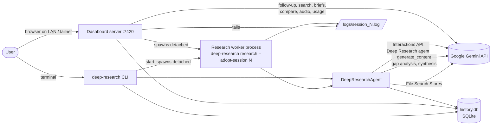
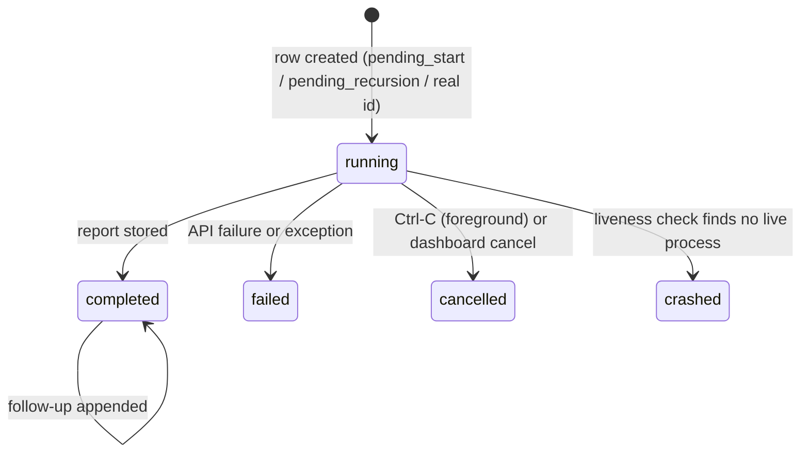
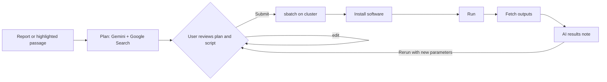

# deep-research: System Specification

| | |
|---|---|
| Document | Complete functional and technical specification |
| Applies to | deep-research v0.35.2 (package `deepresearch`) |
| Status | Living document. Describes the system as built, verified against the source on 2026-09-28 |
| Companion docs | [ARCHITECTURE.md](../ARCHITECTURE.md) (overview), [DASHBOARD_DESIGN.md](DASHBOARD_DESIGN.md) (design intent), [CHANGELOG.md](../CHANGELOG.md) |

This document is normative for behaviour: if the code and this document
disagree, one of them is a bug. Requirement IDs (for example `REQ-RUN-3`) are
stable and are referenced by tests and issues. Items marked **Known gap** are
real current behaviour that falls short of the ideal; each has a tracking note
in [section 17](#17-known-gaps-and-limitations).

## Contents

1. [Purpose and scope](#1-purpose-and-scope)
2. [Glossary](#2-glossary)
3. [System context](#3-system-context)
4. [Requirements](#4-requirements)
5. [Architecture](#5-architecture)
6. [Research engine](#6-research-engine)
7. [Session lifecycle and liveness](#7-session-lifecycle-and-liveness)
8. [Data model](#8-data-model)
9. [Command-line interface](#9-command-line-interface)
10. [Dashboard server and HTTP API](#10-dashboard-server-and-http-api)
11. [Dashboard client](#11-dashboard-client)
12. [Configuration, files and environment](#12-configuration-files-and-environment)
13. [External services, models and cost model](#13-external-services-models-and-cost-model)
14. [Security model](#14-security-model)
15. [Error handling and resilience](#15-error-handling-and-resilience)
16. [Testing and quality gates](#16-testing-and-quality-gates)
17. [Known gaps and limitations](#17-known-gaps-and-limitations)
18. [Build, release and operations](#18-build-release-and-operations)
19. [Extension guide](#19-extension-guide)
20. [Lab runs](#20-lab-runs)
21. [Data sources](#21-data-sources)

---

## 1. Purpose and scope

### 1.1 Problem

Google's Gemini Deep Research agent can plan a research task, run dozens of
web searches, read the sources and write a long, cited report. On its own it
is an API: every run is a one-off call, results live in Google's short-lived
interaction store, and there is no history, no way to go deeper on the gaps a
report leaves, and no comfortable place to read, compare or reuse the output.

### 1.2 What deep-research provides

1. **A command-line tool** (`deep-research`) that runs the agent in the
   foreground or as a detached background job, streams its thinking, uploads
   local files for it to search, and exports the report as Markdown, JSON or CSV.
2. **Recursive research**: after a report comes back, a model finds its gaps,
   spawns child research tasks to fill them in parallel, and synthesizes one
   final report. Depth and breadth are user-controlled and costed up front.
3. **A permanent local history** in SQLite: every run, its prompt, status,
   report, parent/child links and a semantic embedding, so past research can be
   listed, re-read, followed up and searched by meaning.
4. **A self-hosted web dashboard**: a private research desk that launches and
   watches runs, renders reports with citation cards, supports highlights,
   notes and notebooks, shows actual cost, maps related research, compares
   reruns, builds briefs, and reads reports aloud.

### 1.3 Goals

- **G1 Honest cost.** Never spend without showing an estimate first; show the
  real cost after the fact from Google's own usage data.
- **G2 Nothing lost.** Every run is recorded locally before any money is spent,
  and its report is kept after Google forgets the interaction.
- **G3 Truthful state.** A run that is not running must never be shown as
  running.
- **G4 Low friction.** One `uv tool install`, one API key, no build step, no
  external database, no background LLM calls the user did not ask for.
- **G5 Private by default.** Everything stays on the user's machine except the
  calls to Google that the user starts.

### 1.4 Non-goals

- Multi-user accounts, authentication or role separation (see [section 14](#14-security-model)).
- Hosting on the public internet.
- Supporting LLM providers other than Google Gemini.
- Windows service management (the daemon uses POSIX process groups).
- Editing the agent's research plan interactively (the Deep Research
  collaborative-planning mode is not used).

---

## 2. Glossary

| Term | Meaning |
|---|---|
| **Agent** | Google's hosted Deep Research agent (`deep-research-preview-04-2026` by default), reached through the Interactions API. |
| **Interaction** | One agent or model call on Google's side, identified by an interaction id (`v1_...`). Google retains it for a limited time (observed: about a day for usage data). |
| **Session** | One row in the local `sessions` table: a single research task (a root run, or one child of a recursive run) or its record. Identified locally by an integer id. |
| **Root / child** | In a recursive run, the root session has `parent_id NULL`; children point at their parent. |
| **Depth** | Number of recursion levels. Depth 1 = one agent task, no recursion. |
| **Breadth** | Maximum number of child tasks spawned per node. |
| **Node** | One agent task inside a recursive run. A run of depth D and breadth B has at most `1 + B + B^2 + ... + B^(D-1)` nodes. |
| **Adopt** | A background process taking over a session row that was pre-created by its launcher (the `start` command or the dashboard), instead of creating a new row. |
| **File Search Store** | A Gemini-hosted document index the agent can search (`fileSearchStores/...`). Temporary stores are created for `--upload` and deleted afterwards. |
| **Follow-up** | A question asked in the context of a finished interaction; the answer is appended to that session's report. |
| **Notebook** | A dashboard-only Markdown document for collecting findings across reports. |
| **Annotation** | A highlight (and optional note) on an exact quote in a report. |
| **Brief** | A generated executive brief, slide outline or email built from a report or notebook, saved as a notebook. |
| **Audio export** | A Gemini TTS rendering (full text or spoken summary) of a report or notebook, stored as MP3 (WAV if ffmpeg is missing). |
| **State dir** | `$XDG_CONFIG_HOME/deepresearch` (default `~/.config/deepresearch`): settings, database, logs, uploads, audio, dashboard pid file. |

---

## 3. System context


```mermaid
flowchart LR
    user([User]) -->|terminal| cli[deep-research CLI]
    user -->|browser on LAN / tailnet| dash[Dashboard server :7420]
    dash -->|spawns detached| worker[Research worker process<br/>deep-research research --adopt-session N]
    cli -->|start: spawns detached| worker
    cli --> agent[DeepResearchAgent]
    worker --> agent
    dash -->|follow-up, search, briefs,<br/>compare, audio, usage| gemini
    agent -->|Interactions API<br/>Deep Research agent| gemini[(Google Gemini API)]
    agent -->|generate_content<br/>gap analysis, synthesis| gemini
    agent -->|File Search Stores| gemini
    agent --> db[(history.db<br/>SQLite)]
    dash --> db
    cli --> db
    worker --> logs[/logs/session_N.log/]
    dash -->|tails| logs
```

External actors:

| Actor | Interface | Direction |
|---|---|---|
| User (terminal) | `deep-research` CLI, stdout/stderr, exit codes | in/out |
| User (browser) | HTTP on `127.0.0.1:7420` by default (this machine only); single-page app | in/out |
| Google Gemini API | HTTPS via `google-genai` SDK and one raw `urllib` health probe | out |
| ffmpeg (optional) | subprocess, WAV to MP3 conversion | out |
| Local filesystem | state dir (section 12) | in/out |

---

## 4. Requirements

Each requirement is testable. "Test" names the pytest that covers it, where one
exists; "manual" means covered by the release checklist in section 16.4.

### 4.1 Research runs (REQ-RUN)

| ID | Requirement | Verified by |
|---|---|---|
| REQ-RUN-1 | A research run shall create a local session row before or at the moment Google returns an interaction id, so a run is recorded even if the process dies later. | `test_create_session`, `test_process_stream_output` |
| REQ-RUN-2 | A background run (`start` or dashboard) shall pre-create its row with interaction id `pending_start`, record the worker pid, and have the worker adopt that row. No second row shall be created for the root, at any depth. | `test_recursive_root_adopts_precreated_row`, `test_start_research_records_run_meta_and_rerun_link`, `test_main_start` |
| REQ-RUN-3 | When the agent finishes, the complete report text shall be stored in `sessions.result` and the status set to `completed`. Logs may truncate the report; the database shall not. | `test_final_text_from_steps`, `test_update_session` |
| REQ-RUN-4 | If a run fails after an interaction exists, the row shall become `failed` with the error in `result`. If it fails before an interaction exists (bad key, quota, network), an adopted row shall also become `failed`. | `test_research_failure_before_interaction_marks_adopted_row_failed` |
| REQ-RUN-5 | Ctrl-C in a foreground run shall mark the row `cancelled`. | manual |
| REQ-RUN-6 | A streamed run whose connection drops shall check the interaction's status and, if it is still running, resume from the last event id without starting a new interaction, backing off on repeated failures. | `test_stream_end_without_final_event_checks_status` |
| REQ-RUN-7 | Uploaded files shall go into a temporary File Search Store that is deleted, with its documents, when the run ends, whether it succeeds or fails. | `test_agent_auto_upload_and_cleanup`, `test_file_manager_cleanup` |
| REQ-RUN-8 | When `--output` ends in `.json` or `.csv`, the prompt shall ask for a fenced code block of that type, and the exporter shall extract it. Invalid JSON shall be saved raw to `<file>.raw`, not lost. | `test_request_auto_format_json`, `test_request_auto_format_csv`, `test_save_json_invalid_fallback` |

### 4.2 Recursion (REQ-REC)

| ID | Requirement | Verified by |
|---|---|---|
| REQ-REC-1 | For depth > 1, after each non-leaf report the follow-up model shall return 0 to `breadth` gap questions as a JSON list. An empty list, or unparseable output, ends recursion for that node and keeps its report. | `test_recursive_research` |
| REQ-REC-2 | Child tasks at one level shall run in parallel (thread pool sized to breadth), each as its own session row with `parent_id` and `depth` set. | `test_recursive_research` |
| REQ-REC-3 | When at least one child returns a report, the node's report shall be replaced by a synthesis of the parent and child reports. If synthesis fails, the parent report shall be kept with the raw child reports appended under a clear error marker. | code review (no dedicated test; see K8) |
| REQ-REC-4 | A level shall wait for all of its children and synthesize every report that comes back, however long it took. Each task (root or child) is bounded by `task_timeout_min` (default 180, `DR_TASK_TIMEOUT_MIN`, 0 = no limit); a task still running at the limit is cancelled at Google and marked `failed`. At most `breadth` children run per node. | `test_slow_child_report_is_kept_in_synthesis`, `test_gap_questions_are_capped_at_breadth`, `test_poll_times_out_and_cancels_at_google` |

### 4.3 History and liveness (REQ-HIS)

| ID | Requirement | Verified by |
|---|---|---|
| REQ-HIS-1 | A row in state `running` whose worker process no longer exists shall be shown and stored as `crashed` the next time sessions are listed. | `test_pid_tracking_dead`, `test_pid_tracking_alive` |
| REQ-HIS-2 | A child row with no pid shall be judged by its parent: if the parent is finished (`completed`, `crashed`, `failed`, `cancelled`) or the parent's process is gone, the child is `crashed`. | `test_session_manager_coverage` |
| REQ-HIS-3 | A `running` row with no pid and no parent shall become `crashed` after 3 hours without an update (matching the default task limit). | `test_running_row_without_pid_goes_stale`, `test_recent_running_row_without_pid_stays_running` |
| REQ-HIS-4 | Writing an embedding shall not change `updated_at`, so elapsed-time figures stay correct. | code review (see K8) |
| REQ-HIS-5 | Sessions shall be addressable by local integer id or by interaction id in every CLI command that takes an id. | `test_main_followup_numeric_id`, `test_id_help_is_consistent` |

### 4.4 Cost (REQ-COST)

| ID | Requirement | Verified by |
|---|---|---|
| REQ-COST-1 | The CLI `estimate` command and the dashboard launch form shall show a cost estimate from the same formula (section 13.3) before any research money is spent. The estimate makes no API calls. | `test_main_estimate`, `test_estimate_matches_cli_model` |
| REQ-COST-2 | The dashboard shall show a run's actual cost from the Interactions API usage block when Google still has it, and say plainly when it does not. | `test_usage_cost_uses_cached_rate_and_counts_searches`, `test_usage_endpoint_caches_expired_but_retries_transient` |
| REQ-COST-3 | Only definitive usage answers (real usage, or "interaction expired") shall be cached; transient errors shall be retried on the next request. | `test_usage_endpoint_caches_expired_but_retries_transient` |
| REQ-COST-4 | Any paid dashboard action other than launching research (audio export, AI brief, AI compare summary) shall show its cost before it runs. | manual |

### 4.5 Dashboard (REQ-DASH)

| ID | Requirement | Verified by |
|---|---|---|
| REQ-DASH-1 | `deep-research dashboard --start` shall start the server detached, write a pid file, and print every URL it is reachable on. `--stop`, `--restart`, `--status` shall act on that pid. `--status` exits 0 healthy, 1 not answering, 3 not running. | `test_start_status_restart_stop`, `test_stale_pid_file_is_ignored`, `test_flags_are_mutually_exclusive` |
| REQ-DASH-2 | The server shall bind `127.0.0.1:7420` by default, refuse a non-loopback `--host` unless `--allow-remote` is given, reject requests from other machines while loopback-only, and serve the whole UI from packaged static files with no build step and no CDN. | `test_index_and_static_served`, `test_local_only_handler_refuses_other_machines`, `test_start_refuses_non_loopback_without_allow_remote` |
| REQ-DASH-3 | The dashboard and every process it spawns shall use the user settings file for the API key even when started from a folder containing another `.env`. Variables exported in the real shell still win. | `test_service_env_*`, `test_children_and_server_do_not_run_in_callers_cwd` |
| REQ-DASH-4 | `/api/health?check=1` shall report whether Google accepts the key (cached 10 minutes; `null` when it cannot check). The UI shall block launching research when the key is missing or rejected. | `test_health_reports_invalid_key` |
| REQ-DASH-5 | Cancelling a run shall cancel the Google interaction (when one exists), terminate the worker's process group, and mark the row `cancelled`. | `test_cancel_only_running` (state check only) |
| REQ-DASH-6 | Deleting a session shall also delete its annotations and tags; with `recursive=1` it shall delete all descendants too. | `test_delete_recursive_purges_children_and_annotations` |
| REQ-DASH-12 | Every non-GET API request shall be `application/json` (with or without a body), shall be refused when its `Origin` differs from its `Host`, and every request shall be refused when its `Host` is not an IP address, a single-label name, a local or tailnet suffix, or listed in `DR_ALLOWED_HOSTS`. | `test_bodyless_cross_site_post_cannot_cancel`, `test_foreign_origin_write_refused`, `test_dns_rebinding_host_refused`, `test_local_host_names_allowed` |
| REQ-DASH-7 | Uploads shall only be accepted as JSON (base64), limited to 25 MB per request, stored under a random folder in `uploads/`, and research may only reference upload paths inside that folder. | `test_upload_then_research_with_upload`, `test_json_content_type_required_for_writes`, `test_start_research_validation` |
| REQ-DASH-8 | The layout shall be usable at phone (390 px), tablet and desktop widths: side panes become drawers below the tablet breakpoint and nothing overflows horizontally. | manual (Playwright) |
| REQ-DASH-9 | Reading aloud word for word shall use the browser's speech engine (free) and highlight the current paragraph; source lists, URLs and citation markers shall not be read. | `test_speakable_strips_markup_citations_urls_and_sources` |
| REQ-DASH-10 | Audio exports shall support HTTP Range requests so browsers can seek. | `test_range_request_returns_partial_content` |
| REQ-DASH-11 | Notebooks shall autosave within about 1 second of the last edit, and in Read and Split modes shall render Markdown without the editor's text leaking into the preview. | manual |

### 4.6 Non-functional (REQ-NF)

| ID | Requirement |
|---|---|
| REQ-NF-1 | Python 3.12 and 3.13 on Linux and macOS. Runtime dependencies are limited to those in `pyproject.toml`; the dashboard uses only the standard library on the server and vanilla JavaScript on the client. |
| REQ-NF-2 | The test suite shall make no network calls and finish in under a minute. |
| REQ-NF-3 | All SQLite access shall tolerate concurrent writers (worker processes, the dashboard, the CLI) through WAL mode and a 10 s busy timeout. Session writes on the research path shall also retry on `OperationalError`. **Partly met:** several writes have no retry (K1). |
| REQ-NF-4 | The dashboard shall make no Gemini calls on its own schedule; every paid call is the direct result of a user action. (The only unprompted outbound call is the free key check at page load.) |
| REQ-NF-5 | The dashboard shall stay responsive with thousands of sessions: session lists are capped (500 default, 5,000 max) and the report reader renders one session at a time. |
| REQ-NF-6 | No secret (API key) shall be written to logs, the database, exports or the browser. |

---

## 5. Architecture

### 5.1 Module map

| Module | Lines | Responsibility |
|---|---|---|
| `deepresearch/__init__.py` | 30 | Entry point `main`, version lookup, source-checkout venv re-exec (see K18), silences SDK warnings. |
| `deepresearch/__main__.py` | 445 | argparse parser, bare-prompt shortcut, command dispatch, top-level error catch. |
| `cli/base.py` | 43 | `ResearchRequest` and `FollowUpRequest` (Pydantic): final prompt assembly and File Search tool config. |
| `cli/commands.py` | 662 | One handler per CLI command; `detach_process` for `start`; the CLI cost estimator; `--source` handling. |
| `cli/sources.py` | 366 | `deep-research sources ...` (section 21); `guess_kind`, `local_uri` validation. |
| `core/config.py` | 78 | Paths, `.env` loading, `DeepResearchConfig`, `service_env()` for background processes. |
| `core/agent.py` | 674 | `DeepResearchAgent`: stream and poll runs, follow-up, gap analysis, synthesis, recursion. |
| `core/session.py` | 233 | `SessionManager`: all reads and writes of the `sessions` table, liveness rules. |
| `storage/database.py` | 35 | Creates `sessions`, enables WAL, additive column migrations. |
| `storage/files.py` | 151 | `FileManager`: temporary File Search Stores, upload, cleanup rules (`is_disposable_store`). |
| `utils/exporters.py` | 49 | Code-block extraction and `.json` / `.csv` / text export. |
| `utils/retry.py` | 36 | `with_retry` (network) and `db_retry` (SQLite locks) tenacity decorators. |
| `utils/logger.py` | 59 | Rich console logging with `[INFO]`/`[THOUGHT]`/`[WARN]`/`[ERROR]`/`[DB]` tags and optional timestamps. |
| `dashboard/daemon.py` | 225 | `--start/--stop/--restart/--status`, pid file, loopback check, health probe, URL listing. |
| `dashboard/server.py` | 1,659 | `Api` route table and handlers, `ThreadingHTTPServer` plumbing, loopback-only guard, static files, Range support. |
| `dashboard/store.py` | 287 | `DashboardStore`: notebooks, annotations, session meta (stars, tags), dashboard session queries. |
| `dashboard/features.py` | 563 | Actual cost, research map, compare, briefs, text-to-speech audio. |
| `dashboard/lab.py` | 2,584 | Lab runs (section 20): Slurm target, cluster catalog, planner, pre-flight, job harness, watcher. |
| `sources/` | 1,941 | Data sources (section 21): `model`, `registry`, `adapters`, `public` (anonymous buckets), `staging`, `usage`, `index`, `discover`, `cloud_catalogs`, `provenance`, `service`. |
| `dashboard/static/` | 3,736 | `index.html`, `app.css`, `app.js` (core), `features.js`, `lab.js`, `sources.js`, vendored `marked` and `DOMPurify`. |

Total Python: about 10,500 lines. Total client: about 3,700 lines plus vendored libraries.

### 5.2 Process model

| Process | Started by | Lifetime | Holds |
|---|---|---|---|
| Foreground CLI | the user | one command | a `DeepResearchAgent` when researching |
| Research worker | `start` or `POST /api/research`, as `deep-research research ... --adopt-session N` | one research run | the agent; for recursion, one thread per child task |
| Dashboard server | `dashboard --start` (detached) or `--foreground` | until stopped | one `Api` instance, one thread per HTTP request, one thread per audio job |

Workers are started with `start_new_session=True`, so each is the leader of its own
process group and survives the terminal or the dashboard exiting. Cancel kills the
whole group (`os.killpg`). The dashboard starts workers with `python -I -u -c <boot>`
from the state dir, so neither a stray `./deepresearch` package nor a stray `./.env`
in the launch folder can leak in (REQ-DASH-3).

The CLI `start` command uses a different launcher (`detach_process` in
`cli/commands.py`: `sys.executable -u sys.argv[0]`, inheriting the caller's cwd and
environment). Both launchers produce the same worker command line.

### 5.3 A background run end to end

```mermaid
sequenceDiagram
    participant U as User / browser
    participant D as Dashboard (Api)
    participant DB as history.db
    participant W as Worker process
    participant G as Gemini API
    U->>D: POST /api/research {prompt, depth, breadth}
    D->>DB: INSERT sessions (interaction_id='pending_start', status='running')
    D->>W: spawn research --adopt-session N (new process group)
    D->>DB: UPDATE pid; INSERT run_meta (estimate, rerun_of)
    D-->>U: {id, pid}
    W->>G: interactions.create(agent, background, stream)
    G-->>W: interaction.created (id v1_...)
    W->>DB: UPDATE sessions SET interaction_id (adopt row N)
    loop streaming
        G-->>W: thought summaries, text deltas
        W->>W: append to logs/session_N.log
    end
    U->>D: GET /api/sessions/N/log?offset= (every 2 s)
    G-->>W: interaction.completed
    W->>G: interactions.get(id) for final text
    W->>DB: UPDATE status='completed', result=report
    U->>D: GET /api/sessions (every 4 s while running)
```

### 5.4 Concurrency

- **SQLite in WAL mode** is the only shared state between processes. Every connection
  uses a 10 s busy timeout. `SessionManager` write paths that matter most are wrapped in
  `db_retry` (5 attempts, 0.1-1 s backoff). See K1 for the paths that are not.
- **Recursion** uses a `ThreadPoolExecutor(max_workers=breadth)` per level. Each child
  builds its own `DeepResearchAgent` (own Gemini client, own `FileManager`) so threads
  share no mutable objects except the database.
- **Dashboard** request threads share one `Api`. Shared mutable state is limited to the
  audio job table (`_jobs`, guarded by `_jobs_lock`), the embedding backfill (guarded by
  `_embed_lock`), the key-check cache and the lazily created Gemini client in `Features`.

---

## 6. Research engine

### 6.1 Request model

`ResearchRequest` fields: `prompt`, `stores`, `stream`, `output_format`,
`upload_paths`, `output_file`, `adopt_session_id`, `depth` (default 1), `breadth`
(default 3).

The prompt sent to Google (`final_prompt`) is the user prompt plus, in order:

1. `\n\nFormat the output as follows: <format>` when `--format` is given.
2. A fenced-block instruction when `--output` ends in `.json` or `.csv` (REQ-RUN-8).
3. When files are uploaded, the stream path also appends an instruction to search the
   uploaded files first and cite them. The poll path does not (a minor inconsistency).

`tools_config` is `[{"type": "file_search", "file_search_store_names": stores}]` when
any store is in play, otherwise `None` (the agent then uses its default web tools).

### 6.2 Stream mode (`start_research_stream`)

Used for depth-1 runs with `--stream`, for every dashboard depth-1 run, and for the
root node of every recursive run.

1. If uploads are present, create a temporary store and add it to `stores`. On upload
   failure: log, clean up, return `None` (no row is written; an adopted row stays
   `running` until liveness marks it crashed).
2. `interactions.create(input, agent, background=True, stream=True, tools,
   agent_config={"type": "deep-research", "thinking_summaries": "auto"})`.
3. Process events. On `interaction.created`/`interaction.start`: record the id, and
   either adopt the pre-created row (`update_session_interaction_id`) or create a new
   row. Text deltas print as they arrive; thought summaries print as `[THOUGHT]` lines.
   Terminal events: `interaction.completed/complete`, `error`, `interaction.error`,
   `interaction.failed`, `interaction.cancelled`, or a `status_update` to a terminal
   status.
4. If the stream ends without a terminal event (Google closes long connections),
   check the interaction's status; if it is terminal, finish; otherwise reconnect with
   `interactions.get(id, stream=True, last_event_id=...)`. The wait between attempts
   grows from 2 s to 30 s on repeated failures. The loop ends at the task limit
   (6.4a).
5. On completion, fetch the interaction once more and extract the final text
   (`output_text`, else the last `model_output` step). If non-empty, store it with
   status `completed` (or leave `running` when the caller will synthesize later) and
   export it if `--output` was given. If empty, nothing is written (see K6).
6. `KeyboardInterrupt` marks the row `cancelled`. Any other exception marks it `failed`
   (by interaction id if known, else by adopted row id). Uploads are always cleaned up.

### 6.3 Poll mode (`start_research_poll`)

Used for depth-1 runs without `--stream` and for every child node of a recursive run.
Same upload handling. Creates the interaction with `background=True` (no stream, no
`agent_config`), records or adopts the row, then calls `interactions.get` every 10 s
until the status is `completed` (store the report) or any other terminal status
(`failed`, `cancelled`, `incomplete`, `budget_exceeded`: store the error; `cancelled`
maps to `cancelled`, the rest to `failed`). A failed status check is logged and retried;
30 in a row fail the run. The loop ends at the task limit (6.4a). The report is truncated to 2,000 characters
in the log, never in the database (REQ-RUN-3).

### 6.4 Recursion (`start_recursive_research`)

```
execute(prompt, depth d, max D, breadth B, parent):
    if d == 1: run stream mode, adopting the pre-created row if any
    else:      create child row (interaction_id 'pending_recursion', parent, depth d),
               run poll mode adopting it
    if no report: return None
    if d >= D: return report                       # leaf
    questions = analyze_gaps(prompt, report, B)
    if no questions: mark completed, return report
    run execute(q, d+1, D, B, this row) for each of the first B questions,
        in a thread pool of size B
    wait for every child (each bounds itself with the task limit)
    collect every report that came back
    if none: return report
    final = synthesize_findings(prompt, report, child reports)
    store final as this row's result, status completed
    return final
```

Non-leaf nodes are run with `auto_update_status=False`, so their row stays `running`
with the interim report stored until synthesis finishes. The CLI prints a note and
switches to polling when `--stream` is combined with `--depth > 1`, but the root still
streams to the log.

**Gap analysis** (`analyze_gaps`) sends the objective and report to the follow-up model
and asks for 1 to B questions as a JSON list in a ` ```json ` block. Missing block,
unparseable JSON or any error returns `[]`, which ends recursion for that node. The list
is truncated to B.

**Synthesis** (`synthesize_findings`) sends the objective, the node's report and all
child reports to the follow-up model with instructions to integrate rather than append
and to resolve conflicts. On error it returns the parent report followed by
`[ERROR: Synthesis failed. Appending raw sub-reports below]` and the raw child reports
(REQ-REC-3).

### 6.4a Task limit

Every research task, root or child, carries its own deadline of `task_timeout_min`
minutes (default 180; `DR_TASK_TIMEOUT_MIN`; 0 disables it). Runs are never cut short
before then. A task still running at the deadline is cancelled at Google
(`interactions.cancel`) so it stops billing, and its row becomes `failed` with a
"Timed out" message. Because each child bounds itself, a recursion level simply waits
for all its children, and every report that finishes is used.

Google does not document a maximum run time for the Deep Research agent. Observed runs
take 5 to 60 minutes; the 3-hour default leaves room for slow runs and the Max agent.

### 6.5 Follow-up

`follow_up` calls `interactions.create(input=question, model=followup_model,
previous_interaction_id=<session's interaction>)`, so Google supplies the context. The
answer is appended to the session's `result` as:

```
---
### Follow-up (YYYY-MM-DD HH:MM)

**Q: <question>**

<answer>
```

This only works while Google still holds the original interaction. The dashboard
returns 502 when nothing was appended and 409 when the session has no real interaction
id yet.

### 6.6 File Search

`FileManager.create_store_from_paths` creates one store per run, uploads each file
(each regular file in a folder, top level only; K9), forcing `text/plain` for common
source and text extensions, then sleeps a fixed 5 s for ingestion (K9). `cleanup`
deletes each document with `force`, then the store, then any legacy file resources.
Failures are logged as warnings; a store that cannot be emptied persists and can be
removed later with `deep-research cleanup`, which deletes **every** store on the key.

### 6.7 Export

`DataExporter.export(text, path)`: `.json` extracts the first ` ```json ` block (or the
first bare block, or the whole text), parses and pretty-prints it, writing the raw text
to `<path>.raw` if parsing fails. `.csv` writes the extracted block as is. Any other
extension writes the text unchanged. `show --save` is separate: `.html` saves the Rich
rendering with the Monokai theme, anything else saves plain text.

### 6.8 Semantic search

Shared by `deep-research search` and `POST /api/search`:

1. Backfill: embed every completed session without an embedding using
   `gemini-embedding-001` over `Objective: <prompt>\n\nResult:\n<result>` truncated to
   15,000 characters. Stored as a JSON array in `sessions.embedding` without touching
   `updated_at` (REQ-HIS-4).
2. Embed the query, score every embedded session by cosine similarity in pure Python.
3. Take the top `limit` (CLI default 3; dashboard default 5, capped 1 to 20).
4. Optionally (always in the CLI, `synthesize` flag in the dashboard) send the matching
   prompts and **full** reports to the follow-up model with instructions to answer only
   from them and cite `[Session #N]` for every fact.

---

## 7. Session lifecycle and liveness

### 7.1 States


```mermaid
stateDiagram-v2
    [*] --> running: row created (pending_start / pending_recursion / real id)
    running --> completed: report stored
    running --> failed: API failure or exception
    running --> cancelled: Ctrl-C (foreground) or dashboard cancel
    running --> crashed: liveness check finds no live process
    completed --> completed: follow-up appended
```

`crashed` is assigned only by the liveness check, never by the worker. There is no
transition out of `failed`, `cancelled` or `crashed`; a re-run creates a new row.

### 7.2 Interaction id placeholders

| Value | Meaning | Written by |
|---|---|---|
| `pending_start` | Background root row created before the worker has an interaction. | `start`, `POST /api/research` |
| `pending_recursion` | Child row created before its poll run has an interaction. | recursion |
| `v1_...` | Real Google interaction id. | worker on `interaction.created` |

Code that talks to Google (cancel, follow-up, usage) skips any id beginning with
`pending`.

### 7.3 Liveness rules

Applied to each `running` row whenever `SessionManager.list_sessions` runs (CLI `list`;
the dashboard runs it over up to 10,000 rows on every `/api/sessions` and `/api/stats`
call):

1. Row has a pid: dead if `os.kill(pid, 0)` fails (REQ-HIS-1).
2. Row has no pid but a parent: dead if the parent is `completed`, `crashed`, `failed`
   or `cancelled`, or if the parent has a pid that is not alive (REQ-HIS-2).
3. Otherwise: dead if `updated_at` (or `created_at`) is more than 3 hours old
   (REQ-HIS-3).

A dead row is rewritten as `crashed` in the database, not only in the listing.

### 7.4 Pid ownership

Root rows carry the worker's pid (set by the launcher, or by `create_session` /
`update_session_interaction_id` using `os.getpid()` for foreground runs). Child rows
never carry a pid: they run as threads inside the root's worker and are judged through
their parent.

---

## 8. Data model

All tables live in one SQLite file, `history.db`, in WAL mode. Tables are created with
`CREATE TABLE IF NOT EXISTS` by whichever component first needs them; columns are only
ever added (`ALTER TABLE ... ADD COLUMN`), never renamed or dropped. There are no foreign
keys; related rows are cleaned up in code (see K10). Timestamps are naive local-time ISO
strings (K16).

### 8.1 `sessions` (owner: core; read by all)

| Column | Type | Notes |
|---|---|---|
| `id` | INTEGER PK AUTOINCREMENT | Local session id used everywhere in the UI and CLI. |
| `interaction_id` | TEXT | Google id or a placeholder (7.2). Not unique-constrained. |
| `prompt` | TEXT | The user prompt, without format or upload instructions. |
| `status` | TEXT | `running`, `completed`, `failed`, `cancelled`, `crashed`. |
| `created_at`, `updated_at` | TIMESTAMP (ISO text) | `updated_at` changes on status, result and adoption writes, not on embedding. |
| `result` | TEXT | Full report, plus appended follow-ups; error text for `failed`. |
| `files` | JSON (text) | Upload paths as given. |
| `pid` | INTEGER | Worker pid for root rows; NULL for children. Added by migration. |
| `parent_id` | INTEGER | Parent session id for recursion children. Added by migration. |
| `depth` | INTEGER DEFAULT 1 | Recursion level of this node. Added by migration. |
| `embedding` | TEXT | JSON float array from `gemini-embedding-001`. Added by migration. |

### 8.2 Dashboard tables

| Table | Owner | Columns | Purpose |
|---|---|---|---|
| `notebooks` | store | `id`, `title` (max 200), `content`, `created_at`, `updated_at` | Markdown notebooks. |
| `annotations` | store | `id`, `session_id`, `quote` (max 5,000), `occurrence`, `note`, `color` (`amber`/`cyan`/`magenta`/`green`), timestamps. Index on `session_id`. | Highlights anchored by quote text and which occurrence of it. |
| `session_meta` | store | `session_id` PK, `starred`, `tags` (JSON list, max 20) | Stars and tags. |
| `run_meta` | server | `session_id` PK, `depth`, `breadth`, `estimate_usd`, `rerun_of`, `launched_at` | Launch parameters and estimate for dashboard runs; re-run links. |
| `session_usage` | features | `session_id` PK, `usage` (JSON), `fetched_at`, `error` | Cached usage block or definitive "not available" (REQ-COST-3). |
| `audio_exports` | features | `id`, `kind` (`session`/`notebook`), `ref_id`, `mode` (`full`/`summary`), `voice`, `path`, `seconds`, `cost_usd`, `script`, `created_at` | One row per generated audio file. |
| `lab_runs` | lab | `id`, `session_id`, `scope` (`selection`/`document`), `selection`, `request`, `target`, `status`, `stage`, `plan` (JSON), `script`, `job_id`, `slurm_state`, `node`, `elapsed`, `exit_code`, `error`, `result_md`, `files` (JSON), `estimate_usd`, `ai_cost_usd`, `rerun_of`, `data_sources` (JSON names picked at launch), `created_at`, `updated_at`, `submitted_at`, `finished_at` | One row per lab run (section 20). A cache of the cluster's job folder. |
| `lab_suggestions` | lab | `session_id` PK, `data` (JSON), `cost_usd`, `created_at` | Cached pre-run suggestions for a report. |
| `data_sources` | sources | `id`, `name` (unique), `title`, `description`, `tags` (JSON), `kind`, `uri`, `options` (JSON: `include`, `exclude`, `region`, `max_relay_bytes`, `store`, `store_hash`), `auth_ref`, `protection_level`, `staging`, `temporary`, `status`, `last_checked`, `last_error`, `manifest` (JSON), timestamps | The data source registry (21.1). Credential references only, never secrets. |
| `data_source_uses` | sources | `id`, `source_id`, `manifest_hash`, `used_by_kind` (`session`/`lab_run`), `used_by_id`, `role`, `created_at`, `source_name`, `source_kind`, `source_uri` | Which data each report and Lab run used, with a snapshot of the source so deleting it keeps the record (21.9). |

The CLI never reads the dashboard tables. Runs started from the CLI therefore have no
`run_meta` row: no estimate is shown next to their actual cost and they cannot appear as
re-runs.

### 8.3 Files outside the database

See section 12.3 for the full state dir. Audio files are named
`<kind>_<ref>_<mode>_<voice>.mp3` (or `.wav`); uploads live in
`uploads/<12 hex chars>/<sanitised name>`; logs in `logs/session_<id>.log`.

---

## 9. Command-line interface

Entry point: `deep-research` (`deepresearch:main`). If the first argument is not a
known command or flag, `research` is inserted, so `deep-research "question"` runs
research in the foreground. `-v/--version` prints the version.

### 9.1 Research commands

| Command | Purpose |
|---|---|
| `research PROMPT [opts]` | Run in the foreground and print the report. |
| `start PROMPT [opts]` | Pre-create a row, spawn a detached worker, print the session id, pid and log path. |
| `estimate PROMPT [--depth] [--breadth] [--upload ...]` | Cost estimate, no API calls (13.3). |

Shared options for `research` and `start`:

| Option | Default | Meaning |
|---|---|---|
| `--stores NAME ...` | none | Existing File Search Stores to search. |
| `--upload PATH ...` | none | Files or folders for a temporary store (deleted afterwards). |
| `--format TEXT` | none | Extra output instructions appended to the prompt. |
| `--output FILE` | none | Export the report (6.7). |
| `--depth N` | 1 | Recursion levels. No upper bound in the CLI (K7). |
| `--breadth N` | 3 | Max child tasks per node. No upper bound in the CLI (K7). |

`research` only: `-q/--quiet` (errors only, then the bare report on stdout),
`--stream` (stream thoughts; ignored when depth > 1), and the hidden
`--adopt-session N` used by background launchers.

### 9.2 History commands

| Command | Behaviour |
|---|---|
| `list [--limit 10]` | Recent sessions by `updated_at`, after applying liveness rules. |
| `show ID [--recursive] [--save FILE]` | Metadata panel, prompt and rendered report. `--recursive` concatenates the whole tree as Markdown. |
| `tree [ID]` | One tree, or the 10 most recently updated roots with their children. |
| `followup ID PROMPT` | Follow-up (6.5); the answer is printed and appended. |
| `search QUERY [--limit 3]` | Semantic search (6.8). |
| `delete ID` | Deletes one row. No prompt; children and dashboard data are left behind (K10). |

`ID` is a local integer id or an interaction id in every command that takes one
(REQ-HIS-5), except `tree`, which takes an integer.

### 9.3 Account and maintenance

| Command | Behaviour |
|---|---|
| `auth login` | Prompts (hidden) for a key, warns if it does not start with `AIza`, overwrites the user `.env` with `GEMINI_API_KEY=...` (K15). |
| `auth logout` | Deletes the user `.env`. |
| `cleanup [--force]` | Lists and deletes **all** File Search Stores on the key, with documents. Confirms unless `--force`. |

### 9.4 Dashboard

`dashboard [--start | --stop | --restart | --status | --foreground] [--host H]
[--port P] [--allow-remote]`. No flag means `--status`. The default host is `127.0.0.1`;
a non-loopback `--host` exits 2 unless `--allow-remote` is given (14.1). `--restart`
keeps the previous host and port unless given, except that a dashboard started on
`0.0.0.0` by an older version without `--allow-remote` comes back on `127.0.0.1`. Exit
codes: see REQ-DASH-1.

### 9.5 Exit codes and errors

Only `dashboard` returns non-zero exit codes. Every other command exits 0 whether or
not it succeeded. Validation errors print `[ERROR] Input Validation Failed`, config
errors (for example a missing key) print `[CONFIG ERROR]`, anything else prints
`[CRITICAL ERROR]` (K11).

---

## 10. Dashboard server and HTTP API

### 10.1 Conventions

- `ThreadingHTTPServer` from the standard library; one thread per request; daemon threads.
- Anything outside `/api/` is a static file from the packaged `static/` folder. Unknown
  paths fall back to `index.html`; `.` and `..` segments are dropped. Only GET is
  allowed there.
- API responses are JSON (`application/json; charset=utf-8`) except audio files. Errors
  are `{"error": "<message>"}` with the status from the table below.
- Every response carries `Cache-Control: no-store`, `X-Content-Type-Options: nosniff`
  and `Referrer-Policy: no-referrer` (audio: `no-store` and `Accept-Ranges` only).
- Every request whose `Host` is not an IP address, a single-label name, a name ending
  in `.local`, `.lan`, `.home`, `.home.arpa`, `.localdomain`, `.internal` or `.ts.net`,
  or a name listed in `DR_ALLOWED_HOSTS` gets 403 (DNS-rebinding protection).
- Request bodies over 25 MB get 413. Every non-GET API request must be
  `application/json`, with or without a body (415 otherwise); this forces a CORS
  preflight for cross-site requests, which the server never approves. A non-GET
  request whose `Origin` does not match its `Host` gets 403. Bad JSON gets 400.
- Unknown path: 404. Known path, wrong method: 405. Unhandled exception: 500 with the
  exception type and message; the traceback goes to the dashboard log.
- Access logging is off unless `DR_DASHBOARD_ACCESS_LOG` is set.

### 10.2 Endpoints

"Paid" marks calls that can spend money on the Gemini API.

**Health and overview**

| Method and path | Paid | Behaviour |
|---|---|---|
| `GET /api/health[?check=1]` | no | `{ok, version, api_key}`; with `check=1` adds `api_key_valid` (true, false or null) from a cached key probe (REQ-DASH-4). |
| `GET /api/stats` | no | Counts by status, total, roots, total report characters, notebook and annotation counts. Runs liveness. |

**Sessions**

| Method and path | Paid | Behaviour |
|---|---|---|
| `GET /api/sessions[?q=&limit=500]` | no | Session rows (no report text) with child, annotation, star and tag data; newest id first; `q` is a LIKE match on prompt and report; limit capped at 5,000. Runs liveness. |
| `GET /api/sessions/{id}` | no | Full row minus embedding, plus `meta`, `children`, `annotations`, `log_available`, `run` (run_meta) and `reruns`. |
| `DELETE /api/sessions/{id}[?recursive=1]` | no | Deletes the row (and descendants with `recursive=1`) plus their annotations and meta (REQ-DASH-6, K10). |
| `PATCH /api/sessions/{id}/meta` | no | Body `{starred?, tags?}`. |
| `POST /api/sessions/{id}/cancel` | no | 409 unless `running`. Cancels the Google interaction, kills the process group, sets `cancelled`, returns notes (REQ-DASH-5, K4). |
| `POST /api/sessions/{id}/followup` | yes | Body `{prompt}`. 400 empty, 409 no interaction, 502 no text. Returns the full result and the appended part. Synchronous. |
| `GET /api/sessions/{id}/log[?offset=]` | no | Log text from `offset` (or the last 200 KB) with ANSI codes stripped, plus the new size. |
| `GET /api/sessions/{id}/tree` | no | Nested `{id, status, depth, prompt, children}`. |
| `GET /api/sessions/{id}/export?format=md\|json[&recursive=1][&annotations=0]` | no | `{filename, content}`. Markdown appends annotations unless `annotations=0`. |
| `GET /api/sessions/{id}/usage[?refresh=1]` | no | Actual usage and cost (13.4) plus `estimate_usd` from run_meta. |
| `GET /api/sessions/{id}/timeline` | no | Lanes for the whole tree and up to 400 parsed log events (`t`, `kind`, `text`). |

**Launching**

| Method and path | Paid | Behaviour |
|---|---|---|
| `POST /api/estimate` | no | Body `{depth, breadth, uploads?}`; same formula as the CLI (REQ-COST-1). |
| `POST /api/uploads` | no | Body `{name, data (base64)}`; writes to a new random folder under `uploads/`; returns `{path, name, size}` (REQ-DASH-7). |
| `POST /api/research` | yes | Body `{prompt, depth 1-5, breadth 1-10, uploads?, stores?, format?, rerun_of?}`. Validates upload paths are inside `uploads/` and exist, and that a key is set. Pre-creates the row, spawns the worker (`--stream` at depth 1), records run_meta. Returns `{id, pid}`. |
| `GET /api/stores` | no | Lists File Search Stores on the key. |

**Search, annotations and notebooks**

| Method and path | Paid | Behaviour |
|---|---|---|
| `POST /api/search` | yes | Body `{query, limit 1-20 (5), synthesize (true)}`. Returns `{matches, answer, embedded_now}` (6.8). |
| `GET/POST /api/annotations`, `PATCH/DELETE /api/annotations/{id}` | no | List (optionally by `session_id`), create `{session_id, quote, occurrence, note, color}`, update `{note, color}`, delete. |
| `GET/POST /api/notebooks`, `GET/PUT/DELETE /api/notebooks/{id}` | no | List (no content), create `{title, content}`, read, update `{title?, content?}`, delete. |

**Analysis and audio**

| Method and path | Paid | Behaviour |
|---|---|---|
| `GET /api/map` | no | Research map nodes, 2-D coordinates and similarity edges (11.4). |
| `POST /api/compare` | if `summarize` | Body `{a, b, summarize}`. Sources only in A, only in B, shared; optional AI "what changed" summary. |
| `POST /api/brief` | yes | Body `{kind: session\|notebook, id, style: brief\|slides\|email}`. Returns `{markdown, cost_usd}`; the client saves it as a notebook. |
| `POST /api/audio/estimate` | no | Body `{kind, id, mode}`. Words, seconds, cost and the voice list. |
| `POST /api/audio` | yes | Body `{kind, id, mode: full\|summary, voice}`. Starts a background job; returns `{job}`. Reuses a cached file for the same kind, id, mode and voice. |
| `GET /api/audio/jobs/{id}` | no | `{status: running\|done\|error, result, error}`. Jobs live in memory only (K17). |
| `GET /api/audio?kind=&id=` | no | Existing audio exports for a report or notebook. |
| `GET /api/audio/{id}/file[?download=1]` | no | The MP3 or WAV, with Range support (REQ-DASH-10); `download=1` sets `attachment`. |

---

## 11. Dashboard client

### 11.1 Stack and layout

- `index.html` shell, `app.css`, `app.js` (core, dialogs, tabs, reader, notes), `features.js`
  (cost, map, compare, audio, briefs), `lab.js` (Lab runs), `sources.js` (data sources).
  Vanilla JavaScript in strict mode, no framework, no build step, no network calls
  except to the dashboard's own API.
- Markdown is rendered with vendored `marked` (GFM) and always passed through vendored
  `DOMPurify` before insertion. External links open in a new tab with
  `noopener noreferrer`.
- Three panes: **archive** (left: session list, filter, stars, tags), **stage** (centre:
  tabs), **inspector** (right: Details, Notes, Outline, Live log). Below 1200 px the inspector becomes a slide-out drawer; below 820 px the archive does
  too, and split views (notebook, compare) stack vertically.
- Top bar: brand, version, live telemetry counters (running, completed, failed, corpus
  size, key health), Lab runs, Notes, Data sources, the command palette button and New
  research. On phones those pages move into the archive drawer's menu. The FAILED counter
  counts failed, crashed and cancelled sessions, the same set as the Failed filter.

### 11.2 Tabs

Tab kinds: `home` (Mission control, always present), `session`, `notebook`, `launch`,
`search`, `tree`, `map`, `compare`, `sources`, `source`, `labruns`, `notes`. Open tabs and
the active tab persist in `localStorage` (`dr.tabs.v1`); launch tabs are not persisted.

Tabs are a keyboard tab list (arrow keys move, Enter opens, Delete closes) and the active
tab is scrolled into view. Switching away from a tab keeps its state for the page's
lifetime: scroll position and form fields (`VIEWSTATE`), the launcher's uploaded files
and picked data sources, the last semantic search answer, and the Ask draft. Clicking the
active tab does nothing, so the reading position is kept. Async renderers check a render
generation after each request and stop if the user has moved on.

### 11.3 Refresh and polling

| What | Interval | Stops when |
|---|---|---|
| Session list | 4 s while any run is running, otherwise 20 s; stats on about 30% of polls | never (page open) |
| Live log of the open session | 2 s while running, otherwise 15 s; incremental by byte offset | tab or session changes |
| Notebook autosave | 900 ms after the last keystroke; also on tab switch and page unload | saved |
| Notebook preview | 250 ms debounce | |
| Actual cost | once when a finished session opens | |

When the open session leaves `running`, the reader reloads it (whichever inspector tab
is showing), shows a toast and, if the page is hidden and permission was granted, a
browser notification. The archive filter box keeps the full session list for counters,
notifications and completion checks and shows search results separately; a reply to an
older keystroke is dropped.

### 11.4 Features

| Feature | Behaviour |
|---|---|
| Launch | Prompt, six templates (market scan, literature review, tech deep dive, due diligence, policy brief, compare), depth and breadth, uploads (base64 through `/api/uploads`), existing stores, format. Live estimate; the launch button is disabled when the key is missing or rejected. |
| Reader | Rendered report, outline, find in page (Ctrl F: Enter / Shift+Enter step through matches, "3 of 471", Escape closes), citations grouped by domain, star, tags, re-run (estimate first), export, stop, delete (recursive when the session has children), follow-up box (disabled while running). LaTeX (`$...$`, `$$...$$`, `\(...\)`) is shown as plain Unicode (`X_r/h ≈ 6.26`, `y⁺`, `1/κ ln y⁺ + B`); money such as `$5 to $10` and code are left alone. |
| Failed report | A failed, crashed or cancelled session shows its error in a red box with Re-run; Listen, Export, the Lab panel and the Ask box are hidden because there is no report. |
| Citation cards | `[cite: N, M]` markers become chips; hover or tap shows the claim and the numbered source. Paragraphs of 25+ words that contain a digit or a capitalised word pair but no citation get an amber "uncited" edge. |
| Annotations | Select text (mouse, touch or long-press; on phones the toolbar docks at the bottom), pick one of four colours; stored by quote and occurrence, matched against the text the reader sees (citations are decorated first); notes edited in the inspector with a saved / not saved state. |
| Notes page | Every highlight and note across all reports, newest first, with a filter; clicking one opens its report at that highlight (`GET /api/annotations`). |
| Notebooks | Markdown with Edit, Split and Read modes (`dr.nbmode`); "send to notebook" inserts a cited quote. |
| Search | Semantic search with optional synthesized answer. |
| Tree and timeline | Tree of child tasks; timeline with lanes per node, parsed thought and info events, elapsed time, estimate and actual cost. |
| Research map | Completed, embedded root sessions placed by a two-component projection of their embeddings (power iteration, server side) and relaxed client side; edges join each node to up to 4 neighbours with cosine similarity of at least 0.72. |
| Compare | Two sessions side by side; sources only in A, only in B and shared (by link label); paragraphs of 8+ words in B with no normalised match in A are marked new; optional AI summary. |
| Brief builder | Executive brief, slide outline or email, saved as a new notebook with a "Built from Session #N" footer. |
| Read aloud | Browser `speechSynthesis`, free, paragraph highlighting, voice and rate saved as `dr.voice` and `dr.rate`. Reads `speakable()` text (REQ-DASH-9). |
| Audio export | Full text or 2-3 minute summary in one of 8 Gemini voices (`dr.aivoice`); estimate first; plays in an inline player; listed on the report. |
| Command palette | Ctrl/Cmd K: commands, notebooks and sessions, arrow keys and Enter; the highlighted item stays in view (listbox semantics). |
| Lab runs page | Every Lab run with status, report, partition, worst-case cost and age; rows open the report at that run's card (section 20). |
| Data sources | Library, add form (checked before sending), source page with test, edit, index, folder browser and preview, "Find open datasets" with a per-catalog filter and an inline add form (section 21). |
| Dialogs | One modal helper for every dialog: `role=dialog`, Escape and backdrop close, Tab stays inside, focus returns to where it was. Confirm dialogs never confirm on a document-wide Enter; destructive ones start on Cancel; a dialog replaced by another settles as cancelled. Closing the Lab plan review with unsaved edits asks first; Submit takes a second click that shows the worst-case cost. |
| Accessibility | Session rows, tabs, table rows, tree nodes, folder items and the upload drop zone are focusable and work with Enter; a visible focus ring; labelled fields; small text meets 4.5:1 contrast; reduced motion respected. Buttons for paid or destructive actions are disabled while their request runs. |

### 11.5 Keyboard

| Keys | Action |
|---|---|
| Ctrl/Cmd K | Command palette |
| Ctrl/Cmd F | Find in the open report |
| Ctrl/Cmd S | Save the open notebook |
| Enter / Shift+Enter | Send follow-up / new line |
| Escape | Close the dialog (asks first if a plan has unsaved edits), palette, find bar or selection bar |
| Enter / Shift+Enter in Find | Next / previous match |
| Arrow keys on tabs or archive rows | Move between them |
| Middle click on a tab | Close it |

---

## 12. Configuration, files and environment

### 12.1 Settings

| Variable | Default | Used for |
|---|---|---|
| `GEMINI_API_KEY` | none (required) | Every Gemini call. Missing key raises a config error. |
| `GEMINI_AGENT_NAME` | `deep-research-preview-04-2026` | The Deep Research agent. |
| `GEMINI_FOLLOWUP_MODEL` | `gemini-3.8-flash` | Follow-ups, gap analysis, synthesis, search answers. |
| `XDG_CONFIG_HOME` | `~/.config` | Location of the state dir. |
| `DR_LOG_TIMESTAMPS` | unset | Prefix tagged log lines with `[HH:MM:SS]`; set by the dashboard for its workers so the timeline has times. |
| `DR_DASHBOARD_ACCESS_LOG` | unset | Enable per-request access logging. |
| `DR_TASK_TIMEOUT_MIN` | `180` | Safety limit per research task in minutes; 0 = no limit (6.4a). |
| `DR_ALLOWED_HOSTS` | unset | Comma-separated extra host names the dashboard accepts (for example a custom DNS name for the machine). |
| `DR_LOCAL_ROOTS` | your home folder | Folders local data sources may use (path-separator list, 21.2). |
| `DATA_GOV_API_KEY` | `DEMO_KEY` | Data.gov catalog searches in discovery (21.8). |
| `XDG_CACHE_HOME` | `~/.cache` | Discovery catalog caches under `deepresearch/` (21.8a). |

`debug` is a field on `DeepResearchConfig` with no environment variable or flag.

### 12.2 Precedence

`python-dotenv` never overrides a variable that is already set, so the first source to
set a variable wins.

| Process | Order (first wins) |
|---|---|
| CLI (`research`, `list`, ...) | real shell environment, then the user `.env`, then `./.env` in the current folder (`load_env_files()`; since v0.19.6, before which `./.env` came first and a stale project key broke the CLI in that folder) |
| Dashboard server and the workers it starts | real shell environment, then the user `.env`, then `./.env` (`service_env()`; the server also runs from the state dir) |

The CLI `start` command launches its worker from the current folder with the current
environment, so it follows the CLI order.

### 12.3 State dir (`$XDG_CONFIG_HOME/deepresearch/`)

| Path | Contents | Written by |
|---|---|---|
| `.env` | `GEMINI_API_KEY=...` | `auth login` (overwrites), or the user |
| `history.db` (+ `-wal`, `-shm`) | all tables (section 8) | everything |
| `logs/session_<id>.log` | worker stdout and stderr | background workers |
| `logs/dashboard.log` | server output and tracebacks | dashboard |
| `dashboard.pid` | `{"pid", "host", "port", "allow_remote"}` JSON | `dashboard --start` |
| `lab_targets.json` | cluster targets and partitions (not in the repo) | the user |
| `catalog-<target>.json` | cached cluster catalog (20.9) | Lab |
| `lab/run_<N>/` | fetched Lab job outputs, log, plan and write-up | Lab watcher |
| `uploads/<hex>/<name>` | files uploaded through the dashboard | `POST /api/uploads` (never cleaned up, K10) |
| `audio/<kind>_<id>_<mode>_<voice>.mp3` | audio exports (WAV if ffmpeg is missing) | `POST /api/audio` |

---

## 13. External services, models and cost model

### 13.1 Google calls

| Call | SDK method | Model or agent | Triggered by |
|---|---|---|---|
| Research | `interactions.create/get` (stream or poll) | agent `deep-research-preview-04-2026` | research, start, dashboard launch, recursion nodes |
| Follow-up | `interactions.create(previous_interaction_id=...)` | `gemini-3.8-flash` | followup (CLI, dashboard) |
| Gap analysis, synthesis | `models.generate_content` | `gemini-3.8-flash` | recursion |
| Search answer | `models.generate_content` | `gemini-3.8-flash` | search (CLI, dashboard) |
| Embeddings | `models.embed_content` | `gemini-embedding-001` | search backfill and query |
| Compare summary, briefs, audio summary script | `models.generate_content` | `gemini-3.8-flash` | dashboard |
| Lab suggestions, plan, results note | `models.generate_content` (suggestions and plan with Google Search) | `gemini-3.8-flash` | dashboard Lab runs (section 20) |
| Text to speech | `models.generate_content` (AUDIO) | `gemini-3.8-flash-tts` | dashboard audio export |
| Usage | `interactions.get` | none | dashboard, opening a finished session |
| Cancel | `interactions.cancel` | none | dashboard cancel |
| Stores | `file_search_stores.*` | none | uploads, cleanup, store list |
| Key check | raw GET `v1beta/models?pageSize=1` | none | dashboard page load (cached 10 min) |

### 13.2 Prices used

USD per 1M tokens, as hard-coded (checked against Google's price list on 2026-09-26):

| Item | Input | Cached input | Output |
|---|---|---|---|
| Deep Research model inference (Gemini 3.1 Pro rate) | 2.00 | 0.20 | 12.00 |
| `gemini-3.8-flash` | 0.75 | | 3.75 |
| `gemini-3.8-flash-tts` | 0.50 (text) | | 9.00 (audio, 25 tokens per second) |
| Google Search grounding | 5,000 queries a month free, then $14 per 1,000 | | |

### 13.3 Estimate formula (REQ-COST-1)

```
nodes      = 1 + B + B^2 + ... + B^(D-1)
file_tok   = total upload bytes * 0.25
input      = nodes * 250,000 + nodes * file_tok
cached     = nodes * 250,000 * 0.6
output     = nodes * 60,000
cost       = (input - cached) * 2.00/1M + cached * 0.20/1M + output * 12.00/1M
```

The per-node averages follow Google's published figure for a Deep Research run
(about 250k input tokens, 50-70% cached, about 60k output) and match measured runs of
$0.37 to $2.04. The estimate covers agent runs only: it leaves out gap analysis,
synthesis, follow-ups and search grounding (K12).

| Depth x breadth | Nodes | Estimate |
|---|---|---|
| 1 x any | 1 | $0.95 |
| 2 x 2 | 3 | $2.85 |
| 2 x 3 | 4 | $3.80 |
| 3 x 3 | 13 | $12.35 |
| 5 x 10 (dashboard maximum) | 11,111 | $10,555.45 |

The formula is implemented twice, in `cli/commands.py` and `dashboard/server.py`, and
a test keeps them equal (K12).

### 13.4 Actual cost (REQ-COST-2)

From the interaction's `usage` block:

```
fresh_in  = max(total_input - total_cached, 0) + total_tool_use
model_usd = fresh_in * 2.00/1M + total_cached * 0.20/1M
          + (total_output + total_thought) * 12.00/1M
searches  = sum of grounding_tool_count[type == google_search].count
search_usd_if_over_free = searches / 1000 * 14.00   (shown separately, not added)
```

Usage covers the session's own interaction only. For a recursive root it leaves out
the children, gap analysis and synthesis, and it never includes follow-ups (K12).
Google keeps usage for a limited time (observed: about a day); after that the dashboard
shows "not available from Google (interaction expired)" and caches that answer.

### 13.5 Audio estimate

```
words   = word count of speakable text   (summary mode: min(words, 450))
seconds = words / 2.5                    (150 words a minute)
cost    = chars/4 * 0.50/1M + seconds * 25 * 9.00/1M
        (+ chars/4 * 0.75/1M + 700 * 3.75/1M for the summary script)
```

Example: a 5,000-word report is about 33 minutes and $0.45 as full text, or $0.05 as a
summary. Cost after generation is recomputed from the real audio length.

---

## 14. Security model

### 14.1 Trust boundary

The dashboard is a single-user tool. It has **no authentication**, so since v0.28.0 it
listens on `127.0.0.1` only (this machine) and says so in its help text. A non-loopback
`--host` is refused unless `--allow-remote` is given; while loopback-only, the handler
also answers any request from another address with 403. A dashboard started by an older
version on `0.0.0.0` comes back on `127.0.0.1` at `--restart`. Anyone who can reach the
port can read all research, start paid runs, cancel and delete, so `--allow-remote` is
for a network you trust. An optional login is on the roadmap.

### 14.2 Controls in place

| Threat | Control |
|---|---|
| Cross-site writes | Every non-GET API request must be `application/json`, which a browser can only send cross-site after a CORS preflight; the server never answers preflights with CORS headers. Writes whose `Origin` differs from `Host` are refused. |
| Cross-site reads | No CORS headers, so browsers block other origins from reading responses. |
| DNS rebinding | Requests are refused unless `Host` is an IP address, a single-label or local/tailnet name, or listed in `DR_ALLOWED_HOSTS`. |
| Script injection from report content | Reports contain text from the open web. All Markdown goes through DOMPurify; log text is escaped. |
| Path traversal (static) | `.` and `..` segments are dropped; unknown paths serve `index.html`. |
| Path traversal (uploads) | Upload names are reduced to `[A-Za-z0-9._-]`, max 120 characters, inside a fresh random folder; research may only reference paths that resolve inside `uploads/`. |
| Oversized requests | 25 MB body limit. |
| MIME sniffing, referrer leaks | `X-Content-Type-Options: nosniff`, `Referrer-Policy: no-referrer`. |
| API key exposure | The key is never sent to the browser (health returns booleans), never logged, never stored in the database or exports (REQ-NF-6). `auth login` reads it with hidden input. |
| Stale key from a folder `.env` | The user `.env` wins over `./.env` for both the CLI and the dashboard (12.2). |
| Other machines | Loopback-only by default; a non-loopback bind needs `--allow-remote`; while loopback-only every request from another address gets 403 (14.1). |
| Files from outside | Bucket keys are made plain relative paths or skipped (`safe_rel`), and every download is checked to land inside its folder (`safe_join`). Local previews refuse hidden files and symlinks, matching the listing. |
| Active content from Lab jobs | Only plain images, PDF and audio/video render inline; SVG, HTML and unknown types are sent as attachments with `Content-Security-Policy: sandbox` and `nosniff`; text types are served as `text/plain`. Dataset links from catalogs are shown only when they are `http(s)`. |
| Batch file injection | Partition, modules and time limit are validated before they go into `run.sbatch`; a bad value falls back to the default. |
| Accidental cloud deletion | `cleanup` confirms unless `--force`, deletes only temporary stores by default (21.6), keeps a temporary store made in the last 36 hours (a running research may use it), and needs `--all` for everything. |

### 14.3 Data at rest

Everything is plain files under the state dir with the user's normal file permissions.
The database, logs, uploads and audio are not encrypted. The user `.env` gets whatever
mode the umask gives it (K15).

---

## 15. Error handling and resilience

| Failure | Behaviour |
|---|---|
| Missing API key | CLI: `[CONFIG ERROR]`, exit 0. Dashboard: launch disabled, `POST /api/research` returns 400, other paid calls 400. |
| Key rejected by Google | Dashboard health shows `api_key_valid: false`; launch disabled. Worker: row `failed` with the error. |
| Network drop during a streamed run | Check status, then reconnect from the last event id, backing off from 2 s to 30 s, until a terminal status or the task limit. |
| Status check fails while polling | Logged and retried every 10 s; 30 consecutive failures fail the run. |
| Task runs past the limit | Cancelled at Google, row `failed` with a "Timed out" message (6.4a). |
| Network error in follow-up, gaps, synthesis | `with_retry`: up to 4 attempts with exponential backoff (2 s base, 10 s max). Gap analysis and synthesis catch errors internally, so the retry only covers errors raised outside their `try` block. |
| Synthesis failure | Parent report kept, raw child reports appended with an error marker. |
| Child task exception | Logged as a warning; excluded from synthesis. |
| Child returns no report | Logged ("N of M child tasks returned no report"); synthesis uses the rest. |
| Upload failure | Run aborted before any interaction; temporary store cleaned up (K6 for the adopted row). |
| Worker killed or machine rebooted | Row becomes `crashed` at the next listing (7.3). The Google interaction may keep running and billing until it finishes. |
| SQLite lock | 10 s busy timeout everywhere; `db_retry` on the main `SessionManager` writes (K1). |
| TTS chunk failure | Each chunk tried 3 times; job ends in `error` with the message. |
| ffmpeg missing | Audio kept as WAV. |
| Usage lookup failure | Transient errors are not cached and are retried next time; 404 is cached as "expired". |
| Dashboard port taken | `--start` exits 1 with a message. |
| Non-loopback `--host` without `--allow-remote` | `--start` and `--foreground` exit 2 with a message; nothing starts. |
| Browser disconnects mid-response | Ignored quietly (no traceback in the log). |
| Dashboard stops during a Lab submit | The run is failed by the watcher ("Submit interrupted"); cancel also works (20.6). |
| Data source preparation fails for a dashboard research | The session is marked failed with the reason instead of staying running. |
| Stale pid file | Ignored if that pid is not alive. |

---

## 16. Testing and quality gates

### 16.1 Suite

326 tests in 23 files, about 55 s, no network and no API key. Gemini, the cluster and
bucket tools are faked; the dashboard tests run a real HTTP server on an ephemeral port
against a temporary database.

| File | Tests | Covers |
|---|---|---|
| `tests/cli/test_commands.py` | 13 | Command handlers, start, estimate, follow-up by id |
| `tests/cli/test_help.py` | 13 | Help text and option consistency |
| `tests/core/test_agent.py` | 18 | Stream processing, reconnect, uploads, recursion, adoption, failures, task limit |
| `tests/core/test_config.py` | 12 | Key loading, `service_env` precedence |
| `tests/core/test_session.py` | 9 | Session CRUD and liveness rules |
| `tests/dashboard/test_cli.py` | 13 | Dashboard flags, loopback default, `--allow-remote`, working directory |
| `tests/dashboard/test_daemon.py` | 7 | Start, status, restart, stop, stale pid, loopback refusal, restart back to local |
| `tests/dashboard/test_dashboard_review_fixes.py` | 9 | Resource parsing, partition sanitising, SVG download, temp store grace, atomic cache, child failure, source edit, notes list |
| `tests/dashboard/test_features.py` | 16 | Usage cost, speakable text, chunks, compare, audio, Range |
| `tests/dashboard/test_lab.py` | 72 | Script builder, estimate, plan-submit-watch-fetch-write-up loop, cancel races, catalog, pre-flight, AI fix |
| `tests/dashboard/test_lab_races.py` | 10 | One job per submit, stuck submitting, edit/fix vs submit, Slurm forgetting a job |
| `tests/dashboard/test_server.py` | 38 | Routes, validation, uploads, delete, health, estimate parity, cross-site and host checks, loopback guard, sources API |
| `tests/sources/test_discover.py` | 6 | Catalog searches and parsing |
| `tests/sources/test_index.py` | 4 | Saved indexes |
| `tests/sources/test_lab_sources.py` | 9 | Relay and direct staging, pre-flight, provenance |
| `tests/sources/test_provenance.py` | 5 | Fingerprints |
| `tests/sources/test_public_buckets.py` | 13 | Anonymous S3/GCS listing, requester-pays refusal, direct staging |
| `tests/sources/test_sources.py` | 17 | Registry, adapters, CLI |
| `tests/sources/test_sources_review_fixes.py` | 18 | Safe paths, hidden files, filters on fetch, binary preview, name lookup, stable hashes, provenance on delete, relay re-list and cap |
| `tests/sources/test_usage.py` | 8 | Research and Ask inclusion |
| `tests/storage/test_files.py` | 6 | Store creation, upload, cleanup rules |
| `tests/utils/test_exporters.py` | 6 | Code-block extraction, JSON and CSV export |
| `tests/utils/test_retry.py` | 4 | Retry decorators |

### 16.2 Gates

Run locally before a pull request and enforced by CI (`.github/workflows/ci.yml`):

1. `uv run ruff check .`
2. `uv run ruff format --check .`
3. `uv run mypy src/`
4. `node --check` on every dashboard JavaScript file
5. `uv run pytest` with coverage

CI also runs the suite on Python 3.13 and builds the wheel, failing if the dashboard
static files are missing from it. Pre-commit runs ruff, whitespace, YAML/TOML checks, a
1 MB file-size limit and private-key detection.

### 16.3 Test debt

See K8 for requirements that have no automated test.

### 16.4 Release checklist (manual)

Before tagging a release that touches the affected area:

1. **REQ-RUN-5:** start a foreground `research`, press Ctrl-C, confirm `list` shows `cancelled`.
2. **REQ-COST-4:** confirm the audio dialog shows a cost before creating audio (see K14 for briefs and compare).
3. **REQ-DASH-8:** load the dashboard at 390 px, tablet and desktop widths; no horizontal scroll, drawers open and close, browser console clean.
4. **REQ-DASH-11:** type in a notebook, wait about a second, reload, confirm the text is saved; check Read and Split modes.
5. Launch one real depth-1 run from the dashboard and confirm the live log, completion toast and actual cost.
6. After install, `deep-research --version` matches the tag and `dashboard --restart` reports healthy and listens on `127.0.0.1` only (`ss -ltn`).

---

## 17. Known gaps and limitations

Real current behaviour, first recorded against v0.17.5 by reading the source and, where
noted, confirmed by test; items fixed since are marked with the version. Each is a candidate issue.

| ID | Area | Gap | Effect |
|---|---|---|---|
| K1 | Storage | `db_retry` wraps only some `SessionManager` methods (create, update, fail, list, get). `update_session_pid`, `update_session_interaction_id`, `append_to_result`, `update_embedding`, `delete_session` and every write in `store.py`, `server.py` and `features.py` rely on the 10 s busy timeout alone. | A long lock can surface as a 500 in the dashboard or a lost pid or interaction id in a worker. REQ-NF-3 is only partly met. |
| K2 | Security | **Fixed in v0.18.0.** A cross-site bodyless `POST /api/sessions/{id}/cancel` was accepted (confirmed by test), and there was no `Host` check against DNS rebinding. Now covered by REQ-DASH-12. | |
| K3 | Recursion | **Fixed in v0.18.0.** The 600 s level timeout bounded nothing (the executor waited for all threads anyway) and dropped every child report that arrived after it: 48 of 51 completed children in the author's history ran longer than 10 minutes. Now every report is synthesized and each task has its own limit that cancels at Google (6.4a). | |
| K4 | Cancel | Cancel stops the root interaction and kills the worker's process group, but child interactions already running on Google are not cancelled. The row is set to `cancelled` even if both steps failed. | Children keep billing until they finish; their rows become `crashed`. |
| K5 | Engine | **Fixed in v0.18.0.** The stream reconnect loop had no deadline and the poll loop only exited on `completed` or `failed`. Both now stop on any terminal status or the task limit. | |
| K6 | Engine | If an upload fails, nothing is written: an adopted row stays `running` until liveness marks it `crashed`, with no error message. (A streamed interaction that ends without text and without `completed` is now recorded as failed with its status, since v0.18.0.) | "Crashed" hides the real cause. |
| K7 | Recursion | The CLI does not bound `--depth` or `--breadth` (the dashboard allows up to 5 and 10). (The gap list is now truncated to B, since v0.18.0.) | A typo can start a very expensive run. |
| K8 | Tests | No dedicated test for: synthesis fallback (REQ-REC-3), embeddings leaving `updated_at` alone (REQ-HIS-4), cancel's cloud call and process-group kill (REQ-DASH-5, state change only). | Regressions in these paths would not be caught. |
| K9 | Uploads | Folder uploads take only top-level files. After uploading to a store the code waits a fixed 5 s for ingestion rather than checking. | Nested files are silently skipped; large uploads may not be searchable when the run starts. |
| K10 | Cleanup | CLI `delete` removes one row and leaves children (orphaned), annotations, meta, run_meta, usage and audio. Dashboard delete removes annotations and meta but leaves `run_meta`, `session_usage`, `audio_exports` rows and audio files. Uploaded files are never removed. | Orphan rows and disk growth. |
| K11 | CLI | Every command except `dashboard` exits 0, including on errors. | Scripts cannot detect failure. |
| K12 | Cost | The estimate leaves out gap analysis, synthesis, follow-ups and search grounding. Actual cost covers the session's own interaction only (a recursive root's figure leaves out its children). The estimate formula is duplicated in two modules. | Shown costs understate recursive runs. |
| K13 | Dashboard | No authentication (by design; 14.1). Since v0.28.0 it listens on this machine only unless `--allow-remote` is given. | With `--allow-remote`, anyone on that network can use and spend. |
| K14 | Cost | REQ-COST-4 is only met for audio. The brief dialog says "usually under a cent" without an estimate; the compare "What changed? (AI)" button, semantic search synthesis (which sends the full text of the top matches) and follow-ups show no cost before running. | Paid actions without a figure up front. |
| K15 | Config | `auth login` overwrites the whole user `.env`, dropping any other variables in it, and does not set file permissions explicitly. | Lost settings; key file mode depends on umask. |
| K16 | Data | Timestamps are naive local time. Usage times from Google are passed through as given. | Wrong elapsed times across time-zone or DST changes, and when mixing local and Google times. |
| K17 | Dashboard | Audio jobs live in memory: lost on restart, never pruned. | A restart mid-job loses the job's status (a finished file is still listed). |
| K18 | Packaging | `deepresearch/__init__.py` re-executes into `<project>/.venv/bin/python` when that path exists relative to the installed package. Intended for source checkouts, surprising elsewhere. | Hard-to-debug interpreter switch. |
| K19 | Scale | The research map is O(n^2 x d) in pure Python on every request: 144 reports took 3.3 s on the author's laptop. Liveness runs over up to 10,000 rows on every session list poll. | The dashboard slows as history grows (REQ-NF-5). |

---

## 18. Build, release and operations

### 18.1 Development

```bash
uv sync
uv run pre-commit install
uv run deep-research dashboard --foreground --host 127.0.0.1 --port 7421
```

### 18.2 Change and release flow

1. Branch from `main` (`feat/`, `fix/`, `docs/`).
2. For user-visible changes, bump `version` in `pyproject.toml`, run `uv lock`, and add a
   `CHANGELOG.md` entry under the new version.
3. Pull request; CI must pass; squash merge.
4. Tag: `git tag -a vX.Y.Z -m vX.Y.Z && git push origin vX.Y.Z`. The release workflow
   checks that the tag matches `pyproject.toml`, builds the sdist and wheel, and creates a
   GitHub release whose notes are that version's CHANGELOG section.
5. Install: `uv tool install --force git+https://github.com/charles-forsyth/deep-research.git`,
   then `deep-research dashboard --restart` so the server runs the new code.

### 18.3 Operations

| Task | How |
|---|---|
| Is the dashboard up? | `deep-research dashboard --status` (exit 0, 1 or 3). |
| Why did a run fail? | `deep-research show ID` (error text in the result), then `logs/session_<id>.log`. |
| Why did the dashboard fail? | `logs/dashboard.log` (tracebacks for every 500). |
| Stuck "running" row | Listing sessions applies liveness (7.3); if the process really is alive, cancel it from the dashboard. |
| Leftover cloud stores | `deep-research cleanup` removes temporary stores (not source indexes or named stores); `--all` removes every store on the key. |
| Use the dashboard from another machine | SSH tunnel (`ssh -L 7420:127.0.0.1:7420 host`), or `dashboard --restart --host 0.0.0.0 --allow-remote` on a trusted network. |
| A Lab run stuck in "submitting" | Stop run on its card, or let the watcher fail it; then check `squeue --me` on the cluster for a stray job. |
| Back up history | `sqlite3 history.db ".backup backup.db"` (copying the file alone can miss the WAL). |
| Change the key | `deep-research auth login`, then `dashboard --restart`. |

---

## 19. Extension guide

| To add | Do this |
|---|---|
| A CLI command | Add the parser in `build_parser()`, add the name to `known_commands` (otherwise the bare-prompt shortcut swallows it), add a `handle_*` in `cli/commands.py`, dispatch it in `main()`, and add a help test in `tests/cli/test_help.py`. |
| An API endpoint | Add a `self._route(...)` line and a handler in `Api`. Raise `ApiError(status, message)` for expected failures. Add a test in `tests/dashboard/test_server.py` using the real HTTP server fixture. Update the table in section 10.2. |
| A table or column | `CREATE TABLE IF NOT EXISTS` or a guarded `ALTER TABLE ADD COLUMN` in the owning component. Additive only: never rename or drop, because older CLIs share the file. When a table is keyed by `session_id`, clean it up in `purge_session_workspace` (see K10). Update section 8. |
| A paid feature | Show an estimate before calling Google (G1, REQ-COST-4); compute the real cost from `usage_metadata` afterwards; never call it on a timer (REQ-NF-4). Update section 13. |
| A model or price change | Constants live in `core/config.py` (agent, follow-up model), `cli/commands.py` and `dashboard/server.py` (estimate), and `dashboard/features.py` (actual cost, Flash, TTS). Change all that apply and re-check the price date in the comment. |
| Client features | Plain JavaScript in `app.js` or `features.js`; no build step, no CDN. Sanitise any HTML built from report or user text. Check at 390 px and desktop, run `node --check`, keep the console clean. |
| A requirement | Give it the next free ID in its group, name the test that covers it, and update this document in the same pull request as the code. |

---

## 20. Lab runs

Added in v0.19.0. A lab run turns a question raised by a report into a real computation
on an HPC cluster and attaches the results to that report.

### 20.1 Flow


```mermaid
flowchart LR
  A[Report or highlighted passage] --> B[Plan: Gemini + Google Search]
  B --> C{User reviews plan and script}
  C -- edit --> C
  C -- Submit --> D[sbatch on cluster]
  D --> E[Install software] --> F[Run] --> G[Fetch outputs] --> H[AI results note]
  H -- Rerun with new parameters --> C
```

1. **Suggest.** Each report shows a Lab runs section. "Suggest computations" asks Gemini
   (with Google Search) for up to 3 computations the report makes possible; each card
   names the question, method, software and rough run time. Suggestions are cached per
   report and only generated on a click.
2. **Plan.** From a suggestion, a text selection (selection bar: "Lab run") or the whole
   report, `gemini-3.8-flash` with Google Search writes a JSON plan: question,
   method, software, install spec, inputs, parameters, resources, expected outputs,
   success criteria and the job script body. The planner is given the cluster's own
   catalog (section 20.9): partitions, every installed module, tested recipes, install
   tools, prebuilt containers and site rules. Without a catalog it falls back to the
   target's hand-written description (partitions, modules, software notes).
3. **Review (always).** The plan is a `draft` until the user presses Submit. The dialog
   shows the plan, any pre-flight warnings from checking it against the catalog
   (20.9), the full generated sbatch script, the resources and the estimated
   cluster cost. Parameters and resources are editable; edits rebuild the script and the
   estimate. Nothing is ever submitted automatically.
4. **Submit.** The harness writes `plan.json`, `run.sbatch` and a status file into
   `~/deep-research-lab/run_<id>/` on the cluster and calls `sbatch`.
5. **Watch.** The dashboard's watcher thread polls every 15 s while any run is active
   (`squeue`/`sacct`, the stage file and the log tail). It stops when nothing is active.
6. **Fetch.** On a terminal Slurm state the `outputs/` folder, log, script and plan are
   copied to `<state dir>/lab/run_<id>/` (limits: 200 MB total, 50 MB per file).
7. **Write-up.** Gemini reads the plan, the log tail and the text outputs and writes a
   short note: Result, Key numbers, What it means for the report, Limits, Next run. It
   must quote numbers from the outputs; a failed job is described as failed.
8. **Rerun.** Copies the plan into a new draft with `rerun_of` set, back to step 3.

Status values: `planning`, `draft`, `submitting`, `queued`, `running`, `fetching`,
`analyzing`, `completed`, `failed`, `cancelled`. The UI shows them as stages
Plan, Review, Queued, Running, Fetch, Write-up, Done.

### 20.2 Job harness

`build_sbatch()` wraps the planner's script body in a fixed harness:

- `#SBATCH` lines from the resources (partition, nodes, `ntasks_per_node`, GPUs, time).
  No defaults cap nodes, time or GPUs (user decision); the partition's own limits apply.
  A partition the catalog marks `spot` adds `--requeue` (spot nodes can be reclaimed).
- When the catalog publishes a site job header (`job_header.path`, Ursa Major:
  `/apps/docs/templates/job-header.sh`), the script sources it right after the job banner:
  private `TMPDIR`, `SCRATCH`, package caches, `URSA_CONTAINERS`, and `ursa_conda_libs`
  (the libstdc++ fix below). The cluster owns those settings; the path must match
  `/[\w./-]+` or it is ignored.
- A stage file (`Installing software`, `Running`, `Done`/`Failed (exit N)`) the watcher reads.
- Install, in this order: `module load`; when exactly one Python environment module
  (`python-sci`/`python-ml`) is loaded and the plan has pip packages but no conda
  packages, a cached venv on that module's Python (`python3 -m venv
  --system-site-packages`, keyed by module plus pip list, built under `flock`) so the
  module's packages stay importable (#113); otherwise a cached Pixi environment keyed by the package
  list (`~/deep-research-lab/envs/<name>-<hash>`: a readable prefix plus a hash of the
  packages, channels and pip flags, built under `flock` so two jobs never build the same
  one at once; conda-forge/bioconda, then pip inside it, with
  Python and pip added when pip packages are listed); Apptainer images pulled once into
  `~/deep-research-lab/images/` and exported as `IMG_<NAME>`. The environment's `lib`
  directory goes first on `LD_LIBRARY_PATH` because pip wheels need a newer libstdc++
  than Rocky 8's system copy (via the site header's `ursa_conda_libs` when present).
- Parameters are exported as environment variables, so a rerun changes values without
  editing the script.
- Package names, channels, modules, image references and pip index URLs are checked
  against strict patterns before they reach the script; anything else is dropped.

### 20.3 Targets

Targets are defined in `<config dir>/lab_targets.json`, outside the repository (host
names and projects are private). The only type today is `slurm-ssh`: a persistent SSH
ControlMaster built from `gcloud compute ssh --dry-run` (IAP tunnel), about 0.3 s per
command after the first. A target implements `submit`, `status`, `log`, `fetch`, `cancel`
and `describe`. Each partition entry lists CPUs, memory, GPUs and hourly price, used for
the estimate. A second target type only needs those six methods and a `type` value.
Optional `catalog_path` (Ursa Major: `/apps/docs/catalog.json`) points at the cluster's
catalog (20.9); when it loads, its partitions (cores, memory, GPUs, max nodes, spot,
price) replace the hand-written table.

### 20.4 API

| Method and path | Purpose |
|---|---|
| `GET /api/lab/targets` | Configured targets and partitions. |
| `GET /api/lab/catalog?target=` | Catalog status: available, fetched, generated, module and recipe counts, GPU driver. Reads the cache; fetches only if there is none. |
| `POST /api/lab/catalog/refresh` | Fetch the catalog from the cluster now (`{target?}`); 502 if it fails and no cached copy exists. |
| `GET /api/sessions/{id}/lab` | Runs and cached suggestions for a report. Starts the watcher if runs are active. |
| `POST /api/sessions/{id}/lab/suggestions` | Generate suggestions (paid; `{"refresh": true}` to regenerate). |
| `POST /api/sessions/{id}/lab` | Create a run: `{scope, selection?, request?}`, scope `selection`, `document` or `suggestion`. Planning runs in the background. |
| `GET /api/lab/{rid}` | One run. |
| `PUT /api/lab/{rid}/plan` | Edit a draft plan; rebuilds script, estimate and pre-flight warnings (client-sent warnings are discarded). |
| `POST /api/lab/{rid}/submit` | Submit a draft. |
| `POST /api/lab/{rid}/cancel` | `scancel` (or stop planning). |
| `POST /api/lab/{rid}/rerun` | New draft from this run's plan. |
| `POST /api/lab/{rid}/replan` | Retry planning for a `plan_failed` run (same input, same run id); 409 otherwise. The card shows "Retry plan" unless the model judged it not computable. |
| `POST /api/lab/{rid}/fix` | Draft only: the planner fixes what pre-flight flagged (at most 2 model calls), the plan is re-checked, the previous plan is kept as `plan_before_fix`. Returns the run plus `fix` {changes, notes, rounds, remaining}. Never submits; 409 if not a draft. |
| `POST /api/lab/{rid}/undo-fix` | Restore the plan from before the last AI fix; 409 if there is none. |
| `POST /api/lab/{rid}/fix-failed` | Failed runs only: the planner reads the job log and the plan and returns a NEW draft (`rerun_of` = this run) that goes through pre-flight. The failed run is unchanged; nothing is submitted. 409 if the run is not failed, if the model returns nothing usable, or changes the plan without listing the changes. |
| `GET /api/lab/{rid}/log?offset=N` | Log tail (live from the cluster while active, local copy after). |
| `GET /api/lab/{rid}/file?path=...` | A fetched file, confined to the run folder. |
| `DELETE /api/lab/{rid}` | Delete a finished run and its local files (not while active). |

Deleting a report deletes its lab runs, suggestions and local result files.

### 20.5 Cost

The estimate before submit is `partition hourly price x nodes x time limit`, from the
cluster catalog's partition prices when loaded (the same table as the cluster's
`ursa-cost`, Google list prices; `spot` $0.74 against `standard` $1.45 per node-hour),
else from the target config. It is an upper bound: jobs usually end
early, and the node's ~90 s boot is not billed to the job. AI cost (suggestions, plan,
write-up) is computed from `usage_metadata` (cached input at the cached rate, thinking
as output) plus $14 per 1,000 Google Search queries the reply reports, and shown on the
run. The free monthly search quota is shared and not visible here, so that part is a
worst case. Measured on
`gemini-3.8-flash` (v0.19.1): suggestions about $0.01, a plan about $0.10. (On
`gemini-3.1-pro-preview` in v0.19.0 they were $0.04-0.05 and $0.10-0.30, and a write-up
about $0.02.)

### 20.6 Reliability

- The cluster's job folder is the source of truth; `lab_runs` is a cache. A poll that
  fails (laptop asleep, network down) records the error and retries on the next round;
  it never resubmits.
- Submit claims the draft atomically (`draft` to `submitting` in one conditional update),
  so a double-click or a second tab sends one Slurm job; the second gets 409. Every later
  write of the submit is conditional on the run still being `submitting`; if it was
  cancelled while the upload or `sbatch` ran, the job id that comes back is cancelled on
  the cluster.
- A submit that never reaches the cluster (expired `gcloud` sign-in, VPN or tunnel down,
  ssh exit 255) puts the run back to `draft` with stage "Not submitted" and the reason; an
  expired sign-in is reported as such ("run `gcloud auth login`").
- A run left in `submitting` by a dashboard that stopped mid-submit can be cancelled, and
  the watcher marks it failed ("Submit interrupted") when no submit for it is in flight in
  this process.
- Editing a plan and Fix with AI write only while the run is still a draft; if it was
  submitted meanwhile they return 409 and the queued run is left alone.
- If `squeue` and `sacct` both stop reporting a running job (accounting off, or the record
  aged out while the laptop slept), the job's own stage markers decide: `Done` or
  `Failed ...` moves it to fetching; after 8 empty polls (about 2 minutes) it is fetched
  as failed. A queued job with no record yet stays queued.
- Resource values are parsed leniently (`"2"`, `2.0`); values such as `auto` or `4h` fall
  back to the defaults instead of failing. The card marks the step a failed run stopped
  at (Running for a job that failed, Fetch or Write-up when those failed), never Done.
- The watcher lives in the dashboard process. If the dashboard is stopped, jobs keep
  running on the cluster and are picked up when it starts again (checked on start).
- Runs are fetched once; a run stuck in `fetching` or `analyzing` retries that step. A
  fetch that fails `MAX_FETCH_TRIES` (5) times marks the run failed, noting the outputs
  are still on the cluster, so one bad fetch cannot stall the single watcher thread.
- Cancel always wins. Planning threads and the watcher write through
  `_update(only_if=...)`, which changes a row only while it is still in the state they
  expect; a cancel that lands mid-plan or between a watcher read and write is kept.
  Cancelling in `fetching`/`analyzing` skips `scancel` (the job has ended) and the paid
  write-up.
- Deleting a report refuses (409) while any of its lab runs is still active on the
  cluster; cancel them first. Otherwise the job would keep running with no record.
- Planning with Google Search can come back with no text: `gemini-3.8-flash` sometimes
  stops with finish reason `TOO_MANY_TOOL_CALLS` after thinking but before answering
  (run #14). The plan prompt caps searches at 5. If a search reply is still empty,
  `_ask` raises `EmptyReply` with the finish reason, and `make_plan` plans once more
  without search and puts "Planned without web search (...)" at the front of the
  plan's caveats, so the reviewer knows to check package names and flags. An empty reply
  from any other call fails with its finish reason, not "no JSON in model reply".
- Plans carry whole scripts inside a JSON string, and models often leave regex or LaTeX
  backslashes unescaped (`\d`, `\alpha`) or put raw newlines in it; strict JSON rejects
  the entire plan ("Invalid \escape", run #21). `extract_json` parses strictly first, then
  with control characters allowed, then with every backslash that does not start a valid
  JSON escape doubled (valid escapes such as `\\`, `\"`, `\n`, `\u00b0` are kept). The plan
  prompt also asks for valid escaping.
- Pre-flight checks that modules work, not only that they exist (run #21 named
  `python/3.12` + `py-numpy`/`py-scipy`/`py-pandas`, all real modules that could never
  import together). The catalog's `module_health` comes from the cluster's
  `tests/ursa-module-smoke`, which loads every module and starts its programs or imports
  its Python package; `validate_plan` warns on any module listed as broken, on a bare
  `python` or `py-*` module, on two Python environment modules, and on a Python module
  mixed with a conda env. `describe_full` gives the planner the broken list; the catalog
  rules say to load exactly one of `python-sci` (CPU science) or `python-ml` (PyTorch).
- Warnings come with a way out. **Fix with AI** (`Lab.fix_plan`, `POST /api/lab/<id>/fix`)
  sends the plan, the warnings and the full cluster description to the planner
  (`FIX_PROMPT`, no web search), which may change only modules, installs, resources and
  software-setup script lines. The result is re-validated; a second round runs only if
  warnings remain (`FIX_MAX_ROUNDS = 2`). The run stays a draft: fixing never submits.
  The pre-fix plan is stored as `plan.plan_before_fix` and `POST /api/lab/<id>/undo-fix`
  restores it. Two more checks feed it: packages the loaded Python environment module
  already provides (`PYTHON_SCI_PACKAGES`, `PYTHON_ML_PACKAGES`), and plans whose
  `catalog_generated` differs from the current catalog (made before a cluster change).
- A run script that builds its own venv (`uv venv`, `python -m venv`, `virtualenv`) while
  the harness builds the Python environment is flagged: that venv would come first on
  PATH and hide the installed packages (#113).
- The script is checked too (`check_script`, part of `validate_plan`): garbled model
  tokens such as `<unk>` (run #16 had one in place of `{` and died with a Python
  SyntaxError 35 s in), `bash -n` on the whole script, and `compile()` (never exec) of each
  quoted Python heredoc, with the script line number in the warning. Unquoted heredocs
  that contain `$` are skipped because the shell rewrites them before Python sees them.
- Failures that only running can show (file formats, date formats, duplicate names,
  thin data) are handled two ways, neither adding a job or a node. (1) The plan prompt
  requires a `stage "Checking inputs"` block right after inputs are fetched or generated
  that exits 3 with a one-line reason when inputs cannot give a meaningful answer (count,
  range coverage, unique IDs; non-empty generated inputs; responding server for
  benchmarks). (2) Fix with AI on a failed run (`Lab.fix_failed`, `RUNFIX_PROMPT`,
  `POST /api/lab/<id>/fix-failed`) sends the plan and `_log_for_fix(job.log)` (end of the
  log plus an earlier first traceback/ERROR block) and creates a new draft with
  `rerun_of`; it never submits and never edits the failed run. Every change must be
  listed (one retry, then refuse), and `_dropped_options` marks fixes that remove `--flags`
  with a REVIEW note, because removing an option is how a model hides an error (replay
  of run #25 did exactly that).
- `Lab` and `Features` each hold one `genai.Client`, created under a lock. Without the
  lock, two plans started together each built a client and the one that lost was
  garbage-collected mid-request ("Cannot send a request, as the client has been
  closed", run #14 on retry). Never call a method on an unnamed temporary
  (`genai.Client(...).x()`): it is closed before the request is sent.

### 20.7 Tests

`tests/dashboard/test_lab.py` covers the script builder (install order, sanitising,
parameters, index URLs, containers), the cost estimate, the plan-review-submit-watch-
fetch-write-up loop and rerun against an in-memory fake target and fake Gemini, cancel
races (during planning, between watcher read and write, after the job ended), the fetch
retry cap, the env cache key, time-limit parsing, AI cost, the file
endpoint's path confinement, cleanup on report delete, and the API routes. Catalog tests
cover fetch and cache, stale-cache fallback on a bad fetch, partition replacement, the
brief and full prompt descriptions, every pre-flight check, spot `--requeue`,
`ntasks_per_node`, the site header (and rejection of an unsafe header path), and the
catalog endpoints. Live checks are listed in the v0.19.0 and v0.20.0 changelogs.

### 20.8 Known gaps

| ID | Gap | Effect |
|---|---|---|
| L1 | One target type (Slurm over SSH); no target picker in the UI yet. | Other clusters need a new target class. |
| L2 | Mostly closed in v0.20.0: the planner sees the live catalog and every plan is checked against it before submit. Still possible: wrong command-line flags or a package that fails to install from conda/pip (not in the catalog). | A wasted run; fixed by editing and rerunning. |
| L3 | No sweeps, result comparison or cluster-side caching of outputs yet. | Reruns are one at a time. |
| L4 | Watching requires the dashboard to be running; no notification when a job ends. | You see results the next time the report is open. |

### 20.9 Cluster catalog

Added in v0.20.0. The cluster publishes what it can run; the Lab reads it instead of
relying on hand-written notes that go stale (before this, the config still said driver
550, "nothing prebuilt" and an old MPI after all three had changed).

- **Source.** On Ursa Major, `ursa-catalog` (repo `ucr-slurm-production`, `tools/ursa-catalog`)
  writes `/apps/docs/catalog.json` (schema `ursa-catalog/1`) from Slurm, Lmod and
  `/apps`; no AI, no timer. It regenerates after module refreshes and login-node setup,
  and the GPU self-test records the real driver. Keys: `summary` (module and package
  counts, GPU driver and CUDA), `partitions`, `rules`, `install_tools`, `modules.core`,
  `modules.mpi_dependent` (by MPI), `recipes` (tested load lines per application),
  `containers`, `job_header`.
- **Fetch and cache.** `SlurmSSHTarget.load_catalog()` reads it with `cat` over the
  existing SSH connection and caches it at `<state dir>/catalog-<target>.json` with the
  fetch time. On start the dashboard loads the cache only (no cluster call). Before a
  suggestion or plan, a cache older than 24 h is refreshed; a failed refresh keeps the
  cached copy. The Lab panel shows "cluster info: N modules, N recipes, GPU driver ..."
  with a refresh link (`POST /api/lab/catalog/refresh`).
- **Prompts.** Suggestions get `describe_brief()` (about 3.5 KB): partitions with use
  cases and prices, the GPU driver, applications by field, every installed package name,
  and a reminder of multi-node MPI, GPUs, large memory and spot. The prompt asks for the
  best science for the question, preferring installed software when it fits equally.
  Plans get `describe_full()` (about 11 KB): every module with its version and MPI
  level, tested recipes with exact load lines, install tools, prebuilt containers, site
  rules and the job header. The plan prompt says to use installed modules first (load the
  MPI before MPI-built modules), use `/apps/containers` images in place, launch MPI with
  `srun`, and send sweeps to spot with restart-safe scripts.
- **Pre-flight check.** `validate_plan()` runs when a plan is made, edited or copied for a
  rerun, and stores `plan.warnings`: unknown partition; GPUs on a partition without them,
  or more than it has; more nodes than the partition allows; a module that is not
  installed (with the versions that are); an MPI-built module without its MPI loaded
  first; conda/pip packages that are already modules; a local container path not in
  `/apps/containers`. Warnings never block submit; the review dialog lists them.

### 20.10 Lessons and science guards

Added in v0.29.0 (Lab plan v3, nexus `2026-09-29_Deep_Research_Lab_Plan_v3.md`). Module
`dashboard/labguard.py`, deterministic, no model calls.

- **Pitfalls in every prompt.** The plan, Fix-with-AI and fix-failed prompts get a
  "Rules learned from earlier runs" block: five general rules (compute every reported
  number, download reference data instead of typing it, read tool output folders instead
  of guessing file names, write `outputs/verdict.json` for known-answer checks, support
  `LAB_SMOKE=1`) plus the software-specific lessons whose keywords appear in the request,
  report excerpt or plan. Curated lessons live in code; learned ones in
  `<state_dir>/lab_pitfalls.json`.
- **Learning.** When a run created by Fix with AI from a failed run completes, its
  `fix_changes` become a learned lesson keyed by the plan's software. `GET/POST
  /api/lab/pitfalls`, `DELETE /api/lab/pitfalls/{id}` list, add and remove learned ones.
- **Science guards (pre-flight warnings).** Results written as fixed text (a plain string
  literal with a measured-looking number, or a result claim such as "as shown in the
  simulation, WCRT scales", written to a file) and reference tables typed into the script
  (8+ precise numbers under a name like `ghia`, `ref`, `benchmark`, or 12+ under any name).
  Found in the AI drafts of runs #49, #50 and #51; none of the 44 earlier runs is flagged
  except those three.
- **Verdict.** A job may write `outputs/verdict.json` (`checks[]` with name, expected, got,
  tolerance, pass; overall `pass`). The watcher stores it in `lab_runs.verdict`; a failed
  verdict sets the stage to "Completed, known-answer check FAILED", the write-up must lead
  with it, and the run view shows the checks.

### 20.11 Warm node, smoke test, install ladder, probes, matching

Added in v0.33.0 (Lab plan v3 releases 2-5).

- **Warm worker** (`dashboard/warm_worker.sh`, uploaded on every start). One Slurm job
  named `lab-warm` on `warm.partition` (default `computehigh`), `--exclusive`, limit
  `warm.hours` (4), `--signal=B:USR1@60`. Spool at `<remote_root>/warm/`: `queue/<task>`
  (claimed by rename, oldest first), `running/`, `done/` (rc, log, started, finished, node),
  `workers/<job>.json` heartbeats, `stop` file. Up to `max_par` (2) tasks at once, each in
  its own session with a private TMPDIR; an `exclusive` task (a full run) runs alone. Workers scale out: `ensure_warm()` keeps 1 + queued/2 workers
  (running or pending, not draining), capped at `max_workers` (3). A task
  that can't finish before the job's limit marks the worker draining, and the dashboard starts
  a fresh one. Exits after `idle_min` (20) idle minutes. `SlurmSSHTarget.ensure_warm()` starts
  one unless a non-draining worker is running or one is pending.
- **Smoke test.** `submit()` on a CPU plan with a warm-capable target uploads the run folder
  and queues `smoke-<run>-<round>`: `run.sbatch` copied to `run_N/smoke/` and run with
  `LAB_SMOKE=1` under `timeout` (`smoke_min`, 15). Status `smoke`. Pass = exit 0 and every
  `expected_outputs` pattern has a non-empty match (a clean timeout with no error lines also
  passes). Pass with the plan unchanged: dispatch. Pass after AI fixes: back to `draft`
  ("review the changes"). Fail: RUNFIX prompt with the smoke log, new plan re-uploaded
  (folder kept), next round; after `SMOKE_MAX_ROUNDS` (3) the run fails with the smoke log as
  `job.log`. `plan.smoke = false` or a GPU plan skips it. Rounds are kept in `lab_runs.smoke`.
- **Dispatch.** Single-node CPU runs on the warm partition with a time limit up to
  `max_full_min` (120) run on the warm node as exclusive task `full-<run>` (job id
  `warm:full-<run>`; status, cancel and elapsed come from the spool). Others: `sbatch` of the
  uploaded folder.
- **Install ladder** (`install_ladder()` in `build_sbatch`). A module-only Python plan (no pip)
  tries the module itself first (`module` rung). Modules imported by `install.verify` are
  added to the isolated-venv and Pixi rungs (`verify_imports()`); verify is part of the env key.
  Rungs as in the changelog; each
  built once under `envs/<prefix>-<key>-<rung>` with flock, verified by `ladder_verify`
  (imports from `import_names()` plus `install.verify`), marked `.bad` when it fails. Exit 4
  when nothing verifies (unless the plan lists a container). Modules that fail to load go to
  `LADDER_MOD_FALLBACK` and are installed from conda-forge/bioconda. `install.spack` builds in
  `~/deep-research-lab/spack` with `/apps/spack` as upstream.
- **Probes.** `PROBE_PROMPT` (no search) returns up to 6 checks of kinds module, help,
  pyversion, pyhelp, url; `_probe_cmd()` accepts only read-only forms (help flags from a fixed
  list, http(s) URLs, dotted Python names) and refuses the rest. Output (24 KB max) goes into
  the plan prompt as "FACTS CHECKED ON THE CLUSTER". After planning, `_check_urls()` fetches
  each script/input URL from the warm node; failures become warnings (`plan.url_checks`).
- **Matching.** `workload_shape()` (gpu, mpi, bigmem, sweep, cpu) and `suggest_partition()`
  add a pre-flight hint; `time_from_history()` suggests 3x the longest similar completed run
  plus 5 minutes. When a queued job reaches `NODE_FAIL_WARN` node failures and `sinfo -R`
  shows its partition stocked out, `_switch_partition()` cancels it and resubmits the same plan
  on the suggested partition once (`plan.partition_switched`).

### 20.12 Failure classes, AI-fix review gate, stuck sessions

Added in v0.34.0.

- **`classify_failure(log)`** matches `FAILURE_CLASSES` (install, container, tool-crash,
  glibc, missing-feature, numerical, timeout, oom; else script) on the last 40 KB of a log.
  The smoke loop stores the class per round (`smoke.rounds[].class`), passes its advice to
  the fix prompt as `DIAGNOSIS:`, and stops without another AI round for container, timeout
  and oom, or when install/missing-feature repeats; the advice is appended to `error`.
  `fix_failed` adds the diagnosis to the prompt's state line.
- **`fix_concerns(old, new)`**, deterministic, on every AI fix (smoke loop, `fix_plan`,
  `fix_failed`): a new fallback returning a number the script uses as a reference; changed
  verdict `expected`/`tolerance` values; an arithmetic assignment whose only change is one or
  two identifiers; removed imports; >30% of a 10+ line script changed; new fixed-text
  findings. Stored in `plan.fix_concerns`, appended to `fix_notes` as `REVIEW:`, shown as
  "Check before running".
- **Stuck sessions.** `Api._stall(s)` for running sessions: process gone, or no NEW log line
  (`_log_idle_min`: replayed lines and reconnect notices don't count) for `STALL_MIN` (45)
  minutes. The agent itself cancels a task after `STALL_RECONNECTS` (4) resumes in a row
  with no new event id (status failed, result "Stalled: ..."). `GET /api/sessions/{id}` returns `stall`
  {reason, minutes, message}; `GET /api/sessions` adds `stalled` to such rows. The session
  page offers Stop and re-run (cancel + `POST /api/research` with `rerun_of`) or Just stop.
- **Probes** `features` (`<prog> -h`, package sections first) and `conda`
  (`pixi search -c conda-forge -c bioconda`).
- **Weak reference checks** (`labguard.weak_reference_checks`, v0.35.0): `grep -q <word|number> <downloaded file>` or `'<n>' in content` next to a download is a science warning.
- **Containers**: an `install.apptainer` entry that is a path or ends in `.sif` must exist
  and is exported as `IMG_<NAME>` in place; only registry references are pulled.

## 21. Data sources

A data source is a named reference to data that lives somewhere else: an open dataset
on the web, a GCS bucket or prefix, an S3 bucket (including CephRDS) through an rclone
remote, a folder or file under the user's home directory, or one of the user's own
reports or notebooks. The registry stores the reference and a credential *reference*
(`auth_ref`, for example `rclone:ceph` or `gcloud`), never data or secret values. The CLI,
the dashboard and Lab runs share one registry (table `data_sources` in the history DB,
plus `data_source_uses`).

### 21.1 Record

| Field | Meaning |
|---|---|
| `name` | Unique slug; the Lab job variable is `DS_<NAME>` (upper case, `-` to `_`). Lookups try the name first, so a source named `12` is found by name, not as id 12. |
| `kind` | `web`, `gcs`, `s3`, `public_bucket` (21.8a), `local_folder`, `local_file`, `report`, `notebook`. |
| `uri` | `https://...`, `gs://bucket/prefix`, `s3://bucket/prefix`, an absolute path, or a session/notebook id. |
| `auth_ref` | How to reach it: `rclone:<remote>` for S3, `gcloud` for GCS, empty for public web, public buckets and local. |
| `protection` | P1-P4, shown for information. Nothing is blocked on it (decision 2026-09-28). |
| `staging` | `auto`, `relay` or `direct` (21.3). `auto` = direct for web and GCS, relay otherwise. |
| `status`, `last_error`, `last_tested` | Result of the last test. |
| `manifest` | File count, total bytes, format counts, up to 5,000 entries, a content hash, `truncated`. Report and notebook sources hash their text with SHA-256, so the hash is the same in every process. |

### 21.2 Adapters

Each kind has an adapter with `test()`, `list(path)`, `preview(path)` (first 64 KB),
`fetch(dest)` and, where the cluster can do it, `direct_snippet()`. Buckets use tools that
are already installed on the laptop and the cluster (`gcloud storage`, `rclone`), so no new
Python dependencies. Local sources must resolve (after symlinks) inside the allowed roots:
`DR_LOCAL_ROOTS` (path-separator list) or the user's home directory; a relative path means
under the home folder, and other URL schemes (`ftp:`, `mailto:`) and paths outside the
roots are refused when the source is added. Path traversal in browse and preview is
rejected, and preview refuses hidden files and symlinks, exactly as the listing skips
them. Previews return raw bytes, so binary files never cause errors. Browsing reuses the
stored manifest when it is complete, so folder clicks do not re-list a bucket over the VPN.

Fetches honour the source's `include` and `exclude` globs: rclone gets ordered `--filter`
rules, and GCS with filters copies exactly the matching files instead of the whole
prefix. A local folder fetch copies every file or fails (up to 50,000); it never stops
silently at the listing cap. Every downloaded file name is checked to land inside the
destination folder.

### 21.3 Lab staging

Selected sources are listed in `plan.data_sources`. On submit:

- **relay**: the dashboard machine fetches the source (local files, CephRDS over the campus
  VPN, anything the cluster cannot reach), tars it and uploads it to
  `<remote_root>/data/<name>-<manifest hash>/` before `sbatch`. The source is listed again
  first, so the folder name, the cap and the provenance describe today's contents, and a
  copy that is already there (same hash) is reused. A source that cannot be fully listed
  is refused (its size is unknown), and the fetched size is checked against the cap
  again before uploading. Default cap 2 GB per source (`options.max_relay_bytes`). The
  batch file is built after staging so `DS_<NAME>` points at the folder just uploaded.
- **direct**: the job downloads the source on the node in a `Staging data` stage (curl for
  web and public buckets, `gcloud storage rsync`, or per-file `cp` when filtered, for GCS,
  `rclone copy` with the filters for S3 remotes the cluster has),
  under a `flock` so parallel jobs share one download.

Either way the copy is made read-only, the job exports `DS_<NAME>`, `sources.json` in the
run folder records name, kind, URI, mode, manifest hash and path, and the use is recorded
in `data_source_uses`. The planner is told which sources were chosen, their variables and
a sample of their files, and is told never to download them again. Pre-flight warns on an
unknown source, a source that failed its last test, a relay source over the cap, and a
script that never reads its `DS_` variable.

Run folders are never overwritten: if `run_N` already holds a `run.sbatch` or `job.log`
(a reused run id after a fresh DB or a restore), it is renamed `run_N.prev-<timestamp>`
first.

### 21.4 Interfaces

- CLI: `deep-research sources add|list|show|test|browse|preview|rm|index|discover`.
- API: `GET/POST /api/sources`, `GET/PATCH/DELETE /api/sources/{id}`,
  `POST /api/sources/{id}/test`, `GET /api/sources/{id}/browse?path=`,
  `GET /api/sources/{id}/preview?path=`; `POST /api/sessions/{sid}/lab` accepts
  `data_sources`.
- Dashboard: Data sources page (library, add form, test, folder browser, preview), a
  source page with Edit (title, description, tags, filters, credentials, staging, level;
  changing filters or credentials re-lists it; an edit never changes the saved index),
  and a source picker in the launcher, the Ask box, the New lab run dialog and plan review.
  Pickers refresh the list when they open, so deleted sources disappear.

### 21.5 Research runs and Ask

- **Research** (`--source NAME`, repeatable; the launcher's Data sources picker;
  `data_sources` on `POST /api/research`): each source is fetched on this machine, readable
  files (text, CSV, JSON, code, PDF, Office) are flattened into one folder per source and
  uploaded to the run's temporary File Search Store like `--upload`. Caps: 200 files and
  200 MB per source; over the cap is an error, never a silent cut. The temporary copy is
  removed when the process exits. The use is recorded, including for foreground streamed
  runs (whose stored prompt carries an appended File Search note).
- **Ask / follow-up** (`followup --source NAME`; the picker above the Ask box;
  `data_sources` on `POST /api/sessions/{sid}/followup`): the text of each source goes into
  the prompt inside `<data_source name=... kind=... uri=...>` tags, capped at 60 KB per
  source and 200 KB in total. The model is told to cite sources by name. The report
  records only the typed question plus "Data sources: ..."; source text is never pasted
  into the report.

### 21.6 cleanup

`deep-research cleanup` deletes only temporary stores by default: stores named
`deep-research-temp-*` (every upload store is created with that display name) and unnamed
stores left by older versions. A temporary store named in the last 36 hours is kept,
because a research run may still be using it. Named stores (such as future `deep-research-source-*`
indexes, or stores the user made) and stores a data source points at are kept and listed.
`--all` deletes everything, as before.

### 21.7 Saved search indexes

`deep-research sources index NAME` (or "build" on the source page, `POST
/api/sources/{id}/index`) uploads the source's readable files once into a File Search Store
named `deep-research-source-<name>` and records `options.store` and `options.store_hash`
(the manifest hash it was built from). Research runs that include an indexed source search
that store instead of re-uploading. When the manifest hash changes the index is stale and
is rebuilt on next use; the old store is deleted. `--drop` / `DELETE .../index` and
deleting the source remove the store. `cleanup` never deletes these stores (21.6).

### 21.8 Open dataset discovery

Google Dataset Search has no API, so `deep-research sources discover QUERY` (the "Find open
datasets" panel, `GET /api/sources/discover?q=`) searches catalogs that do, in parallel:
Data.gov (v4 Catalog API; `DATA_GOV_API_KEY` or the shared `DEMO_KEY`), Zenodo (datasets,
no key) and the Hugging Face Hub (public, ungated datasets). Hits show title, catalog,
license, publisher, page and direct file links, with a plain format name ("Excel",
"GeoJSON") instead of a MIME type; "add as source" opens an inline form and makes a `web`
source for one file. Results can be filtered by catalog. Nothing is downloaded during search; a failing catalog is reported, not fatal.

### 21.8a Free public cloud data

Only free sources are offered (Chuck, 2026-09-28); Kaggle is not included.

- **Public buckets** (kind `public_bucket`): `s3://bucket/prefix` (AWS Open Data) and
  `gs://bucket/prefix` (Google Cloud public datasets) read anonymously over HTTPS with
  unsigned requests: S3 ListObjectsV2 and the GCS JSON API for listing, plain GETs for
  preview and fetch. No account, no credentials, nothing billed. A requester-pays or
  non-public bucket is refused with a clear message. `guess_kind` treats `s3://` and
  `gs://` without `auth_ref` as public. Lab staging is direct: the node curls each file
  of the stored manifest (no rclone, gcloud or aws CLI needed on the cluster). Include
  globs without `/` list only the top level of the prefix, so a filter does not scan a
  bucket of millions of objects; listing stops after 50 pages. Fetch refuses more than
  2,000 files (use a prefix or filter).
- **Discovery** adds three catalogs: `aws` (registry.opendata.aws/index.ndjson; datasets
  whose buckets are requester-pays, account-only or controlled-access are dropped),
  `gcp` (a curated list of public Google buckets verified anonymous on 2026-09-28) and
  `earthengine` (the public STAC catalog, about 1,160 datasets; information-only, linked
  to the catalog page, not added as sources because Earth Engine data is used inside
  Earth Engine). Catalog indexes are cached a day under `~/.cache/deepresearch`. Ranking
  weights title and tags above descriptions.

### 21.9 Provenance

Every report and Lab run carries an inputs fingerprint (first 16 hex digits of a SHA-256
over canonical JSON). Reports: prompt, upload names and sizes, data sources with the
manifest hash they had when used. Lab runs: script, install list, resources, parameters and
data sources with hashes. It is shown in the report inspector ("inputs") and on Lab run
cards, printed by `show`, and written into Markdown and JSON exports. Same inputs, same
fingerprint; a changed source changes it. Each use row keeps the source's name, kind and
URI, so deleting a source does not change the provenance or fingerprint of reports and
runs that used it. Tests and index builds update only their own fields, so one never
drops the other's result.

### 21.10 Known gaps
- Read-only: nothing is written back to buckets.
- The dashboard has no login; it listens on this machine only (see section 14).
  Previews never show hidden files or follow links, matching the listing.

---

## Document history

| Date | Version | Change |
|---|---|---|
| 2026-09-26 | v0.17.5 | First complete specification, written from the source. |
| 2026-09-26 | v0.18.0 | K2, K3, K5 fixed; task limit (6.4a); REQ-DASH-12; host and origin checks. |
| 2026-09-26 | v0.19.0 | Lab runs (section 20); `lab_runs`, `lab_suggestions` tables. |
| 2026-09-26 | v0.19.1 | `gemini-3.8-flash` for all general model calls (12.1, 13.1, 20.1). |
| 2026-09-26 | v0.19.2 | Header version; Lab calls in 13.1; section 17 intro; Flash cost figures in 20.5. |
| 2026-09-26 | v0.19.3 | Empty search replies during planning: search cap and fallback (20.6). |
| 2026-09-26 | v0.19.4 | `POST /api/lab/{rid}/replan` and the Retry plan button (20.4). |
| 2026-09-26 | v0.19.5 | Shared Gemini client under a lock; no temporary clients (20.6). |
| 2026-09-26 | v0.19.6 | CLI loads the user `.env` before `./.env` (12.2, 14). |
| 2026-09-27 | v0.20.0 | Cluster catalog (20.9): prompts from the live catalog, pre-flight plan check, catalog API, site job header, spot `--requeue`, `ntasks_per_node` (20.1-20.8). |
| 2026-09-27 | v0.20.1 | Lenient plan JSON parsing (20.6). |
| 2026-09-27 | v0.20.2 | Pre-flight flags broken modules (catalog `module_health`) and mixed Python stacks (20.6). |
| 2026-09-27 | v0.21.0 | Fix with AI for pre-flight warnings, Undo fix; redundant-install and stale-catalog warnings; `POST /api/lab/{rid}/fix`, `/undo-fix` (20.4, 20.6). |
| 2026-09-27 | v0.21.1 | Pre-flight checks the run script: garbled model tokens, `bash -n`, Python compile (20.6). |
| 2026-09-27 | v0.22.0 | Fix with AI on failed runs (new draft, REVIEW note for removed options), "Checking inputs" stage in plans, write-up count rule, JSON trailing-data parse; `POST /api/lab/{rid}/fix-failed` (20.4, 20.6). |
| 2026-09-28 | v0.22.1 | pip on top of a Python module goes into a venv on the module's Python; pre-flight flags script-built venvs (20.2, 20.6). |
| 2026-09-28 | v0.23.0 | Data sources (section 21): registry, adapters, CLI, API, Sources page, Lab staging (relay/direct), run folders never overwritten. |
| 2026-09-28 | v0.24.0 | Data sources in research runs and Ask (21.5); `cleanup` keeps named stores, `--all` (21.6). |
| 2026-09-28 | v0.25.0 | Queue status counts NODE_FAIL requeues (`node_fails`); `GET /api/lab/runs` and the Lab runs page; compact selection toolbar (11). |
| 2026-09-28 | v0.25.1 | `GET /api/lab/runs` returns a summary per run. |
| 2026-09-28 | v0.26.0 | Saved per-source indexes (21.7), open dataset discovery (21.8), provenance fingerprints (21.9); plan review sections and AI fix diff (`plan.fix_diff`, 20.4). |
| 2026-09-28 | v0.27.0 | Free public cloud data: `public_bucket` kind (anonymous AWS S3 and GCS), AWS Open Data, Google Cloud and Earth Engine discovery (21.8a). |
| 2026-09-28 | v0.28.0 | Review fixes: loopback-only dashboard (REQ-DASH-2, 14.1); atomic Lab submit, recovery of runs stuck in submitting, guarded edit/fix, finish runs Slurm forgot (20); source safety and correctness (safe paths, hidden-file preview, filters on fetch, relay re-list and size check, stable hashes, name-first lookup, provenance snapshot, 21); UI: dialogs, drafts, failed-report view, find, notes page, source edit, accessibility. |
| 2026-09-28 | v0.28.0 (docs) | Whole document brought up to date with v0.28.0: module map (5.1), tables (8.2), CLI (9.4), client (11), settings and files (12), controls (14.2), errors (15), test suite (16.1), K13, operations (18.3), Lab reliability (20.6), data sources (21). |
| 2026-09-29 | v0.28.1 | Lab submit: expired gcloud sign-in named plainly; a submit that never reached the cluster keeps the run as a draft (20.6). |
| 2026-09-29 | v0.28.2 | Lab: OR-Tools plans on a Python module get an isolated venv (CP-SAT segfaulted on top of python-sci). |
| 2026-09-29 | v0.29.0 | Lab: lessons (curated + learned) in plan/fix prompts, science guards, known-answer verdicts (20.10). |
| 2026-09-29 | v0.35.2 | Missing-import pre-flight; .pth layering for venv modules; set +u around pixi hooks; restart-safe smoke fix. |
| 2026-09-29 | v0.35.1 | Ladder: verify lines checked one by one; pinned compiled conda packages keep their pin, no forced python=3.12, no pip rung for binaries. |
| 2026-09-29 | v0.35.0 | Weak reference checks warned; module-duplicate warning spares pinned feature builds. |
| 2026-09-29 | v0.34.1 | Stalled Google tasks cancelled after 4 empty reconnects; stuck detection ignores replayed log lines. |
| 2026-09-29 | v0.34.0 | Lab failure classes, AI-fix review gate, stuck-session detection, features/conda probes, local containers in place (20.12). |
| 2026-09-29 | v0.33.3 | Lab ladder: module rung first for module-only Python plans; verify imports installed in fallbacks; verify in env key. |
| 2026-09-29 | v0.33.2 | Lab: warm workers scale out with the queue (max_workers, default 3). |
| 2026-09-29 | v0.33.1 | Lab: catalog usage cards in the planner's cluster description. |
| 2026-09-29 | v0.33.0 | Lab: warm node, smoke test with AI fix loop, install ladder, planner probes, cluster matching (20.11). |
